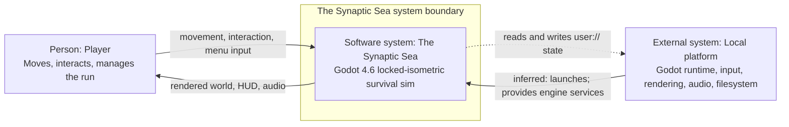

# C4 System Context — The Synaptic Sea

- **Diagram ID:** ARCH-C4-CONTEXT
- **Audience:** Developers onboarding to the runtime boundary
- **Scope:** Current local single-player execution only
- **Evidence baseline:** ae28d95
- **Freshness date:** 2026-07-10

## Purpose and conclusion

This view answers who uses the game and what sits outside its software boundary. The Synaptic Sea is one local Godot system: the player provides input and receives audiovisual feedback, while the local platform is inferred to launch the process and supplies local engine and filesystem services. No network or cloud runtime is present.

## Diagram

## Relationship legend

Solid arrows are direct runtime interaction or execution. The short-dot arrow is local persistence access. Labels, not color, define meaning.

## Text equivalent

| Source | Relationship | Target |
| --- | --- | --- |
| Player | sends movement, interaction, and menu input | The Synaptic Sea |
| The Synaptic Sea | returns rendered world, HUD, and audio feedback | Player |
| Local platform | inferred: launches the Godot process and provides engine services | The Synaptic Sea |
| The Synaptic Sea | reads and writes local `user://` state | Local platform filesystem |

## Evidence

| Element or relationship | Source path | Symbol | Basis |
| --- | --- | --- | --- |
| Godot game identity and runtime feature baseline | project.godot | application/config/name and config/features | explicit |
| Player input enters runtime controller | scripts/player/player_controller.gd | _unhandled_input and request_interact | explicit |
| Local world persistence | scripts/systems/save_load_service.gd | save_world and load_world | explicit |
| Audiovisual/runtime consequences remain scene-owned | docs/game/04_tdd.md | Architecture principles | explicit |

## Explicit, inferred, and omitted

The game configuration, player input code, and save service are explicit. The platform-to-process execution arrow is labeled `inferred: launches` because it derives from Godot engine lifecycle rather than a repository-owned call. Internal scenes, models, and data stores are deliberately omitted at this level.

## Known current gaps

Real cloud saves are not implemented. The cloud manifest is local metadata, not a network backend. Full audio content is deferred even though the local audio pipeline exists.

## Export and regeneration

Rendered export: [rendered/01-c4-system-context.svg](rendered/01-c4-system-context.svg). Regenerate and validate from the repository root with `python3 tools/validate_architecture_diagrams.py --update` followed by `--check`.
