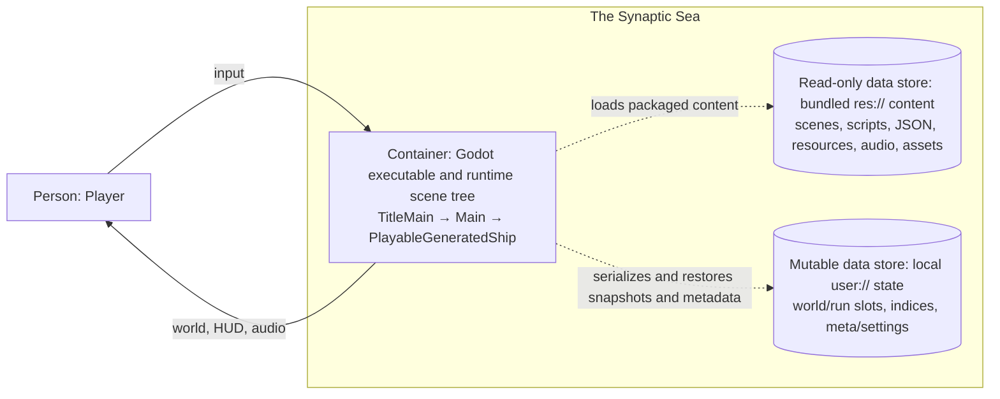

# C4 Containers and Data Stores — Local Runtime

- **Diagram ID:** ARCH-C4-CONTAINERS
- **Audience:** Developers tracing runtime content and persistence boundaries
- **Scope:** Current executable, bundled `res://` content, and local `user://` data
- **Evidence baseline:** ae28d95
- **Freshness date:** 2026-07-10

## Purpose and conclusion

The shipped runtime is one Godot executable and scene tree. It reads bundled scenes, scripts, resources, JSON, audio, and assets under `res://`, while mutable snapshots, slot indices, meta state, and settings live under `user://`. Source modules are not independently deployable C4 containers.

## Diagram

## Relationship legend

Solid arrows are direct runtime interaction. Short-dot arrows are data/resource or persistence access. Arrows describe local relationships only.

## Text equivalent

| Container or store | Responsibility | Relationship |
| --- | --- | --- |
| Godot executable and runtime scene tree | owns title, playable session, scene consequences, services, and pure models | receives input and emits audiovisual feedback |
| Bundled `res://` content | immutable packaged scenes, scripts, resources, JSON, audio, and imported assets | read by the runtime and loaders |
| Local `user://` state | mutable world/run snapshots, slot index, meta progression, and settings/state files | read and written by session-owned persistence services |

## Evidence

| Element or relationship | Source path | Symbol | Basis |
| --- | --- | --- | --- |
| Configured executable entry scene | project.godot | run/main_scene | explicit |
| Title lazily creates gameplay | scripts/title_main.gd | _instantiate_gameplay | explicit |
| Main creates the configured playable scene | scripts/main.gd | _ready | explicit |
| Playable session is the composition root | scripts/procgen/playable_generated_ship.gd | _ready and _build_runtime_nodes | explicit |
| Loader reads bundled layout, kit, and gameplay JSON | scripts/procgen/generated_ship_loader.gd | load_from_paths | explicit |
| Save service reads/writes world snapshots | scripts/systems/save_load_service.gd | save_world and load_world | explicit |
| World snapshot separates mutable state from geometry | docs/game/adr/0012-world-persistence-model.md | Decision | ADR |

## Explicit, inferred, and omitted

All content and persistence accesses are explicit in repository source. The diagram treats bundled and local stores as C4 data-store containers; it does not claim that GDScript folders, managers, or models deploy separately.

## Known current gaps

The repository has no runtime network container or true cloud-save service. TitleMain and PlayableGeneratedShip construct separate `SaveLoadService` instances; persistence is not a singleton or autoload.

## Export and regeneration

Rendered export: [rendered/02-c4-containers.svg](rendered/02-c4-containers.svg). Regenerate and validate from the repository root with `python3 tools/validate_architecture_diagrams.py --update` followed by `--check`.
