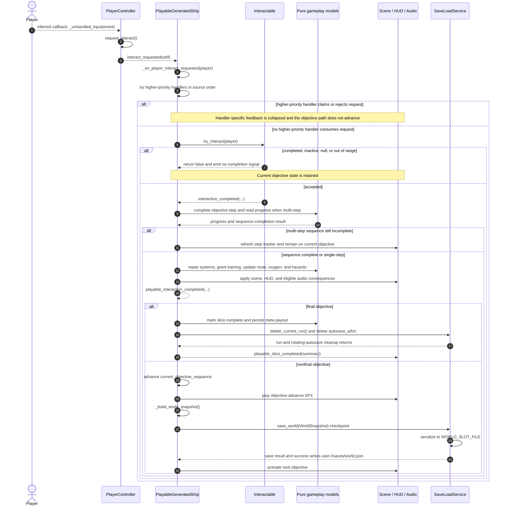

# Gameplay Interaction Sequence — Input to Checkpoint

- **Diagram ID:** ARCH-SEQ-INTERACTION
- **Audience:** Developers tracing the core moment-to-moment interaction loop
- **Scope:** Current objective interaction path from player input through completion or rejection
- **Evidence baseline:** ae28d95
- **Freshness date:** 2026-07-10

## Purpose and conclusion

This sequence answers message order only: an interact input reaches a real in-world `Interactable`, updates pure models, applies scene/HUD/audio consequences only after the objective sequence is complete, and either ends the run or writes a world checkpoint. `PlayableGeneratedShip` owns dispatch and integration; pure models do not reach into the scene tree.

## Diagram

## Relationship legend

Solid messages are direct synchronous calls. Dashed messages are engine callbacks, emitted signals, public events, or returns. Persistence meaning is carried by the `WorldSnapshot`, `save_world`, `WORLD_SLOT_FILE`, and `user://saves/world.json` labels. The first callback is explicitly inferred engine lifecycle; relationship meaning does not depend on color.

## Text equivalent

1. Godot invokes `PlayerController._unhandled_input(event)` as an inferred engine callback; the controller directly calls `request_interact()` and emits `interact_requested(self)`.
2. `PlayableGeneratedShip` tries interaction handlers in source-defined priority order. A higher-priority handler can claim or reject and consume the request; otherwise dispatch falls through to objective interactables.
3. `Interactable.try_interact(player)` returns `false` without a completion signal when it is completed, inactive, given a null player, or out of range. The objective remains active.
4. An accepted interaction marks the interactable complete and emits `interaction_completed(...)` synchronously into the coordinator callback.
5. For a multi-step objective, the coordinator completes the step and checks progress first. If the sequence is still incomplete, it refreshes step progress and returns without repair, training, route, oxygen/hazard, scene, HUD, or audio consequences.
6. A complete sequence or single-step objective applies pure-model consequences, then scene/HUD/audio consequences, marks the tracker complete, and emits `playable_interaction_completed(...)`.
7. The final objective marks the slice complete, persists its meta payout, clears current-run/world and rotating-autosave files, and emits `playable_slice_completed(summary)`.
8. A nonfinal objective advances the sequence, builds a `WorldSnapshot`, calls `SaveLoadService.save_world(...)`, and then activates the next objective. A successful checkpoint serializes through `WORLD_SLOT_FILE` to `user://saves/world.json`.

## Evidence

| Element or relationship | Source path | Symbol | Basis |
| --- | --- | --- | --- |
| Interact input emits player request | scripts/player/player_controller.gd | _unhandled_input and request_interact | explicit |
| Coordinator subscribes to player interaction | scripts/procgen/playable_generated_ship.gd | _spawn_player | explicit |
| Ordered interaction dispatch | scripts/procgen/playable_generated_ship.gd | _on_player_interact_requested | explicit |
| Interactable validation and completion signal | scripts/interaction/interactable.gd | try_interact | explicit |
| Coordinator connects objective completion | scripts/procgen/playable_generated_ship.gd | _build_interactables | explicit |
| Step-first, incomplete-return, and final handling | scripts/procgen/playable_generated_ship.gd | _on_interactable_completed | explicit |
| Checkpoint world snapshot and save | scripts/procgen/playable_generated_ship.gd | _auto_save_current_run and _build_world_snapshot | explicit |
| Local world save destination | scripts/systems/save_load_service.gd | WORLD_SLOT_FILE and save_world | explicit |
| Real input path advances objective sequence | scripts/validation/main_playable_slice_input_smoke.gd | input interaction scenario | explicit |
| Objective, route, and extraction contract | docs/game/05_requirements.md | REQ-001, REQ-002, and REQ-003 | requirement |

## Explicit, inferred, and omitted

Godot's initial `_unhandled_input` callback is inferred engine lifecycle. Signal declarations/connections, source-order dispatch, same-stack completion handling, the incomplete-step early return, consequences, cleanup, and world-save calls are explicit. Tool, cargo, docking, crafting, menu, combat, and other handlers ahead of objective dispatch are collapsed because this view answers objective message order rather than cataloguing every interaction type. Save-failure recovery and snapshot field expansion are omitted because they do not change that ordering.

## Known current gaps

The coordinator is a high-degree integration hotspot. Comments near checkpoint code still describe `current_run.json`, but executable `_auto_save_current_run()` builds a `WorldSnapshot` and `save_world()` targets `WORLD_SLOT_FILE` at `user://saves/world.json`; this current-only view follows executable behavior. The caller proceeds to activate the next objective even when the checkpoint result is false.

## Export and regeneration

Rendered export: [rendered/03-gameplay-interaction-sequence.svg](rendered/03-gameplay-interaction-sequence.svg). Canonical source is the Mermaid fence above; the validation renderer is the repository-locked Mermaid CLI. Regenerate and validate from the repository root with `python3 tools/validate_architecture_diagrams.py --update` followed by `--check`.
