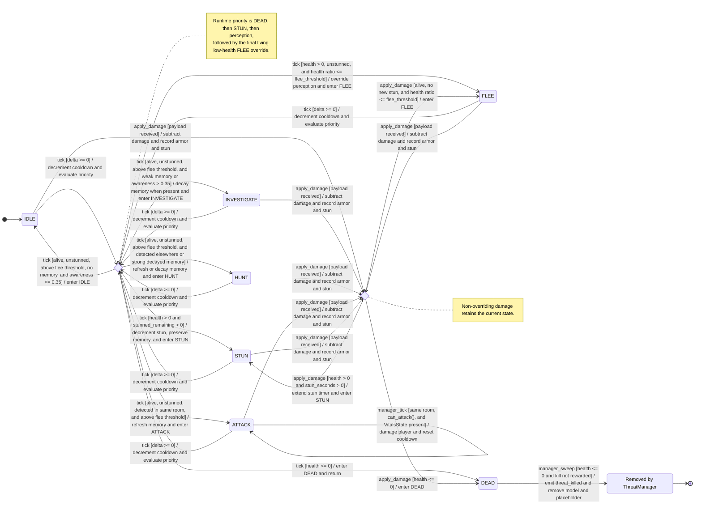

# Threat-AI State Machine — Implemented Runtime

- **Diagram ID:** ARCH-STATE-THREAT-AI
- **Audience:** Developers maintaining combat, detection, and threat behavior
- **Scope:** Current `ThreatAIState` transitions plus manager-owned attack, movement, and removal consequences
- **Evidence baseline:** ae28d95
- **Freshness date:** 2026-07-10

## Purpose and conclusion

This state machine answers allowed implemented transitions only. The pure `ThreatAIState` model starts from its default `state` and `previous_state` fields and is driven by health, stun duration, awareness, room equality, memory, and archetype flee thresholds; `ThreatManager` supplies context and owns player damage, placeholder movement, kill emission, and removal. Reachable `FLEE` and `INVESTIGATE` states currently lack distinct matching scene behavior.

## Diagram

## Relationship legend

Every ordinary arrow is a UML state transition labeled `event [guard] / action`; only the initial and terminal `[*]` arrows are exempt. Choice nodes show ordered evaluation and are not runtime enum values. `Removed by ThreatManager` is a manager-owned lifecycle outcome outside the pure model. Labels and arrow direction carry meaning without color.

## Text equivalent

| From | Event and guard | To | Action |
| --- | --- | --- | --- |
| construction/default fields | no restored state | `IDLE` | `state` and `previous_state` both default to `STATE_IDLE` |
| any living state | valid tick and `health <= 0` | `DEAD` | highest-priority state change and early return |
| any living state | valid tick, alive, and `stunned_remaining > 0` | `STUN` | decrement stun, preserve at least one tick of memory, and return |
| any unstunned living state | detected at threshold in the same room and above flee threshold | `ATTACK` | refresh memory and `last_known_room` |
| any unstunned living state | detected in another room or decayed memory remains above 40 percent, and above flee threshold | `HUNT` | refresh or decay memory |
| any unstunned living state | decayed memory is at or below 40 percent, or no memory with awareness above 0.35, and above flee threshold | `INVESTIGATE` | decay memory where present |
| any unstunned living state | no memory, awareness at or below 0.35, and above flee threshold | `IDLE` | enter idle response |
| any living, unstunned state | health ratio at or below the archetype flee threshold | `FLEE` | final override after perception |
| any living state | lethal, stunning, or at-or-below-threshold damage | `DEAD` / `STUN` / `FLEE` | apply damage, extend any stun, and override state in that priority |
| current living state | non-overriding damage | same state | retain state without calling `_change_state` |
| `ATTACK` | manager tick, same room, cooldown ready, alive, and vitals present | `ATTACK` | damage the player and reset cooldown |
| `DEAD` | manager sweep sees unrewarded health at or below zero | removed | emit `threat_killed`, erase the model, and queue-free its placeholder |

## Evidence

| Element or relationship | Source path | Symbol | Basis |
| --- | --- | --- | --- |
| State constants and default initialization | scripts/systems/threat_ai_state.gd | STATE_* constants; state and previous_state fields | explicit |
| Tick transition priority and perception guards | scripts/systems/threat_ai_state.gd | tick | explicit |
| Damage overrides | scripts/systems/threat_ai_state.gd | apply_damage | explicit |
| Attack cooldown action | scripts/systems/threat_ai_state.gd | can_attack and consume_attack | explicit |
| Live detection context and player damage | scripts/systems/threat_manager.gd | tick_threats | explicit |
| Kill event and removal | scripts/systems/threat_manager.gd | _sweep_dead_threats and _remove_threat | explicit |
| HUNT/ATTACK placeholder movement only | scripts/systems/threat_manager.gd | _update_placeholder | explicit |
| Archetype sensitivities, memory, cooldown, and flee thresholds | data/combat/threat_archetypes.json | archetype records | explicit |
| Combat architecture and persistence | docs/game/adr/0037-combat-threat-architecture.md | Decision | ADR |
| Threat behavior requirement | docs/game/05_requirements.md | REQ-D-001, REQ-D-006, and REQ-D-010 | requirement |
| Model transition smoke | scripts/validation/threat_ai_state_smoke.gd | transition cases | explicit |

## Explicit, inferred, and omitted

All drawn enum states, transitions, priorities, guards, actions, attack consequences, and manager removal behavior are explicit current source. Choice nodes are explanatory control points. Weighted perception inputs are summarized rather than expanded, invalid negative-delta no-ops are omitted because they do not transition, and non-overriding damage is documented as retained state rather than drawn as six redundant self-loops. Persistence summary fields and position interpolation details are omitted because they do not change the allowed-transition question.

## Known current gaps

`FLEE` is reachable, but `_update_placeholder()` has no move-away scene behavior for it. `INVESTIGATE` has no distinct scene action, and stored `last_known_room` is not consumed outside the model. No desired move-away, investigation, or memory-consumer fix is drawn. Current validation does not directly pin `FLEE`, the exact 40-percent memory boundary, or stun recovery.

## Export and regeneration

Rendered export: [rendered/04-threat-ai-state-machine.svg](rendered/04-threat-ai-state-machine.svg). Canonical source is the Mermaid fence above; the validation renderer is the repository-locked Mermaid CLI. Regenerate and validate from the repository root with `python3 tools/validate_architecture_diagrams.py --update` followed by `--check`.
