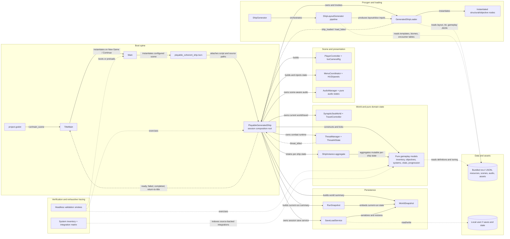

# Runtime Component Dependencies — Curated Onboarding View

- **Diagram ID:** ARCH-COMP-RUNTIME
- **Audience:** Developers locating runtime ownership and dependency seams
- **Scope:** Stable boot, composition, procgen, domain, presentation, persistence, data, and validation clusters
- **Evidence baseline:** ae28d95
- **Freshness date:** 2026-07-10

## Purpose and conclusion

The runtime is a clustered directed graph with one dominant session hub. `project.godot` boots `TitleMain`, which lazily creates `Main` and the configured playable scene. `PlayableGeneratedShip` then owns scene-aware coordinators and pure-model aggregates. Explicit source imports have no multi-node cycle; apparent feedback loops are child signals returning to their owner.

## Diagram

## Relationship legend

Solid arrows are construction, ownership, direct call, aggregation, or runtime control. Long-dash arrows are signals/events back to owners. Short-dot arrows are content, persistence, validation, or documentation-evidence dependencies. Every arrow is labeled; color is not semantic.

## Text equivalent

| Cluster | Responsibility | Principal dependencies |
| --- | --- | --- |
| Boot spine | selects title, creates gameplay shell, and instantiates configured playable session | `project.godot` → `TitleMain` → `Main` → playable scene → `PlayableGeneratedShip` |
| Procgen/loading | produces deterministic layouts and instantiates structural/objective scene nodes | generators and layout pipeline → `GeneratedShipLoader` → wrapper scenes |
| World/domain | owns current world selection, mutable per-ship aggregates, pure state, and combat state | coordinator-owned or injected; `ShipInstance` aggregates per-ship models |
| Presentation | owns player/camera nodes, HUD/menu panels, and scene-aware audio | constructed and refreshed by `PlayableGeneratedShip` |
| Persistence | captures current-run and world summaries and writes local files | coordinator → `RunSnapshot`/`WorldSnapshot` → `SaveLoadService` → `user://` |
| Data/assets | supplies packaged read-only inputs and local mutable state | read by loaders/models/services |
| Verification | proves production seams and maintains exhaustive relationship evidence | validation scripts and generated inventory depend on production targets |

## Evidence

| Element or relationship | Source path | Symbol | Basis |
| --- | --- | --- | --- |
| Project boots title scene | project.godot | run/main_scene | explicit |
| Title creates Main and observes playable lifecycle | scripts/title_main.gd | _instantiate_gameplay and _poll_for_playable_started | explicit |
| Main instantiates configured playable scene | scripts/main.gd | DEFAULT_PLAYABLE_SHIP_SCENE and _ready | explicit |
| Playable scene binds script and source paths | scenes/procgen/playable_coherent_ship.tscn | ext_resource and exported paths | explicit |
| Composition-root dependencies, travel coordination, and lifecycle signals | scripts/procgen/playable_generated_ship.gd | preload constants, travel_to, and playable signals | explicit |
| Loader reads JSON and instantiates runtime nodes | scripts/procgen/generated_ship_loader.gd | load_from_paths, _instance_structural_wrappers, and objective-volume construction in load_from_paths | explicit |
| Procgen pipeline stage order | scripts/procgen/ship_layout_generator.gd | generate | explicit |
| Per-ship aggregate ownership | scripts/systems/ship_instance.gd | state fields and get_summary | explicit |
| World and travel injection | scripts/systems/travel_controller.gd | attempt_travel | explicit |
| Ship-system model hierarchy | scripts/systems/ship_systems_manager.gd | load_definitions and system ownership | explicit |
| Threat runtime ownership and kill signal | scripts/systems/threat_manager.gd | threat_killed and tick_threats | explicit |
| Menu state/panel ownership | scripts/ui/menu_coordinator.gd | preload constants and runtime construction | explicit |
| Audio manager ownership | scripts/audio/audio_manager.gd | runtime owner contract and pure-state fields | explicit |
| Run/world snapshot boundary | scripts/systems/world_snapshot.gd | home_ship and to_dict/from_dict | explicit |
| Local save serialization | scripts/systems/save_load_service.gd | save_world and load_world | explicit |
| Exhaustive system/edge source | docs/game/inventory/system_inventory.json | systems and integrations | inventory |
| Regression ownership and diagnostic gate | docs/game/06_validation_plan.md | Regression bundle and run_clean | explicit |

## Explicit, inferred, and omitted

Shown ownership, calls, signals, reads, aggregation, and validation targets are explicit. Godot child `_ready()` execution after `add_child()` is engine lifecycle but is represented here through explicit instantiation edges rather than a separate inferred edge. Individual model classes, 109 coordinator load edges, and all 324 inventory relationships are intentionally collapsed.

## Known current gaps

`PlayableGeneratedShip` remains a large integration hotspot. Explicit preload/load/extends dependencies have no multi-node strongly connected component; owner/child signal feedback is runtime control, not an import cycle. Some documented live weaknesses—such as deferred ambient/spatial audio inputs—remain discoverable in the exhaustive inventory and are not expanded here.

## Export and regeneration

Rendered export: [rendered/05-runtime-component-dependencies.svg](rendered/05-runtime-component-dependencies.svg). For exhaustive details, use [SYSTEM_INVENTORY.md](../inventory/SYSTEM_INVENTORY.md) and [system_map.html](../inventory/system_map.html). Regenerate and validate from the repository root with `python3 tools/validate_architecture_diagrams.py --update` followed by `--check`.
