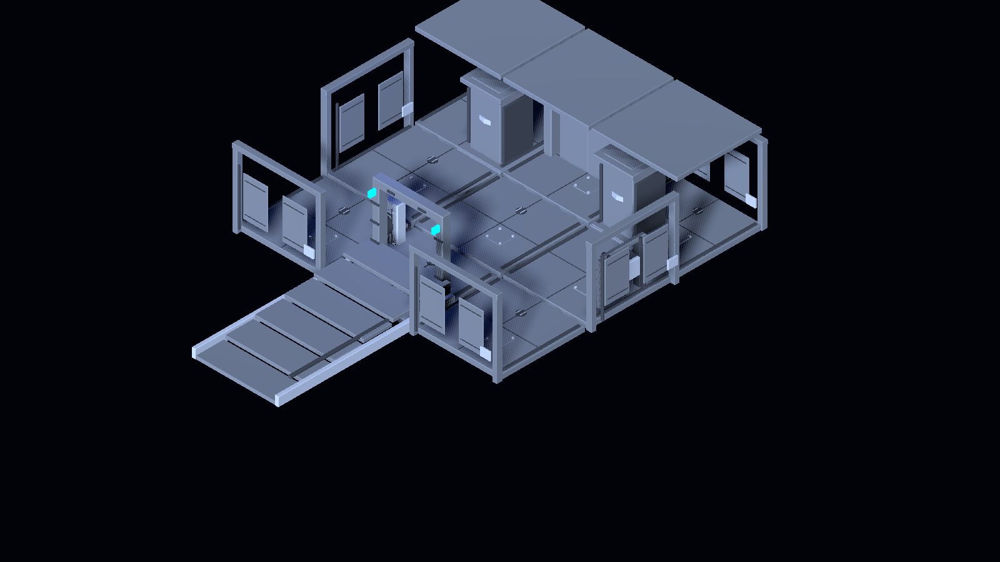

# UI Repository and Asset Review — 2026-09-05

## Purpose and baseline

This is a read-only evidence review supporting the proposed
[UI presentation program](../features/ui_presentation_program.md) and its
[implementation plan](../../superpowers/plans/2026-09-05-ui-presentation-program.md).
It describes the repository as inspected on 2026-09-05; it is not an
implementation claim, visual approval, or fresh playtest report.

- Baseline commit: `f4a656692606e23813df68d24daba4c5e4a0151b` (`main` HEAD when inspected).
- Scope: repository docs, GDScript/scenes/data, asset inventory, historical local
  artifacts, and installed local tool discovery.
- Excluded: no game launch, headless smoke, import, screenshot capture, benchmark,
  Blender edit, board mutation, or runtime/source change.
- Consequently, statements labelled **verified** are source or file facts. Statements
  labelled **inference** are planning hypotheses that need a fresh visual or player test.
- The tree already has protected, unrelated in-progress work: the crafting/derelict
  ADR, feature spec, and 2026-09-04 completion plan. This review neither changes nor
  re-scopes that work.

### Evidence consulted

- [project.godot](../../../project.godot): application scene, renderer feature tags, and
  `1280×720` configured viewport.
- [STATUS.md](../../../STATUS.md): project-state narrative, identified here only where
  its engine/version claim conflicts with the active repository contract.
- [05_requirements.md](../05_requirements.md), [ui_ux_accessibility.md](../features/ui_ux_accessibility.md),
  [ADR-0033](../adr/0033-ui-ux-accessibility-architecture.md), and
  [06_validation_plan.md](../06_validation_plan.md): current feature intent and
  validation rules.
- [playable_generated_ship.gd](../../../scripts/procgen/playable_generated_ship.gd):
  live HUD allocation, panel binding, modal signals, and the dual-branch process loop.
- [scripts/ui](../../../scripts/ui): panel sizing, accessibility methods, local widget
  construction, and player-facing surface inventory.
- [data/ui](../../../data/ui) and [data/release/achievement_catalog.json](../../../data/release/achievement_catalog.json):
  menu and catalog references.
- [assets/ui](../../../assets/ui), [assets/_staging/focused_nine](../../../assets/_staging/focused_nine),
  and [artifacts/validation-previews](../../../artifacts/validation-previews): local
  icon, structural, and historical preview inventory.
- [2026-09-04 crafting/derelict plan](../../superpowers/plans/2026-09-04-crafting-derelict-feature-completion.md):
  active package ownership and dependencies.

No external websites or third-party technical claims were used.

### Presentation infrastructure inventory

- **Verified:** no bundled `.ttf`, `.otf`, `.woff`, or `.woff2` font files were found.
- **Verified:** no shared `.theme` resource or `Theme.new()` construction was found in the
  inspected UI path. Individual scripts repeatedly use per-control overrides, including
  [tracker](../../../scripts/ui/objective_tracker.gd#L158),
  [vitals](../../../scripts/ui/player_vitals_panel.gd#L83), and
  [inventory rows](../../../scripts/ui/inventory_row.gd#L62).
- **Verified:** [project.godot](../../../project.godot#L25) fixes the viewport at 1280×720
  and has no inspected display-stretch or window-minimum-size configuration. This does
  not establish OS resize behavior; it establishes that the project file does not define it.
- **Verified:** title settings deliberately skip `apply_to_accessibility` because no
  `AccessibilitySettings` exists there ([title](../../../scripts/title_main.gd#L325));
  the dirty summary transfers only on start/continue
  ([handoff](../../../scripts/title_main.gd#L190)). **Inference:** title and live-play
  text-scale/colour feedback can be uneven; capture both before promising immediate apply.
- **Verified:** inventory rows and drop zones handle mouse-button events in `_gui_input`
  ([row](../../../scripts/ui/inventory_row.gd#L64),
  [drop zone](../../../scripts/ui/inventory_drop_zone.gd#L28)); no keyboard/gamepad focus
  navigation was found in these inventory view scripts. This needs an end-to-end input
  test against the feature contract's keyboard/mouse/gamepad promise.

## Authority reconciliation

The current engine contract is Godot **4.7.1 Forward+** under
[AGENTS.md](../../../AGENTS.md), while [project.godot](../../../project.godot) declares
the `4.7` and `Forward Plus` feature tags. [STATUS.md](../../../STATUS.md) still calls
the project Godot 4.6.2 and points at an obsolete machine path, so it is stale on this
point. Prior 2026-09-04 probes reportedly used 4.7.2 and emitted warnings; they are not
a clean runtime baseline. Treat 4.7.1 as the implementation target until a recorded
P00-style engine selection and clean validation run supersede it.

The crafting/derelict completion plan has **scope agreed; detailed implementation proposal
pending**, with execution gates rather than evidence that its packages are done. It explicitly makes P09 responsible for recipe
economy/queue UX and makes P21 (restoration through normal controls) depend on P09,
P15, and P20. UI presentation work must supply a shared visual system and readable
feedback without duplicating those behaviors or pre-empting their ownership. P10 owns
craft persistence boundaries and P11 component/slot compatibility, so their existing
panels are integration consumers, not a second transaction or validation authority.
See [P09](../../superpowers/plans/2026-09-04-crafting-derelict-feature-completion.md#p09--complete-recipe-economy-queue-ux-and-acquisition-routes),
[P10](../../superpowers/plans/2026-09-04-crafting-derelict-feature-completion.md#p10--migrate-and-persist-crafting-at-transaction-boundaries),
[P11](../../superpowers/plans/2026-09-04-crafting-derelict-feature-completion.md#p11--enforce-real-component-and-slot-compatibility), and
[P21](../../superpowers/plans/2026-09-04-crafting-derelict-feature-completion.md#p21--make-restoration-understandable-through-normal-controls).

The UI feature contract remains [ui_ux_accessibility.md](../features/ui_ux_accessibility.md),
with pure-model/view seams in [ADR-0033](../adr/0033-ui-ux-accessibility-architecture.md).
Its original minimap language is explicitly superseded by the item-gated web-chart
decision it cites. The review should not revive an interior minimap.

## Existing player-facing surfaces

| Group | Verified repository surfaces | Review implication |
| --- | --- | --- |
| Entry and pause | Title main; main/pause/settings; save/load; records; credits; build and release surfaces. | Establish title, pause, and records as one coherent navigation family. |
| Persistent play HUD | Objective tracker, vitals, weapon hotbar, contextual tooltip/focus, captions, work-action progress, tutorial and codex hints. | Reduce competing persistent text while preserving survival urgency. |
| Contextual play panels | Scanner, inventory and transfer, station recipe picker, wounds/treatment, ship modification, web chart. | Give every panel a shared frame, focus treatment, empty/blocked state, and close behavior. |
| Progress and collection | Achievements, skill tree, hub upgrades, class selection, codex, audio log. | Unify list/detail patterns and distinguish locked, new, actionable, and complete states. |
| Settings and accessibility | Accessibility, input glyphs, audio, language, difficulty, captions and reduced motion. | Keep these as a first-class visual acceptance surface, including 1x/1.5x/2x layouts. |
| World-space feedback | Label3D affordances, hazard labels, interact prompts, hallucination overlay and dialogue/captions. | Calibrate contrast, occlusion, and world/HUD hierarchy together. |
| Preview-only surfaces | Derelict builder preview HUD and focused-nine capture harnesses. | Useful art/readability references only; do not mistake them for the shipped HUD. |

The live ship builds these views procedurally in one HUD layer, rather than instancing a
single authored HUD scene: see [`_build_hud_layer`](../../../scripts/procgen/playable_generated_ship.gd#L6740).
The separate [topdown HUD scene](../../../scenes/topdown/topdown_hud.tscn) remains a
small, older alternate presentation surface. **Verified:** it contains vitals, hotbar,
and objective controls with different fixed offsets. **Inference:** it needs an explicit
product decision—supported mode, diagnostic harness, or presentation-debt target—before
the visual system promises cross-mode parity.

## Source findings and shortcomings

1. **Verified — fragmented construction.** Many panels create their own `StyleBoxFlat`,
labels, margins, colors, and dimensions in script. The tracker and vitals independently
repeat near-identical dark translucent panel styling in
[objective_tracker.gd](../../../scripts/ui/objective_tracker.gd#L12) and
[player_vitals_panel.gd](../../../scripts/ui/player_vitals_panel.gd#L18). A shared theme,
semantic color token set, spacing scale, typography roles, and reusable panel primitives
are absent from this inspected path.
2. **Verified — content is text-first.** Objective text includes a full control legend,
progress, systems, current objective, and prompt in one panel
([composition](../../../scripts/ui/objective_tracker.gd#L188)). **Inference:** this risks
weak combat/survival hierarchy and should be split into compact persistent telemetry plus
contextual/transient instruction after a playfield review.
3. **Verified — uneven accessibility application.** `AccessibilitySettings` scales HUD
font and panel sizes ([helpers](../../../scripts/ui/accessibility_settings.gd#L126));
the live builder injects that seam into tracker, vitals, and hotbar
([builder](../../../scripts/procgen/playable_generated_ship.gd#L6751)). Several modal
panels instead use fixed positions/minimum sizes, for example inventory `700×440`
([inventory](../../../scripts/ui/inventory_panel.gd#L51)) and chart labels positioned at
fixed pixels ([chart](../../../scripts/ui/chart_panel.gd#L35)). The review did not run
these at every scale, so clipping is an inference pending captures.
4. **Verified — styling lacks asset use.** Eight achievement PNGs are 64×64 and the
release catalog points to them as `icon_placeholder`; the status effect PNGs are each
1×1. The achievement panel source inspected is list-text oriented. The art inventory is
therefore a small, usable icon seed set, not a complete UI kit.
5. **Verified — modal input and simulation are separate.** Opening a menu modal calls
`_freeze_player_for_panel` ([modal handler](../../../scripts/procgen/playable_generated_ship.gd#L7629)),
while the live `_process` continues ticking both home and away branches
([process loop](../../../scripts/procgen/playable_generated_ship.gd#L8525)). This does
not prove a player-visible bug: it proves that the program must explicitly decide and
test which panels pause simulation, which permit time pressure, and how the state is
communicated before changing presentation.
6. **Verified — current visual evidence is historical.** The focused-nine artifacts
were generated for staged structural/derelict previews. They establish useful environment
material and contrast references, but they do not show the current HUD or prove current
layout behavior.
7. **Verified — audio inventory exceeds stale planning counts.**
   [assets/audio](../../../assets/audio) contains 21 WAV files in this checkout, whereas
   the historical Domain 9 design describes only two placeholder WAVs under `data/audio`
   ([stale count](../../superpowers/specs/2026-07-02-domain9-audio-design.md#L50)). This
   does not prove routing, licensing, mix quality, or runtime playback; UI feedback work
   needs an actual event-to-stream inventory rather than the old two-clip count.

## Layout footprint risk

At 1x, the tracker is `520×250` and vitals are `360×150`
([tracker constant](../../../scripts/ui/objective_tracker.gd#L13),
[vitals constant](../../../scripts/ui/player_vitals_panel.gd#L18)). Their combined raw
area is 184,000 pixels, approximately 20% of the 1280×720 project viewport before the
hotbar, prompts, or any expanded panel. At 2x they become `1040×500` and `720×300`.
At a 720-pixel-tall viewport, the top-left tracker and bottom-left vitals therefore have
an overlapping vertical range; the tracker alone consumes 81% of viewport width. This
is a bounds calculation, not a visual reproduction. It makes responsive reflow and
scale-specific capture a P0 acceptance requirement.

The requested UI work should follow the low-chrome isometric game budget: protect the
centre and lower-middle playfield, keep one primary persistent cluster plus a small
secondary cluster, and disclose long text through drawers, modal views, or transient
prompts. This is a design recommendation from the requested UI skill, pending the
game's actual capture review.

## Asset evidence

| Asset family | Evidence | Recommended use in program |
| --- | --- | --- |
| Achievement icons | Eight 64×64 PNGs in [assets/ui/achievements](../../../assets/ui/achievements), referenced as placeholders by the release catalog. | Preserve IDs and paths; art-direct a completion/locked treatment before replacing placeholder content. |
| Status icons | Eight 1×1 PNGs in [assets/ui/status](../../../assets/ui/status). | Treat as implementation placeholders; define icon silhouettes and semantic states before HUD integration. |
| Focused-nine structural kit | GLB/scene/manifests under [assets/_staging/focused_nine](../../../assets/_staging/focused_nine). | Use its industrial geometry, emissive points, breach and pressure-door language to inform panel material and warning states. |
| Historical preview captures | Local PNGs under [artifacts/validation-previews/focused-nine](../../../artifacts/validation-previews/focused-nine). | Reference composition and environment legibility only; recapture current UI after each visual milestone. |
| Blender toolchain | `C:\Program Files\Blender Foundation\Blender 5.2\blender.exe` is installed. Repository render code targets 5.2, but the structural add-on declares Blender 4.0. | Run a compatibility probe before use; do not assume the add-on works unchanged on 5.2. |
| Blender source/provenance | Structural authoring uses an external configurable `source_root` ([preference](../../../tools/blender_addons/structural_module_toolkit/preferences.py#L14)); focused-nine recipes require external structural/prop roots and preserve source paths ([CLI](../../../tools/focused_nine_blender_recipes.py#L301)). | UI may consume renders as reference, but cannot claim source ownership/provenance or promote generated geometry without the governed export path. |
| Renderer limitation | [batch_render_modules.py](../../../tools/batch_render_modules.py#L14) hardcodes a macOS Blender path and `/tmp` output. The render pass writes deterministic 1024px PNGs from existing GLBs ([render](../../../tools/render_module_passes.py#L266)). | Adapt configuration for Windows; outputs are structural-review evidence, not UI runtime captures. |

## Ranked program priorities

1. **P0 — establish a capture-backed UI baseline and viewport matrix.** Record 1280×720
at 1x, 1.5x, and 2x plus one constrained height/width case; include HUD-only, each modal,
and a live danger state. Classify Godot diagnostics and verify the centre/lower-middle
playfield remains legible. No existing artifact meets this acceptance bar.
2. **P0 — define play/pause semantics.** For pause, inventory, crafting, scanner, repair,
chart, and restoration panels, decide simulation/input behavior and surface it visibly.
Test home and away branches because `_process` has separate execution paths.
3. **P1 — build the presentation foundation.** Introduce semantic tokens and reusable
Godot Control primitives for background, borders, typography, focus, disabled/denied,
danger, warning, success, and tooltip states. Migrate the persistent HUD first without
changing models or ownership.
4. **P1 — recompose persistent HUD.** Compact objective, vitals, hotbar, prompt and
work progress around game decisions; move control exposition and verbose status detail
to contextual disclosure. Pass the 1x/2x geometry matrix before calling it readable.
5. **P1 — standardize modal flows.** Apply the same navigation, focus, title, action,
empty/error, tooltip, close, and accessibility patterns to inventory, recipe picker,
wounds, scanner, chart, and ship modification. Reserve P09/P10/P11/P21 behavior changes
for their owning packages.
6. **P2 — turn the existing icon seed into a system.** Define icon rendering rules,
state variants, pixel density, fallback text, and asset import/export validation. Begin
with achievement and status IDs; do not silently change catalog paths.
7. **P2 — visual feedback and polish.** Add restrained transitions tied to danger,
achievement, work completion, and tutorial states; honor reduced motion and captions.
Use Blender only where an in-world prop, render reference, or a replacement source asset
is needed, not as a substitute for native Control readability.

## Validation limitations and next evidence

The repository has many focused UI smokes (for shell parsing, inventory, scanner, recipe
picker, ship modification, save/load, menus, and accessibility) and the formal marker
contract is [06_validation_plan.md](../06_validation_plan.md). They were not executed
for this review. Historical `PASS` strings, zero exit status, or screenshots alone are
insufficient: the project contract requires expected markers and clean output with every
unexpected `ERROR:`/`WARNING:` classified.

Before implementation approval, add an allowed-files card that lists the visual surfaces,
model boundaries, responsive matrix, capture paths, manual observations, smoke commands,
and P09/P10/P11/P21 non-goals. After each implementation slice, inspect the diff, run
the scoped smokes under a selected Godot 4.7.1 binary, then run the documented regression
bundle and record fresh markers and diagnostics. Human checks must cover keyboard, mouse,
gamepad, text scale, reduced motion, captions, colour modes, modal simulation semantics,
and both home/away play.
