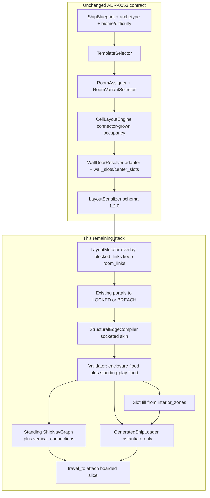
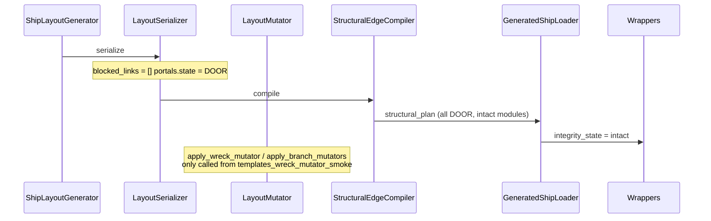

# Remaining Procgen Work After ADR-0053 — Play, Not a New Generator

- **Author:** Synaptic Sea design
- **Date:** 2026-08-23
- **Status:** Superseded for generator authority by
  `docs/game/features/unified_procgen_platform.md`; retained for reusable
  enclosure, walkability, loader, and presentation work
- **Project:** The Sargasso of Stars / The Synaptic Sea
- **Engine:** Godot consumer/assembly layer; Rust is authoritative per ADR-0057
- **Supersedes / amends:** Superseded where it assumes GDScript generation or a
  GDScript-owned gameplay slice. Consumes ADR-0053 as done for enclosure
  geometry. Its loader/presentation work remains input to the unified platform.
- **Related feature specs:** `docs/game/features/socketed_enclosed_interiors.md`, `docs/game/features/component_slots.md`, `docs/game/features/procedural_generation_expansion.md`, `docs/game/features/vertical_slice_v1.md`, `docs/game/features/module_integrity.md`

---

## Overview

ADR-0053 replaced the two middle pipeline stages so generated ships emit connector-grown occupancy, socket-matched walls/ceilings/corners, and a validated `structural_plan` inside schema 1.2.0. Enclosure is the geometry gate. It is not the play gate.

The remaining stack does **not** invent a new generator, a second loader, a schema rewrite, WFC interiors, voxel hulls, or unique hive meshes. It makes the existing occupancy/compiler/loader contract **playable**:

1. Walkability that fails closed on compiler walls (player-height, doorway clearance, no void, no wall-through), with `ShipNavGraph` consuming `SOLID/OPEN/DOOR/LOCKED/HATCH/BREACH`.
2. Live decay: `LayoutMutator` actually stamps `LOCKED`/`BREACH` and damaged modules on generated wrecks; wrapper variants load quietly.
3. Slot-fill and dressing instances inside enclosed rooms (stop dumping loot on `floor_cell_*`).
4. Hive topology template + biomatter kit remapping the **same** sockets.
5. One boarded generated-seed vertical slice — not `coherent_ship_001`.

Each item is an independently mergeable PR with allowed files, non-goals, requirements, and Godot `--script` PASS markers. Hub boot stays the hand-authored golden. Generated seeds remain the travel/away path.

---

## Background & Motivation

### What ADR-0053 already shipped

Verified in code:

- `CellLayoutEngine.layout()` grows 4-connected integer occupancy from `template.connections` (`scripts/procgen/cell_layout_engine.gd`). `ROOM_GAP` is forbidden on live paths. Recent fix: spine destination shares a cardinal edge (`cell_layout_engine_smoke` contract includes `connections_wired=true`).
- `StructuralEdgeCompiler.compile()` loads `ModularAssetSpec` sockets, emits floors, ceilings, corners, `socket_bindings`, and canonical edge kinds `SOLID | OPEN | DOOR | LOCKED | HATCH | BREACH` (`scripts/procgen/structural_edge_compiler.gd` `SUPPORTED_EDGE_KINDS`).
- `LifeBoatBuilder` is off `StructuralPlacer`; hub uses the compiler.
- `GeneratedShipLoader` instantiates `ceiling_placements` via the same wrapper loop and caches PackedScenes so instantiate is not O(placements) × broken imports (`_instance_structural_wrappers` / `_instantiate_structural_record`).
- `socketed_enclosure_smoke` is GREEN and registered in `docs/game/06_validation_plan.md`.
- `_kit_id_for_biome` already maps `breach_field → ship_structural_hazard`, `dead_fleet → ship_structural_industrial` (`scripts/procgen/ship_layout_generator.gd`). REQ-ENC-004 text that claims “always v0” is **stale**.

### Why enclosure is not play

The live play path still treats generated interiors as floor plates with tags:

| Layer | Current behavior | Why it fails play |
|---|---|---|
| Walkability smoke | Occupancy BFS over **non-SOLID** compiler edges, then `NavigationAgent3D` on `floor_1x1` / `corridor_floor_1x1` faces only | Does not test player height, doorway aperture, walk-off into void, or walls you can step through. LOCKED edges are treated as walkable because only `SOLID` is skipped. |
| `ShipNavGraph` | 4-connected edges from floor-module world positions (`scripts/systems/ship_nav_graph.gd`). Never reads `structural_plan.edges` or `SOLID` | Threats and quality-gate start→goal paths ignore compiler walls, locked doors, and breaches. |
| Navmesh bake | Floor polygons only (`procgen_walkability_smoke._build_navigation_region`, loader `_build_navigation_region`) | Walls are not nav obstacles. ADR-0049 already said baked nav is tooling-only; production still builds the graph as if walls did not exist. |
| Decay | Compiler *can* emit `LOCKED` (`doorway_frame_blocked_1x1`) and `BREACH` (no module unless declared). Serializer always writes `"state": "DOOR"` and `"blocked_links": []`. Loader hard-sets `integrity_state = "intact"`. `ShipGenerator` always passes `ship_structural_v0.json` to the loader. | Live wrecks look pristine. `LayoutMutator` is only exercised by `templates_wreck_mutator_smoke.gd` (in the bundle, but not on the live path). `structural_live_loader_smoke` even generates `Condition.WRECKED` and still gets intact wrappers. |
| Interior fill | `WallDoorResolver` computes `wall_slots` / `center_slots`. `GameplaySliceBuilder._get_first_floor_cell` parks salvage and loot on the first `floor_cell_*`. Dressing is fog/light at occupancy room centers. Component markers offset from room **centers**, not slot cells. | Loot piles in doorways. Rooms are empty boxes with a crate on cell zero. |
| Theme | No `hive` template. Socket contracts exist only under `data/placement/contracts/structural/ship_structural_v0/`. Hazard/industrial kits overlap module ids and have no contract dirs (catalog falls back to v0). Loader kit file is hardcoded v0. | Biome `kit_id` is a stamp, not a visual remap. Hive is encounter/dressing flavour (`biomatter_crusted`), not a kit. |
| Vertical slice | `scripts/main.gd` instantiates `playable_coherent_ship.tscn` → golden `coherent_ship_001`. Generated seeds appear only via `PlayableGeneratedShip.travel_to` → `TravelController.attempt_travel` → `_attach_derelict_active`. | No bundled main-scene smoke boards a generated wreck through that production attach path and ticks the away `_process` branch. |

### Player collision vs compiler geometry (quantified)

- Player capsule (`scripts/player/player_controller.gd`): radius **0.35 m**, height **1.6 m**, move speed 6.0 m/s, floor snap 0.5 m. `set_crouching` lowers move speed and stealth only; it does **not** shrink the capsule.
- Floor wrappers: collision `BoxShape3D(4, 0.25, 4)` — matches the 4 m cell (`floor_wrapper_collision_footprint_smoke`).
- Wall / doorway wrappers: collision `BoxShape3D(1, 1, 1)` (`wall_straight_1x1.tscn`, `doorway_frame_open_1x1.tscn`). Contract bounds for `wall_straight_1x1` are X −2..2, Y 0..3, Z 0 (4 m × 3 m plate). Player can walk around or through the 1 m cube.
- Doorway contract height is 3.2 m; there is no authored aperture collision (posts + header). Open frames currently block a 1 m cube at the edge center, which is the **wrong** failure mode: they neither leave a standing gap nor span the 4 m wall run.

This is why a NavigationAgent walking floor polygons can PASS while a `CharacterBody3D` player clips walls, walks into the void, or is stopped by a 1 m door cube.

---

## Goals & Non-Goals

### Goals

1. Fail-closed walkability on compiler walls using player capsule dimensions, including doorway clearance, no walk-off, no wall-through.
2. `ShipNavGraph` (ADR-0049 production authority) consumes compiler edge kinds. Threats and quality-gate paths stop tunneling.
3. Live generation of `Condition.DAMAGED` / `WRECKED` stamps `LOCKED`/`BREACH` portals and pre-damaged modules; variants instantiate without unclassified `ERROR:`/`WARNING:`.
4. Loot, salvage approach cells, components, and dressing props land on `wall_slots` / `center_slots` derived from compiler walls, not the first floor cell.
5. One hive topology template plus a biomatter kit that remaps existing stems onto the same sockets.
6. One boarded generated-seed smoke that is the play proof of (1)–(4), independent of `coherent_ship_001`, using the production `travel_to` attach path.

### Non-goals (locked — do not reopen)

- Occupancy-out: a catalog of whole authored room prefabs that cannot emit integer occupancy cells.
- Loader-out: topology or socket solving in `GeneratedShipLoader`. No second loader.
- `layout.json` schema rewrite. Schema stays **1.2.0**. New fields live inside `structural_plan` or existing top-level keys (`blocked_links`, `module_damage`, `portals[].state`). Goldens are hand-upgraded, never pipeline-regenerated.
- Ground-up WFC or voxel/CSG interiors (ADR-0051, ADR-0053).
- Unique hive meshes before a socketed biomatter kit can remap existing stems.
- Autoload god-objects. Pure gameplay state stays `RefCounted`/`Resource`. Typed GDScript.
- Replacing hub boot (`scripts/main.gd` + `playable_coherent_ship.tscn`) with a generated hub.
- Player auto-path. Baked `NavigationRegion3D` remains debug/tooling, not production threat authority (ADR-0049).
- Regenerating goldens from the pipeline. Fire-zone markers and authored `blocked_links` on `coherent_ship_001/002/003` stay curated.
- Adding a RED smoke to the regression bundle. Rewriting a bundled smoke in place is allowed only in an atomic GREEN merge; a partial branch that leaves `WALKABILITY PASS spine_seed_42` RED bricks `run_clean`.
- Inserting new occupancy cells or new portals between non-adjacent rooms as a “BREACH intent.”
- Treating crouch as a smaller capsule in this stack (`PlayerController.set_crouching` does not change `CapsuleShape3D`).

---

## Key Decisions

1. **Play stack, not a generator rewrite.** Topology construction and boundary compilation stay as ADR-0053 left them: occupancy blobs skinned 1×1 from `ship_structural_v0` sockets. Remaining work is consumption of that plan (nav, decay, fill, theme, boarded proof).
2. **Two named occupancy floods, not one.** Write both into ADR-0054 and REQ-WALK-001:
   - **Enclosure flood** — today’s watertight check: non-`SOLID` edges (including `LOCKED` and `BREACH`), all occupied cells reachable. Portal-endpoint and `critical_path` reachability in `StructuralPlanValidator` stay on this flood. Isolated rooms behind a lock remain enclosure-reachable.
   - **Standing-play flood** — `OPEN` / `DOOR` / `HATCH` only, plus `layout.vertical_connections`. `LOCKED` never. `BREACH` never on the standing graph. Requires start→goal only. Rooms behind `LOCKED` are allowed to be standing-unreachable.
   `procgen_walkability_smoke._canonical_plan_invariants` switches from 100% occupancy to standing start→goal. Validator portal-endpoint / `critical_path` checks stay on **enclosure flood**, so a `LOCKED` portal remains mutually reachable and does not emit `flood-fill/topology reachability disagreement`. Do not reuse standing-play adjacency for those errors.
3. **Production `ShipNavGraph` is the standing graph.** `build_from_layout` prefers `structural_plan.occupancy` + `edges`, then overlays `blocked_links` as `LOCKED` even if the stored plan still says `DOOR` (goldens). Same-deck edges come from compiler kinds only — never proximity 4-connect. Vertical edges come **only** from `layout.vertical_connections` (costs 1.25 elevator / 1.5 ramp). Floor-module 4-connect remains a fallback only when `structural_plan` is absent.
4. **`LOCKED` is present in `_base_edges` at `BLOCKED_COST`.** Omitting it would drop the edge entirely. This stack does **not** unlock doors and does **not** add `unlock_edge`. `ThreatManager.update_nav_dynamic_costs` always calls `nav_graph.reset_dynamic_costs()` (copies `_base_edges` onto `edges`) then reapplies fire/bulkheads. Writing 1.0 onto `edges` re-locks on the next tick; `set_edge_blocked(a, b, false)` restores `_base_edges` and would also re-lock. A later door-hack card may add an `_unlocked` overlay that those two functions re-apply after the copy.
5. **`BREACH` is `BLOCKED_COST` on the production (standing) graph.** `crouch_cost_for_kind` exists for tests only (BREACH 1.75, LOCKED blocked). Live crouch does not shrink the capsule, so this stack does not claim a player can crawl a breach. ADR-0051 `crawl_passable` remains an integrity tag for a later crouch-collision card.
6. **Walkability Stage A is a cell-center → neighbor-center capsule sweep against an extruded contract slab, not an AABB-at-cell-center vs zero-thickness bounds.** Contract Z is 0 (`placement_origin: edge-center`). Extrude ±0.10 m (total thickness 0.20 m) into both cells. `no_wall_through` means a SOLID sweep **must hit** that slab. `DOOR`/`HATCH` sweeps **must pass** a named 0.80 × 1.70 opening. NavigationAgent stays debug-only and is not the PASS contract.
7. **Collision retune is PR 2b, not bundled with mutator wiring.** PR 1 ships graph + per-edge extruded-slab sweeps (contracts). PR 2a wires decay + quiet imports. PR 2b authors collision **per wrapper family**: straight 1×1 plates get one 4×3×0.2 slab; corners/T get one slab per SOLID wing (or the 4×3×4 contract AABB); open 1×1 doorways get posts+header. Not a single slab on every SOLID module. WP5 depends on 2b. `bulkhead_portal_2x1` is out of 2b.
8. **Mutators are overlays. They do not delete `room_links`.** Live `apply_branch_mutators` must keep logical topology: copy blocked hops into `blocked_links` and set matching `portals[].state = LOCKED`, leave `room_links` intact. `_layout_is_connected` stays room-link BFS (every room id reachable). `MAX_CONNECTIVITY_ATTEMPTS` is not the wreck lever. Quality-gate seeds stay `Condition.DAMAGED` (`ShipBlueprint.new(1, 1, …)`); after PR 2a the gate asserts wreck stamps **and** room-link connectivity **and** standing start→goal.
9. **BREACH rewrite is existing-DOOR only.** Never insert a portal-like edge, never add occupancy, never ask the loader to choose LOCKED vs DOOR vs BREACH. Exterior hull holes are a later card.
10. **Wreck damage stamps in `ShipLayoutGenerator._generate_once` immediately after `_stamp_structural_plan`, keyed by loader `module_key`.** `procgen_quality_gate_smoke.gd` calls `generate_with_options` and never `ShipGenerator._load_layout_as_scene`; stamping only on the loader path makes the quality-gate `wreck_applied` assertion dead. `ShipGenerator._load_layout_as_scene` skips recompile when a validated plan exists and **must not stamp a second time**. Visual authority is `IntegrityVisualResolver` show/hide of Intact/Damaged/Breached children — not `ModuleIntegrityConsequences.apply_to_node` albedo tint. `_find_structural_module_node` scans wrapper meta, not `room_id_placement_name`.
11. **Slot fill reads `room.interior_zones.{wall_slots,center_slots,reserved_cells}`.** Fix serializer so every slot cell is `[x, z]`. Teach `ComponentPlacementState._extract_slots` that path (it currently reads `room[slot_key]` / `room.zones`, never `interior_zones`). Do not use `ReadabilityPropFactory` for generic dressing (unique named affordances, no `prop_density` API).
12. **Hive kit binds on `layout.template_id == "hive"`.** Stamp `template_id` in `ShipLayoutGenerator` (not `LayoutSerializer`, so `layout_schema_coherence_smoke` top-level keys stay put). Do not add `hive` as a derelict guaranteed template. First milestone copies v0 `godot_wrapper_scene` paths — a kit-id stamp, not a visual remap.
13. **Boarded slice copies `away_branch_integrity_smoke.gd` literally.** `_all_operational` + `travel_to_marker_id(in_range[0])` → `travel_to` → `_attach_derelict_active`. First away jump runs `_apply_first_run_contract_to_marker`, which overwrites `marker.seed_value` from `preferred_seeds` (`[42, 777]`, `pick_seed` may return 777). Do not pin `seed=42` in the PASS / `run_clean` prefix. Print `seed=` as informational. Timeout 300 frames. Extract is dropped from REQ-SLICE-001.
14. **REQ-ENC-004 is documentation-stale, not a geometry blocker.** Code already maps biome → hazard/industrial kit ids. Remaining theme work is loader kit file selection + hive template/kit.
15. **Seed-hash pin stays `hash=`.** Mutators and hive templates will change FNV output. Do not pin the hex.

---

## Proposed Design

### Pipeline after ADR-0053 (what stays vs what this stack adds)



Occupancy-in is preserved: every room is a 4-connected integer cell set; the compiler still skins 1×1 from kit sockets. Loader-in is preserved: no topology, no socket solve, no second loader.

### Work package 1 — Compiler-true walkability and nav

#### Two floods (canonical)

| Predicate | Edges counted | Reachability required | Who uses it |
|---|---|---|---|
| **Enclosure flood** | every compiler kind except `SOLID` (`OPEN`, `DOOR`, `HATCH`, `LOCKED`, `BREACH`) plus `vertical_connections` | **all** occupied cells from any occupied start; every portal pair mutually reachable; every `critical_path` hop reachable | `StructuralPlanValidator._validate_walkable_flood_fill` (keep today’s watertight / topology disagreement checks). A `LOCKED` portal **is** enclosure-reachable. |
| **Standing-play flood** | `OPEN`, `DOOR`, `HATCH` only, plus `vertical_connections` | **start room → goal room** only | `ShipNavGraph` production graph, walkability smoke `_canonical_plan_invariants`, quality-gate start→goal. Rooms behind `LOCKED` may be standing-unreachable. Validator must **not** fail portal-endpoint / critical_path checks because standing-play cannot cross a lock. |

Named helpers (pure, shareable):

```gdscript
static func enclosure_passable(kind: String) -> bool  # kind != "SOLID"
static func standing_passable(kind: String) -> bool   # OPEN / DOOR / HATCH
```

`LOCKED` is enclosure-passable and standing-blocked. `BREACH` is enclosure-passable and standing-blocked.

#### Passability table (production graph = standing)

| Kind / source | In `_base_edges` | Standing cost | Test-only crouch cost | Notes |
|---|---|---|---|---|
| `OPEN` | yes | 1.0 | 1.0 | Interior cell-cell, no wrapper |
| `DOOR` | yes | 1.0 | 1.0 | Standing sweep must clear the named aperture |
| `HATCH` | yes | 1.15 | 1.15 | Runtime `block_bulkhead` / `set_edge_blocked` overlays |
| `LOCKED` | **yes** | `BLOCKED_COST` | `BLOCKED_COST` | Present so unlock is `set_edge_blocked(a, b, false)`. `doorway_frame_blocked_1x1` |
| `BREACH` | **yes** | `BLOCKED_COST` | 1.75 (tests only) | Integrity `crawl_passable` tag; not a live smaller capsule |
| `SOLID` | no | n/a | n/a | Wall / corner / T-junction |
| `vertical_connections` | yes | 1.25 elevator / 1.5 ramp | same | **Not** a compiler edge kind. Added from `layout.vertical_connections` only. Never infer by `dy == deck_height` proximity |

`crouch_cost_for_kind` is a test helper. No stored crouch graph. Live `PlayerController` capsule stays 0.35 × 1.6 while crouching.

#### `ShipNavGraph` change

Current (`scripts/systems/ship_nav_graph.gd`):

```gdscript
func build_from_layout(layout: Dictionary) -> int:
    # iterates room.structural_placements, keeps floor_ / corridor_floor / ramp_
    _connect_orthogonal_neighbors()  # 4-connect by snapped world position
```

Proposed:

```gdscript
func build_from_layout(layout: Dictionary) -> int:
    var plan: Variant = layout.get("structural_plan", {})
    if plan is Dictionary and not (plan as Dictionary).is_empty() \
            and (plan as Dictionary).has("occupancy") and (plan as Dictionary).has("edges"):
        return build_from_structural_plan(layout)
    return _build_from_floor_placements(layout)  # golden / legacy fallback only if plan missing
```

`build_from_structural_plan` body, in order:

1. One node per occupancy cell from `structural_plan.occupancy` (cell key, room_id, world position from compiler `cell_world_position`).
2. For each compiler edge, add an undirected `_base_edges` entry using standing cost (`LOCKED`/`BREACH` at `BLOCKED_COST`; `SOLID` omitted).
3. Overlay `layout.blocked_links`: for each blocked hop, set the matching occupancy-cell pair (from_cell/to_cell, or portal cell pair) to `BLOCKED_COST` even if the stored `structural_plan.edges[].kind` is still `DOOR`. Do **not** regenerate goldens. BlockedRoute_* meshes stay perception-only.
4. For each `layout.vertical_connections` entry, add an undirected edge between the two occupancy keys (cost 1.25 if same XZ / elevator, 1.5 if ramp-like XZ step). **Never** infer vertical edges by proximity (`dy == deck_height`).
5. Freeze `_base_edges`. Keep `apply_fire_costs`, `block_bulkhead`, `set_edge_blocked` as dynamic overlays on that frozen base. Do **not** add `unlock_edge`. LOCKED/BREACH stay `BLOCKED_COST` for the life of this stack. `reset_dynamic_costs` copies `_base_edges` onto `edges` (`ThreatManager.update_nav_dynamic_costs` line 97); any 1.0 written onto `edges` is wiped next tick.

`ship_nav_graph_smoke.gd` currently loads `coherent_ship_001` and asserts a corridor path plus a runtime `set_edge_blocked` detour. Keep that. **Add:** the golden `blocked_links` shortcut `spine_01` → `reactor_01` cells `[8,1,1]` → `[9,1,1]` has standing cost ≥ `BLOCKED_COST` (or no neighbor), while airlock→corridor still paths. **Add:** a stacked-template generated layout (`template: "stacked"`) has at least one vertical `_base_edges` entry and start→goal still paths.

`procgen_quality_gate_smoke.gd` already requires a `ThreatPathfinder` start→goal path. After this change that path is standing-play. If a seed fails standing start→goal, fail the seed — do not 4-connect around SOLID/LOCKED. Enclosure flood remains the validator’s all-cells check. List this smoke on PR 1 files.

#### Walkability smoke rewrite

Keep `scripts/validation/procgen_walkability_smoke.gd` as the named smoke (regression pin `WALKABILITY PASS spine_seed_42`) but change the contract. **PR 1 must not merge, and must not land on the bundle-checked branch, until the extended GREEN line exists.** A half-rewritten bundled smoke that still prints the old marker or FAIL bricks `run_clean`.

Named constants (one place, `scripts/procgen/walkability_contract.gd` new RefCounted, used by smoke and PR 2b):

```gdscript
const PLAYER_RADIUS_M: float = 0.35
const PLAYER_HEIGHT_M: float = 1.6
const CLEARANCE_MARGIN_M: float = 0.10
const STANDING_OPENING_WIDTH_M: float = 0.80   # 2*radius + margin
const STANDING_OPENING_HEIGHT_M: float = 1.70  # height + margin
const SLAB_THICKNESS_M: float = 0.20          # ±0.10 m from the edge plane
const DOOR_OPENING_WIDTH_M: float = 1.20      # centered on portal_center until wrappers author posts
```

**Stage A — pure, no scene (must fail closed even if GLBs are broken):**

1. Generate `spine` seed 42 as today. Compiler errors and `StructuralPlanValidator` enclosure-flood errors still fail.
2. **Enclosure flood:** all occupied cells reachable via non-`SOLID` (today’s invariant, still required).
3. **Standing-play flood:** start room and goal room reachable via `OPEN`/`DOOR`/`HATCH` + vertical_connections. Do **not** require 100% occupancy. Isolated rooms behind `LOCKED` are allowed.
4. **SOLID sweep:** for every `SOLID` edge, capsule-sweep (radius 0.35, height 1.6, bottom at floor Y + 0.12) from source-cell center to neighbor-cell center. FAIL `wall_through` if the sweep does **not** hit the extruded contract slab (module bounds yawed onto the edge pose, extruded to `SLAB_THICKNESS_M` along the edge normal). Zero-thickness contract AABBs at cell centers will never hit — that is why extrusion is mandatory. Do not claim `no_wall_through` without this sweep.
5. **DOOR/HATCH sweep:** same capsule sweep must **pass** through a 0.80 × 1.70 opening centered on `portal_center` (opening width `DOOR_OPENING_WIDTH_M`, height `STANDING_OPENING_HEIGHT_M`). FAIL `doorway_clearance` if the standing capsule cannot thread that opening. `LOCKED` sweeps must **not** pass (hit the full slab).
6. **Void:** every occupied cell on the standing path has a floor placement. A cardinal step from a path cell into a missing occupancy key is FAIL `void`.

**Stage B — optional scene walker (does not define PASS):**

Existing `NavigationAgent3D` on floor faces may still print polygon counts for debug. Timeout of that walker is **not** a PASS/FAIL once Stage A is GREEN. ADR-0049 already rejected NavigationAgent as production authority.

Expected GREEN marker (extend, keep prefix for `run_clean`):

```
WALKABILITY PASS spine_seed_42 compiler_walls=true doorway=true no_void=true no_wall_through=true nav_kinds=true
```

`run_clean` already matches a prefix (`WALKABILITY PASS spine_seed_42`); adding flags is safe.

Golden fixture (same smoke or `ship_nav_graph_smoke.gd`): `coherent_ship_001` `spine_to_reactor_blocked_shortcut` is standing-blocked; start→goal still exists.

#### ADR

New `docs/game/adr/0054-compiler-edge-nav-and-walkability.md`: amends ADR-0049 “graph quality depends on floor placement completeness” → “graph quality depends on compiler edge kinds plus vertical_connections plus blocked_links overlay.” Records the two-flood split, LOCKED/BREACH-at-BLOCKED_COST, standing-only production graph, extruded-slab sweep, and **no unlock API** in this stack (`reset_dynamic_costs` is the live dynamic-cost path). Baked navmesh remains tooling-only.

### Work package 2 — Live decay (LOCKED / BREACH / damaged modules)

#### Current gap (verified)



`structural_live_loader_smoke.gd` builds `Condition.WRECKED` blueprints and still loads intact v0 wrappers. `ShipGenerator._load_layout_as_scene` hardcodes `kit_path = res://data/kits/ship_structural_v0.json`. Loader line 678: `wrapper.set_meta("integrity_state", "intact")`.

#### Live wiring (PR 2a) — overlays, not topology edits

`LayoutMutator.apply_branch_mutators` today **removes** blocked hops from `room_links` (`layout_mutator.gd` 113–124). `ShipLayoutGenerator._layout_is_connected` BFS’s only remaining `room_links` and requires every room id (`ship_layout_generator.gd` 356–401). `procgen_quality_gate_smoke.gd` builds `ShipBlueprint.new(1, 1, …)` = `Size.SMALL` + `Condition.DAMAGED`, then asserts `_layout_is_connected`. Putting the current mutator inside `_generate_once` makes DAMAGED quality-gate seeds a lottery: leaf blocks fail connectivity, and `MAX_CONNECTIVITY_ATTEMPTS` retries the **same** room-link BFS.

**Lock:** live branch mutation is an overlay.

- Keep every hop in `room_links`.
- Append a copy to `blocked_links` with `module_id = "doorway_frame_blocked_1x1"` and `reason = "branch_mutator"`.
- Set the matching `portals[].state = "LOCKED"` and `portals[].module_id = "doorway_frame_blocked_1x1"`.
- Cap and critical-path protection stay as today (`links.size()/4`, first critical hop protected).
- `_layout_is_connected` stays room-link BFS (logical topology). Do not use connectivity retry as the wreck lever.
- Quality-gate seeds stay `DAMAGED`. After PR 2a the gate asserts: room-link connected, standing start→goal, and `wreck_applied` / non-empty `blocked_links` (or at least one LOCKED edge). List `procgen_quality_gate_smoke.gd` and `_layout_is_connected` on PR 2a files.
- Keep the **old** `apply_branch_mutators` behavior behind a flag or a new `apply_branch_overlays` so `templates_wreck_mutator_smoke` stays GREEN; migrate that smoke to overlays in the same PR.

`_stamp_blocked_portals` (called after overlay, before compile):

- For each `blocked_links` entry, find the matching `portals[]` pair (`from_room`/`to_room` or cells).
- Set `portal.state = "LOCKED"`.
- BREACH: convert a **non-critical existing `DOOR`** portal only (`state = "BREACH"`). Never insert a portal, never add occupancy, never add a portal between non-adjacent rooms, never ask the loader to choose the kind. Exterior hull holes are a later card. Standing start→goal must still exist (do not BREACH the only remaining standing hop).

Zone mutators stay off (`zone: false`). They drop template zones and would change occupancy.

#### Compile order and wreck keys (PR 2a)

Pin the stamp host. `procgen_quality_gate_smoke.gd` calls `ShipLayoutGenerator.generate_with_options` and never `ShipGenerator._load_layout_as_scene`. Wreck keys must exist on that layout dict.

**Order (all inside `_generate_once` except loader apply):**

1. Serialize + stamp occupancy/portals (`room_links` complete).
2. Overlay branch locks → `blocked_links` + `portals[].state` (room_links unchanged).
3. `_stamp_structural_plan` — compile + validate (enclosure flood still sees LOCKED as passable).
4. **Immediately** `_apply_wreck_to_compiled_plan(layout, blueprint)` — `module_damage` keyed by loader `module_key` (`floor/<cell_key>`, `edge/<edge_key>`, `ceiling/<cell_key>`) plus `placement_id`; set `wreck_applied`.
5. `ShipGenerator._load_layout_as_scene` **skips recompile** when a validated `structural_plan` exists and **does not stamp wreck again**. If a caller arrives without a plan, compile once there, then stamp once.
6. Loader instantiates, sets `integrity_state` from `module_damage`, calls **only** `IntegrityVisualResolver.apply_visual_state`. Do not also albedo-tint those wrappers via `ModuleIntegrityConsequences.apply_to_node`.
7. Coordinator seeds `ModuleIntegrityMap` from `layout.module_damage` + compiler placements (not room `structural_placements` indices). Rewrite `_find_structural_module_node` to scan descendant meta `module_key` / `structural_placement_id`. Wire both `_process` branches / attach path (`_attach_derelict_active`).

Smoke must `find` a node by meta and assert `integrity_state != intact` **and** the Damaged or Breached child `visible == true`.

#### Wrapper import noise (PR 2a)

Eight variant wrappers under `scenes/wrappers/structural/ship_structural_v0/` instance intact/damaged/breached GLBs. `doorway_frame_blocked_1x1.tscn` is legacy single `VisualInstance` (no damaged/breached children). `structural_variant_wrapper_smoke.gd` instantiates the eight and is **not** in the regression bundle.

Live loader PASS currently coexists with damaged/breached import `ERROR` noise because Godot still parses the damaged/breached `ext_resource` lines even when those children start `visible = false`.

Mitigation (fail-closed, this PR):

1. Host-side audit of each `*_damaged.glb` / `*_breached.glb` path referenced by the eight wrappers. Missing/corrupt imports: either repair the GLB or **point the damaged/breached `ext_resource` at the intact GLB** and let `IntegrityVisualResolver` hide/show (sockets unchanged — ADR-0052).
2. Blocked-frame wrapper: add Intact/Damaged/Breached children that reuse the intact GLB if variants are broken.
3. Run `structural_variant_wrapper_smoke.gd` until `STRUCTURAL VARIANT WRAPPER PASS wrappers=8 intact=true damaged=true breached=true` with only the baseline allowlist. Then add it to the bundle in the same PR (after GREEN).
4. Do **not** classify damaged-import ERRORs as baseline.

`Condition.WRECKED` live decay smoke must assert `wreck_applied=true`, at least one `LOCKED` edge or `blocked_links` entry, room-links still connect all rooms, standing start→goal exists, and at least one wrapper `integrity_state != intact` with the matching visual child visible.

#### Collision retune (PR 2b) — not in 2a

Contract Z thickness is 0, so “match contracts” is not a `BoxShape3D` size. Godot cannot cut a hole in one box.

Named proxy sizes (must match `walkability_contract.gd` `SLAB_THICKNESS_M` / `DOOR_OPENING_WIDTH_M`). **Per wrapper, not “every SOLID.”** Corner/T contracts are `local_min_m [-2,0,-2]` / `local_max_m [2,3,2]` (`footprint_cells [1,1]`), not zero-thickness plates. Live `wall_inner_corner.tscn` is still `BoxShape3D(1,1,1)`.

| Wrapper | Collision | Pose |
|---|---|---|
| `wall_straight_1x1.tscn`, `wall_end_cap.tscn` | one `BoxShape3D(4.0, 3.0, 0.2)` | edge-center, compiler yaw |
| `wall_inner_corner.tscn`, `wall_outer_corner.tscn` | **compound:** two `BoxShape3D(4.0, 3.0, 0.2)` slabs, one per SOLID wing, local axes matching the two wall sockets | **or** one `BoxShape3D(4.0, 3.0, 4.0)` matching the contract AABB. Prefer compound slabs so Stage A per-edge extrusion still hits each wing. |
| `wall_t_junction.tscn` | **compound:** three `BoxShape3D(4.0, 3.0, 0.2)` slabs, one per SOLID wing | same as corners |
| `doorway_frame_blocked_1x1.tscn` | one `BoxShape3D(4.0, 3.2, 0.2)` | full slab, no opening |
| `doorway_frame_open_1x1.tscn` | **compound:** two posts `BoxShape3D(1.4, 3.2, 0.2)` at local X = ±1.3 m, plus header `BoxShape3D(4.0, 1.0, 0.2)` with bottom at Y = 2.2 m | ~1.2 × 2.2 opening; standing capsule 0.80 × 1.70 must pass |
| `bulkhead_portal_2x1.tscn` | **out of PR 2b** | Compiler `HATCH_MODULE` is this 2×1 (`local_min_m` X −4..4). This stack never emits `state = HATCH`. Leave the 1×1 placeholder. HATCH standing cost stays 1.15 with no collision retune until a later card actually stamps HATCH. |

Stage A stays per-edge extrusion of **that edge’s** module bounds, so a corner SOLID edge still must hit even if PR 2b uses compound wings.

New `scripts/validation/structural_wrapper_collision_footprint_smoke.gd` analogous to `floor_wrapper_collision_footprint_smoke.gd`. Marker:

```
STRUCTURAL WRAPPER COLLISION FOOTPRINT PASS walls=true corners=true doors=true aperture=true thickness=0.2 hatch_skipped=true
```

WP5 depends on **2b**, not 2a. Graph/nav (PR 1) does not wait on 2b.

### Work package 3 — Slot fill and dressing instances

#### Current gap (verified)

- `WallDoorResolver.resolve` already fills `interior_zones.wall_slots` (cells with a SOLID wall, no portal) and `center_slots` (cells with neither).
- `LayoutSerializer` writes those onto each room.
- `GameplaySliceBuilder._get_first_floor_cell` parses the first placement name beginning `floor_cell` and uses that for **every** salvage objective and loot container.
- `GeneratedShipLoader._build_loot_container_specs` converts `approach_cell` to world via `_room_cell_world`.
- Dressing (`_apply_dressing_visuals`) puts `OmniLight3D` and a fog sphere at the **room center**.
- `ComponentPlacementState._extract_slots` looks at `room[slot_key]` then `room.zones[slot_key]`, **never** `room.interior_zones` (`component_placement_state.gd` 102–115), then synthesizes from the first N floors (`synthetic_wall_slots_smoke`).
- After JSON round-trip, `wall_slots[].cell` is the string `"(1, 0)"` while `reserved_cells` / `center_slots` are `[x, y]` arrays (`layout_serializer._serialize_interior_zones` copies `wall_slots` raw; `seed_000017/layout.json` 238–246).
- Component markers in `playable_generated_ship._rebuild_component_markers` start at the room center and jitter by `slot_index`, ignoring slot cells.
- `ReadabilityPropFactory` emits unique named affordances (`BlockedAffordance_01_BlockedBiomatter`, objective crates) with **no** `prop_density` API. It is the wrong factory for interior clutter.
- `WallDoorResolver` runs **before** mutators. Overlaying a wall to `BREACH` will not refresh slots unless slots are re-resolved after portal rewrite.

Enclosed rooms now have real walls; dumping content on cell zero is the remaining “empty box” tell.

#### Slot contract

| Content | Slot preference | Fallback |
|---|---|---|
| Loot container | `center_slots[i]` then unused `wall_slots` | first floor cell (log `slot_fallback`) |
| Salvage objective approach | adjacent `center_slots` or portal-adjacent reserved cell | first floor cell |
| Mounted component | existing catalog `slot` (`wall`/`center`) against resolver slots | synthesis (goldens only) |
| Dressing prop | `wall_slots` weighted by `prop_density` | skip (no floor dump) |
| Dressing light/fog | room center (keep) | n/a |

Rules:

1. One occupant per slot. Loot and a component cannot share a slot.
2. Deterministic: iterate slots in serialized order; RNG from `blueprint.seed_value XOR room_index` (same family as `RoomVariantSelector`).
3. Do not place in `reserved_cells` (portal cells).
4. Do not place on the start-room boarding cell.
5. Schema: add optional `slot_kind` / `slot_index` on loot and objective dicts **inside existing gameplay_slice keys**. No layout.json version bump.

Exact read path for every consumer:

```
room.interior_zones.wall_slots[].cell
room.interior_zones.center_slots[]          # cell array or {cell, ...}
room.interior_zones.reserved_cells[]
```

PR 3 **must** change `layout_serializer._serialize_interior_zones` so every slot cell is `[x, z]` (deck is the room’s `deck`). During one release, `_extract_slots` / `_pick_slot_cell` parse both `[x, z]` and `"(x, y)"`. Teach `ComponentPlacementState._extract_slots` to read `interior_zones` **before** `room[slot_key]` / `room.zones`; keep synthesis only when `interior_zones` is missing or empty (goldens).

`GameplaySliceBuilder.build` changes `_get_first_floor_cell` into `_pick_slot_cell(room, kind)` that uses that path. If zones are empty, keep today’s floor-cell parse.

Dressing instances: do **not** call `ReadabilityPropFactory` per wall slot (name collisions + wrong semantics). Add `ReadabilityPropFactory.create_dressing_prop(kind: String, index: int) -> Node3D` **or** a small `DressingPropFactory` that generates `DressingProp_<room>_<index>` names from a thin prop set (crate/pipe/growth). `prop_density` scales count, not unique affordance identity. Props stay `collision_policy=none_visual_only` (ADR-0052). Lights/fog stay at room center via `_apply_dressing_visuals`.

Component markers: resolve world position from `entry.cell` / slot world_position; drop the center+jitter hack.

Slot timing vs decay: define slots as **compile-time SOLID-wall cells** from `WallDoorResolver` (already after occupancy, before mutators). A later BREACH overlay on an existing DOOR does not invent new wall slots and does not require a second resolver pass. Do not re-resolve after portal rewrite in this PR.

List `layout_serializer.gd` on PR 3 files.

### Work package 4 — Hive template + biomatter kit remap

#### Facts

- Templates on disk: 13 JSON files under `data/procgen/templates/` (spine … vault). No `hive`.
- `TemplateSelector.EXTENDED_TEMPLATES` lists those 13. `AVAILABLE_TEMPLATES` remains the legacy three.
- Socket contracts: **only** `data/placement/contracts/structural/ship_structural_v0/`.
- `ModularSocketCatalog.load_kit` already falls back to v0 if the kit directory is missing or empty.
- Hazard / industrial kits are `role_modules` catalogs **without** a `modules[].godot_wrapper_scene` array.
- `ShipGenerator._load_layout_as_scene` **always** passes `res://data/kits/ship_structural_v0.json` into the loader. Biome `kit_id` never changes instantiated wrappers. REQ-ENC-004’s “remap stems” is therefore not live.

#### Hive topology (occupancy-in)

Add `data/procgen/templates/hive.json`:

- Same schema as `derelict_a.json` (zones + connections + entry/destination).
- Shape: clustered compartments around a short corridor core, one lateral “overgrown” pocket, destination on the bow. Still integer cells, still shared cardinal edges. Not a unique mesh, not WFC.
- Append `"hive"` to `EXTENDED_TEMPLATES` only (legacy three-template smokes unchanged).
- Do **not** add `hive` to the derelict archetype as a guaranteed / forced `template` key. Production travel loads `data/procgen/archetypes/derelict.json` and `select_with_options(..., extended=true)` only picks `hive` if RNG lands on it. That is acceptable; do not put hive in the 16-seed quality-gate pool by force.

Stamp `layout.template_id` in `ShipLayoutGenerator._generate_once` after serialize (additive existing-key style: it is a new top-level key, but `layout_schema_coherence_smoke` asserts goldens carry every **serializer** key. Stamp in the **generator**, not `LayoutSerializer`, so goldens/schema coherence stay put). Bind biomatter kit when `template_id == "hive"`, independent of biome. `_kit_id_for_biome` is unchanged.

#### Biomatter kit (socket remap, no unique meshes)

Add `data/kits/ship_structural_biomatter.json`:

- `modules` array **copied from v0** with the same `module_id`s and `godot_wrapper_scene` paths. REQ-HIVE-001 first milestone is this kit-id stamp with identical visuals, **not** a visual remap. Skinned wrappers that preserve socket transforms (ADR-0052) are a later content card.
- Do **not** add unique GLBs in this PR. Dressing `biomatter` / variant `biomatter_crusted` already exists in `RoomVariantSelector.VARIANT_EFFECTS`. Slot-fill (WP3) instances those props.

`ShipGenerator` kit path:

```gdscript
var kit_id: String = str(layout.get("kit_id", "ship_structural_v0"))
var kit_path: String = "res://data/kits/%s.json" % kit_id
if not FileAccess.file_exists(kit_path) or not _kit_has_wrapper_map(kit_path):
    kit_path = "res://data/kits/ship_structural_v0.json"
```

`_kit_has_wrapper_map` is true iff `modules` is a non-empty array of `{module_id, godot_wrapper_scene}`. Hazard/industrial keep falling back to v0 wrappers until they gain that array — honest, and unblocks hive without pretending those kits already skin.

When biomatter wrappers are later authored: new scenes under `scenes/wrappers/structural/ship_structural_biomatter/` that **preserve socket transforms** (ADR-0052). Compiler still consumes v0 contracts via catalog fallback. No unique topology.

Update REQ-ENC-004 text: biome → kit_id mapping is implemented; loader kit file selection and hive template are the remainder.

### Work package 5 — Boarded generated-seed vertical slice

#### Current boot

```gdscript
# scripts/main.gd
const DEFAULT_PLAYABLE_SHIP_SCENE = preload("res://scenes/procgen/playable_coherent_ship.tscn")
```

Away attach path (production, already used by `away_branch_integrity_smoke.gd` / `derelict_fire_zone_marker_smoke.gd`):

```
_all_operational(ship_systems_manager)
PlayableGeneratedShip.travel_to_marker_id(id)
  → travel_to(marker)
    → ship_generator.configure_run_context(...)
    → TravelController.attempt_travel(...)   # generate_from_seed inside
    → _attach_derelict_active(inst, new_root)  # sets away_from_start = true
```

`generate_from_seed` alone returns a loader `Node3D` and does **not** attach `current_ship` or enter the away `_process` branch. Assigning `away_from_start = true` in a test is forbidden (comment in `away_branch_integrity_smoke.gd`: “Real boarding path, no away_from_start flag-flip”). `generate_from_seed` defaults `condition=1` (`DAMAGED`), not `WRECKED`.

`main_playable_derelict_pipeline_contract_smoke.gd` generates a layout and checks nav/biome but does not board. `vertical_slice_v1.md` still locks hub = golden. Extract/return-home is not a named validation seam on generated wrecks; **drop extract from REQ-SLICE-001**.

#### Slice smoke (the play proof)

New `scripts/validation/generated_seed_boarded_slice_smoke.gd`.

Does **not** change `main.gd`. Copy `away_branch_integrity_smoke.gd` attach **literally** (timeout **300** frames, not 400):

1. Instantiate `res://scenes/main.tscn`. Wait until `playable_started` and hub loader `has_loaded_ship()`.
2. `_all_operational` on `playable.get_ship_systems_manager()` for `power`, `navigation`, `scanners`, `propulsion`.
3. `in_range = world.markers_in_range(scanner_state.range_radius)`; `playable.travel_to_marker_id(String(in_range[0].marker_id))`. Do **not** overwrite `seed_value` / `condition` first. First away jump runs `_apply_first_run_contract_to_marker`, which sets `marker.seed_value` from `preferred_seeds` (`[42, 777]`; `pick_seed` may return 777 if 42 fails `validate`, else falls back to `preferred[0]`). Do not skip/null `first_run_contract`.
4. Assert `playable.away_from_start == true` as a **result** of `_attach_derelict_active`, and `current_ship.scene_root` is a loaded `GeneratedShipLoader`.
5. Read `current_ship.built_layout` / loader layout copy. Assert `schema_version == 1.2.0`, enclosure validator ok, `ShipNavGraph` standing path start→goal, at least one objective spec, at least one loot spec whose `approach_cell` equals an `interior_zones` center or wall slot (not the first `floor_cell_*` unless that cell is that slot), wreck overlay present if that boarded blueprint is DAMAGED/WRECKED (`blocked_links` non-empty or a LOCKED edge; `wreck_applied=true`).
6. Tick **30** away `_process` frames. Assert HUD/objective surface still alive (`get_combined_system_status_lines()` non-empty or `complete_objective_sequence_for_validation(1)` succeeds). No extract assertion.

Depends on PR 1 (standing nav), PR 2a (wreck overlay), PR 2b (live collision so a CharacterBody slice is honest), PR 3 (slots). PR 4 optional.

Expected marker (`run_clean` prefix **without** `seed=42`):

```
GENERATED SEED BOARDED SLICE PASS away=true nav=true slots=true wreck=true objectives=true away_ticks=30
```

Print `seed=<n>` on the same line as informational. Do not put `seed=42` in the bundle pin.

Register in `06_validation_plan.md` **on the same PR, after the smoke is GREEN** (do not push a RED line into the bundle). Hub remains `coherent_ship_001` for New Game.

---

## API / Interface Changes

### `ShipNavGraph` (`scripts/systems/ship_nav_graph.gd`)

```gdscript
## After:
func build_from_layout(layout: Dictionary) -> int
func build_from_structural_plan(layout: Dictionary) -> int
static func standing_cost_for_kind(kind: String) -> float  # LOCKED/BREACH → BLOCKED_COST
static func crouch_cost_for_kind(kind: String) -> float    # tests only
# No unlock_edge. LOCKED/BREACH stay BLOCKED_COST through reset_dynamic_costs.
```

No scene access. Callers (`ThreatPathfinder`, quality gate, threat follow) unchanged. Production pathfinding uses standing costs.

### `LayoutMutator` / `ShipLayoutGenerator`

```gdscript
# New overlay API; do not delete hops from room_links on the live path:
static func apply_branch_overlays(layout: Dictionary, seed_value: int) -> int
# ShipLayoutGenerator._generate_once:
_apply_condition_mutators(layout, blueprint, template)  # before compile
_stamp_structural_plan(layout)
_apply_wreck_to_compiled_plan(layout, blueprint)         # immediately after compile; module_key
layout["template_id"] = str(template.id)                # generator stamp, not serializer
# ShipGenerator._load_layout_as_scene: skip recompile if plan validated; do not stamp wreck again
```

`apply_branch_mutators` (legacy delete-from-room_links) remains for `templates_wreck_mutator_smoke` until that smoke migrates in PR 2a.

### `GeneratedShipLoader`

Additive only:

- Read `layout.module_damage` and set wrapper `integrity_state` + `IntegrityVisualResolver.apply_visual_state` after instantiate.
- Kit path is chosen by the caller (`ShipGenerator`); loader still only maps `module_id → PackedScene`.
- Slot-based loot positions already flow through `approach_cell`; no new loader topology.

Forbidden: choosing LOCKED vs DOOR vs BREACH, growing occupancy, solving sockets.

### `PlayableGeneratedShip`

```gdscript
# Rewrite: scan meta module_key / structural_placement_id
func _find_structural_module_node(root: Node, module_key: String) -> Node
# Seed map from layout.module_damage + compiler placements, not structural_placements names
```

Boarded slice calls public `travel_to` / `travel_to_marker_id` only.

### `GameplaySliceBuilder`

```gdscript
func _pick_slot_cell(room: Dictionary, prefer: String) -> Array  # [x, z, deck] from interior_zones
```

Loot/objective dicts may include `slot_kind` and `slot_index`. Goldens without those keys still load.

### `ComponentPlacementState`

`_extract_slots` reads `room.interior_zones[slot_key]` first. Parse `[x, z]` and `"(x, y)"`.

### `TemplateSelector`

```gdscript
# EXTENDED_TEMPLATES append "hive" only. AVAILABLE_TEMPLATES unchanged.
```

### `ShipGenerator`

```gdscript
# kit_path derived from layout.kit_id when that kit JSON has modules[].godot_wrapper_scene
# Skip duplicate compile when layout.structural_plan is already validated
```

---

## Data Model Changes

Schema_version stays **1.2.0**. No top-level key bump.

| Field | Where | Change | Migration |
|---|---|---|---|
| `portals[].state` | layout | Live overlay may write `LOCKED` / `BREACH` in addition to `DOOR` | Goldens keep `DOOR` on portals; do not hand-edit. |
| `blocked_links` | layout | Live non-empty on damaged/wrecked; **room_links still contain the hop** | Serializer still initializes `[]`; generator appends overlays. |
| `module_damage` | layout | Live array of `{placement_id, module_key, kind, room_id, amount, state}` | New on generated layouts; goldens omit (pristine). |
| `wreck_applied`, `wreck_seed` | layout | Already written by mutator | No schema bump. |
| `kit_id` | layout | May be `ship_structural_biomatter` when `template_id == hive` | Existing values unchanged. |
| `template_id` | layout | Stamped by **generator**, not serializer | Goldens omit; schema coherence still serializer-keyed. |
| `gameplay_slice.loot_containers[].slot_kind` | slice | Optional | Older slices without it use `approach_cell` as today. |
| `structural_plan.edges[].kind` | plan | Already present | Nav consumes it; graph **also** overlays `blocked_links`. |
| `interior_zones.*.cell` | room | Always `[x, z]` after PR 3 | One-release parse of `"(x, y)"` strings. |

**Golden blocked_link consumption (PR 1, graph build, no golden rewrite):** `ShipNavGraph.build_from_structural_plan` overlays `blocked_links` onto whatever `structural_plan.edges` exist. A stored DOOR kind still becomes standing `BLOCKED_COST` if a blocked_link names that cell pair. Compiler `_portal_kind` may also force LOCKED when a blocked_link matches, for **live** compiles; goldens are not recompiled at load. `ship_nav_graph_smoke.gd` asserts the `coherent_ship_001` shortcut is standing-blocked while airlock→corridor paths. BlockedRoute_* meshes stay perception-only. Do not hand-edit golden `portals[].state`.

---

## Alternatives Considered

### A. Keep floor-polygon NavigationAgent3D as the walkability contract

- **Pros:** Smoke already exists; `WALKABILITY PASS spine_seed_42` is in the bundle.
- **Cons:** Walls are not obstacles; LOCKED floods; player capsule never tested; contradicts ADR-0049. Would rubber-stamp unplayable decks.
- **Rejected.** Keep the agent as debug only.

### B. Second loader / “playable loader” that rebuilds walls from physics

- **Pros:** Could hide compiler mistakes with runtime CSG or convex hulls.
- **Cons:** Violates loader-in, duplicates goldens vs procgen, undoes ADR-0053.
- **Rejected.**

### C. Prefab room catalog (occupancy-out)

- **Pros:** Art-directed interiors, guaranteed doorways.
- **Cons:** Cannot emit occupancy cells; breaks schema, goldens, nav, save regenerate-from-seed.
- **Rejected** (locked constraint).

### D. Unique hive mesh generator

- **Pros:** Distinct silhouette.
- **Cons:** Locked: no unique hive meshes before socketed biomatter kit remaps existing stems. Kit remap is WP4.
- **Deferred** until WP4 wrappers exist.

### E. Apply mutators inside the compiler

- **Pros:** One stage.
- **Cons:** Compiler would start inventing portal states from RNG; harder to test; mixes kit matching with wreck policy.
- **Rejected.** Mutator rewrites portal intents; compiler only skins.

### F. Replace hub boot with a generated seed

- **Pros:** Forces play on procgen every launch.
- **Cons:** Breaks every main-scene smoke pinned to `coherent_ship_001`; `vertical_slice_v1` hub lock; authored fire/blocked_links/objectives vanish.
- **Rejected.** Generated play is the **away** path plus a dedicated smoke.

### G. Keep room-link BFS as generator connectivity; treat compiler kinds as play-only

- **Pros:** `_layout_is_connected` and the DAMAGED quality gate stay stable; mutators cannot false-fail topology.
- **Cons:** If mutators **delete** `room_links`, this alternative is what the live generator already does poorly. If mutators **overlay** `blocked_links` and leave `room_links`, room-link BFS is honest logical topology and standing-play is a second predicate — that is this design.
- **Chosen** as the overlay + two-flood split (Key Decision 2 and 8). Rejected: delete-from-room_links then retry seeds.

### H. Retune wrapper collision in WP1 so Stage A physics and Stage A contracts cannot diverge

- **Pros:** One PR makes CharacterBody and sweep agree.
- **Cons:** Mixes graph/flood contract work with 1×1×1 → compound-shape authorship; PR 1 would not stay reviewable; a RED walkability rewrite plus a RED collision rewrite bricks the bundle together.
- **Rejected for WP1.** Stage A uses extruded **contract** slabs (independent of wrapper boxes). PR 2b retunes wrappers to those same numbers. WP5 waits on 2b.

---

## Security & Privacy Considerations

This is a single-player local Godot game. The remaining procgen stack does not open a network surface.

- **Saves:** `module_damage`, `blocked_links`, `kit_id`, and slot-stamped loot ids will appear in layout JSON under `user://` and in `RunSnapshot` sparse integrity deltas (`ModuleIntegrityMap`). No new PII. Seeds are integers, not secrets.
- **Integrity:** FNV-1a layout hashes are determinism fingerprints, not a security MAC (ADR-0029). Do not treat `hash=` as an anti-tamper check.
- **No auth, no cloud, no telemetry required** for these PRs.
- **Modding / file injection:** layout JSON is trusted local data. Validators already fail-closed on malformed `structural_plan`; keep that. Do not execute scripts from layout dicts.

---

## Observability (Godot headless smokes)

Not SaaS metrics. Completion is PASS markers plus absence of unclassified `ERROR:`/`WARNING:`.

Godot on this machine:

```
GODOT="C:/Users/dasbl/Documents/Godot/Godot_v4.6.2-stable_win64_console.exe"
ROOT="D:/the-synaptic-sea"
```

`--script` can exit 0 on parse/load errors. Markers are the contract.

| Smoke | Marker (GREEN) | Bundle |
|---|---|---|
| Existing enclosure | `SOCKETED ENCLOSURE PASS no_floor_only=true no_room_gap=true sockets_consumed=true watertight=true corners_used=true floor_socket_axes=true hub_plan=true` | already in |
| Walkability (rewritten in place) | `WALKABILITY PASS spine_seed_42 compiler_walls=true doorway=true no_void=true no_wall_through=true nav_kinds=true` | already in; PR 1 merges only when this extended line is GREEN |
| Nav graph | `SHIP NAV GRAPH PASS` plus golden shortcut standing-blocked + stacked vertical | already in |
| Quality gate | `PROCGEN QUALITY GATE PASS` | already in; PR 1 standing path; PR 2a wreck stamps on DAMAGED |
| Wreck mutator (existing) | `TEMPLATES WRECK MUTATOR PASS catalog=true load=true zone=true branch=true wreck=true` | already in; migrate to overlays in 2a |
| New live decay | `LIVE DECAY STAMP PASS locked=true wreck=true integrity=true links_kept=true quiet_import=true` | add after GREEN (PR 2a, same PR) |
| Wrapper variants | `STRUCTURAL VARIANT WRAPPER PASS wrappers=8 intact=true damaged=true breached=true` | add after GREEN (PR 2a) |
| Wrapper collision | `STRUCTURAL WRAPPER COLLISION FOOTPRINT PASS walls=true doors=true aperture=true thickness=0.2` | add after GREEN (PR 2b) |
| Slot fill | `ENCLOSED SLOT FILL PASS loot_on_slot=true no_floor_dump=true components_on_cell=true dressing=true` | add after GREEN (PR 3) |
| Hive kit | `HIVE BIOMATTER KIT PASS template=true kit=true sockets_fallback=true occupancy=true v0_paths=true` | add after GREEN (PR 4) |
| Boarded slice | `GENERATED SEED BOARDED SLICE PASS away=true nav=true slots=true wreck=true objectives=true away_ticks=30` | add after GREEN (PR 5); `seed=` informational only |

Baseline allowlist only:

```
ERROR: Capture not registered: 'gdaimcp'.
WARNING: ObjectDB instances leaked at exit (run with --verbose for details).
```

Save-load smokes keep their existing rejection-path WARNING allowlist. Damaged-GLB import errors are **not** baseline.

---

## Rollout Plan

Staged PRs in the order below (1 → 2a → 2b → 3 → 4 optional → 5). PR 3 and PR 4 may land without 2a/2b. PR 5 may not. Each PR:

- Cites a requirement row and this design (plus a per-PR feature spec under `docs/game/features/`).
- Lists allowed files and non-goals on the card.
- Includes verification commands.
- Does **not** add a new smoke line to `docs/game/06_validation_plan.md` while RED. Registration happens in the **same PR** after GREEN (include the validation-plan file on every PR that introduces a smoke).
- PR 1 rewrites a bundled smoke: it must not merge, and must not be pushed to the bundle-checked branch, until `WALKABILITY PASS spine_seed_42 compiler_walls=true doorway=true no_void=true no_wall_through=true nav_kinds=true` is GREEN.
- Updates `seed_determinism_smoke` only via the existing `hash=` prefix pin.
- Leaves `scripts/main.gd` hub boot on `coherent_ship_001`.

Rollback: revert the PR. Layout schema is additive; old saves without `module_damage` load as pristine. Graph fallback to floor 4-connect remains one release if a golden lacks `structural_plan` (should not, post-0053).

Feature flags: none in engine. Condition/biome/template selection is data. `PRISTINE` blueprints skip mutators, so the live path is gated by `ShipBlueprint.Condition` already used by travel markers.

---

## Risks

| Risk | Severity | Mitigation |
|---|---|---|
| Using one flood for both enclosure and standing-play fails every wreck (LOCKED portals + 100% occupancy + validator portal reachability) | **High** | Two named floods. Validator portal/critical_path stay on enclosure flood. Standing-play is start→goal only. Isolated locked rooms are allowed. |
| Branch mutator deleting `room_links` false-fails `_layout_is_connected` and DAMAGED quality-gate seeds | **High** | Overlays only. Keep `room_links`. Quality gate stays `Condition.DAMAGED` and asserts wreck stamps + room-link BFS + standing start→goal. Do not use `MAX_CONNECTIVITY_ATTEMPTS` as the wreck lever. |
| Dropping proximity 4-connect drops stacked vertical nav | **High** | After kind-filtered same-deck edges, add **only** `layout.vertical_connections`. Stacked case in `ship_nav_graph_smoke`. |
| `unlock_edge` writing 1.0 onto `edges` re-locks on `reset_dynamic_costs` | **High** | Do not ship `unlock_edge`. LOCKED/BREACH stay `BLOCKED_COST` in `_base_edges`. Later door-hack adds an `_unlocked` overlay reapplied after `reset_dynamic_costs`. |
| Zero-thickness contract AABB makes `no_wall_through` always pass | **High** | Cell-center → neighbor-center capsule sweep against extruded 0.20 m slab. Do not claim the flag without the sweep. |
| Live player still walks through 1×1×1 cubes after PR 1 GREEN | **High** | Accepted for PR 1. PR 2b authors compound shapes to the same numbers. WP5 depends on 2b. |
| Damaged/breached GLB import ERRORs | **High** | Point broken `ext_resource`s at intact GLBs in PR 2a; do not allowlist. |
| Wreck `module_key` vs `room_id/placement_name` finder + duplicate compile | **High** | Stamp after last compile; rewrite finder to meta; delete duplicate compile when plan exists; IntegrityVisualResolver only. |
| `_extract_slots` never reads `interior_zones`; wall cells stringify | **High** | Serializer emits `[x, z]`; `_extract_slots` reads `interior_zones` first. |
| Kit file switch to hazard/industrial JSON (no `modules` array) | **High** | Fallback to v0 when wrapper map missing. Hive kit has the array from day one (v0 paths). |
| Seed hash churn | **Low** | Pin is `hash=`. |
| Away-branch `_process` early-return | **High** | Slice uses `travel_to` attach, asserts `away_from_start` from that path, `away_ticks=30`. |
| Quality gate slower with capsule tests | **Low** | Capsule tests live in walkability smoke (1 seed). Quality gate stays pure graph. |

---

## Open Questions

None that block implementation. Flood isolation, LOCKED-at-`BLOCKED_COST`, standing-only production graph, overlay mutators, extruded-slab sweep, PR 2a/2b split, hive-on-`template_id`, and `travel_to` attach are Key Decisions.

Product follow-up (not this stack): a fourth biome with distinct modifiers if content wants hive lighting/loot dials beyond template+kit. A dedicated crouch-collision card if crawl-through-BREACH becomes play.

---

## Requirements to add

Extend `docs/game/05_requirements.md`. Keep REQ-ENC-001..003. Rewrite REQ-ENC-004 rationale (mapping is live; loader kit file is not).

### REQ-WALK-001 — Compiler-edge walkability and nav

- Priority: must
- Acceptance: Two floods (enclosure = non-SOLID all cells; standing-play = OPEN/DOOR/HATCH + vertical_connections, start→goal only). `ShipNavGraph` standing path cannot cross `SOLID`, `LOCKED`, or `BREACH`. `LOCKED`/`BREACH` exist in `_base_edges` at `BLOCKED_COST` for the life of this stack (no `unlock_edge`). Walkability Stage A capsule-sweeps SOLID (must hit 0.20 m slab) and DOOR (must pass 0.80×1.70 opening). `coherent_ship_001` biomatter shortcut is standing-blocked. Stacked vertical_connections path.
- Verification: `procgen_walkability_smoke.gd`, `ship_nav_graph_smoke.gd`, `procgen_quality_gate_smoke.gd`

### REQ-DECAY-001 — Live wreck stamps

- Priority: must
- Acceptance: `Condition.DAMAGED`/`WRECKED` layouts overlay `blocked_links` **without** removing `room_links`, set matching portals `LOCKED` (and optional existing-DOOR `BREACH`), `wreck_applied=true`, at least one wrapper not `intact` with the Damaged/Breached child visible. Imports emit no unclassified ERROR/WARNING. `_layout_is_connected` still true.
- Verification: new `live_decay_stamp_smoke.gd`, `structural_variant_wrapper_smoke.gd`, `procgen_quality_gate_smoke.gd` (after GREEN)

### REQ-DECAY-002 — Structural wrapper collision matches walkability contract

- Priority: must
- Acceptance: `wall_straight_1x1` / `wall_end_cap` one `BoxShape3D(4, 3, 0.2)`; inner/outer corner two wing slabs (or 4×3×4 AABB); T-junction three wing slabs; `doorway_frame_open_1x1` posts+header; `doorway_frame_blocked_1x1` full slab. `bulkhead_portal_2x1` unchanged. Numbers match `walkability_contract.gd`.
- Verification: new `structural_wrapper_collision_footprint_smoke.gd`

### REQ-FILL-001 — Slot-native interior fill

- Priority: must
- Acceptance: Consumers read `room.interior_zones.{wall_slots,center_slots,reserved_cells}` with `[x, z]` cells. Generated loot/salvage/component/dressing use those slots; no live dump on first `floor_cell_*` unless that cell is the chosen slot. Not `ReadabilityPropFactory` unique affordance names for clutter.
- Verification: new `enclosed_slot_fill_smoke.gd`; existing component slot smokes remain green

### REQ-HIVE-001 — Hive template + biomatter kit remap

- Priority: should
- Acceptance: `hive.json` loads through `CellLayoutEngine` (shared edges, occupancy). Generator stamps `template_id`. When `template_id == "hive"`, `kit_id = ship_structural_biomatter`. That kit’s `modules[].godot_wrapper_scene` may be v0 paths (intentional first milestone, not a visual remap). Compiler sockets fall back to v0. `ShipGenerator` passes a kit file that contains wrapper scenes.
- Verification: new `hive_biomatter_kit_smoke.gd`; `kit_catalog_smoke.gd` remains green; `template_selector_smoke.gd` legacy three unchanged

### REQ-SLICE-001 — Boarded generated-seed play proof

- Priority: must
- Acceptance: Headless `travel_to_marker_id` boarding of a generated wreck (not `coherent_ship_001`), copied from `away_branch_integrity_smoke.gd`. `away_from_start` is true as a result of `_attach_derelict_active`. Standing nav start→goal, slot-placed loot, wreck overlay when the boarded condition is DAMAGED/WRECKED, at least one objective, `away_ticks=30`. No extract requirement. Bundle pin does not include `seed=42`.
- Verification: `generated_seed_boarded_slice_smoke.gd` — registered in the bundle in the same PR after GREEN

---

## Feature specs to add

One spec per PR, using `docs/game/features/feature_spec_template.md`:

- `docs/game/features/compiler_walkability.md`
- `docs/game/features/live_decay_stamping.md`
- `docs/game/features/structural_wrapper_collision.md` (PR 2b)
- `docs/game/features/enclosed_slot_fill.md`
- `docs/game/features/hive_biomatter_kit.md`
- `docs/game/features/generated_seed_boarded_slice.md`

ADR-0054 for nav/walkability (two floods, standing graph, blocked_links overlay, vertical_connections). No new ADR for mutator overlays. No new ADR for hive. Slice is a validation proof, not an architecture change.

---

## Implementation cards (process)

This machine is not Hermes. Cards on board `synaptic-sea-stage-gate`, assignee `synaptic_sea_worker`. Each card must list:

- Requirement id
- Allowed files
- Non-goals
- Verification command + expected PASS marker
- Note: Godot `--script` exit code is not the contract

Godot verification pattern:

```bash
GODOT="C:/Users/dasbl/Documents/Godot/Godot_v4.6.2-stable_win64_console.exe"
ROOT="D:/the-synaptic-sea"
"$GODOT" --headless --path "$ROOT" --script res://scripts/validation/<smoke>.gd
```

---

## References

- `docs/game/adr/0053-socketed-enclosed-interiors.md`
- `docs/game/adr/0049-threat-pathfinding.md`
- `docs/game/adr/0050-derelict-hazard-source-of-truth.md`
- `docs/game/adr/0051-module-integrity-not-voxels.md`
- `docs/game/adr/0052-asset-metadata-and-visual-binding-architecture.md`
- `docs/game/adr/0029-procedural-generation-expansion-architecture.md`
- `docs/game/features/socketed_enclosed_interiors.md`
- `docs/game/features/component_slots.md`
- `docs/game/features/procedural_generation_expansion.md`
- `docs/game/features/vertical_slice_v1.md`
- `docs/game/features/module_integrity.md`
- `docs/game/06_validation_plan.md`
- `scripts/validation/procgen_walkability_smoke.gd`
- `scripts/systems/ship_nav_graph.gd`
- `scripts/procgen/layout_mutator.gd`
- `scripts/procgen/gameplay_slice_builder.gd`
- `scripts/procgen/template_selector.gd`
- `scripts/procgen/cell_layout_engine.gd`
- `scripts/procgen/structural_edge_compiler.gd`
- `scripts/procgen/generated_ship_loader.gd`
- `scripts/procgen/ship_generator.gd`
- `scripts/main.gd`

---

## PR Plan

Independently reviewable, mergeable in this order: **1 → 2a → 2b → 3 → 4 (optional) → 5**. PR 3 and PR 4 may land without 2a/2b. **PR 5 may not.**

### PR 1 — Compiler-true nav and walkability

- **Title:** `feat(procgen): fail-closed walkability and ShipNavGraph from compiler edge kinds`
- **Files/components:**
  - `scripts/procgen/walkability_contract.gd` (new; capsule/slab/opening constants)
  - `scripts/systems/ship_nav_graph.gd`
  - `scripts/procgen/structural_plan_validator.gd` (enclosure flood stays non-SOLID including LOCKED; standing-play is a separate helper used by nav/walkability/quality-gate, not by portal-endpoint errors)
  - `scripts/procgen/structural_edge_compiler.gd` (optional live blocked_link → LOCKED kind; no topology invent)
  - `scripts/validation/procgen_walkability_smoke.gd` (in-place rewrite; merge only when extended GREEN)
  - `scripts/validation/ship_nav_graph_smoke.gd` (golden shortcut standing-blocked; stacked vertical_connections)
  - `scripts/validation/procgen_quality_gate_smoke.gd` (standing start→goal; no capsule tests)
  - `docs/game/adr/0054-compiler-edge-nav-and-walkability.md` (new)
  - `docs/game/features/compiler_walkability.md` (new)
  - `docs/game/05_requirements.md` (REQ-WALK-001)
  - `docs/game/06_validation_plan.md` (marker text once GREEN in this PR)
- **Depends on:** ADR-0053 (merged)
- **Changes:** Two floods. Standing graph from compiler kinds + `vertical_connections` + `blocked_links` overlay. Walkability PASS is extruded-slab capsule sweeps, not NavigationAgent. Do not merge until `WALKABILITY PASS spine_seed_42 compiler_walls=true doorway=true no_void=true no_wall_through=true nav_kinds=true`. Non-goals: wrapper collision retune, mutators, hive, `main.gd`.

### PR 2a — Live decay overlays and quiet variant imports

- **Title:** `feat(procgen): overlay LOCKED/BREACH and module damage on live wrecks`
- **Files/components:**
  - `scripts/procgen/ship_layout_generator.gd` (`_layout_is_connected` unchanged; overlay mutators; `_apply_wreck_to_compiled_plan` immediately after `_stamp_structural_plan`)
  - `scripts/procgen/layout_mutator.gd` (`apply_branch_overlays`; wreck keys on compiled plan)
  - `scripts/procgen/ship_generator.gd` (skip duplicate compile when plan exists; **do not** stamp wreck again)
  - `scripts/procgen/generated_ship_loader.gd` (`IntegrityVisualResolver` from `module_damage`)
  - `scripts/procgen/playable_generated_ship.gd` (meta finder; seed map from `module_damage`; attach path)
  - `scripts/systems/module_integrity_consequences.gd` (do not albedo-fight resolver on variant wrappers)
  - Wrapper `.tscn` damaged/breached `ext_resource` fallbacks
  - `scripts/validation/live_decay_stamp_smoke.gd` (new)
  - `scripts/validation/structural_variant_wrapper_smoke.gd`
  - `scripts/validation/templates_wreck_mutator_smoke.gd` (overlays)
  - `scripts/validation/procgen_quality_gate_smoke.gd` (DAMAGED asserts wreck + links_kept)
  - `docs/game/features/live_decay_stamping.md`
  - `docs/game/05_requirements.md` (REQ-DECAY-001)
  - `docs/game/06_validation_plan.md` (register new smokes after GREEN in this PR)
- **Depends on:** PR 1 (standing-play treats LOCKED as blocked).
- **Changes:** Overlay `blocked_links`; keep `room_links`. BREACH = existing DOOR only. Quiet imports. Non-goals: collision retune, hive meshes, slot fill, hub.

### PR 2b — Wall/door collision proxies

- **Title:** `feat(procgen): structural wrapper collision matches walkability contract`
- **Files/components:**
  - `scenes/wrappers/structural/ship_structural_v0/wall_straight_1x1.tscn`
  - `scenes/wrappers/structural/ship_structural_v0/wall_end_cap.tscn`
  - `scenes/wrappers/structural/ship_structural_v0/wall_inner_corner.tscn`
  - `scenes/wrappers/structural/ship_structural_v0/wall_outer_corner.tscn`
  - `scenes/wrappers/structural/ship_structural_v0/wall_t_junction.tscn`
  - `scenes/wrappers/structural/ship_structural_v0/doorway_frame_open_1x1.tscn`
  - `scenes/wrappers/structural/ship_structural_v0/doorway_frame_blocked_1x1.tscn`
  - `scripts/procgen/walkability_contract.gd` (shared numbers)
  - `scripts/validation/structural_wrapper_collision_footprint_smoke.gd` (new)
  - `docs/game/features/structural_wrapper_collision.md`
  - `docs/game/05_requirements.md` (REQ-DECAY-002)
  - `docs/game/06_validation_plan.md` (register after GREEN in this PR)
- **Depends on:** PR 1 constants. Independent of 2a.
- **Changes:** Straight 1×1 plates one slab; corners two wing slabs; T three wing slabs; open doorway posts+header; blocked frame full slab. **Non-goals:** `bulkhead_portal_2x1.tscn`, mutators, GLB authoring, unique meshes. WP5 depends on this PR.

### PR 3 — Slot-native loot, components, and dressing

- **Title:** `feat(procgen): place loot and dressing on enclosed room slots`
- **Files/components:**
  - `scripts/procgen/layout_serializer.gd` (`_serialize_interior_zones` cells as `[x, z]`)
  - `scripts/procgen/gameplay_slice_builder.gd`
  - `scripts/procgen/generated_ship_loader.gd` (dressing props; not `ReadabilityPropFactory` unique names)
  - `scripts/procgen/playable_generated_ship.gd` (`_rebuild_component_markers` uses slot cells)
  - `scripts/systems/component_placement_state.gd` (`interior_zones` first)
  - `scripts/validation/enclosed_slot_fill_smoke.gd` (new)
  - `docs/game/features/enclosed_slot_fill.md`
  - `docs/game/features/component_slots.md` (status/note)
  - `docs/game/05_requirements.md` (REQ-FILL-001)
  - `docs/game/06_validation_plan.md` (register after GREEN in this PR)
- **Depends on:** ADR-0053 enclosure (slots exist). Does not require PR 2a/2b.
- **Changes:** Stop `_get_first_floor_cell` dumps on live enclosed rooms. Non-goals: new machine art, loot table redesign, ship-mod UI, re-resolving slots after BREACH overlay.

### PR 4 — Hive template and biomatter kit remap

- **Title:** `feat(procgen): hive template and biomatter kit remapping v0 sockets`
- **Files/components:**
  - `data/procgen/templates/hive.json`
  - `scripts/procgen/template_selector.gd` (`EXTENDED_TEMPLATES`)
  - `data/kits/ship_structural_biomatter.json` (`modules[].godot_wrapper_scene` = v0 paths)
  - `scripts/procgen/ship_generator.gd` (kit path from `layout.kit_id` with wrapper-map fallback)
  - `scripts/procgen/ship_layout_generator.gd` (stamp `template_id`; biomatter when `template_id == "hive"`)
  - `scripts/validation/hive_biomatter_kit_smoke.gd` (new)
  - `docs/game/features/hive_biomatter_kit.md`
  - `docs/game/05_requirements.md` (REQ-HIVE-001, REQ-ENC-004 text fix)
  - `docs/game/06_validation_plan.md` (register after GREEN in this PR)
- **Depends on:** ADR-0053 catalog fallback. Independent of PR 3. Optional for PR 5.
- **Changes:** Occupancy hive topology + kit id the loader can instance. First milestone is v0 paths (stamp, not visual remap). Non-goals: unique hive GLBs, fourth biome, WFC, forcing hive into derelict guaranteed templates.

### PR 5 — Boarded generated-seed vertical slice

- **Title:** `test(procgen): boarded generated-seed slice via travel_to (not coherent_ship_001)`
- **Files/components:**
  - `scripts/validation/generated_seed_boarded_slice_smoke.gd` (new; copies `_all_operational` + `travel_to` pattern from `away_branch_integrity_smoke.gd`)
  - `docs/game/features/generated_seed_boarded_slice.md`
  - `docs/game/features/vertical_slice_v1.md` (away proof pointer; hub lock unchanged)
  - `docs/game/05_requirements.md` (REQ-SLICE-001)
  - `docs/game/06_validation_plan.md` (register after GREEN in this PR)
- **Depends on:** PR 1, PR 2a, PR 2b, PR 3. PR 4 optional.
- **Changes:** Headless `travel_to_marker_id` boarding copied from `away_branch_integrity_smoke.gd`; `away_from_start` from `_attach_derelict_active`; `away_ticks=30`; PASS prefix without `seed=42`. Does not change `scripts/main.gd`. Non-goals: replacing New Game hub, extract assertion, skipping `first_run_contract`, title-flow rewrite, 20-minute content script.
