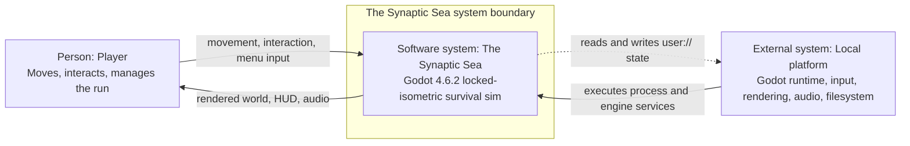
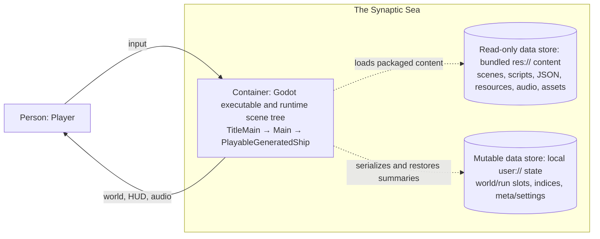
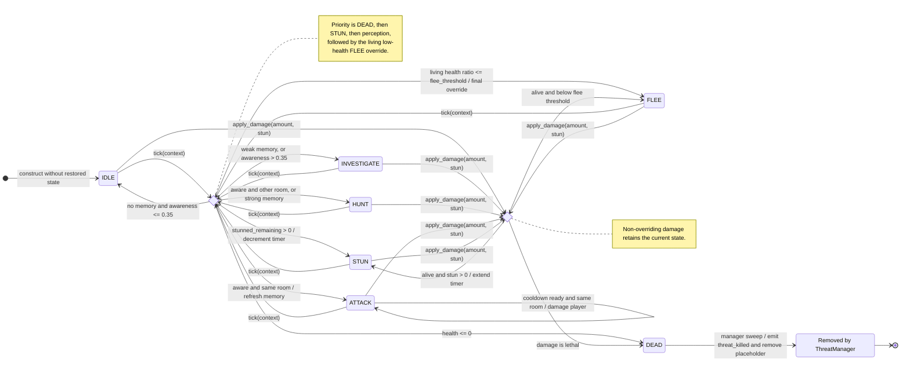
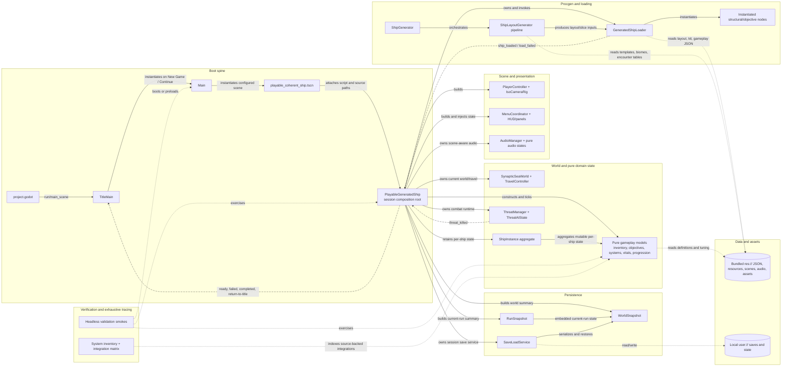

# As-Built Architecture Visualizations Implementation Plan

> **For agentic workers:** REQUIRED SUB-SKILL: Use superpowers:subagent-driven-development (recommended) or superpowers:executing-plans to implement this plan task-by-task. Steps use checkbox (`- [ ]`) syntax for tracking.

**Goal:** Build five individually readable, source-backed Mermaid architecture views and validated SVG exports for developer onboarding without changing game runtime behavior.

**Architecture:** Markdown is the canonical diagram source. A repository-local, exact-version Mermaid CLI renders exports, while a stdlib-only Python validator enforces document schema, evidence paths, notation, retired-ID guards, renderer metadata, and atomic export refreshes. Governance lands first; C4, behavior, and dependency content can then proceed independently behind the validator contract, followed by one integrated verification gate.

**Tech Stack:** Godot 4.6.2 repository; Markdown; Mermaid CLI `11.16.0`; Node.js `26.x`; npm lockfile; Python 3.11+ standard library; Hermes Kanban CLI; SVG.

## Global Constraints

- Authoritative design: `docs/superpowers/specs/2026-07-10-as-built-architecture-visualizations-design.md`.
- Primary audience: developers onboarding to and maintaining The Synaptic Sea.
- Scope is current implementation only; planned or deferred behavior appears only as an explicit omission or current gap.
- Preserve the source-authority order: current code/data, canonical `system_inventory.json`, feature specs/requirements/ADRs, then reconfirmed older prose.
- Do not change `.gd`, `.tscn`, `.tres`, gameplay JSON, input, scene behavior, or save behavior.
- Do not invent game autoloads, network services, cloud backends, or independently deployable source modules.
- `PlayableGeneratedShip` remains the session-owned composition root; `TitleMain` and gameplay own separate `SaveLoadService` instances.
- Canonical checkpoint persistence is `_auto_save_current_run()` -> `SaveLoadService.save_world()` -> `user://saves/world.json`; ignore stale nearby comments naming `current_run.json`.
- Every implementation card cites this design and `REQ-DOC-009`, enumerates allowed files, states non-goals, and lists exact verification commands.
- Use explicit `--board synaptic-sea-stage-gate` for every Kanban command.
- Mermaid source uses stable node/edge IDs, labeled relationships, and no color-only meaning.
- Flowchart edge classes: ownership/call is solid; signal is `stroke-dasharray: 8\,4`; data/persistence is `stroke-dasharray: 2\,3`.
- Sequence diagrams use solid direct calls, dashed signals/callbacks/returns, and explicit labels for data/persistence.
- State diagrams use standard transitions labeled `event [guard] / action`; line style does not encode semantics.
- Each diagram document has exactly one Mermaid fence and the eight exact H2 headings from the design; the index has no Mermaid fence and its seven exact H2 headings.
- Evidence table `Basis` is one of `explicit`, `engine lifecycle`, `inventory`, `feature spec`, `ADR`, or `requirement`.
- Pin `@mermaid-js/mermaid-cli` exactly at `11.16.0`; do not use floating `npx` or a global install.
- `tools/architecture/node_modules/` is ignored and never committed.
- A failed render must leave every committed SVG unchanged.
- Unexpected Godot `ERROR:` or `WARNING:` lines block completion unless already classified by the canonical regression bundle.
- Do not mark the feature or `REQ-DOC-009` Validated until all five exports, document checks, inventory checks, currency checks, and the complete Godot regression pass with fresh output.

## Upstream Tooling Anchors

- Mermaid CLI usage and Markdown/SVG rendering: `https://github.com/mermaid-js/mermaid-cli`.
- Mermaid configuration schema and deterministic ID seed: `https://mermaid.js.org/config/schema-docs/config`.
- Mermaid flowchart edge IDs and edge classes: `https://mermaid.js.org/syntax/flowchart`.

## File Structure

### Create

- `docs/game/features/architecture_visualizations.md` — governed feature contract.
- `docs/game/adr/0048-mermaid-architecture-diagram-source-and-svg-exports.md` — workflow/format decision.
- `docs/game/architecture/README.md` — onboarding order, notation, freshness, and exhaustive-map links.
- `docs/game/architecture/01-c4-system-context.md` — C4 system-context view.
- `docs/game/architecture/02-c4-containers.md` — C4 container/data-store view.
- `docs/game/architecture/03-gameplay-interaction-sequence.md` — core interaction sequence.
- `docs/game/architecture/04-threat-ai-state-machine.md` — implemented threat-AI lifecycle.
- `docs/game/architecture/05-runtime-component-dependencies.md` — curated layered dependency view.
- `docs/game/architecture/rendered/*.svg` — five generated exports with source/renderer metadata.
- `tools/architecture/package.json` — private exact-version renderer package.
- `tools/architecture/package-lock.json` — transitive dependency lock.
- `tools/architecture/.npmrc` — engine-strict local npm policy.
- `tools/architecture/mermaid.config.json` — safe deterministic Mermaid configuration.
- `tools/validate_architecture_diagrams.py` — parser, renderer, freshness checker, and update CLI.
- `tools/test_validate_architecture_diagrams.py` — stdlib-only validator self-test.

### Modify

- `.gitignore` — ignore only `tools/architecture/node_modules/`.
- `docs/game/05_requirements.md` — add `REQ-DOC-009`, initially In implementation, finally Validated.
- `docs/game/06_validation_plan.md` — register the architecture check and advance bundle count 207 -> 208.
- `docs/game/adr/README.md` — index ADR-0048.
- `docs/SYNAPTIC_SEA_COMPLETE_SYSTEMS_MAP.md` — add ADR-0048 to the currency index.
- `scripts/validation/doc_currency_validators.py` — support per-REQ-DOC sources, `REQ-DOC-009`, ADR-0048, and the new marker.

---

## Execution Order

The long literal templates are grouped near the contracts they implement, so the physical section order is not the execution order. Execute strictly by task number:

1. [Task 1 — governance and board graph](#task-1-establish-the-board-graph-and-governance-contract)
2. [Task 2 — renderer and validator](#task-2-build-the-locked-renderer-and-validator-with-tests)
3. [Task 3 — index and C4 overview](#task-3-author-the-onboarding-index-and-c4-overview-views)
4. [Task 4 — sequence and state views](#task-4-author-the-gameplay-sequence-and-threat-ai-state-views)
5. [Task 5 — component/dependency view](#task-5-author-the-curated-runtime-componentdependency-view)
6. [Task 6 — exports and currency integration](#task-6-generate-exports-and-close-documentation-currency-integration)
7. [Task 7 — full regression and board closure](#task-7-run-the-complete-regression-gate-and-close-the-kanban-work)

Task 1 must be committed before Task 2 begins because ADR-0048 is the workflow decision gate.

---

### Task 3: Author the onboarding index and C4 overview views

**Files:**
- Create: `docs/game/architecture/README.md`
- Create: `docs/game/architecture/01-c4-system-context.md`
- Create: `docs/game/architecture/02-c4-containers.md`

**Interfaces:**
- Consumes: Task 2 `--check-source`, current boot/persistence sources, and ADR-0048 notation.
- Produces: the architecture reading entry point plus `ARCH-C4-CONTEXT` and `ARCH-C4-CONTAINERS` canonical Mermaid sources.

- [ ] **Step 1: Create the architecture index**

Create `docs/game/architecture/README.md` exactly as follows:

````markdown
# The Synaptic Sea — As-Built Architecture

## Purpose

This directory is the developer-onboarding path for the current Godot runtime. It explains a small set of architectural questions without replacing the exhaustive system inventory, feature contracts, requirements, ADRs, or validation evidence.

## Reading order

1. [System context](01-c4-system-context.md) — runtime boundary and outside actors.
2. [Containers and data stores](02-c4-containers.md) — executable, bundled content, and local persistence.
3. [Gameplay interaction sequence](03-gameplay-interaction-sequence.md) — input through models, consequences, and checkpointing.
4. [Threat-AI state machine](04-threat-ai-state-machine.md) — implemented threat states and guards.
5. [Runtime component dependencies](05-runtime-component-dependencies.md) — boot spine, composition root, and stable clusters.

Each source document links its matching SVG under `rendered/`.

## Notation

- Flowchart solid edge: ownership, construction, direct call, or runtime control.
- Flowchart long-dash edge: signal or event callback.
- Flowchart short-dot edge: data/resource or persistence access.
- Sequence solid message: synchronous direct call.
- Sequence dashed message: emitted signal, callback, or return.
- State transition label: `event [guard] / action`.
- `inferred` means Godot lifecycle behavior supported by engine semantics but not directly called by repository source.
- Color is supplementary; labels and line/arrow conventions carry meaning.

## Evidence hierarchy

1. Current `project.godot`, scenes, scripts, resources, and JSON.
2. `docs/game/inventory/system_inventory.json`.
3. Accepted feature specs, requirements, and ADRs.
4. Older prose only after confirmation against current source.

## Freshness policy

The diagrams describe the implementation at evidence baseline `ae28d95`, reconfirmed on 2026-07-10. Update a diagram whenever a cited ownership, call, event, state transition, resource path, or persistence boundary changes. Line numbers are supplemental; path plus symbol is the durable anchor.

## Regeneration and validation

```bash
npm --prefix tools/architecture ci
python3 tools/validate_architecture_diagrams.py --update
python3 tools/validate_architecture_diagrams.py --check
```

Update mode renders all five diagrams before replacing any SVG. Check mode performs a fresh syntax render and verifies each export's source hash and exact renderer version.

## Exhaustive maps

- [Canonical system inventory](../inventory/SYSTEM_INVENTORY.md)
- [Interactive system map and integration matrix](../inventory/system_map.html)
- [Structured inventory source](../inventory/system_inventory.json)

The curated dependency view intentionally does not draw all 191 systems or 324 integration relationships.
````

- [ ] **Step 2: Create the system-context document**

Create `docs/game/architecture/01-c4-system-context.md`:

````markdown
# C4 System Context — The Synaptic Sea

- **Diagram ID:** ARCH-C4-CONTEXT
- **Audience:** Developers onboarding to the runtime boundary
- **Scope:** Current local single-player execution only
- **Evidence baseline:** ae28d95
- **Freshness date:** 2026-07-10

## Purpose and conclusion

This view answers who uses the game and what sits outside its software boundary. The Synaptic Sea is one local Godot system: the player provides input and receives audiovisual feedback, while the local platform executes the process and supplies local filesystem persistence. No network or cloud runtime is present.

## Diagram



## Relationship legend

Solid arrows are direct runtime interaction or execution. The short-dot arrow is local persistence access. Labels, not color, define meaning.

## Text equivalent

| Source | Relationship | Target |
| --- | --- | --- |
| Player | sends movement, interaction, and menu input | The Synaptic Sea |
| The Synaptic Sea | returns rendered world, HUD, and audio feedback | Player |
| Local platform | executes the Godot process and provides engine services | The Synaptic Sea |
| The Synaptic Sea | reads and writes local `user://` state | Local platform filesystem |

## Evidence

| Element or relationship | Source path | Symbol | Basis |
| --- | --- | --- | --- |
| Godot game identity and runtime version | project.godot | application/config/name and config/features | explicit |
| Player input enters runtime controller | scripts/player/player_controller.gd | _unhandled_input and request_interact | explicit |
| Local world persistence | scripts/systems/save_load_service.gd | save_world and load_world | explicit |
| Audiovisual/runtime consequences remain scene-owned | docs/game/04_tdd.md | Architecture principles | explicit |

## Explicit, inferred, and omitted

The game configuration, player input code, and save service are explicit. The platform-to-process execution arrow is labeled as a system-context relationship derived from Godot engine lifecycle. Internal scenes, models, and data stores are deliberately omitted at this level.

## Known current gaps

Real cloud saves are not implemented. The cloud manifest is local metadata, not a network backend. Full audio content is deferred even though the local audio pipeline exists.

## Export and regeneration

Rendered export: [rendered/01-c4-system-context.svg](rendered/01-c4-system-context.svg). Regenerate and validate from the repository root with `python3 tools/validate_architecture_diagrams.py --update` followed by `--check`.
````

- [ ] **Step 3: Create the container/data-store document**

Create `docs/game/architecture/02-c4-containers.md`:

````markdown
# C4 Containers and Data Stores — Local Runtime

- **Diagram ID:** ARCH-C4-CONTAINERS
- **Audience:** Developers tracing runtime content and persistence boundaries
- **Scope:** Current executable, bundled `res://` content, and local `user://` data
- **Evidence baseline:** ae28d95
- **Freshness date:** 2026-07-10

## Purpose and conclusion

The shipped runtime is one Godot executable and scene tree. It reads bundled scenes, scripts, resources, JSON, audio, and assets under `res://`, while mutable snapshots, slot indices, meta state, and settings live under `user://`. Source modules are not independently deployable C4 containers.

## Diagram



## Relationship legend

Solid arrows are direct runtime interaction. Short-dot arrows are data/resource or persistence access. Arrows describe local relationships only.

## Text equivalent

| Container or store | Responsibility | Relationship |
| --- | --- | --- |
| Godot executable and runtime scene tree | owns title, playable session, scene consequences, services, and pure models | receives input and emits audiovisual feedback |
| Bundled `res://` content | immutable packaged scenes, scripts, resources, JSON, audio, and imported assets | read by the runtime and loaders |
| Local `user://` state | mutable world/run snapshots, slot index, meta progression, and settings/state files | read and written by session-owned persistence services |

## Evidence

| Element or relationship | Source path | Symbol | Basis |
| --- | --- | --- | --- |
| Configured executable entry scene | project.godot | run/main_scene | explicit |
| Title lazily creates gameplay | scripts/title_main.gd | _instantiate_gameplay | explicit |
| Main creates the configured playable scene | scripts/main.gd | _ready | explicit |
| Playable session is the composition root | scripts/procgen/playable_generated_ship.gd | _ready and _build_runtime_nodes | explicit |
| Loader reads bundled layout, kit, and gameplay JSON | scripts/procgen/generated_ship_loader.gd | load_from_paths | explicit |
| Save service reads/writes world snapshots | scripts/systems/save_load_service.gd | save_world and load_world | explicit |
| World snapshot separates mutable state from geometry | docs/game/adr/0012-world-persistence-model.md | Decision | ADR |

## Explicit, inferred, and omitted

All content and persistence accesses are explicit in repository source. The diagram treats bundled and local stores as C4 data-store containers; it does not claim that GDScript folders, managers, or models deploy separately.

## Known current gaps

The repository has no runtime network container or true cloud-save service. TitleMain and PlayableGeneratedShip construct separate `SaveLoadService` instances; persistence is not a singleton or autoload.

## Export and regeneration

Rendered export: [rendered/02-c4-containers.svg](rendered/02-c4-containers.svg). Regenerate and validate from the repository root with `python3 tools/validate_architecture_diagrams.py --update` followed by `--check`.
````

- [ ] **Step 4: Run focused source/render validation**

```powershell
python tools/validate_architecture_diagrams.py --check-source docs/game/architecture/README.md docs/game/architecture/01-c4-system-context.md docs/game/architecture/02-c4-containers.md
git diff --check -- docs/game/architecture/README.md docs/game/architecture/01-c4-system-context.md docs/game/architecture/02-c4-containers.md
```

Expected: `ARCHITECTURE DIAGRAM SOURCE PASS documents=3 diagrams=2 references=11`.

- [ ] **Step 5: Commit the overview views**

```powershell
git add docs/game/architecture/README.md docs/game/architecture/01-c4-system-context.md docs/game/architecture/02-c4-containers.md
git commit -m "docs: add architecture overview views"
```

---

### Task 2: Build the locked renderer and validator with tests

> **Execution-order note:** Task 1's governance section appears later in this document because this validator listing was inserted beside the file-structure contract. Execute strictly by task number: finish and commit Task 1 before beginning any Task 2 implementation.

**Files:**
- Create: `tools/architecture/package.json`
- Create: `tools/architecture/package-lock.json`
- Create: `tools/architecture/.npmrc`
- Create: `tools/architecture/mermaid.config.json`
- Create: `tools/validate_architecture_diagrams.py`
- Create: `tools/test_validate_architecture_diagrams.py`
- Modify: `.gitignore`

**Interfaces:**
- Consumes: ADR-0048, exact document schemas, Node.js `26.x`, and Mermaid CLI `11.16.0`.
- Produces: `--check`, `--update`, and `--check-source` CLI modes; `ARCHITECTURE DIAGRAM VALIDATOR SELFTEST PASS`; full and focused PASS markers; atomic SVG export updates.

- [ ] **Step 1: Write the failing validator self-test**

Create `tools/test_validate_architecture_diagrams.py`:

```python
from __future__ import annotations

import contextlib
import io
import json
import subprocess
import tempfile
import unittest
from pathlib import Path
from unittest.mock import patch

import validate_architecture_diagrams as vad


H2 = [
    "Purpose and conclusion", "Diagram", "Relationship legend", "Text equivalent",
    "Evidence", "Explicit, inferred, and omitted", "Known current gaps",
    "Export and regeneration",
]
README_H2 = [
    "Purpose", "Reading order", "Notation", "Evidence hierarchy",
    "Freshness policy", "Regeneration and validation", "Exhaustive maps",
]


def diagram_text(diagram_id: str, family: str, source_path: str = "project.godot") -> str:
    syntax = {
        "flowchart": "flowchart LR\n  A[Source] edge@--> B[Target]\n  classDef dataEdge stroke-dasharray:2\\,3;\n  class edge dataEdge;",
        "sequence": "sequenceDiagram\n  participant A\n  participant B\n  A->>B: call\n  B-->>A: return",
        "state": "stateDiagram-v2\n  state Decision <<choice>>\n  [*] --> IDLE\n  IDLE --> Decision: tick\n  Decision --> IDLE: otherwise",
    }[family]
    if diagram_id == "ARCH-COMP-RUNTIME":
        syntax += "\n  classDef signalEdge stroke-dasharray:8\\,4;"
    legend = {
        "flowchart": "Solid direct call; dataEdge is short-dot; labels carry meaning.",
        "sequence": "Solid direct call; dashed signal or return; labels carry meaning.",
        "state": "Standard labeled state transitions; line style carries no meaning.",
    }[family]
    parts = [
        f"# {diagram_id}", "", f"- **Diagram ID:** {diagram_id}",
        "- **Audience:** Developers", "- **Scope:** Current implementation",
        "- **Evidence baseline:** test", "- **Freshness date:** 2026-07-10", "",
        "## Purpose and conclusion", "", "Purpose. Conclusion.", "",
        "## Diagram", "", "```mermaid", syntax, "```", "",
        "## Relationship legend", "", legend, "",
        "## Text equivalent", "", "Source calls Target.", "",
        "## Evidence", "",
        "| Element or relationship | Source path | Symbol | Basis |",
        "| --- | --- | --- | --- |",
        f"| A to B | {source_path} | test_symbol | explicit |", "",
        "## Explicit, inferred, and omitted", "", "All shown edges are explicit.", "",
        "## Known current gaps", "", "None in this fixture.", "",
        "## Export and regeneration", "", "Run the repository validator.", "",
    ]
    return "\n".join(parts)


def index_text() -> str:
    lines = ["# Architecture", ""]
    for heading in README_H2:
        lines.extend([f"## {heading}", "", f"{heading} text.", ""])
    return "\n".join(lines)


class ValidatorTests(unittest.TestCase):
    def setUp(self) -> None:
        self.temp = tempfile.TemporaryDirectory()
        self.root = Path(self.temp.name)
        (self.root / "project.godot").write_text("config_version=5\n", encoding="utf-8")
        arch = self.root / "docs/game/architecture"
        arch.mkdir(parents=True)
        (arch / "README.md").write_text(index_text(), encoding="utf-8")
        for spec in vad.DIAGRAM_SPECS:
            (arch / spec.filename).write_text(
                diagram_text(spec.expected_id, spec.family), encoding="utf-8"
            )
        tool = self.root / "tools/architecture"
        package_root = tool / "node_modules/@mermaid-js/mermaid-cli"
        cli = package_root / "src/cli.js"
        cli.parent.mkdir(parents=True)
        cli.write_text("// fake cli\n", encoding="utf-8")
        (tool / "package.json").write_text(json.dumps({
            "private": True, "engines": {"node": "26.x"},
            "devDependencies": {"@mermaid-js/mermaid-cli": "11.16.0"},
        }), encoding="utf-8")
        (package_root / "package.json").write_text(json.dumps({
            "name": "@mermaid-js/mermaid-cli", "version": "11.16.0",
            "bin": {"mmdc": "./src/cli.js"},
        }), encoding="utf-8")
        (tool / "mermaid.config.json").write_text("{}\n", encoding="utf-8")

    def tearDown(self) -> None:
        self.temp.cleanup()

    @staticmethod
    def fake_runner(args: list[str], **_kwargs) -> subprocess.CompletedProcess[str]:
        output = Path(args[args.index("--output") + 1])
        output.write_text('<svg xmlns="http://www.w3.org/2000/svg"><text>ok</text></svg>', encoding="utf-8")
        return subprocess.CompletedProcess(args, 0, "", "")

    def run_main(self, *args: str, runner=None) -> tuple[int, str]:
        out = io.StringIO()
        selected = runner or self.fake_runner
        with patch.object(vad.subprocess, "run", side_effect=selected), contextlib.redirect_stdout(out), contextlib.redirect_stderr(out):
            code = vad.main([*args, "--root", str(self.root)])
        return code, out.getvalue()

    def test_valid_update_then_check(self) -> None:
        code, output = self.run_main("--update")
        self.assertEqual(0, code, output)
        self.assertRegex(output, r"ARCHITECTURE DIAGRAMS PASS diagrams=5 exports=5 references=5")
        code, output = self.run_main("--check")
        self.assertEqual(0, code, output)

    def test_rejects_duplicate_mermaid_fence(self) -> None:
        path = self.root / "docs/game/architecture/01-c4-system-context.md"
        path.write_text(path.read_text(encoding="utf-8") + "\n```mermaid\nflowchart LR\nX-->Y\n```\n", encoding="utf-8")
        code, output = self.run_main("--check-source", str(path.relative_to(self.root)))
        self.assertEqual(1, code)
        self.assertIn("exactly one Mermaid fence", output)

    def test_rejects_bad_heading_order_and_basis(self) -> None:
        path = self.root / "docs/game/architecture/01-c4-system-context.md"
        text = path.read_text(encoding="utf-8").replace("## Relationship legend", "## Evidence", 1)
        path.write_text(text, encoding="utf-8")
        code, output = self.run_main("--check-source", str(path.relative_to(self.root)))
        self.assertEqual(1, code)
        self.assertIn("H2 headings", output)

    def test_rejects_missing_and_escaping_evidence_paths(self) -> None:
        path = self.root / "docs/game/architecture/01-c4-system-context.md"
        path.write_text(diagram_text("ARCH-C4-CONTEXT", "flowchart", "../secret.txt"), encoding="utf-8")
        code, output = self.run_main("--check-source", str(path.relative_to(self.root)))
        self.assertEqual(1, code)
        self.assertIn("repository-relative", output)

    def test_rejects_retired_id_only_inside_mermaid(self) -> None:
        path = self.root / "docs/game/architecture/01-c4-system-context.md"
        path.write_text(path.read_text(encoding="utf-8").replace("A[Source]", "A[FireState]"), encoding="utf-8")
        code, output = self.run_main("--check-source", str(path.relative_to(self.root)))
        self.assertEqual(1, code)
        self.assertIn("prohibited current-architecture ID", output)

    def test_stale_hash_fails_check(self) -> None:
        code, output = self.run_main("--update")
        self.assertEqual(0, code, output)
        path = self.root / "docs/game/architecture/01-c4-system-context.md"
        path.write_text(path.read_text(encoding="utf-8").replace("A[Source]", "A[Changed]"), encoding="utf-8")
        code, output = self.run_main("--check")
        self.assertEqual(1, code)
        self.assertIn("source_sha256", output)

    def test_render_failure_keeps_all_exports(self) -> None:
        code, output = self.run_main("--update")
        self.assertEqual(0, code, output)
        exports = sorted((self.root / "docs/game/architecture/rendered").glob("*.svg"))
        before = {p.name: p.read_bytes() for p in exports}
        calls = {"n": 0}
        def fail_third(args: list[str], **kwargs):
            calls["n"] += 1
            if calls["n"] == 3:
                return subprocess.CompletedProcess(args, 2, "", "renderer exploded")
            return self.fake_runner(args, **kwargs)
        code, output = self.run_main("--update", runner=fail_third)
        self.assertEqual(1, code)
        self.assertIn("renderer exploded", output)
        self.assertEqual(before, {p.name: p.read_bytes() for p in exports})


if __name__ == "__main__":
    suite = unittest.defaultTestLoader.loadTestsFromTestCase(ValidatorTests)
    result = unittest.TextTestRunner(verbosity=2).run(suite)
    if not result.wasSuccessful():
        raise SystemExit(1)
    print("ARCHITECTURE DIAGRAM VALIDATOR SELFTEST PASS")
```

- [ ] **Step 2: Run the self-test to verify RED**

Run:

```powershell
python tools/test_validate_architecture_diagrams.py
```

Expected: FAIL with `ModuleNotFoundError: No module named 'validate_architecture_diagrams'`.

- [ ] **Step 3: Add the exact renderer package and configuration**

Create `tools/architecture/package.json`:

```json
{
  "name": "synaptic-sea-architecture-renderer",
  "version": "1.0.0",
  "private": true,
  "engines": {
    "node": "26.x"
  },
  "devDependencies": {
    "@mermaid-js/mermaid-cli": "11.16.0"
  }
}
```

Create `tools/architecture/.npmrc`:

```ini
engine-strict=true
save-exact=true
```

Create `tools/architecture/mermaid.config.json`:

```json
{
  "look": "classic",
  "theme": "neutral",
  "securityLevel": "strict",
  "deterministicIds": true,
  "deterministicIDSeed": "synaptic-sea-architecture-v1",
  "fontFamily": "Arial, sans-serif",
  "flowchart": {
    "curve": "linear",
    "htmlLabels": true,
    "useMaxWidth": false
  },
  "sequence": {
    "useMaxWidth": false,
    "showSequenceNumbers": true
  },
  "state": {
    "useMaxWidth": false
  }
}
```

Append to `.gitignore`:

```gitignore
# Local architecture renderer dependencies
tools/architecture/node_modules/
```

Generate the lockfile using the already-exact dependency:

```powershell
npm --prefix tools/architecture install --package-lock-only
npm --prefix tools/architecture ci
```

Expected: `package-lock.json` records `@mermaid-js/mermaid-cli` version `11.16.0`; `node_modules/` remains untracked.

- [ ] **Step 4: Implement the validator contract**

Create `tools/validate_architecture_diagrams.py` with these exact public types and CLI behavior:

```python
#!/usr/bin/env python3
from __future__ import annotations

import argparse
import hashlib
import json
import os
import re
import shutil
import subprocess
import sys
import tempfile
from dataclasses import dataclass
from datetime import date
from pathlib import Path
from typing import Sequence

ROOT_DEFAULT = Path(__file__).resolve().parents[1]
ARCH_REL = Path("docs/game/architecture")
RENDERER_REL = Path("tools/architecture")
H2_EXPECTED = [
    "Purpose and conclusion", "Diagram", "Relationship legend", "Text equivalent",
    "Evidence", "Explicit, inferred, and omitted", "Known current gaps",
    "Export and regeneration",
]
README_H2 = [
    "Purpose", "Reading order", "Notation", "Evidence hierarchy",
    "Freshness policy", "Regeneration and validation", "Exhaustive maps",
]
META_KEYS = ["Diagram ID", "Audience", "Scope", "Evidence baseline", "Freshness date"]
EVIDENCE_COLUMNS = ["Element or relationship", "Source path", "Symbol", "Basis"]
BASIS = {"explicit", "engine lifecycle", "inventory", "feature spec", "ADR", "requirement"}
PROHIBITED = {"ShipSystemState", "FireState", "MinimapPanel", "MapFogState", "GDAIMCPRuntime"}
MERMAID_RE = re.compile(r"```mermaid\s*\n(.*?)\n```", re.DOTALL)
H2_RE = re.compile(r"^## (.+)$", re.MULTILINE)
META_RE = re.compile(r"^- \*\*(.+?):\*\*\s+(.+)$", re.MULTILINE)
SVG_META_RE = re.compile(r'<metadata id="synaptic-sea-architecture">(.*?)</metadata>', re.DOTALL)


@dataclass(frozen=True)
class DiagramSpec:
    filename: str
    expected_id: str
    family: str


@dataclass(frozen=True)
class ParsedDiagram:
    spec: DiagramSpec
    path: Path
    metadata: dict[str, str]
    mermaid_source: str
    source_sha256: str
    evidence_paths: tuple[str, ...]


DIAGRAM_SPECS = (
    DiagramSpec("01-c4-system-context.md", "ARCH-C4-CONTEXT", "flowchart"),
    DiagramSpec("02-c4-containers.md", "ARCH-C4-CONTAINERS", "flowchart"),
    DiagramSpec("03-gameplay-interaction-sequence.md", "ARCH-SEQ-INTERACTION", "sequence"),
    DiagramSpec("04-threat-ai-state-machine.md", "ARCH-STATE-THREAT-AI", "state"),
    DiagramSpec("05-runtime-component-dependencies.md", "ARCH-COMP-RUNTIME", "flowchart"),
)
SPEC_BY_NAME = {spec.filename: spec for spec in DIAGRAM_SPECS}


class ValidationError(RuntimeError):
    pass


def normalize_source(source: str) -> str:
    return source.replace("\r\n", "\n").replace("\r", "\n").strip() + "\n"


def source_hash(source: str) -> str:
    return hashlib.sha256(normalize_source(source).encode("utf-8")).hexdigest()


def sections(text: str) -> tuple[list[str], dict[str, str]]:
    matches = list(H2_RE.finditer(text))
    names = [match.group(1).strip() for match in matches]
    content: dict[str, str] = {}
    for index, match in enumerate(matches):
        end = matches[index + 1].start() if index + 1 < len(matches) else len(text)
        content[names[index]] = text[match.end():end].strip()
    return names, content


def parse_pipe_row(line: str) -> list[str]:
    if not line.strip().startswith("|") or not line.strip().endswith("|"):
        raise ValidationError("evidence table row must start and end with '|'")
    return [cell.strip().replace("\\|", "|") for cell in re.split(r"(?<!\\)\|", line.strip())[1:-1]]


def parse_evidence(block: str, root: Path, rel: str) -> tuple[str, ...]:
    lines = [line for line in block.splitlines() if line.strip().startswith("|")]
    if len(lines) < 3 or parse_pipe_row(lines[0]) != EVIDENCE_COLUMNS:
        raise ValidationError(f"{rel}: evidence columns must be {EVIDENCE_COLUMNS}")
    separator = parse_pipe_row(lines[1])
    if len(separator) != 4 or not all(re.fullmatch(r":?-{3,}:?", cell) for cell in separator):
        raise ValidationError(f"{rel}: invalid evidence table separator")
    paths: list[str] = []
    for line in lines[2:]:
        row = parse_pipe_row(line)
        if len(row) != 4:
            raise ValidationError(f"{rel}: evidence row must have four cells")
        path_text = row[1].strip("`")
        if row[3] not in BASIS:
            raise ValidationError(f"{rel}: invalid Basis {row[3]!r}")
        candidate = Path(path_text)
        if not path_text or candidate.is_absolute() or "\\" in path_text or ".." in candidate.parts:
            raise ValidationError(f"{rel}: evidence path must be a non-escaping repository-relative POSIX path: {path_text!r}")
        if not (root / candidate).exists():
            raise ValidationError(f"{rel}: evidence path does not exist: {path_text}")
        paths.append(path_text)
    if not paths:
        raise ValidationError(f"{rel}: evidence table has no data rows")
    return tuple(paths)


def parse_diagram(path: Path, root: Path, spec: DiagramSpec) -> ParsedDiagram:
    rel = path.relative_to(root).as_posix()
    if not path.is_file():
        raise ValidationError(f"{rel}: missing diagram document")
    text = path.read_text(encoding="utf-8").replace("\r\n", "\n").replace("\r", "\n")
    first = next((line for line in text.splitlines() if line.strip()), "")
    if not first.startswith("# ") or first.startswith("## ") or len(re.findall(r"^# ", text, re.MULTILINE)) != 1:
        raise ValidationError(f"{rel}: expected exactly one H1 as the first non-empty line")
    names, content = sections(text)
    if names != H2_EXPECTED:
        raise ValidationError(f"{rel}: H2 headings must equal {H2_EXPECTED}, got {names}")
    metadata_pairs = META_RE.findall(text[:text.index("## Purpose and conclusion")])
    if [key for key, _ in metadata_pairs] != META_KEYS:
        raise ValidationError(f"{rel}: metadata keys must equal {META_KEYS}")
    metadata = dict(metadata_pairs)
    if metadata["Diagram ID"] != spec.expected_id:
        raise ValidationError(f"{rel}: Diagram ID must be {spec.expected_id}")
    try:
        date.fromisoformat(metadata["Freshness date"])
    except ValueError as exc:
        raise ValidationError(f"{rel}: invalid Freshness date") from exc
    fences = MERMAID_RE.findall(text)
    if len(fences) != 1:
        raise ValidationError(f"{rel}: expected exactly one Mermaid fence, found {len(fences)}")
    if len(MERMAID_RE.findall(content["Diagram"])) != 1:
        raise ValidationError(f"{rel}: Mermaid fence must be inside ## Diagram")
    source = normalize_source(fences[0])
    expected_prefix = {"flowchart": "flowchart ", "sequence": "sequenceDiagram", "state": "stateDiagram-v2"}[spec.family]
    if not source.startswith(expected_prefix):
        raise ValidationError(f"{rel}: expected {spec.family} Mermaid source")
    legend = content["Relationship legend"].lower()
    if spec.family == "flowchart":
        if "@-->" not in source or "classDef dataEdge" not in source or "solid" not in legend:
            raise ValidationError(f"{rel}: flowchart notation requires edge IDs, dataEdge class, and solid-edge legend")
        if spec.expected_id == "ARCH-COMP-RUNTIME" and "classDef signalEdge" not in source:
            raise ValidationError(f"{rel}: component view requires signalEdge and dataEdge classes")
    elif spec.family == "sequence":
        if "->>" not in source or "-->>" not in source or "solid" not in legend or "dashed" not in legend:
            raise ValidationError(f"{rel}: sequence notation requires solid calls and dashed signals/returns")
    elif spec.family == "state":
        if "<<choice>>" not in source or not re.search(r"\w+\s+-->\s+\w+\s*:", source):
            raise ValidationError(f"{rel}: state notation requires a choice and labeled transitions")
    for retired in sorted(PROHIBITED):
        if re.search(rf"\b{re.escape(retired)}\b", source):
            raise ValidationError(f"{rel}: prohibited current-architecture ID {retired}")
    evidence = parse_evidence(content["Evidence"], root, rel)
    return ParsedDiagram(spec, path, metadata, source, source_hash(source), evidence)


def validate_index(path: Path, root: Path) -> None:
    rel = path.relative_to(root).as_posix()
    text = path.read_text(encoding="utf-8")
    first = next((line for line in text.splitlines() if line.strip()), "")
    if not first.startswith("# ") or first.startswith("## ") or len(re.findall(r"^# ", text, re.MULTILINE)) != 1:
        raise ValidationError(f"{rel}: expected exactly one H1 as the first non-empty line")
    names, _content = sections(text)
    if names != README_H2:
        raise ValidationError(f"{rel}: H2 headings must equal {README_H2}, got {names}")
    if MERMAID_RE.search(text):
        raise ValidationError(f"{rel}: README must not contain a Mermaid fence")


def renderer_info(root: Path) -> tuple[str, Path, Path, Path]:
    tool = root / RENDERER_REL
    declared = json.loads((tool / "package.json").read_text(encoding="utf-8"))
    wanted = declared.get("devDependencies", {}).get("@mermaid-js/mermaid-cli")
    if wanted != "11.16.0":
        raise ValidationError("tools/architecture/package.json: Mermaid CLI must be exact version 11.16.0")
    installed_path = tool / "node_modules/@mermaid-js/mermaid-cli/package.json"
    if not installed_path.is_file():
        raise ValidationError("tools/architecture: renderer not installed; run npm --prefix tools/architecture ci")
    installed = json.loads(installed_path.read_text(encoding="utf-8"))
    if installed.get("version") != wanted:
        raise ValidationError(f"tools/architecture: installed renderer {installed.get('version')} != {wanted}")
    bin_value = installed.get("bin", {})
    cli_rel = bin_value.get("mmdc") if isinstance(bin_value, dict) else bin_value
    cli = installed_path.parent / str(cli_rel)
    node = shutil.which("node")
    config = tool / "mermaid.config.json"
    if not node or not cli.is_file() or not config.is_file():
        raise ValidationError("tools/architecture: node, Mermaid CLI entry, or config is missing")
    return wanted, Path(node), cli, config


def render(diagram: ParsedDiagram, root: Path, temp: Path) -> Path:
    version, node, cli, config = renderer_info(root)
    source_file = temp / f"{diagram.path.stem}.mmd"
    output_file = temp / f"{diagram.path.stem}.svg"
    source_file.write_text(diagram.mermaid_source, encoding="utf-8", newline="\n")
    command = [
        str(node), str(cli), "--input", str(source_file), "--output", str(output_file),
        "--configFile", str(config), "--width", "1600", "--height", "1200",
        "--backgroundColor", "transparent", "--svgId", diagram.spec.expected_id.lower(),
    ]
    result = subprocess.run(command, cwd=root, text=True, capture_output=True, check=False)
    if result.returncode != 0:
        raise ValidationError(f"{diagram.path.relative_to(root).as_posix()}: Mermaid render failed: {result.stderr.strip()}")
    if not output_file.is_file() or "<svg" not in output_file.read_text(encoding="utf-8"):
        raise ValidationError(f"{diagram.path.relative_to(root).as_posix()}: renderer produced no SVG")
    return output_file


def metadata_payload(diagram: ParsedDiagram, version: str) -> str:
    return json.dumps({
        "renderer": "@mermaid-js/mermaid-cli", "renderer_version": version,
        "source_sha256": diagram.source_sha256,
    }, sort_keys=True, separators=(",", ":"))


def inject_metadata(svg: str, diagram: ParsedDiagram, version: str) -> str:
    if SVG_META_RE.search(svg):
        raise ValidationError(f"{diagram.path.name}: renderer unexpectedly emitted reserved metadata id")
    opening_end = svg.find(">", svg.find("<svg"))
    if opening_end < 0:
        raise ValidationError(f"{diagram.path.name}: malformed SVG root")
    tag = f'<metadata id="synaptic-sea-architecture">{metadata_payload(diagram, version)}</metadata>'
    return svg[:opening_end + 1] + tag + svg[opening_end + 1:]


def verify_export(path: Path, diagram: ParsedDiagram, version: str) -> None:
    if not path.is_file():
        raise ValidationError(f"{path.name}: missing committed export")
    match = SVG_META_RE.search(path.read_text(encoding="utf-8"))
    if not match:
        raise ValidationError(f"{path.name}: missing architecture metadata")
    payload = json.loads(match.group(1))
    expected = json.loads(metadata_payload(diagram, version))
    for key, value in expected.items():
        if payload.get(key) != value:
            raise ValidationError(f"{path.name}: stale {key}: {payload.get(key)!r} != {value!r}")


def parse_all(root: Path) -> tuple[ParsedDiagram, ...]:
    arch = root / ARCH_REL
    validate_index(arch / "README.md", root)
    return tuple(parse_diagram(arch / spec.filename, root, spec) for spec in DIAGRAM_SPECS)


def render_all(root: Path, diagrams: Sequence[ParsedDiagram]) -> tuple[Path, tuple[Path, ...]]:
    temp_dir = Path(tempfile.mkdtemp(prefix=".architecture-render-", dir=root / ARCH_REL))
    try:
        outputs = tuple(render(diagram, root, temp_dir) for diagram in diagrams)
        return temp_dir, outputs
    except Exception:
        shutil.rmtree(temp_dir, ignore_errors=True)
        raise


def full_run(root: Path, update: bool) -> tuple[int, int, int]:
    diagrams = parse_all(root)
    version, _node, _cli, _config = renderer_info(root)
    temp_dir, rendered = render_all(root, diagrams)
    try:
        export_dir = root / ARCH_REL / "rendered"
        if update:
            export_dir.mkdir(parents=True, exist_ok=True)
            staged: list[tuple[Path, Path]] = []
            for diagram, source_svg in zip(diagrams, rendered):
                final_temp = temp_dir / f"final-{diagram.path.stem}.svg"
                final_temp.write_text(inject_metadata(source_svg.read_text(encoding="utf-8"), diagram, version), encoding="utf-8")
                staged.append((final_temp, export_dir / f"{diagram.path.stem}.svg"))
            for source, destination in staged:
                os.replace(source, destination)
        for diagram in diagrams:
            verify_export(export_dir / f"{diagram.path.stem}.svg", diagram, version)
        return len(diagrams), len(diagrams), sum(len(d.evidence_paths) for d in diagrams)
    finally:
        shutil.rmtree(temp_dir, ignore_errors=True)


def source_run(root: Path, names: Sequence[str]) -> tuple[int, int]:
    docs = 0
    diagrams: list[ParsedDiagram] = []
    for name in names:
        candidate = (root / name).resolve()
        try:
            candidate.relative_to(root)
        except ValueError as exc:
            raise ValidationError(f"{name}: source path escapes repository") from exc
        docs += 1
        if candidate.name == "README.md":
            validate_index(candidate, root)
        else:
            spec = SPEC_BY_NAME.get(candidate.name)
            if not spec:
                raise ValidationError(f"{name}: not an approved architecture document")
            diagrams.append(parse_diagram(candidate, root, spec))
    if diagrams:
        temp_dir, _outputs = render_all(root, diagrams)
        shutil.rmtree(temp_dir, ignore_errors=True)
    return docs, sum(len(d.evidence_paths) for d in diagrams)


def main(argv: Sequence[str] | None = None) -> int:
    parser = argparse.ArgumentParser(description="Validate Synaptic Sea architecture diagrams")
    mode = parser.add_mutually_exclusive_group(required=True)
    mode.add_argument("--check", action="store_true")
    mode.add_argument("--update", action="store_true")
    mode.add_argument("--check-source", nargs="+", metavar="PATH")
    parser.add_argument("--root", type=Path, default=ROOT_DEFAULT)
    args = parser.parse_args(argv)
    root = args.root.resolve()
    try:
        if args.check_source:
            documents, references = source_run(root, args.check_source)
            diagrams = sum(1 for name in args.check_source if Path(name).name != "README.md")
            print(f"ARCHITECTURE DIAGRAM SOURCE PASS documents={documents} diagrams={diagrams} references={references}")
        else:
            diagrams, exports, references = full_run(root, update=args.update)
            print(f"ARCHITECTURE DIAGRAMS PASS diagrams={diagrams} exports={exports} references={references}")
        return 0
    except (OSError, ValueError, json.JSONDecodeError, ValidationError) as exc:
        print(f"ERROR: {exc}", file=sys.stderr)
        return 1


if __name__ == "__main__":
    raise SystemExit(main())
```

- [ ] **Step 5: Run the self-test and fix only contract mismatches**

Run:

```powershell
python tools/test_validate_architecture_diagrams.py
```

Expected final line: `ARCHITECTURE DIAGRAM VALIDATOR SELFTEST PASS`.

- [ ] **Step 6: Verify lock, ignore, and RED against the not-yet-authored real docs**

Run:

```powershell
npm --prefix tools/architecture ci
python tools/validate_architecture_diagrams.py --check
git status --short
git diff --check
```

Expected: validator fails with `docs/game/architecture/README.md: missing` or equivalent; tests pass; `tools/architecture/node_modules/` is absent from `git status`.

- [ ] **Step 7: Commit the renderer/validator deliverable**

```powershell
git add .gitignore tools/architecture/package.json tools/architecture/package-lock.json tools/architecture/.npmrc tools/architecture/mermaid.config.json tools/validate_architecture_diagrams.py tools/test_validate_architecture_diagrams.py
git commit -m "tools: validate architecture diagrams"
```

---

### Task 1: Establish the board graph and governance contract

**Files:**
- Create: `docs/game/features/architecture_visualizations.md`
- Create: `docs/game/adr/0048-mermaid-architecture-diagram-source-and-svg-exports.md`
- Modify: `docs/game/05_requirements.md:363`
- Modify: `docs/game/adr/README.md:3-34`
- Modify: `docs/game/06_validation_plan.md:220-235`

**Interfaces:**
- Consumes: approved design specification and board name `synaptic-sea-stage-gate`.
- Produces: six dependency-linked Kanban card IDs, accepted ADR-0048, in-progress `REQ-DOC-009`, feature contract, and the future validator registration used by later tasks.

- [ ] **Step 1: Create or repair the required board without changing the active-board default**

Run from the repository root in PowerShell:

```powershell
$Board = 'synaptic-sea-stage-gate'
$Workspace = (Resolve-Path '.').Path
$boards = hermes kanban boards list --json | ConvertFrom-Json
if (-not ($boards | Where-Object { $_.slug -eq $Board })) {
    hermes kanban boards create $Board `
        --name 'Synaptic Sea Stage Gate' `
        --description 'Stage-Gate implementation and review cards for The Synaptic Sea' `
        --default-workdir $Workspace
    if ($LASTEXITCODE -ne 0) { throw 'Failed to create synaptic-sea-stage-gate' }
} else {
    hermes kanban boards set-default-workdir $Board $Workspace
    if ($LASTEXITCODE -ne 0) { throw 'Failed to update board workdir' }
}
hermes kanban --board $Board list --json
```

Expected: JSON list output; no `board ... does not exist` error. The local Hermes profiles may be absent; create the cards for governance tracking but do not dispatch them from Hermes in that state.

- [ ] **Step 2: Create the six idempotent cards with full contracts and dependencies**

Use the following helper and exact card bodies:

```powershell
$Board = 'synaptic-sea-stage-gate'
$Workspace = (Resolve-Path '.').Path

function New-ArchitectureCard {
    param(
        [Parameter(Mandatory)][string]$Title,
        [Parameter(Mandatory)][string]$Body,
        [Parameter(Mandatory)][string]$Assignee,
        [Parameter(Mandatory)][int]$Priority,
        [Parameter(Mandatory)][string]$IdempotencyKey,
        [string[]]$Parents = @()
    )
    $args = @(
        'kanban', '--board', $Board, 'create', $Title,
        '--body', $Body, '--assignee', $Assignee,
        '--priority', [string]$Priority,
        '--workspace', "dir:$Workspace",
        '--idempotency-key', $IdempotencyKey,
        '--created-by', 'gpt-5.5-coordinator', '--json'
    )
    foreach ($parent in $Parents) { $args += @('--parent', $parent) }
    $raw = (& hermes @args | Out-String)
    if ($LASTEXITCODE -ne 0) { throw "Card creation failed: $raw" }
    $card = $raw | ConvertFrom-Json
    if (-not $card.id) { throw "Create response missing id: $raw" }
    return [string]$card.id
}

function CardBody {
    param([string]$Objective, [string[]]$Allowed, [string[]]$NonGoals, [string[]]$Checks)
    @"
Sources:
- docs/superpowers/specs/2026-07-10-as-built-architecture-visualizations-design.md
- REQ-DOC-009
- ADR-0048

Objective:
$Objective

Allowed files:
$(($Allowed | ForEach-Object { "- $_" }) -join "`n")

Non-goals:
$(($NonGoals | ForEach-Object { "- $_" }) -join "`n")

Verification commands:
$(($Checks | ForEach-Object { "- $_" }) -join "`n")
"@
}

$governance = New-ArchitectureCard `
    -Title 'DOCS: establish as-built architecture visualization governance' `
    -Assignee 'synaptic_sea_docs' -Priority 10 `
    -IdempotencyKey 'archviz-2026-07-10-01-governance' `
    -Body (CardBody `
        'Create the feature spec, REQ-DOC-009, accepted ADR-0048, ADR index entry, and validation-plan registration.' `
        @('docs/game/features/architecture_visualizations.md','docs/game/05_requirements.md','docs/game/adr/0048-mermaid-architecture-diagram-source-and-svg-exports.md','docs/game/adr/README.md','docs/game/06_validation_plan.md') `
        @('No renderer implementation, diagrams, SVG exports, runtime code, or gameplay changes.','REQ-DOC-009 remains In implementation until final verification.') `
        @('python -c "from pathlib import Path as P; assert all(P(x).is_file() for x in [''docs/game/features/architecture_visualizations.md'',''docs/game/adr/0048-mermaid-architecture-diagram-source-and-svg-exports.md''])"','git diff --check'))

$renderer = New-ArchitectureCard `
    -Title 'IMPLEMENT: locked Mermaid renderer and architecture validator' `
    -Assignee 'synaptic_sea_worker' -Priority 20 `
    -IdempotencyKey 'archviz-2026-07-10-02-renderer' -Parents @($governance) `
    -Body (CardBody `
        'Implement the exact-version Mermaid toolchain, architecture validator, and stdlib self-tests.' `
        @('tools/architecture/package.json','tools/architecture/package-lock.json','tools/architecture/.npmrc','tools/architecture/mermaid.config.json','tools/validate_architecture_diagrams.py','tools/test_validate_architecture_diagrams.py','.gitignore') `
        @('No diagram content, SVG exports, runtime code, or global npm installation.') `
        @('npm --prefix tools/architecture ci','python tools/test_validate_architecture_diagrams.py','git diff --check'))

$overview = New-ArchitectureCard `
    -Title 'DOCS: architecture overview context and container views' `
    -Assignee 'synaptic_sea_docs' -Priority 30 `
    -IdempotencyKey 'archviz-2026-07-10-03-overview' -Parents @($governance,$renderer) `
    -Body (CardBody `
        'Create the onboarding index plus system-context and container views.' `
        @('docs/game/architecture/README.md','docs/game/architecture/01-c4-system-context.md','docs/game/architecture/02-c4-containers.md') `
        @('No behavior/state/component diagrams, SVG exports, tooling, inventory regeneration, or runtime changes.') `
        @('python tools/validate_architecture_diagrams.py --check-source docs/game/architecture/README.md docs/game/architecture/01-c4-system-context.md docs/game/architecture/02-c4-containers.md','git diff --check'))

$behavior = New-ArchitectureCard `
    -Title 'DOCS: gameplay sequence and threat-AI state views' `
    -Assignee 'synaptic_sea_docs' -Priority 40 `
    -IdempotencyKey 'archviz-2026-07-10-04-behavior' -Parents @($governance,$renderer) `
    -Body (CardBody `
        'Create the gameplay-interaction sequence and implemented threat-AI state-machine views.' `
        @('docs/game/architecture/03-gameplay-interaction-sequence.md','docs/game/architecture/04-threat-ai-state-machine.md') `
        @('No runtime AI fixes, desired transitions, overview/component diagrams, SVG exports, or tooling changes.') `
        @('python tools/validate_architecture_diagrams.py --check-source docs/game/architecture/03-gameplay-interaction-sequence.md docs/game/architecture/04-threat-ai-state-machine.md','git diff --check'))

$components = New-ArchitectureCard `
    -Title 'DOCS: runtime component dependency view and exhaustive-map links' `
    -Assignee 'synaptic_sea_docs' -Priority 50 `
    -IdempotencyKey 'archviz-2026-07-10-05-components' -Parents @($governance,$renderer) `
    -Body (CardBody `
        'Create the curated runtime component/dependency view and exhaustive-map linkage.' `
        @('docs/game/architecture/05-runtime-component-dependencies.md') `
        @('No expansion of all 191 systems or 324 edges, coordinator refactor, other diagrams, SVG exports, or tooling changes.') `
        @('python tools/validate_architecture_diagrams.py --check-source docs/game/architecture/05-runtime-component-dependencies.md','git diff --check'))

$verification = New-ArchitectureCard `
    -Title 'REVIEW: refresh architecture SVG exports and verify feature' `
    -Assignee 'synaptic_sea_review' -Priority 60 `
    -IdempotencyKey 'archviz-2026-07-10-06-verification' `
    -Parents @($renderer,$overview,$behavior,$components) `
    -Body (CardBody `
        'Refresh all exports atomically, perform visual QA, run currency/inventory/Godot regression checks, and only then validate the feature and requirement.' `
        @('docs/game/architecture/rendered/*.svg','docs/game/features/architecture_visualizations.md','docs/game/05_requirements.md','docs/game/06_validation_plan.md','docs/SYNAPTIC_SEA_COMPLETE_SYSTEMS_MAP.md','scripts/validation/doc_currency_validators.py') `
        @('No gameplay/runtime changes and no partial export refresh after a render failure.') `
        @('npm --prefix tools/architecture ci','python tools/validate_architecture_diagrams.py --update','python tools/validate_architecture_diagrams.py --check','python tools/build_system_inventory.py --check','python scripts/validation/doc_currency_validators.py requirement-trace','Run the complete Regression bundle in docs/game/06_validation_plan.md'))

[pscustomobject]@{governance=$governance;renderer=$renderer;overview=$overview;behavior=$behavior;components=$components;verification=$verification} | ConvertTo-Json
```

Expected: six JSON IDs; repeated execution returns the same IDs because every card has an idempotency key.

- [ ] **Step 3: Write the documentation feature spec**

Create `docs/game/features/architecture_visualizations.md` with this complete contract:

````markdown
# Feature: As-Built Architecture Visualizations

## Status

In implementation under `REQ-DOC-009` and ADR-0048.

## Design pillar alignment

- Source-backed structure: every major node and relationship cites current source.
- Runtime systems over proof artifacts: diagrams describe actual runtime behavior and do not substitute for gameplay.
- Stage-Gate discipline: the feature has requirements, an ADR, scoped Kanban cards, and fresh validation.

## Player fantasy

This is a developer-facing documentation feature. It protects the player experience indirectly by helping maintainers understand and change the runtime without breaking closed gameplay loops.

## Gameplay problem

The code-verified inventory is exhaustive but too dense for onboarding, while older architecture prose predates the current title bootstrap and later system integrations.

## Core behavior

Five individual Mermaid documents explain system context, runtime containers/data stores, the core gameplay-interaction sequence, implemented threat-AI states, and curated runtime component dependencies. Each document includes a text equivalent, current evidence, inference labels, omissions, and current gaps. A locked renderer produces five SVG exports; a host-side validator blocks schema, evidence, render, and freshness drift.

## Inputs

- Current `project.godot`, scene, GDScript, resource, and JSON sources.
- `docs/game/inventory/system_inventory.json` and its generated views.
- Accepted feature specs, requirements, and ADRs.
- Approved design `docs/superpowers/specs/2026-07-10-as-built-architecture-visualizations-design.md`.

## Outputs

- `docs/game/architecture/README.md`.
- Five individually rendered Markdown/Mermaid documents.
- Five SVG exports with source SHA-256 and renderer version metadata.
- `ARCHITECTURE DIAGRAMS PASS diagrams=5 exports=5 references=N`.

## Rules

- Current implementation only; planned behavior is never drawn as current.
- One primary question and abstraction level per diagram.
- No game autoload, network service, cloud backend, or deployable source module is invented.
- Relationship meaning uses labels and line/arrow conventions, never color alone.
- A failed render cannot partially replace committed exports.
- Every evidence-table path is repository-relative and exists.

## Non-goals

- No runtime, gameplay, scene, input, save, or data changes.
- No exhaustive 191-system/324-edge node-link graph.
- No interactive architecture explorer, XMI, UMLDI, PDF, or PNG deliverable.
- No repair of current threat-AI behavior gaps.

## Technical design

Mermaid source lives inside the five Markdown documents. `tools/validate_architecture_diagrams.py` parses and renders with the exact local `@mermaid-js/mermaid-cli` version locked under `tools/architecture/`. Update mode renders all five before atomically replacing any SVG. Check mode re-renders for syntax and validates committed export metadata rather than byte-comparing cross-platform SVG geometry.

## Allowed files

- `docs/game/architecture/**`
- `docs/game/features/architecture_visualizations.md`
- `docs/game/05_requirements.md`
- `docs/game/06_validation_plan.md`
- `docs/game/adr/0048-mermaid-architecture-diagram-source-and-svg-exports.md`
- `docs/game/adr/README.md`
- `docs/SYNAPTIC_SEA_COMPLETE_SYSTEMS_MAP.md`
- `scripts/validation/doc_currency_validators.py`
- `tools/architecture/**`
- `tools/validate_architecture_diagrams.py`
- `tools/test_validate_architecture_diagrams.py`
- `.gitignore`

## Acceptance criteria

- Given the architecture index, a developer can follow the approved reading order and reach the exhaustive inventory/matrix.
- Given each diagram document, the exact metadata, heading, Mermaid, legend, text-equivalent, evidence, inference/omission, gap, and export schema is present.
- Given current source, every diagram node and relationship is explicit or labeled inferred.
- Given the five Mermaid sources, update mode renders five SVGs atomically and embeds current source hash and renderer version.
- Given unchanged sources/exports, check mode prints the anchored ARCHITECTURE DIAGRAMS PASS marker.
- Given the full validation bundle, it finishes with `SYNAPTIC_SEA REGRESSION PASS commands=208 clean_output=true` and no unclassified diagnostics.

## Validation

```bash
npm --prefix tools/architecture ci
python3 tools/test_validate_architecture_diagrams.py
python3 tools/validate_architecture_diagrams.py --update
python3 tools/validate_architecture_diagrams.py --check
python3 tools/build_system_inventory.py --check
python3 scripts/validation/doc_currency_validators.py requirement-trace
```

## Risks

- Coordinator line drift is mitigated by path-plus-symbol evidence.
- Dense graphs are mitigated by stable clusters and the exhaustive-matrix link.
- Renderer drift is mitigated by exact package/lock metadata and fresh render checks.
- Visual-only information loss is mitigated by text equivalents and labeled relationships.

## ADRs

- `docs/game/adr/0048-mermaid-architecture-diagram-source-and-svg-exports.md`
````

- [ ] **Step 4: Add `REQ-DOC-009` as In implementation**

Insert after `REQ-DOC-008` in `docs/game/05_requirements.md`:

```markdown
## REQ-DOC-009: Current architecture visualizations are source-backed and individually renderable

- Source: `features/architecture_visualizations.md`
- Type: documentation / process
- Priority: must
- Status: In implementation
- Rationale: Developers need a small current architecture reading path that remains traceable to source and does not confuse historical intent with live runtime behavior.
- Acceptance criteria:
  - Five individual Mermaid diagrams cover system context, containers/data stores, gameplay interaction, threat-AI state, and curated runtime dependencies.
  - Every diagram includes a text equivalent, current evidence paths and symbols, inference/omission notes, current gaps, and export instructions.
  - Five committed SVGs carry the current Mermaid-source SHA-256 and exact renderer version.
  - Planned or deferred behavior is absent from diagram semantics.
- Verification:
  - `python3 tools/validate_architecture_diagrams.py --check` (`ARCHITECTURE DIAGRAMS PASS`)
  - Complete regression bundle (`SYNAPTIC_SEA REGRESSION PASS commands=208 clean_output=true`)
```

- [ ] **Step 5: Record and index ADR-0048 before implementation**

Create `docs/game/adr/0048-mermaid-architecture-diagram-source-and-svg-exports.md`:

```markdown
# ADR-0048: Mermaid architecture source and validated SVG exports

- **Status:** Accepted
- **Date:** 2026-07-10
- **Supersedes / amends:** extends ADR-0040 documentation-currency policy

## Context

The canonical inventory contains 191 systems and 324 relationships, while the older architecture reference predates the current title bootstrap and later integration work. Developer onboarding needs a small set of current views that can be diffed, rendered, exported, and validated without a visual-editor binary format.

## Decision

Maintain five curated architecture views as one Mermaid fence per Markdown document. Use native GitHub/Codex rendering for normal reading and a repository-local exact-version Mermaid CLI for validation and SVG export. Commit SVG exports beside the sources. Each SVG carries the normalized Mermaid source SHA-256 and renderer version. Check mode performs a fresh syntax render and verifies metadata; it does not compare cross-platform SVG geometry bytes. Update mode renders every diagram successfully before replacing any export.

Flowchart views use stable edge IDs plus solid ownership/call edges, long-dash signal edges, and short-dot data/persistence edges. Sequence and state views use their native message/transition semantics. Every view has a text equivalent and source evidence.

## Alternatives considered

- PlantUML was rejected because it adds a less repository-native renderer for this documentation audience.
- Structurizr + PlantUML + Graphviz was rejected because three source formats and toolchains outweigh the layout benefit for five curated views.
- SVG-only or visual-editor files were rejected because they obscure semantic review and drift from source.

## Consequences

- Mermaid CLI and its browser dependency are development-only, locked under `tools/architecture/`.
- Generated SVG geometry may differ across platforms; freshness is based on source/renderer metadata plus successful current rendering and visual review.
- Exhaustive dependencies remain in the generated inventory/matrix instead of one unreadable node-link diagram.
- Diagram claims must be updated with source changes or validation fails.

## Validation

- `python3 tools/test_validate_architecture_diagrams.py`
- `python3 tools/validate_architecture_diagrams.py --update`
- `python3 tools/validate_architecture_diagrams.py --check`
- Full Godot 4.6.2 regression bundle with clean diagnostic output.
```

Append this row to `docs/game/adr/README.md` before `## Notes`:

```markdown
| 0048 | docs/game/adr/0048-mermaid-architecture-diagram-source-and-svg-exports.md | Mermaid-first as-built architecture source, evidence schema, locked rendering, and SVG freshness policy |
```

- [ ] **Step 6: Register the future feature check in the validation plan**

After the system-inventory anti-drift registration in `docs/game/06_validation_plan.md`, add:

```bash
# --- REQ-DOC-009 as-built architecture visualizations (host-side Python + locked Mermaid CLI) ---
run_clean 'architecture diagram anti-drift check' '^ARCHITECTURE DIAGRAMS PASS diagrams=5 exports=5 references=[1-9][0-9]*$' bash -lc 'npm --prefix "$1/tools/architecture" ci --silent && python3 "$1/tools/validate_architecture_diagrams.py" --check' _ "$ROOT"
```

Change the final marker from `commands=207` to `commands=208`. Do not run the full bundle yet because the validator and diagrams do not exist.

- [ ] **Step 7: Verify the governance contract and commit**

Run:

```powershell
rg -n 'REQ-DOC-009|ADR-0048|ARCHITECTURE DIAGRAMS PASS|commands=208' docs/game docs/SYNAPTIC_SEA_COMPLETE_SYSTEMS_MAP.md
git diff --check
git status --short
```

Expected: the feature spec, requirement, accepted ADR, index row, and validation-plan marker are present; `REQ-DOC-009` still says `In implementation`.

Commit:

```powershell
git add docs/game/features/architecture_visualizations.md docs/game/05_requirements.md docs/game/adr/0048-mermaid-architecture-diagram-source-and-svg-exports.md docs/game/adr/README.md docs/game/06_validation_plan.md
git commit -m "docs: govern architecture visualizations"
```

---

### Task 4: Author the gameplay sequence and threat-AI state views

**Files:**
- Create: `docs/game/architecture/03-gameplay-interaction-sequence.md`
- Create: `docs/game/architecture/04-threat-ai-state-machine.md`

**Interfaces:**
- Consumes: Task 2 `--check-source`, interaction and threat source paths, ADR-0037, and REQ-D-001/006/010.
- Produces: `ARCH-SEQ-INTERACTION` and `ARCH-STATE-THREAT-AI` sources with explicit alternate branches, guard priority, manager removal, evidence, and current-gap disclosures.

- [ ] **Step 1: Create the gameplay-interaction sequence document**

Create `docs/game/architecture/03-gameplay-interaction-sequence.md`:

````markdown
# Gameplay Interaction Sequence — Input to Checkpoint

- **Diagram ID:** ARCH-SEQ-INTERACTION
- **Audience:** Developers tracing the core moment-to-moment interaction loop
- **Scope:** Current objective interaction path from player input through completion or rejection
- **Evidence baseline:** ae28d95
- **Freshness date:** 2026-07-10

## Purpose and conclusion

This sequence shows how an interact input reaches a real in-world `Interactable`, updates pure models, applies scene/HUD/audio consequences, and either ends the run or writes a world checkpoint. `PlayableGeneratedShip` owns dispatch and integration; models do not reach into the scene tree.

## Diagram

```mermaid
sequenceDiagram
  autonumber
  actor Player
  participant PC as PlayerController
  participant PGS as PlayableGeneratedShip
  participant IA as Interactable
  participant Models as Pure gameplay models
  participant FX as Scene / HUD / Audio
  participant Save as SaveLoadService

  Player->>PC: press interact
  Note over Player,PC: inferred Godot input dispatch
  PC-->>PGS: interact_requested(self)
  PGS->>PGS: ordered interaction dispatch
  alt no valid target or higher-priority interaction rejects
    PGS-->>FX: retain state or show blocking prompt
  else objective Interactable selected
    PGS->>IA: try_interact(player)
    alt completed, inactive, null, or out of range
      IA-->>PGS: return false; emit no completion signal
      PGS-->>FX: retain current objective state
    else accepted
      IA-->>PGS: interaction_completed(...)
      PGS->>Models: complete step; repair; grant training; apply route/hazard state
      alt multi-step objective still incomplete
        Models-->>PGS: step accepted; objective incomplete
        PGS->>FX: refresh tracker and scene state
      else objective complete
        Models-->>PGS: objective and consequences complete
        PGS->>FX: update scene, HUD, and audio
        PGS-->>PGS: playable_interaction_completed(...)
        alt final objective
          PGS->>Save: clear run/autosave files
          PGS-->>FX: playable_slice_completed(summary)
        else next objective
          PGS->>PGS: build WorldSnapshot
          PGS->>Save: save_world() checkpoint
          Save-->>PGS: user://saves/world.json written
          PGS->>FX: activate next objective
        end
      end
    end
  end
```

## Relationship legend

Solid messages are direct synchronous calls. Dashed messages are signals, callbacks, returns, or public events. Persistence is named explicitly in messages. The first input delivery is inferred engine lifecycle; all repository-owned calls and signals are source-backed.

## Text equivalent

1. Godot delivers the interact input to `PlayerController`.
2. `PlayerController` emits `interact_requested(self)` to the coordinator.
3. `PlayableGeneratedShip` tries interaction handlers in source-defined priority order.
4. A selected `Interactable` rejects invalid attempts or marks itself complete and emits `interaction_completed`.
5. The coordinator mutates objective, ship-system, progression, route, and hazard models.
6. Multi-step progress refreshes the tracker without advancing the objective sequence.
7. Completed objectives apply scene, HUD, and audio consequences and emit the playable event.
8. The final objective ends the slice and clears run saves; any earlier objective builds a `WorldSnapshot`, calls `save_world()`, and activates the next objective.

## Evidence

| Element or relationship | Source path | Symbol | Basis |
| --- | --- | --- | --- |
| Interact input emits player request | scripts/player/player_controller.gd | _unhandled_input and request_interact | explicit |
| Coordinator subscribes to player interaction | scripts/procgen/playable_generated_ship.gd | _build_player_and_camera | explicit |
| Ordered interaction dispatch | scripts/procgen/playable_generated_ship.gd | _on_player_interact_requested | explicit |
| Interactable validation and completion signal | scripts/interaction/interactable.gd | try_interact | explicit |
| Coordinator connects objective completion | scripts/procgen/playable_generated_ship.gd | _build_interactables | explicit |
| Multi-step and final objective handling | scripts/procgen/playable_generated_ship.gd | _on_interactable_completed | explicit |
| Checkpoint world snapshot and save | scripts/procgen/playable_generated_ship.gd | _auto_save_current_run | explicit |
| Local world save destination | scripts/systems/save_load_service.gd | WORLD_SAVE_PATH and save_world | explicit |
| Real input path advances objective sequence | scripts/validation/main_playable_slice_input_smoke.gd | input interaction scenario | explicit |
| Objective, route, extraction contract | docs/game/05_requirements.md | REQ-001, REQ-002, and REQ-003 | requirement |

## Explicit, inferred, and omitted

Godot's delivery of the initial input event is inferred engine lifecycle. Signal declarations/connections, dispatch order, model mutations, scene consequences, and world-save calls are explicit. Tool, cargo, docking, crafting, menu, and combat branches ahead of objective dispatch are collapsed into the single higher-priority rejection branch.

## Known current gaps

The coordinator is a high-degree integration hotspot. Comments near checkpoint code still mention `current_run.json`, but executable code builds `WorldSnapshot` and writes `user://saves/world.json`; this diagram follows the executable path.

## Export and regeneration

Rendered export: [rendered/03-gameplay-interaction-sequence.svg](rendered/03-gameplay-interaction-sequence.svg). Regenerate and validate from the repository root with `python3 tools/validate_architecture_diagrams.py --update` followed by `--check`.
````

- [ ] **Step 2: Create the threat-AI state-machine document**

Create `docs/game/architecture/04-threat-ai-state-machine.md`:

````markdown
# Threat-AI State Machine — Implemented Runtime

- **Diagram ID:** ARCH-STATE-THREAT-AI
- **Audience:** Developers maintaining combat, detection, and threat behavior
- **Scope:** Current `ThreatAIState` transitions plus manager-owned attack/movement/removal consequences
- **Evidence baseline:** ae28d95
- **Freshness date:** 2026-07-10

## Purpose and conclusion

Threat behavior is a pure state machine driven by health, stun duration, awareness, room equality, memory, and archetype flee thresholds. `ThreatManager` supplies live context and owns scene movement, attacks, kill emission, and removal. Some enum states are reachable without distinct scene behavior.

## Diagram



## Relationship legend

Every arrow is a state transition labeled `event [guard] / action`. Choice nodes represent evaluation control, not runtime enum values. `Removed by ThreatManager` is a manager lifecycle outcome outside the pure model enum.

## Text equivalent

| From | Event and guard | To | Action |
| --- | --- | --- | --- |
| construction | no restored state | `IDLE` | initialize current and previous state |
| any living state | tick and `health <= 0` | `DEAD` | highest-priority early return |
| any living state | tick and stun remains | `STUN` | decrement stun timer |
| any unstunned living state | awareness threshold met and same room | `ATTACK` | refresh memory and last-known room |
| any unstunned living state | awareness threshold met in another room or memory remains strong | `HUNT` | refresh or decay memory |
| any unstunned living state | weak memory or awareness above 0.35 | `INVESTIGATE` | decay memory where present |
| any unstunned living state | no memory and awareness at most 0.35 | `IDLE` | clear active response |
| any living state | health ratio at/below archetype flee threshold | `FLEE` | final override after perception |
| any living state | lethal/stunning/low-health damage | `DEAD` / `STUN` / `FLEE` | apply damage and override state |
| `ATTACK` | cooldown ready, alive, same room | `ATTACK` | manager damages player and resets cooldown |
| `DEAD` | manager sweep | removed | emit `threat_killed`, erase model, free placeholder |

## Evidence

| Element or relationship | Source path | Symbol | Basis |
| --- | --- | --- | --- |
| State constants and initialization | scripts/systems/threat_ai_state.gd | STATE_* constants and _init | explicit |
| Tick transition priority and perception guards | scripts/systems/threat_ai_state.gd | tick | explicit |
| Damage overrides | scripts/systems/threat_ai_state.gd | apply_damage | explicit |
| Attack cooldown action | scripts/systems/threat_ai_state.gd | can_attack and consume_attack | explicit |
| Live detection/context and player damage | scripts/systems/threat_manager.gd | tick_threats | explicit |
| Kill event and removal | scripts/systems/threat_manager.gd | _sweep_dead_threats | explicit |
| HUNT/ATTACK placeholder movement only | scripts/systems/threat_manager.gd | _update_placeholder | explicit |
| Archetype sensitivities, memory, cooldown, and flee thresholds | data/combat/threat_archetypes.json | archetype records | explicit |
| Combat architecture and persistence | docs/game/adr/0037-combat-threat-architecture.md | Decision | ADR |
| Threat behavior requirement | docs/game/05_requirements.md | REQ-D-001, REQ-D-006, and REQ-D-010 | requirement |
| Model transition smoke | scripts/validation/threat_ai_state_smoke.gd | transition cases | explicit |

## Explicit, inferred, and omitted

All drawn states, guards, actions, and removal behavior are explicit. Weighted perception inputs are summarized rather than expanded. Position interpolation and persistence summary fields are omitted because they do not change the transition question.

## Known current gaps

`FLEE` is reachable, but scene logic does not move a fleeing placeholder away from the player. `INVESTIGATE` has no distinct scene action, and stored `last_known_room` is not consumed outside the model. Current validation does not directly pin `FLEE`, the exact 40-percent memory boundary, or stun recovery.

## Export and regeneration

Rendered export: [rendered/04-threat-ai-state-machine.svg](rendered/04-threat-ai-state-machine.svg). Regenerate and validate from the repository root with `python3 tools/validate_architecture_diagrams.py --update` followed by `--check`.
````

- [ ] **Step 3: Run focused source/render validation**

```powershell
python tools/validate_architecture_diagrams.py --check-source docs/game/architecture/03-gameplay-interaction-sequence.md docs/game/architecture/04-threat-ai-state-machine.md
git diff --check -- docs/game/architecture/03-gameplay-interaction-sequence.md docs/game/architecture/04-threat-ai-state-machine.md
```

Expected: `ARCHITECTURE DIAGRAM SOURCE PASS documents=2 diagrams=2 references=21`.

- [ ] **Step 4: Commit the behavior views**

```powershell
git add docs/game/architecture/03-gameplay-interaction-sequence.md docs/game/architecture/04-threat-ai-state-machine.md
git commit -m "docs: add architecture behavior views"
```

---

### Task 5: Author the curated runtime component/dependency view

**Files:**
- Create: `docs/game/architecture/05-runtime-component-dependencies.md`

**Interfaces:**
- Consumes: Task 2 flowchart edge-class contract and current boot/procgen/domain/persistence/UI/audio/validation sources.
- Produces: `ARCH-COMP-RUNTIME`, a stable clustered graph that links to rather than duplicates the exhaustive inventory matrix.

- [ ] **Step 1: Create the component/dependency document**

Create `docs/game/architecture/05-runtime-component-dependencies.md`:

````markdown
# Runtime Component Dependencies — Curated Onboarding View

- **Diagram ID:** ARCH-COMP-RUNTIME
- **Audience:** Developers locating runtime ownership and dependency seams
- **Scope:** Stable boot, composition, procgen, domain, presentation, persistence, data, and validation clusters
- **Evidence baseline:** ae28d95
- **Freshness date:** 2026-07-10

## Purpose and conclusion

The runtime is a clustered directed graph with one dominant session hub. `project.godot` boots `TitleMain`, which lazily creates `Main` and the configured playable scene. `PlayableGeneratedShip` then owns scene-aware coordinators and pure-model aggregates. Explicit source imports have no multi-node cycle; apparent feedback loops are child signals returning to their owner.

## Diagram



## Relationship legend

Solid arrows are construction, ownership, direct call, aggregation, or runtime control. Long-dash arrows are signals/events back to owners. Short-dot arrows are content, persistence, validation, or documentation-evidence dependencies. Every arrow is labeled; color is not semantic.

## Text equivalent

| Cluster | Responsibility | Principal dependencies |
| --- | --- | --- |
| Boot spine | selects title, creates gameplay shell, and instantiates configured playable session | `project.godot` → `TitleMain` → `Main` → playable scene → `PlayableGeneratedShip` |
| Procgen/loading | produces deterministic layouts and instantiates structural/objective scene nodes | generators and layout pipeline → `GeneratedShipLoader` → wrapper scenes |
| World/domain | owns current world selection, mutable per-ship aggregates, pure state, and combat state | coordinator-owned or injected; `ShipInstance` aggregates per-ship models |
| Presentation | owns player/camera nodes, HUD/menu panels, and scene-aware audio | constructed and refreshed by `PlayableGeneratedShip` |
| Persistence | captures current-run and world summaries and writes local files | coordinator → `RunSnapshot`/`WorldSnapshot` → `SaveLoadService` → `user://` |
| Data/assets | supplies packaged read-only inputs and local mutable state | read by loaders/models/services |
| Verification | proves production seams and maintains exhaustive relationship evidence | validation scripts and generated inventory depend on production targets |

## Evidence

| Element or relationship | Source path | Symbol | Basis |
| --- | --- | --- | --- |
| Project boots title scene | project.godot | run/main_scene | explicit |
| Title creates Main and observes playable lifecycle | scripts/title_main.gd | _instantiate_gameplay and _poll_for_playable_started | explicit |
| Main instantiates configured playable scene | scripts/main.gd | DEFAULT_PLAYABLE_SHIP_SCENE and _ready | explicit |
| Playable scene binds script and source paths | scenes/procgen/playable_coherent_ship.tscn | ext_resource and exported paths | explicit |
| Composition-root dependencies and lifecycle signals | scripts/procgen/playable_generated_ship.gd | preload constants and playable signals | explicit |
| Loader reads JSON and instantiates runtime nodes | scripts/procgen/generated_ship_loader.gd | load_from_paths and _build_runtime | explicit |
| Procgen pipeline stage order | scripts/procgen/ship_layout_generator.gd | generate | explicit |
| Per-ship aggregate ownership | scripts/systems/ship_instance.gd | state fields and get_summary | explicit |
| World and travel injection | scripts/systems/travel_controller.gd | create and travel_to | explicit |
| Ship-system model hierarchy | scripts/systems/ship_systems_manager.gd | load_definitions and system ownership | explicit |
| Threat runtime ownership and kill signal | scripts/systems/threat_manager.gd | threat_killed and tick_threats | explicit |
| Menu state/panel ownership | scripts/ui/menu_coordinator.gd | preload constants and runtime construction | explicit |
| Audio manager ownership | scripts/audio/audio_manager.gd | runtime owner contract and pure-state fields | explicit |
| Run/world snapshot boundary | scripts/systems/world_snapshot.gd | run_snapshot and to_dict/from_dict | explicit |
| Local save serialization | scripts/systems/save_load_service.gd | save_world and load_world | explicit |
| Exhaustive system/edge source | docs/game/inventory/system_inventory.json | systems and integrations | inventory |
| Regression ownership and diagnostic gate | docs/game/06_validation_plan.md | Regression bundle and run_clean | explicit |

## Explicit, inferred, and omitted

Shown ownership, calls, signals, reads, aggregation, and validation targets are explicit. Godot child `_ready()` execution after `add_child()` is engine lifecycle but is represented here through explicit instantiation edges rather than a separate inferred edge. Individual model classes, 109 coordinator load edges, and all 324 inventory relationships are intentionally collapsed.

## Known current gaps

`PlayableGeneratedShip` remains a large integration hotspot. Explicit preload/load/extends dependencies have no multi-node strongly connected component; owner/child signal feedback is runtime control, not an import cycle. Some documented live weaknesses—such as deferred ambient/spatial audio inputs—remain discoverable in the exhaustive inventory and are not expanded here.

## Export and regeneration

Rendered export: [rendered/05-runtime-component-dependencies.svg](rendered/05-runtime-component-dependencies.svg). For exhaustive details, use [SYSTEM_INVENTORY.md](../inventory/SYSTEM_INVENTORY.md) and [system_map.html](../inventory/system_map.html). Regenerate and validate from the repository root with `python3 tools/validate_architecture_diagrams.py --update` followed by `--check`.
````

- [ ] **Step 2: Run focused source/render validation**

```powershell
python tools/validate_architecture_diagrams.py --check-source docs/game/architecture/05-runtime-component-dependencies.md
git diff --check -- docs/game/architecture/05-runtime-component-dependencies.md
```

Expected: `ARCHITECTURE DIAGRAM SOURCE PASS documents=1 diagrams=1 references=17`.

- [ ] **Step 3: Commit the dependency view**

```powershell
git add docs/game/architecture/05-runtime-component-dependencies.md
git commit -m "docs: add runtime dependency view"
```

---

### Task 6: Generate exports and close documentation-currency integration

**Files:**
- Create: `docs/game/architecture/rendered/01-c4-system-context.svg`
- Create: `docs/game/architecture/rendered/02-c4-containers.svg`
- Create: `docs/game/architecture/rendered/03-gameplay-interaction-sequence.svg`
- Create: `docs/game/architecture/rendered/04-threat-ai-state-machine.svg`
- Create: `docs/game/architecture/rendered/05-runtime-component-dependencies.svg`
- Modify: `docs/game/features/architecture_visualizations.md`
- Modify: `docs/game/05_requirements.md`
- Modify: `docs/game/adr/README.md:3-34`
- Modify: `docs/SYNAPTIC_SEA_COMPLETE_SYSTEMS_MAP.md:43,72-98`
- Modify: `scripts/validation/doc_currency_validators.py:31-50,176-203`

**Interfaces:**
- Consumes: all five source documents, Task 2 renderer/validator, ADR-0048, and the validation-plan marker registered in Task 1.
- Produces: five current SVGs, `references=49`, `REQ-DOC-009` currency enforcement, and final Validated statuses after focused evidence passes.

- [ ] **Step 1: Reinstall from the lock and run the validator self-test**

```powershell
npm --prefix tools/architecture ci
python tools/test_validate_architecture_diagrams.py
```

Expected: `ARCHITECTURE DIAGRAM VALIDATOR SELFTEST PASS`.

- [ ] **Step 2: Run all source checks before writing exports**

```powershell
python tools/validate_architecture_diagrams.py --check-source docs/game/architecture/README.md docs/game/architecture/01-c4-system-context.md docs/game/architecture/02-c4-containers.md docs/game/architecture/03-gameplay-interaction-sequence.md docs/game/architecture/04-threat-ai-state-machine.md docs/game/architecture/05-runtime-component-dependencies.md
```

Expected: `ARCHITECTURE DIAGRAM SOURCE PASS documents=6 diagrams=5 references=49`.

- [ ] **Step 3: Render the complete export set atomically, then verify freshness**

```powershell
python tools/validate_architecture_diagrams.py --update
python tools/validate_architecture_diagrams.py --check
```

Expected from both successful modes: `ARCHITECTURE DIAGRAMS PASS diagrams=5 exports=5 references=49`.

- [ ] **Step 4: Visually inspect all five committed SVGs**

Open these exact files using `view_image` or the in-app browser:

- `C:\Users\dasbl\the-synaptic-sea\docs\game\architecture\rendered\01-c4-system-context.svg`
- `C:\Users\dasbl\the-synaptic-sea\docs\game\architecture\rendered\02-c4-containers.svg`
- `C:\Users\dasbl\the-synaptic-sea\docs\game\architecture\rendered\03-gameplay-interaction-sequence.svg`
- `C:\Users\dasbl\the-synaptic-sea\docs\game\architecture\rendered\04-threat-ai-state-machine.svg`
- `C:\Users\dasbl\the-synaptic-sea\docs\game\architecture\rendered\05-runtime-component-dependencies.svg`

For each export verify: no clipped labels, no overlapping nodes/text, clear reading direction, traceable labeled edges, distinguishable signal/data line patterns, readable grayscale structure, and no text scaled below normal document readability. If one fails, edit only its canonical Markdown source, rerun source check, then rerun the all-five update.

- [ ] **Step 5: Extend documentation-currency validation to the new requirement and ADR**

In `scripts/validation/doc_currency_validators.py`, replace `DOC_REQ_IDS` with:

```python
DOC_REQUIREMENT_SOURCES = {
    **{f"REQ-DOC-{i:03d}": "systems_map_task_graph_currency.md" for i in range(1, 9)},
    "REQ-DOC-009": "architecture_visualizations.md",
}
```

Append to `REQUIRED_ADR_PATHS`:

```python
    "docs/game/adr/0048-mermaid-architecture-diagram-source-and-svg-exports.md",
```

Replace the requirement loop in `RequirementTraceValidator.validate` with:

```python
        for rid, expected_source in DOC_REQUIREMENT_SOURCES.items():
            checked += 1
            heading = f"## {rid}:"
            if heading not in req_text:
                errors.append(f"missing requirement heading {heading}")
                continue
            start = req_text.index(heading)
            nxt = req_text.find("\n## ", start + 1)
            block = req_text[start:nxt if nxt != -1 else len(req_text)]
            if "Status: Validated" not in block:
                errors.append(f"{rid} is not Validated")
            if expected_source not in block:
                errors.append(f"{rid} missing feature spec source {expected_source}")
```

Change the marker tuple to:

```python
        for marker in (
            "SYSTEMS MAP CURRENCY PASS",
            "REQUIREMENT TRACE PASS",
            "KANBAN MANIFEST PASS",
            "ARCHITECTURE DIAGRAMS PASS",
        ):
```

Change the result detail expression from `len(DOC_REQ_IDS)` to `len(DOC_REQUIREMENT_SOURCES)`.

- [ ] **Step 6: Add ADR-0048 and REQ-DOC-009 to the systems-map currency surfaces**

In `docs/SYNAPTIC_SEA_COMPLETE_SYSTEMS_MAP.md`, update the Doc/manifest currency status row to:

```markdown
| Doc/manifest currency | Validated by Task 15 validators plus REQ-DOC-009 architecture validation | REQ-DOC-001..009; SYSTEMS MAP CURRENCY PASS; REQUIREMENT TRACE PASS; KANBAN MANIFEST PASS; ARCHITECTURE DIAGRAMS PASS |
```

Update its top metadata to:

```markdown
**Currency date:** 2026-07-10
**Validation markers:** `SYSTEMS MAP CURRENCY PASS`, `REQUIREMENT TRACE PASS`, `KANBAN MANIFEST PASS`, `ARCHITECTURE DIAGRAMS PASS`
```

Append to the ADR Currency Index after ADR-0040:

```markdown
| 0048 | docs/game/adr/0048-mermaid-architecture-diagram-source-and-svg-exports.md | Mermaid as-built architecture source, evidence schema, locked rendering, and SVG freshness policy |
```

In `docs/game/adr/README.md`, update the currency header to:

```markdown
Currency date: 2026-07-10
Validated by: Task 15 (`t_c7ac4d08`) plus `REQ-DOC-009` architecture-diagram validation
```

Do not add a fake Task 16 package row or rewrite the historical Task 15 board/currency claims.

- [ ] **Step 7: Promote the feature and requirement only after focused checks pass**

In `docs/game/features/architecture_visualizations.md`, replace:

```markdown
In implementation under `REQ-DOC-009` and ADR-0048.
```

with:

```markdown
Validated under `REQ-DOC-009` and ADR-0048 with five rendered SVG exports and fresh host-side validation.
```

In `docs/game/05_requirements.md`, change only the `REQ-DOC-009` status line to:

```markdown
- Status: Validated
```

- [ ] **Step 8: Run all focused documentation checks**

```powershell
python tools/test_validate_architecture_diagrams.py
python tools/validate_architecture_diagrams.py --check
python tools/build_system_inventory.py --check
python scripts/validation/doc_currency_validators.py systems-map
python scripts/validation/doc_currency_validators.py requirement-trace
git diff --check
```

Expected markers:

```text
ARCHITECTURE DIAGRAM VALIDATOR SELFTEST PASS
ARCHITECTURE DIAGRAMS PASS diagrams=5 exports=5 references=49
SYSTEM INVENTORY CHECK PASS systems=191 verified=191
SYSTEMS MAP CURRENCY PASS packages=15 checks=47 stale_phrases=0
REQUIREMENT TRACE PASS doc_requirements=9 adrs=19 checks=81
```

- [ ] **Step 9: Commit exports and currency integration**

```powershell
git add docs/game/architecture/rendered docs/game/features/architecture_visualizations.md docs/game/05_requirements.md docs/game/adr/README.md docs/SYNAPTIC_SEA_COMPLETE_SYSTEMS_MAP.md scripts/validation/doc_currency_validators.py
git commit -m "docs: render and validate architecture views"
```

---

### Task 7: Run the complete regression gate and close the Kanban work

**Files:**
- Verify only: all files changed in Tasks 1–6
- External state: board `synaptic-sea-stage-gate`

**Interfaces:**
- Consumes: the complete authoritative Regression bundle in `docs/game/06_validation_plan.md`, Godot 4.6.2, all focused markers, and the six board cards.
- Produces: fresh `SYNAPTIC_SEA REGRESSION PASS commands=208 clean_output=true`, clean worktree, board results/comments, and a final review handoff.

- [ ] **Step 1: Confirm Godot 4.6.2 before running the bundle**

On the canonical host:

```bash
ROOT="$(pwd)"
GODOT="${GODOT:-/Users/christopherwilloughby/.local/bin/godot-4.6.2}"
"$GODOT" --version
```

Expected: version output begins with `4.6.2`. On Windows, set `GODOT` to the installed 4.6.2 console executable before running; this checkout did not expose one during planning, so absence is a real execution blocker rather than permission to skip regression.

- [ ] **Step 2: Extract and run the authoritative Regression bundle**

Use Python only to extract the exact fenced block after `## Regression bundle`; the block itself remains source-of-truth:

```bash
ROOT="$(pwd)"
GODOT="${GODOT:-/Users/christopherwilloughby/.local/bin/godot-4.6.2}"
export ROOT GODOT
python3 - <<'PY' > /tmp/synaptic_sea_regression_bundle.sh
from pathlib import Path
text = Path("docs/game/06_validation_plan.md").read_text(encoding="utf-8")
section = text.split("## Regression bundle", 1)[1]
block = section.split("```bash", 1)[1].split("```", 1)[0]
print(block.strip())
PY
bash /tmp/synaptic_sea_regression_bundle.sh | tee /tmp/synaptic_sea_architecture_regression.log
grep -F 'SYNAPTIC_SEA REGRESSION PASS commands=208 clean_output=true' /tmp/synaptic_sea_architecture_regression.log
```

Expected: final marker `SYNAPTIC_SEA REGRESSION PASS commands=208 clean_output=true`; the bundle itself exits on any unallowlisted `ERROR:` or `WARNING:` line.

- [ ] **Step 3: Re-run the final focused checks after regression**

```bash
python3 tools/test_validate_architecture_diagrams.py
python3 tools/validate_architecture_diagrams.py --check
python3 tools/build_system_inventory.py --check
python3 scripts/validation/doc_currency_validators.py systems-map
python3 scripts/validation/doc_currency_validators.py requirement-trace
git diff --check
git status --short --branch
```

Expected: all focused markers from Task 6, no diff-check output, and a clean worktree.

- [ ] **Step 4: Record board results and complete the six cards in dependency order**

Run in PowerShell:

```powershell
$Board = 'synaptic-sea-stage-gate'
$cards = hermes kanban --board $Board list --archived --json | ConvertFrom-Json
function CardId([string]$title) {
    $match = @($cards | Where-Object { $_.title -eq $title })
    if ($match.Count -ne 1) { throw "Expected one card named '$title', found $($match.Count)" }
    return [string]$match[0].id
}
$ordered = @(
    'DOCS: establish as-built architecture visualization governance',
    'IMPLEMENT: locked Mermaid renderer and architecture validator',
    'DOCS: architecture overview context and container views',
    'DOCS: gameplay sequence and threat-AI state views',
    'DOCS: runtime component dependency view and exhaustive-map links',
    'REVIEW: refresh architecture SVG exports and verify feature'
)
$summaries = @(
    'Governance accepted: feature spec, REQ-DOC-009, ADR-0048, index, and validation registration.',
    'Locked Mermaid renderer and validator self-tests pass.',
    'Index, system-context, and container views pass focused rendering.',
    'Gameplay sequence and threat-AI state views pass focused rendering.',
    'Curated runtime dependency view passes focused rendering and links exhaustive maps.',
    'Five SVG exports, currency/inventory checks, and 208-command Godot regression pass.'
)
for ($i = 0; $i -lt $ordered.Count; $i++) {
    $id = CardId $ordered[$i]
    hermes kanban --board $Board comment $id "VALIDATION: $($summaries[$i])"
    hermes kanban --board $Board complete $id `
        --result $summaries[$i] `
        --summary $summaries[$i] `
        --metadata '{"requirement":"REQ-DOC-009","design":"docs/superpowers/specs/2026-07-10-as-built-architecture-visualizations-design.md"}'
    if ($LASTEXITCODE -ne 0) { throw "Failed to complete card $id" }
}
hermes kanban --board $Board list --json --sort priority
```

Expected: all six architecture cards report `done`. If a card is already done because a worker closed it at its own checkpoint, `complete` may be omitted for that card after verifying its result/comment.

- [ ] **Step 5: Final review and handoff**

Review the cumulative commit range, not only the last commit:

```bash
git log --oneline --decorate -10
git diff --stat HEAD~6..HEAD
git status --short --branch
```

Confirm the handoff names all five diagrams, links the architecture index, reports the exact focused and full-regression markers, calls out that no runtime files changed, and notes any accepted pre-existing documentation drift separately from this feature.

---
