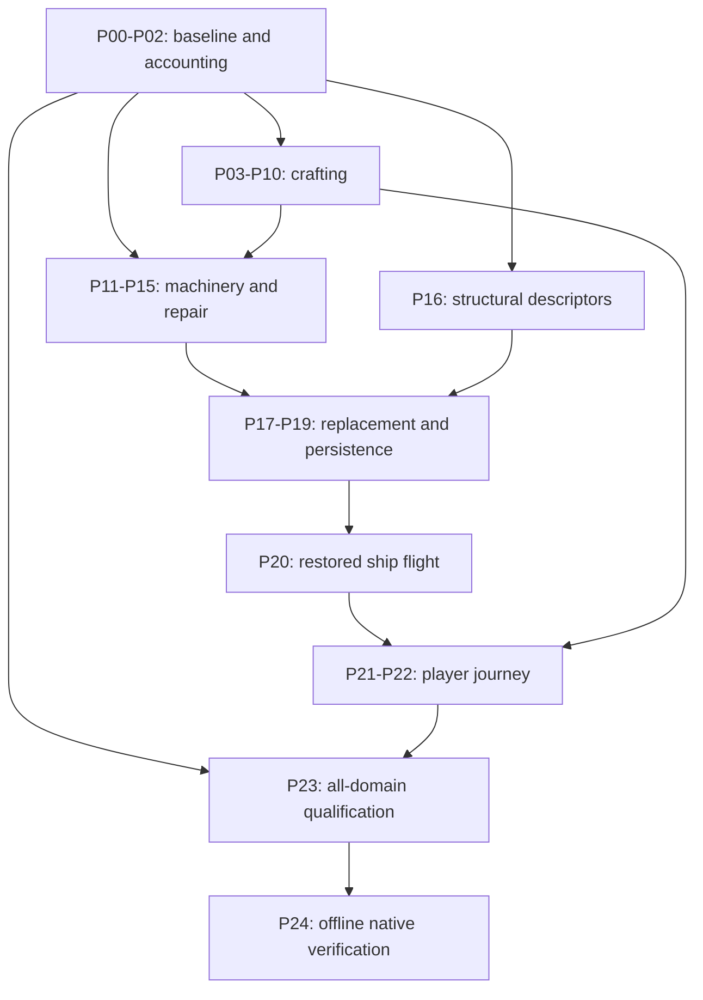

# Crafting and Derelict Feature Completion Implementation Plan

> **For agentic workers:** REQUIRED SUB-SKILL: Use superpowers:subagent-driven-development (recommended) or superpowers:executing-plans to implement this plan task-by-task. Steps use checkbox (`- [ ]`) syntax for tracking.

**Goal:** Complete the designed crafting economy and repair/rebuild/claim/fly loop,
then establish evidence-backed completion of every other active designed system.

**Architecture:** Extend existing inventory, crafting, WorkAction, ShipRuntime and
module-integrity owners with explicit lots, job/transaction identities and ship
targets. Keep generated module geometry and authored sockets authoritative; scene
adapters apply validated replacement consequences. Preserve existing APIs and saves
through tested migration rather than replacing the gameplay framework.

**Tech Stack:** Godot typed GDScript, RefCounted/Resource state, native GDExtension
generation, JSON catalogs, Python validation tools, Windows PowerShell.

**Spec:** [crafting_derelict_feature_completion.md](../../game/features/crafting_derelict_feature_completion.md).
Read it together with [accepted ADR-0059](../../game/adr/0059-crafting-and-derelict-restoration-transactions.md).

## Global constraints

- Plan status: **source accounting frozen and execution in progress as of
  2026-09-05**. Scoped implementations called out below have focused independent
  acceptance; canonical whole-program and player gates remain pending. Created
  2026-09-04 against `f4a65669`.
- Use board `synaptic-sea-stage-gate` explicitly. Do not invent a board CLI/API.
- Every execution card includes requirement IDs, allowed files, non-goals, tests,
  dependencies, evidence links, and a single owner.
- Pure state stays in RefCounted/Resource classes; scene nodes own consequences.
- Preserve soft player encumbrance, per-item stack ceilings, cargo limits, item
  IDs, recipe IDs, save compatibility, native generator contracts and offline play.
- Module destruction/reconstruction follows ADR-0051; no voxel or freeform editor.
- Runtime authority is the actual ship/slot/module, not a synthetic validation target.
- Unexpected Godot ERROR/WARNING lines block a gate. PASS text and exit 0 alone
  do not suffice. Negative tests check the expected failure and absent PASS marker.
- Use the current documented 4.7.1 baseline, or explicitly accept/version a compatible
  toolchain change in P00. Earlier 4.7.2 results do not certify a 4.7.1 baseline.
- No new global installs/configuration, provider calls, asset generation, publishing,
  or commits to paid/local editor plugins are implied by this plan.
- Primary agent owns architecture, integration, review and final acceptance.
  Use `luna_worker` only for bounded execution after contracts are settled.
- Shared coordinator, loader, inventory, snapshot and catalogs have exclusive
  ownership windows. No parallel agents edit overlapping files.
- Preserve WIP before execution. The planning checkout was clean before these docs.

## 1. What completion means

The spec contains 24 proposed acceptance requirements, FC-01..FC-24. Existing
REQ-CS/MI/CMP/WA/SMOD and all other active requirements remain in force.

| Gate | Deliverable | Exit rule |
|---|---|---|
| G0 | Reliable baseline and complete accounting | P00-P02 accepted; no unclassified runtime files or hidden active requirements |
| G1 | Crafting feature complete | P03-P10 accepted; FC-04..12 pass through real interactions and saves |
| G2 | Repair and machinery complete | P11-P15 accepted; no arbitrary installs, free healing or cross-ship changes |
| G3 | Derelict rebuilding complete | P16-P20 accepted; restored wreck works after docking, travel and reload |
| G4 | Player journey complete | P21-P22 accepted; human acceptance and full regression clean |
| G5 | Designed systems complete | P23 accepted for every domain, including additional gap cards it discovers |
| G6 | Offline native product verification | P24 accepted; exported game runs the core loop without development tools |

Do not average G1/G2 into a whole-game completion claim. G5 cannot pass merely
because the previously recorded inventory scores are high. Release/store/cloud
readiness stays separately named; if such features remain active design scope,
their incomplete state also remains visible.

### Honest completion metrics

P01 records each leaf acceptance criterion with four independent evidence fields:
`implemented`, `production_reachable`, `fresh_validation`, `player_accepted`.
Each is true only with a source/evidence reference. Track `blocked`, `unbuilt`,
`failed`, and `not_verified` separately, never as partial passes.

Publish:

```text
implemented_percent = implemented active criteria / all active criteria * 100
validated_percent = fresh-passing active criteria / all active criteria * 100
accepted_percent = player-accepted active criteria / all active criteria * 100
feature_complete = all required criteria accepted AND no blocking defects
```

Group criteria into named features before implementation and freeze the denominator
at G0. New discoveries append criteria with a scope-change note; never split easy
criteria or remove failing criteria to improve a percentage. A model-only criterion
uses its specified model acceptance rather than inventing a player UI; a gameplay
feature still needs its own player scenario. Existing inventory scores remain
labeled historical/recorded and are not overwritten with these different metrics.

## 2. Baseline findings -> work ownership

| Finding | Status of evidence | Closing tasks |
|---|---|---|
| 53 scripts omitted by inventory coverage | Fresh prior coverage failure; classify tooling separately | P01-P02, P23 |
| Engine/import diagnostics despite scene PASS markers | Fresh prior logs; 120-second import timed out | P00, P02 |
| Knowledge model bypassed by live crafting | Source trace | P06, P09-P10 |
| Crafted quality not retained or consumed | Source trace | P03-P05, P09-P10 |
| Two queued outputs for one ingredient payment | Reproduced pure API; no current live enqueue callers | P07-P08 |
| Output lost when stack fills during craft | Source trace | P08 |
| Deconstruction quality/capacity race | Source risk, needs negative reproduction | P04, P08 |
| Global active craft versus multiple stations | Model shape, needs concurrent scenario | P07, P13 |
| Water accepted as installed machinery | Reproduced with loaded catalog | P11 |
| Immediate install rather than timed physical work | Source trace | P12-P14 |
| Home/away target ambiguity | Needs two-ship production reproduction | P13, P20 |
| Plating repairs first damaged module; cycling may heal free | First behavior confirmed; cycle is unverified risk | P14-P15 |
| Destroyed module cannot be repaired/rebuilt | Model and target-resolution trace | P16-P19 |
| Ownership/pilot transition exists but full restored-wreck journey unverified | Existing smoke is narrower than journey | P20-P22 |
| Other domain percentages not acceptance-audited | Explicit evidence gap | P23 |

## 3. Approach and boundaries

The proposed ADR compares narrow callback fixes, bounded extensions, and wholesale
replacement. Use bounded extensions: correctness fixes land early, then persistent
quality/jobs and selected-target construction. No unrelated coordinator rewrite.

Proposed new files below are designs, not claims that APIs already exist. P01 locks
their contracts before implementation; any change updates the spec, ADR and all
dependent cards together. Existing methods stay as compatibility wrappers until
all production callers and historical saves are covered.

| New owner | Responsibility and public contract |
|---|---|
| `scripts/systems/item_lot_ledger.gd` | `add_lot(lot: Dictionary) -> int`, `take_lots(item_id: String, quantity: int, preferred_ids: PackedStringArray = []) -> Array`, `get_quantity(item_id: String) -> int`, `get_summary() -> Dictionary`, `apply_summary(summary: Dictionary) -> bool`; conservation, caps, deterministic lot identity |
| `scripts/systems/item_quality_effects.gd` | `resolve(item_id: String, lot: Dictionary, consumer: String) -> Dictionary`; declared effect values, neutral fallback only for explicitly quantity-only items |
| `scripts/systems/craft_job_state.gd` | Serializable job ID, ship/station/recipe IDs, phase, escrow, progress, resolved output and receipt |
| `scripts/systems/craft_job_scheduler.gd` | `evaluate(request: Dictionary, context: Dictionary) -> Dictionary`, `enqueue(request: Dictionary, context: Dictionary) -> Dictionary`, `advance(delta: float, context: Dictionary) -> Array`, `cancel(job_id: String, context: Dictionary) -> Dictionary`, `get_summary() -> Dictionary`, `apply_summary(summary: Dictionary) -> bool` |
| `scripts/systems/pending_output_store.gd` | `deposit_once(receipt_id: String, lots: Array) -> bool`, `collect(receipt_id: String, destination: RefCounted) -> Dictionary`, `get_summary() -> Dictionary`, `apply_summary(summary: Dictionary) -> bool`; persistent recoverable output |
| `scripts/systems/ship_work_context.gd` | Resolve explicit `ship_id`, model owners and physical target registry; `resolve(ship_id: String, target_id: String) -> Dictionary` returns owner-scoped state or a typed denial |
| `scripts/systems/ship_work_transaction.gd` | `prepare(request: Dictionary, context: Dictionary) -> Dictionary`, `commit(work_id: String, context: Dictionary) -> Dictionary`, `cancel(work_id: String, context: Dictionary) -> Dictionary`; escrow, revision, once-only receipt; uses existing WorkAction progress |
| `scripts/systems/structural_rebuild_state.gd` | `register_original(descriptor: Dictionary) -> bool`, `evaluate_replace(request: Dictionary, context: Dictionary) -> Dictionary`, `commit_replace(work_id: String, descriptor: Dictionary) -> Dictionary`, `get_summary() -> Dictionary`, `apply_summary(summary: Dictionary) -> bool` |
| `scripts/procgen/structural_rebuild_applier.gd` | `preflight(descriptor: Dictionary) -> Dictionary`, `stage(descriptor: Dictionary) -> Dictionary`, `commit_stage(stage_id: String) -> bool`, `rollback_stage(stage_id: String) -> void`; owns reversible scene staging |
| `scripts/systems/ship_restoration_readiness.gd` | `evaluate(context: Dictionary) -> Dictionary`; live readiness checklist, never force-repairs a dependency |
| `scripts/ui/ship_restoration_panel.gd` | Inspection, selected target, materials/tool blockers, readiness; emits requests only |
| `data/items/quality_effects.json` | Versioned category/item consumer mapping and bounded authored curves |
| `data/construction/structural_rebuild_catalog.json` | Original-compatible module replacements, BOM, tools, time, sockets/footprint and skill requirements |
| `tools/run_feature_completion.py` | Portable timed marker/diagnostic runner and machine-readable evidence; never interprets success solely from exit code |
| `data/validation/feature_completion_cases.json` | Profiles, script paths, exact PASS markers, expected negative diagnostics, timeouts and scope labels |
| `docs/game/inventory/feature_acceptance.json` | Criterion denominator, design/source/evidence links, per-domain status and gap-card IDs |

All request results use `{ok: bool, reason: String, ...}`. Requests contain stable
IDs; no Node references are serialized. Production mutation uses a live context,
not dictionaries copied into a panel and later synchronized optimistically.

In task allowlists, **coordinator** means only
`scripts/procgen/playable_generated_ship.gd`; **component catalog** means
`data/components/component_catalog.json`; **work-action catalog** means
`data/work_actions/work_action_catalog.json`. Catalog changes in P09 are limited
to `data/recipes/recipe_definitions.json`, `data/materials/material_definitions.json`,
`data/items/item_definitions.json`, `data/items/loot_tables.json`, and that component
catalog. New paths require explicit primary-agent scope changes before editing.

### Shared serialized records

P01/P03 implement these fields under the new versioned summary, preserving old
fields through migration. `sequence` is a persisted per-owner monotonic counter;
job/work/lot IDs are stable once assigned and never regenerated on load.

```json
{
  "job_id": "ship-42/station-engineering-1/job-7",
  "ship_id": "ship-42",
  "station_id": "station-engineering-1",
  "recipe_id": "weld_plating",
  "phase": "queued",
  "source_holder_id": "player-local",
  "escrow_holder_id": "ship-42/station-engineering-1",
  "escrow_lots": [],
  "progress_seconds": 0.0,
  "output_lots": [],
  "receipt_id": "",
  "sequence": 7
}
```

The example shows the record shape, not an admissible unpaid job: admission must
populate the exact recipe's escrow. Moving materials into station escrow transfers
their weight once from the source holder; no hidden weightless reservation exists.
Revalidation of a queued job checks its escrow, not a second payment from inventory.
If tier/knowledge/access becomes invalid, keep it blocked with recoverable escrow.
Job phases are `queued`, `running`, `paused_power`, `blocked`, `output_ready`,
`collected`, and `cancelled`; only `running` consumes simulation time.

Physical work requests contain `work_id`, `ship_id`, `target_id`, `target_revision`,
`action_id`, `source_holder_id`, `selected_lot_ids` and `replacement_catalog_id`
(empty for ordinary repairs). Their receipt contains committed target revision,
consumed/returned lot IDs and awarded event IDs. Commit cannot infer a target from
the player's later location or a panel's current cursor.

## 4. Execution protocol and commands

Each task is a reviewable card, not a claim that an entire subsystem can be coded
in five minutes. Its listed steps are the smallest practical work sequence; split
large implementation steps into file-owned child cards before dispatch.

For every gameplay task:

1. Recheck HEAD/WIP and the task's source contracts; claim its allowed-file window.
2. Add the named failing behavioral case and observe the expected failure marker.
3. Implement only the stated behavior and compatibility seams.
4. Run that task's named new smoke plus listed regressions; inspect diagnostics.
5. Review the diff, attach evidence and update the criterion/card. Commit only the
   task's files according to the repository's execution policy; never blanket-stage.

New gameplay-task smoke scripts (P03-P22) live at
`scripts/validation/fc_<task>_smoke.gd` using lowercase task IDs, extend SceneTree,
print exactly `FC <TASK> PASS` with uppercase IDs on success and exit nonzero on failure. Their
filename/marker mapping is registered by P02. The scenario blocks below specify
the negative and positive assertions; they are not permission to replace a live
scene test with a model-only fixture.

Before P02, run a focused script directly using explicit executable paths:

```powershell
$Godot = 'C:\path-selected-by-P00\godot_console.exe'
$Python = 'C:\Users\dasbl\.cache\codex-runtimes\codex-primary-runtime\dependencies\python\python.exe'
& $Godot --version
& $Python tools/build_system_inventory.py --check
& $Python tools/build_system_inventory.py --coverage
& $Godot --headless --path . --script res://scripts/validation/crafting_state_smoke.gd
```

`$Godot` is a required local configuration value, not a proposed installation path.
P00 records the chosen absolute path and version in evidence. Do not execute that
example before substituting the verified binary.

After P02, every task uses the same exact runner contract:

```powershell
& $Python tools/run_feature_completion.py --godot $Godot --case P07 --evidence-dir artifacts/feature-completion/P07
& $Python tools/run_feature_completion.py --godot $Godot --profile crafting --evidence-dir artifacts/feature-completion/G1
& $Python tools/run_feature_completion.py --godot $Godot --profile restoration --evidence-dir artifacts/feature-completion/G3
& $Python tools/run_feature_completion.py --godot $Godot --profile all --evidence-dir artifacts/feature-completion/G4
```

These runner interfaces are implemented by `tools/run_feature_completion.py`.
The canonical full regression source remains the `Regression bundle` section of
`docs/game/06_validation_plan.md`. The accepted P00 baseline at `3b601e39` passed
all 652 documented commands on the exact Windows runtime accepted by ADR-0060.
That baseline does not certify subsequent feature changes or player acceptance.
Do not substitute `tools/synaptic_sea_gate4_regression.sh`, whose current paths and
engine are historical. P02 extracts/checks the documented bundle into a temporary
script, supplies ROOT/GODOT, runs it through verified Bash, and records the actual
case count; no copied hard-coded count becomes the authority.

## 5. Task packages

### P00 — Establish a clean engine, import and native-runtime baseline

The canonical `load_denied_sfx_smoke.gd` reproduced an engine warning on the
expected missing-save input path. Scope permits only that smoke and the
coordinator's `request_load` missing-save branch to treat ordinary load denial
without an engine warning. Preserve the false result, denial sound, and live
world/save state. Acceptance requires the exact existing marker and clean output;
do not suppress warnings globally or classify unrelated load failures as success.

**Depends:** none. **Requirements:** FC-02. **Owner:** primary/toolchain worker.
**Allowed files:** `docs/game/06_validation_plan.md`, `README.md`, `AGENTS.md` only
for a reviewed toolchain correction; the two doorway damaged/breached `.glb.import`
files and `scenes/wrappers/structural/ship_structural_v0/doorway_frame_open_1x1.tscn`
only if a reproducible source defect is demonstrated. Generated caches stay in an
isolated worktree. Evidence-driven scope addition: `scripts/procgen/ceiling_fade_controller.gd`
and `scripts/validation/fc_p00_ceiling_lifetime_smoke.gd` may fix the baseline
freed-player access reproduced by the canonical main save/load smoke. Acceptance:
freeing or replacing the tracked player never reads a freed object; rebinding a
live player restores ceiling fading; both the focused lifetime smoke and main
save/load smoke pass without unexpected diagnostics. A second reproduced baseline
gap permits `scripts/procgen/ship_generator.gd` and
`scripts/validation/fc_p00_native_arc_smoke.gd`, strengthening only existing
zone-identity/reload/revisit assertions in `scripts/validation/derelict_arc_smoke.gd`, plus only generation calls in
`scripts/procgen/playable_generated_ship.gd` functions
`_activate_derelict_from_instance` and `_ensure_derelict_geometry`: preserve builder-authored arc-zone
descriptors through the native generation route, matching the existing fallback
projection. Acceptance requires explicit native-route evidence, deterministic
same-seed descriptors, real scene arc markers, and a clean `derelict_arc_smoke.gd`
covering its existing away-tick/save/revisit assertions. Regeneration must select
the same generation route and saved seed/size/condition as initial travel so the
persisted arc IDs address the rebuilt geometry. ADR-0061 additionally permits
`scripts/procgen/ship_blueprint.gd` and the coordinator's initial generation-context
capture and `_apply_run_context_from_blueprint` seams to serialize and restore the
actual resolved biome/difficulty, including first-run overrides. The optional
versioned blueprint context must round-trip; malformed present context is distinct
from absent legacy data. ADR-0063 additionally permits `scripts/procgen/life_boat.gd`,
the coordinator's matching-biome lifeboat `build_layout` call, and
`scripts/validation/main_playable_lifeboat_biome_skin_smoke.gd` to validate the
current compiled enclosure contract. Preserve occupancy/socket geometry; compare
actual wrapper identities and paths with compiled records across all three biomes.
Report deliberate v0 fallback honestly; this is not acceptance of distinct themed
visuals under P23. The reproduced item-economy failure also permits the
coordinator's incremental breach-seal-point projection, force-breach helper and
post-runtime hull synchronization seam, plus `main_playable_item_economy_smoke.gd`
and a focused projection regression. Newly opened live breaches become
interactable, closed stale points disappear, and unrelated open channels survive
repeated synchronization. Tests retain actual player dispatch and resource gates.
The canonical survival-stakes scene fixture may be corrected in
`scripts/validation/main_playable_survival_stakes_smoke.gd` to expect the current
Hermite encumbrance curve with its 0.35 minimum multiplier, replacing only the
stale pre-PKG-C3.1b half-speed cliff expectation while preserving the scenario.
`scripts/validation/audio_spatial_playback_smoke.gd` may replace its obsolete
catalogued door-open fallback probe with a real routed absent-catalog event and
must still prove that neither a stream nor playback is created.
The baseline consistency scope also permits `vitals_state_save_load_smoke.gd`
to isolate its persistence case from ambient fire, and `room_assigner.gd` with
`room_assigner_smoke.gd` to preserve the authored security-vault footprint.
Under ADR-0064, `capture_current_topology_fixture.gd` and
`procgen_golden_parity_smoke.gd` may capture and compare the versioned current
topology fixture without treating an unreviewed capture as acceptance evidence.
The focused `procgen_layout_stress_smoke.gd` may replace its stale filled-rectangle
assumption with ADR-0053's actual contract: non-empty unique integer cells, exact
bounding box and 4-connected topology, while retaining floor, portal and room-
ownership checks.
The reviewed P00 current-objective fixture migration also permits
`scripts/validation/procgen_playable_ship_smoke.gd` only: update the stale
`149ed476` fixture to the current one-objective identity bridge
`bridge_07:reach_goal`, and align the documented runtime-demo marker count from 4/4 to
1/1. This is fixture/assertion maintenance only and changes no production
generation or objective behavior.
The same reviewed fixture migration permits
`scripts/validation/procgen_loader_playable_contract_smoke.gd` only: assert the
current `149ed476` one-objective `bridge_07:reach_goal` fixture contract and its
225 collision, 70 edge, and 52 floor markers. This adds no production behavior
and does not alter the canonical bundle.
The native boarding regression also permits
`scripts/validation/generated_seed_boarded_slice_smoke.gd`: replace the obsolete
fallback-only `procgen-` identity assertion with current native generator version,
blueprint seed, archetype and exact program identity checks. Capture the home and
selected marker before travel and verify the boarded owner and loader agree with
the selected generated ship and differ from home. Preserve enclosure, navigation,
loot, objectives, wreck and away-tick checks. Wrong-seed and home substitutions
must still fail. Validate with its existing canonical PASS marker and clean output;
this changes no production generation or canonical bundle membership.
ADR-0067 additionally permits `data/procgen/slice/first_run_contract.json`,
`scripts/procgen/first_run_contract.gd`, the native room-variant seam in
`ship_generator.gd`, coordinator first-run candidate/travel preflight only,
`first_run_contract_smoke.gd`, the existing boarded smoke, and its feature design
explanation. Validate actual production candidates and deny unsatisfied contracts
before any travel mutation; retain blocked-edge semantics and wreck damage.
**Non-goals:** unrelated
gameplay edits, blanket reimport churn or installs.

- [ ] Record HEAD, clean/dirty paths, engine path/version, native extension load,
  import source existence and current test outputs. Preserve real save data.
- [ ] Use an isolated checkout and scratch user-data directory. Diagnose the actual
  missing imported resources; run a bounded import with per-process logs and kill
  only processes spawned by this run if it times out. Classify every diagnostic.
- [ ] Resolve source/import configuration defects if demonstrated; otherwise fix
  local cache/setup and record that distinction. Do not commit generated textures,
  DLL shadows, or unrelated `.import` rewrites.
- [ ] Run `crafting_state`, `module_integrity_consequences`, `repair_loop`,
  `main_playable_slice_station_craft`, `pilot_switch` smokes, then the canonical
  full bundle. Capture native-generator selection, not just fallback success.
- [ ] Accept G0 toolchain evidence only when the documented baseline is reproducible
  and all unexpected diagnostics are resolved. A newer engine requires explicit
  compatibility evidence and a recorded decision, not a silent version substitution.

**Behavioral assertion:** a damaged/breached doorway instantiates its actual visual
resources in the playable scene; missing visuals fail the test even if gameplay
models continue running.

### P01 — Freeze scope, requirements and completion accounting

**Depends:** P00 evidence capture (classification can proceed during diagnostics).
**Requirements:** FC-01, FC-23. **Owner:** primary with bounded documentation help.
**Allowed files:** spec/ADR-0059; `docs/game/05_requirements.md`, `07_risk_register.md`,
`inventory/system_inventory.json`, new `inventory/feature_acceptance.json`,
`integration_debt.md`, `STATUS.md`; board cards. **Non-goals:** increasing scores
without evidence or declaring old deferrals irrelevant.

- [ ] Reconcile the 53 missing files and all runtime directories, including topdown,
  threats, world, audio, render and root entry scripts currently outside the scanner.
  Mark inactive/legacy/tooling files explicitly, with source-backed reasons.
- [ ] Extract every active requirement and feature acceptance criterion into the
  register. Link each to a leaf feature and code/player evidence. Include planned,
  expected-unbuilt and deferred scope with its actual status.
- [ ] Register FC-01..24 beside existing requirement IDs. Resolve conflicts in the
  proposed spec/ADR, choose migration identifiers from current HEAD and lock the
  request/receipt schema before dependent code tasks begin.
- [ ] Create P00-P24 execution cards on `synaptic-sea-stage-gate` using the actual
  available board integration; each carries this task's allowlist and commands.
  If tooling is unavailable, write an importable local card manifest and mark
  board synchronization pending; never claim cards were created.
- [ ] Publish recorded vs implemented vs validated vs accepted counts separately.
  Keep the scope denominator and newly discovered gap history reviewable.

**Acceptance:** every active criterion has an owner/card and evidence state; no
file is removed from the denominator merely because its implementation is missing.

### P02 — Make completion evidence executable and resistant to false positives

**Depends:** P01. **Requirements:** FC-01..03.
**Allowed files:** new runner/case manifest; `tools/build_system_inventory.py`,
`tools/test_build_system_inventory.py`, `tools/classify_orphan_smokes.sh`, and
`.gitattributes` only for the classifier's Windows/Git-Bash LF checkout rule; new `tests/test_feature_completion_runner.py`,
`tests/test_feature_acceptance_registry.py`; `docs/game/06_validation_plan.md`.
**Non-goals:** replacing the canonical regression or relaxing diagnostic policy.

- [ ] Add Python tests with fake processes: exit 0 without marker, PASS with ERROR,
  PASS with WARNING, expected negative diagnostic, timeout, nonzero with PASS,
  missing script and duplicate criterion IDs. Each unacceptable result must fail.
- [ ] Implement the runner contracts in section 4, raw stdout/stderr capture,
  actual exit/timing/engine/commit recording, isolated user data and named profiles.
- [ ] Extend coverage with explicit active/legacy/tooling classifications and scan
  all runtime roots. Add checks for broken evidence paths and missing active criteria.
- [ ] Keep orphan-smoke classifications synchronized with the exact `run_clean`
  bundle. Feature-completion cases remain standalone until fresh runner evidence;
  other unintegrated runtime coverage remains a promotion candidate.
- [ ] Validate canonical bundle extraction against its section boundaries and
  expected marker; a changed/unrecognized document structure must fail visibly.
- [ ] Run `python -m pytest -q tests/test_feature_completion_runner.py
  tests/test_feature_acceptance_registry.py` and
  `python tools/test_build_system_inventory.py` (standalone self-test), then
  inventory `--check`/`--coverage`. Register each subsequent task's exact script.

**Evidence:** `summary.json` contains raw-log paths and separate model/scene/player
scope. Stored `confidence: V` is never counted as an executed check.

### P03 — Preserve quality lots behind compatible inventory APIs

**Depends:** P01-P02. **Requirements:** FC-05, FC-12.

**Scoped status (d3d4b89c):** implementation and focused independent review accepted for quality-lot ledger. Full canonical validation and player gates remain pending; this status does not promote whole-feature evidence.
**Allowed files:** new `item_lot_ledger.gd`; `inventory_state.gd`, `material_state.gd`,
`item_defs.gd`; new `fc_p03_smoke.gd`. All scripts here are under `scripts/systems/`
except the smoke under `scripts/validation/`. Also allow fixture initialization
changes only in `scripts/validation/production_output_full_consume_smoke.gd`,
`scripts/validation/production_output_full_consume_away_smoke.gd`,
`scripts/validation/work_yield_scoop_denied_sfx_smoke.gd`,
`scripts/validation/work_yield_scoop_denied_away_smoke.gd`,
`scripts/validation/work_yield_partial_scoop_smoke.gd`, and
`scripts/validation/work_yield_partial_scoop_away_smoke.gd`: replace direct
aggregate-dictionary assignments with ledger-backed inventory APIs while preserving
every behavior assertion. **Non-goals:** UI, cargo, rebalancing.

- [ ] Reproduce loss by adding two qualities of the same item; specify exact lots,
  aggregate quantity, split behavior, stack cap and legacy-load expectations.
- [ ] Implement the ledger contracts in section 3. Preserve existing inventory
  quantities/APIs as a single synchronized view; reject inconsistent dual state.
- [ ] Route add/remove/clear/load through the ledger; detect direct `items` writes
  and assign each caller to P04 rather than permitting silent metadata loss.
- [ ] Add deterministic migration from aggregate quantities and material summaries,
  including empty/malformed/negative quantities and duplicate lot IDs.
- [ ] Run case P03 plus `inventory_state_smoke.gd`, `material_state_smoke.gd`.

**Contract assertions:**

```gdscript
# New ItemLotLedger API; fixture supplies cap 99 for this existing item.
assert(ledger.add_lot({"lot_id":"a", "item_id":"scrap_metal", "quantity":2,
    "quality_score":0.2, "quality_tier":"poor", "condition":1.0, "origin":{}}) == 2)
assert(ledger.add_lot({"lot_id":"b", "item_id":"scrap_metal", "quantity":3,
    "quality_score":0.8, "quality_tier":"excellent", "condition":1.0, "origin":{}}) == 3)
assert(ledger.get_quantity("scrap_metal") == 5)
var taken: Array = ledger.take_lots("scrap_metal", 1, PackedStringArray(["b"]))
assert(taken.size() == 1 and taken[0].quality_score == 0.8)
assert(ledger.get_quantity("scrap_metal") == 4)
```

### P04 — Carry lots through the real logistics and salvage paths

**Depends:** P03. **Requirements:** FC-05, FC-09.

**Scoped status (bab5dbce):** implementation and focused independent review accepted for lossless lot logistics and salvage. Full canonical validation and player gates remain pending; this status does not promote whole-feature evidence.
**Allowed files:** `scripts/systems/{ship_inventory,cargo_transfer,cart_state,
equipment_state,deconstruction_resolver}.gd`,
`scripts/tools/{cargo_hold_control,cart_control,work_yield_drop,loot_container}.gd`,
`scripts/ui/{inventory_panel,inventory_row,inventory_drop_zone}.gd`,
`scripts/procgen/playable_generated_ship.gd` transfer, exact-lot equip/unequip,
loot and salvage deposits, cart/equipment validation, and floor-drop snapshot/revisit
binding seams; `scripts/systems/ship_instance.gd` cargo/cart identity and persistent
floor-holder binding; `scripts/systems/world_snapshot.gd` only floor-holder payload
validation if needed; `scripts/tools/crafting_station.gd` only lot-aware salvage
deposits, preserving P06 receipts and P07 job ownership;
new `fc_p04_smoke.gd`, `fc_p04_holder_atomicity_smoke.gd`, and
`fc_p04_floor_drop_persistence_smoke.gd`; existing `equipment_carts_smoke.gd`
and `main_playable_slice_inventory_ui_smoke.gd` gain exact-lot production-path
coverage while retaining their existing assertions.
**Non-goals:** changing transfer distance, encumbrance or cargo weight policy.

- [ ] Enumerate every inventory mutation caller with `rg`; assign lot-aware source
  and destination operations, including corpse loot, floor drops and salvage yields.
- [ ] Implement preflighted transfer with exact accepted quantity and rollback of
  rejected remainder. Preserve quality/condition/origin on stack splits and returns.
- [ ] Convert scalar legacy removals through deterministic selection; expose exact
  lot selection to existing inventory rows without replacing the UI framework.
- [ ] Test player -> cart -> cargo -> floor -> player -> equipment, full cargo,
  full item stack, partial transfers, and save/load at an intermediate holder.
- [ ] Run P04, `cargo_transfer_smoke.gd`, `equipment_carts_smoke.gd`,
  `main_playable_slice_inventory_ui_smoke.gd`; verify mass and quantity conservation.

**Assertion:** the sum of each lot's quantity across holders plus committed
consumption is invariant. Capacity rejection cannot delete a source item.

### P05 — Give crafted quality visible and mechanical consequences

**Depends:** P03-P04. **Requirements:** FC-06.
**Scoped status (current integration, commit pending):** implementation and focused
independent review accepted for deterministic quality effects. Full canonical
validation and player gates remain pending; this status does not promote
whole-feature evidence.
**Allowed files:** new `item_quality_effects.gd`, `data/items/quality_effects.json`;
`quality_tier_resolver.gd`, `work_action_resolver.gd`, `consumable_state.gd`,
`medicine_state.gd` and `stimulant_state.gd` only exact-lot potency context and
effect application, preserving independent skill/tolerance behavior;
`effect_dispatcher.gd` only medicine positive-health restoration potency, with
standard multiplier 1 when no quality context is supplied;
`ship_modification_state.gd` only its installed source-lot-derived power-draw
getter, using catalog draw times the lot quality multiplier and legacy multiplier 1;
`component_mount_resolver.gd` in systems; `inventory_panel.gd` only its exact selected-lot
Use request, plus `inventory_row.gd` and `recipe_picker_panel.gd` in UI;
`scripts/systems/work_action_driver.gd` only selected tool/repair lot effect context;
`scripts/procgen/playable_generated_ship.gd` only its two WorkActionDriver start
context seams and adjacent lot-selection helper, using actually held compatible
tool lots and paid repair-material snapshots;
`docs/game/balance/crafting_materials_tuning.md` for the exact deterministic score
formula; new `fc_p05_smoke.gd`. **Non-goals:** random stat rerolls or new item IDs.

The authored skill and station bonus caps are contributions, applied once:
`clamp(material_quality * 0.40 + clamp(skill_level * 0.08, 0, 0.35) +
clamp(station_level * 0.06, 0, 0.25) + powered_bonus, 0, 1)`.
Verify monotonicity and tier reachability; do not double-weight the capped bonuses.

- [ ] Inventory all produced item categories; assign actual consumers or explicit
  quantity-only rules. Tie effects to existing data multipliers before tuning.
- [ ] Resolve quality from selected ingredient lots and effective station tier,
  not a global per-material average or stale base station level.
- [ ] Attach resolved lots to output and connect tool speed, component efficiency,
  patch integrity and consumable potency to real consumers. Condition stays separate.
- [ ] Show quality and the relevant effect in inventory/recipe preview; color is
  accompanied by text. Transfers/repairs never reroll these values.
- [ ] Run P05, `quality_tier_smoke.gd`, `crafting_quality_knowledge_smoke.gd`, and
  compare two actual outputs through at least one instance of each declared consumer.

**Assertion:** equal input/job snapshots yield equal output/effects; changing only
quality changes the authored consumer value, and never increases item quantity.

### P06 — Enforce recipe knowledge through every production entry point

**Depends:** P01-P02. **Requirements:** FC-04.
**Scoped status (bab5dbce):** implementation and focused independent review accepted
for production recipe-knowledge routing. Full canonical validation and player gates
remain pending; this status does not promote whole-feature evidence.
**Allowed files:** `scripts/systems/{crafting_state,field_crafting_state,
recipe_knowledge_state}.gd`, `scripts/tools/crafting_station.gd`,
`scripts/ui/recipe_picker_panel.gd`, coordinator knowledge/list/start seams;
`data/recipes/recipe_definitions.json`, `data/items/item_definitions.json`,
`data/items/loot_tables.json` (existing engineering salvage table); new
`fc_p06_smoke.gd`. The item-data expansion supplies a real readable skill book for
the existing book catalog. Its normal-play acquisition and inventory Read action
must be wired and verified; additional file scope requires a recorded exact path.
**Non-goals:** adding a separate metaprogression system or hundreds of recipes.

- [ ] Use the authored non-starter recipe to demonstrate picker/direct-start gate
  bypass; add synthetic tests for book/reverse-engineer/codex event idempotence.
- [ ] Pass the current-run knowledge owner into listing, begin, field eligibility
  and later queue evaluation; return the same denial reason at each entry.
- [ ] Wire actual book use, dismantling/reverse-engineering and codex discovery
  events to the owner; do not award knowledge from scene load or mere possession.
- [ ] Preserve starter and intentional emergency-field behavior; show acquisition
  hints for locked recipes and refresh immediately after learning.
- [ ] Run P06, `crafting_recipe_list_smoke.gd`, `main_playable_slice_recipe_picker_smoke.gd`.

**Assertion:** the locked recipe remains blocked with sufficient materials/skill;
the real learning event unlocks it; replaying that event does not award twice.

### P07 — Implement paid, independent and persistent station jobs

**Depends:** P03, P06. **Requirements:** FC-07..08.
**Scoped status (bab5dbce):** implementation and focused independent review accepted
for paid station jobs before the P08 escrow-mass integration child. Full canonical
validation and player gates remain pending; this status does not promote
whole-feature evidence.
**Allowed files:** new `craft_job_state.gd`, `craft_job_scheduler.gd`;
`crafting_state.gd`, `station_state.gd`, `ship_runtime.gd` under systems;
new `fc_p07_smoke.gd`; `scripts/tools/crafting_station.gd` only production station
identity/job ownership calls; `scripts/procgen/playable_generated_ship.gd` only
`_build_crafting_stations`, its adjacent stable-identity helper, and the existing
ShipRuntime configuration/tick/snapshot seams needed to bind the real scheduler
with exactly one advancement authority.
The coordinator `_refresh_station_tiers_from_ship_mod` seam and CraftingState tier
refresh accept explicit actual home-station owner IDs; refresh targets only those
physical stations and never broadcasts a same-kind tier across owners. The picker's
generic tier projection remains a compatibility view; P13 owns selected-ship UX.
`station_tiers_batch_smoke.gd` may migrate its fixture to paid scheduler requests
while retaining tier/batch assertions. IDs use the actual owning ship and stable
authored local placement, never station kind alone
or a transient iteration counter. **Non-goals:** queue UI or changing station power balance.

- [ ] Promote the one-payment/two-output probe into a regression; add concurrent
  same-kind stations and repeated-tick/completion cases.
- [ ] Implement exact lot escrow on enqueue, once-only consume on start, capacity
  eight, recipe/knowledge/skill/tier revalidation, typed denials and stable job IDs.
- [ ] Advance each station serially and stations independently. Route existing
  single-craft calls through the scheduler so there is one execution authority.
- [ ] Implement unstarted refund, started cancellation warning/result, power pause,
  interrupted catch-up and no-double-tick behavior through ShipRuntime.
- [ ] Run P07 and `crafting_state_smoke.gd`, `station_state_smoke.gd`.

**Assertion:** with ingredients for one job, the second enqueue is denied
`missing_materials`; two completions with the same job ID yield one receipt. Two
different stations never overwrite another station's active job.

### P08 — Make completion, refunds and salvage output lossless

**Depends:** P04, P07. **Requirements:** FC-08..09.
**Allowed files:** ADR-0062 for the reviewed `pending_outputs_v1` correction; new
`pending_output_store.gd`; `craft_job_scheduler.gd` only its
non-destructive output/refund peek and exact-receipt acknowledgement APIs;
`crafting_state.gd`, `station_state.gd` only strict JSON-safe integral restore,
`field_crafting_state.gd`, `deconstruction_resolver.gd`,
`ship_instance.gd`, `inventory_state.gd`, `ship_inventory.gd`, and `world_snapshot.gd`
under systems; `crafting_station.gd`, `work_yield_drop.gd` under tools; coordinator
completion, station-destruction, and whole-world holder preflight seams; new
`fc_p08_smoke.gd`; `fc_p07_smoke.gd` only exact escrow-mass reservation assertions
and physical station fixture bindings to a ship-owned `PendingOutputStore`, required
to prove missing-store completion fails closed.
The scheduler job escrow is the single serialized reservation authority. Source holders
read exact unstarted escrow through a nonserialized authority binding so reserved lots
remain unavailable while their mass still counts for player load and hard cargo capacity.
A direct refund credits only its own verified reservation during the atomic return; other
jobs remain counted. Portable field work advances through one shared home/away attendance
gate only while the run is active, the player exists and is not incapacitated, and stamina
is above the established `0.001` work threshold. Losing attendance pauses the same paid
job; UI input capture does not pause it. **Non-goals:** infinite hidden player storage,
field station-radius or hold-input requirements.
Before first publication, a paid field job follows the attended player across ships.
At first publication it pins the current attached physical occupancy plus the player's
ship-local position in `field_pending_v1`; retries, JSON reload, orphan recovery and
collection cannot rebind that receipt. With no attached occupied ship, completed output
stays at the producer until a valid owner exists and never falls back to home.

- [ ] Fill output stacks after work starts; reproduce any craft/deconstruction loss.
  Test multi-output salvage with only one destination having room.
- [ ] Deposit completed lots once into the station-owned output store. Collect
  accepted quantities and retain remainder. Replace console-only loss handling.
- [ ] Put unstarted cancellations and invalidated physical work escrow into the
  same recoverable owner store if their original holder cannot accept the refund.
- [ ] Expose orphaned station output/escrow as a persistent salvageable container
  after station destruction; never place it in inaccessible removed geometry.
- [ ] Exercise the actual home and away coordinator process paths: exhausted,
  incapacitated, or ended runs preserve field-job progress and payment; recovered
  attendance resumes it, including while a UI panel captures movement input. Start at
  home, complete on an attached away ship, then reload/revisit/collect the pinned exact
  receipt once; repeated retries must neither rebind it nor duplicate value.
- [ ] Run P08, `main_playable_slice_station_craft_smoke.gd`,
  `main_playable_slice_salvage_picker_smoke.gd`; test save/revisit/partial collection.

**Contract assertion:** calling `deposit_once("job-1", lots)` twice returns true
then false and leaves exactly one output quantity. Collection into a full stack
returns zero transferred and retains every lot.

### P09 — Complete recipe economy, queue UX and acquisition routes

**Depends:** P05-P08. **Requirements:** FC-10..11.
**Allowed files:** recipe/material/item/loot/component catalogs;
`data/items/quality_effects.json`; ADR-0059 action-specific tool-compatibility
and economy-cycle addendum; new
`tools/check_crafting_economy.py`, `tests/test_crafting_economy.py`;
`crafting_station.gd`, `recipe_picker_panel.gd`, coordinator input seams;
`work_action_driver.gd` only for a defensive-copy projection of the selected
tool context actually consumed at successful action start, alongside its frozen
quality multiplier. Reset it with the driver's action lifecycle; this adds no
second escrow authority or persistence schema. Verify that projection through
real timed weld/cut progress and terminal consequences, not helper selection alone;
new `fc_p09_smoke.gd`; `fc_p05_smoke.gd` tool-consumer regression only;
`recipe_picker_panel_smoke.gd` for explicit station-owner adapters, visible queue,
power and pending-output status, and missing/foreign/stale-owner denial. The panel
fixture supplements the real coordinator/player journey in `fc_p09_smoke.gd`.
`fc_p12_smoke.gd` is allowed only for the P09-compatible max-stack-one
`console_unit` reentrant setup; it must preserve the P12 exact refund and
duplicate-completion assertions.
**Non-goals:** expanding recipe count as a success metric.

P09 also permits owner-explicit physical station construction and attach/occupancy
binding in the coordinator. Keep each station alive under its actual attached
ShipInstance; changing player occupancy changes interaction eligibility, not paid
jobs or station identity. Reuse P13 action-specific access, selection, occupancy,
generation and spatial range checks. `ship_work_context.gd` may expose an injected
reference to the existing shared owner-keyed CraftingState; do not create a second
scheduler or per-ship crafting authority. Stations use the exact ship/station key
and that reference. Real away-station and remote-home denial proof is required.

- [ ] Build a graph of all authored recipes, deconstruction outputs, repair BOMs, learning
  items and component forms. Identify missing IDs, unreachable prerequisites,
  self-dependencies and profitable zero-cost conversion cycles.
- [ ] Reconcile `plating` versus `plating_plate` by an authored conversion/use rule;
  preserve existing IDs. Every required restoration part needs a reachable source.
- [ ] Expose selected station/recipe/lots, queue length, progress, power pause,
  cancellation policy, pending output, quality preview and exact blockers.
- [ ] Add a tested starter path, machinery-donor path and advanced restoration path.
  Reuse current recipes where possible; author only missing links and tier rewards.
- [ ] Run P09 and the economy validator, `recipe_resource_smoke.gd`,
  `recipe_picker_panel_smoke.gd`; traverse each acquisition path without injected stock.

**Assertion:** a cold run can acquire every mandatory opening repair input; optional
advanced recipes require attainable knowledge/tier upgrades, not circular prerequisites.

### P10 — Migrate and persist crafting at transaction boundaries

**Depends:** P03-P09. **Requirements:** FC-12.
**Scoped status (ADR-0059 decisions 17-22):** architecture accepted and bounded
implementation underway. Acceptance evidence, the strict P10 runner, independent
review, G1 profile, canonical regression and player gates remain pending.
**Allowed files:** ADR-0059 and the P10 implementation/repair briefs;
`scripts/systems/{run_snapshot,world_snapshot,save_migration_service,
save_load_service,crafting_state,craft_job_state,craft_job_scheduler,station_state,
field_crafting_state,recipe_knowledge_state,component_placement_state,
ship_instance,ship_runtime,pillar_persistence,threat_ai_state,threat_manager,
threat_save_contract,threat_initial_state_builder}.gd`; coordinator capture, detached prepare/commit,
new `scripts/systems/save_restore_candidate.gd` for the detached owner graph;
`scripts/main.gd` and `scripts/title_main.gd` only staged playable-instance
replacement, owner pointer and signal reconnection seams;
`scripts/audio/audio_manager.gd` only to defer global AudioServer writes and
physical playback while a restore candidate is staged, suppress synthetic restore
events that mutate hydrated SFX routing/captions/cooldowns, and publish its bus
settings on successful activation without replaying restoration events.
`scripts/camera/iso_camera_rig.gd` only to defer current-camera selection before
staged tree entry and activate the replacement camera after the accepted swap.
Every injected failure must retain the old viewport camera as current.
Failure tests must compare actual global bus volume/mute before and after both
post-rebuild and post-world-apply failures, not only audio model counters;
`scripts/ui/save_load_menu.gd` and `scripts/ui/menu_coordinator.gd` only modern
world-envelope slot dispatch; existing manual/auto/quick save and migration smokes
only for the reviewed coherent-world policy and strict legacy compatibility;
owner binding and tick/collection enablement seams only; new `fc_p10_smoke.gd`,
`fc_p10_process_smoke.gd` (producer/consumer modes), optional strict
`combat_persistence_smoke.gd`,
`tools/run_p10_process_smoke.py` and its focused
`tests/test_p10_process_runner.py`, and the nine approved `p10_*.json` migration
fixtures under `tests/fixtures/feature_completion/`. R02 explicitly adds
`tests/fixtures/feature_completion/p10_run_v7_future.json` and
`tests/fixtures/feature_completion/p10_world_v7_future.json` while preserving the
historical v6 future fixtures. Existing test-file scope for the version update is
`scripts/validation/{threat_ai_state_smoke,tendril_structure_damage_smoke,
save_migration_service_smoke,save_migration_world_smoke,save_load_service_smoke,
world_snapshot_smoke,world_save_service_smoke}.gd`. R02 may update
`docs/game/06_validation_plan.md` and `tools/classify_orphan_smokes.sh` only to
register and classify `combat_persistence_smoke.gd` as a standalone smoke.
**Non-goals:** changing save filenames or wiping historical data.

**R02 combat amendment:** allocate current `gate2-current-run-6`, `world-6`,
and nested `threat-manager-2`. The pure codec is
`scripts/systems/threat_save_contract.gd` with
`validate_current(summary: Variant) -> Dictionary` and
`migrate_legacy(summary: Variant) -> Dictionary`. The shared pure initializer is
`scripts/systems/threat_initial_state_builder.gd` with
`build_initial_v2(layout: Dictionary, markers: Array, anchor: Vector3, definitions: Dictionary) -> Dictionary`;
`ThreatManager.configure_for_layout` uses the same initializer. Current run v6
requires initialized home combat and current world v6 requires initialized combat
for active `current_location`; inactive never-initialized owners may omit combat.
Recognized pre-v6 absent/empty required combat is bootstrapped from validated
original layout/markers/owner anchor or visited blueprint/generation context and
canonical definitions before decoding and sealing. Present current `{}` rejects;
complete v2 `threats: []` remains authoritative. Outer source version pins every
migration: current v6 receives no v5 crafting adaptation and world v6 embeds run
v6 exactly. Home inventory combat and visited ship combat remain separate owner
state; candidate inventory normalization retains validated `threat_summary` and
strictly String `combat_hotbar_text`. The frozen legacy archetype map and complete
validation/rollback/proof obligations are specified by ADR-0059 decisions 33-39.

- [ ] Implement ADR-0059 decisions 23-26: coherent world envelopes for modern
  slots, legacy closed-graph adaptation, single pending authority, target-run
  knowledge identity, global lot/receipt conservation and strict component lots.
  Prove failure leaves the complete live world unchanged, including an injected
  failure after scene rebuilding; Boolean propagation alone is insufficient.
- [ ] Add real-disk fixtures for current saves and representative older supported schemas,
  plus future-version rejection. Allocate new schema IDs through accepted ADR-0059.
- [ ] Persist lots, knowledge, station IDs, jobs, escrow, progress, pending output and
  receipt IDs together. Restore owners before tick or player collection is enabled.
- [ ] Convert the old single active craft without recharging paid inputs; migrate
  queued legacy IDs into blocked/unreserved entries requiring valid admission.
- [ ] Require modern v5 transaction and knowledge payloads, including explicit
  schema-valid empty states. Reject absent or malformed modern fields before live
  apply; preserve the original save bytes/path and do not write a migrated sidecar.
- [ ] Carry P13 `home_access_v1` unchanged through world v5. Validate the entire
  home/visited-ship candidate detached before one live owner changes.
- [ ] Preserve current `component_placement_v2` in pillar persistence; migrate only
  recognized v1 payloads and reject malformed present payloads when strict apply
  fails.
- [ ] Save before/after enqueue, start, completion and partial collection; reload
  twice and compare quantity, quality, progress and receipts exactly.
- [ ] Add a fresh-process disk proof. Producer mode uses the production save API
  to write the versioned baseline slot, then separately writes immutable expected
  observations and a digest manifest under one unique evidence parent. It records the
  baseline artifact path and digest without treating the expected-observation manifest
  as save evidence. Producer, consumer one, and consumer two are three separately
  launched OS processes. Each receives a distinct, initially empty user-home subdirectory
  under that evidence parent; the production slot is absent before its allowed artifact is
  installed, and no mutable save, index, cache, or user-home state is shared between them.
  Consumer one receives only the baseline path plus expected-observation manifest. It first
  verifies the baseline input digest, then independently asserts exact owners, lots,
  knowledge, jobs, escrow, station IDs, progress, pending receipts and component origins
  from disk. It collects once through the production interaction, saves the resulting world
  through the production API, and records a distinct post-collection artifact and digest.
  Consumer two receives only that post-collection artifact plus its post-save manifest; it
  loads no baseline slot and proves no remaining output, recharge, duplicate reservation,
  duplicate collection, receipt replay, or migrated sidecar. The baseline copy/digest
  remains available for comparison; different baseline and post-collection digests are
  valid. No consumer may accept producer memory, a process-local singleton, or a copied
  fixture as evidence. The strict Python orchestration, if used, creates the evidence
  parent and sets each child only to its own user-home subdirectory through `APPDATA`,
  `LOCALAPPDATA`, and the Godot save path. It rejects missing producer/consumer markers,
  diagnostics, unexpected output, a baseline digest mismatch, or cleanup beyond the
  unique evidence parent. It retains raw logs, manifests, baseline/post-save artifacts and
  accepted evidence on success; only scratch user directories may be cleaned after
  capture, while failures are retained for diagnosis. `FC P10 PROCESS PASS` is
  preparatory process-isolation evidence only. It never substitutes for `FC P10 PASS`,
  the G1 profile, canonical regression, player gates, or independent P10 review.
- [ ] Run P10, `save_migration_service_smoke.gd`, `save_migration_world_smoke.gd`,
  `save_load_service_smoke.gd`, then G1 profile and full regression.
- [ ] Close ADR-0059 decisions 29-31: reject forged terminal refund/field receipts,
  preserve moved component lot origins across two reloads, bind restored inactive
  crafting owners before catch-up, and compare the full authoritative staged
  recapture with the prepared world. `home_ship.oxygen_summary.player_in_breach_zone`
  is the only recapture-comparison exception: validate a present current value as a
  boolean before normalization, omit only that exact derived production-oxygen projection (scene overlap or active field atmosphere),
  and after activation/revisit/tick prove it matches the production oxygen context:
  current scene overlap or active field atmosphere. Test one precise
  staged-rebuild projection difference, malformed non-boolean rejection, and unrelated
  oxygen-field drift rejection. Preserve all other oxygen values, thresholds, breach
  state and zone IDs exactly. Before applying a persisted ThreatManager summary, clear
  only derived runtime nodes and caches, then apply manager, threat, detection and
  damage fields exactly; there is no combat comparison exception or schema change.
  Include a nondefault combat roundtrip and fresh-process restore check. No broad
  summary ignore or normalization may hide lost saved state.

**G1 exit:** FC-04..12 evidence is complete; the player can obtain, craft, queue,
interrupt, collect and use differentiated output through normal controls.

### P11 — Enforce real component and slot compatibility

**Depends:** P01-P02. **Requirements:** FC-13.

**Scoped status (c8b03806):** implementation and focused independent review accepted for component and physical-slot compatibility. Full canonical validation and player gates remain pending; this status does not promote whole-feature evidence.
**Allowed files:** `scripts/systems/{component_catalog,component_placement_state,
component_mount_resolver,ship_modification_state}.gd`,
`scripts/ui/ship_modification_panel.gd`, component catalog; new `fc_p11_smoke.gd`;
`scripts/procgen/playable_generated_ship.gd` only its physical-slot/ship-mod panel
binding seam, plus `scripts/validation/ship_modification_smoke.gd` for a real
physical-slot fixture. This binding is required for P11 to function in gameplay;
P13 generalizes explicit ship ownership. Coordinate with P06's disjoint knowledge
seams in the same coordinator file. Explicit authored physical-slot profile IDs may
be emitted by `scripts/procgen/wall_door_resolver.gd`, preserved by
`scripts/procgen/layout_serializer.gd`, and projected in only the native component
slot seam of `scripts/procgen/ship_generator.gd`. Coordinate the latter with P00's
separate arc projection. ComponentPlacementState owns occupancy; ship-mod state is
a derived view. Saved fit policy must never override current layout/catalog data.
`data/procgen/golden/coherent_ship_001/layout.json` may receive explicit physical
slot metadata without changing room geometry, module keys or placement order.
The same metadata-only change is allowed in `coherent_ship_002/layout.json` only
if its actual runtime/regression references require the same physical-slot path.
Validation scope includes new `fc_p11_live_smoke.gd` and fixture-only updates in
`ship_modification_panel_smoke.gd`, `component_slot_population_smoke.gd`,
`component_system_link_smoke.gd`, `component_mount_dismount_smoke.gd`,
`pillar_revisit_persistence_smoke.gd`, and `ship_mod_power_budget_scene{,_away}_smoke.gd`.
The same explicit-profile fixture adaptation covers `ship_mod_run_snapshot_smoke.gd`,
`ship_mod_restore_effects{,_away}_smoke.gd`, `hull_plating_resist_smoke.gd`,
`fire_plating_resist_smoke.gd`, and `ship_mod_system_effect{,_away}_smoke.gd`.
These fixtures must use explicit physical profiles and real compatible slots;
retain their existing behavioral assertions rather than bypassing fit validation.
**Non-goals:** timing changes until P12 or synthetic replacement slots.

- [ ] Reproduce purified-water installation using the real catalog; add unknown
  item, wrong footprint/socket/type, occupied slot and wrong-ship cases.
- [ ] Define slot compatibility from actual placement descriptors and catalog
  component requirements. Reject unknown IDs before quantity/power mutation.
- [ ] Remove arbitrary-stack and three-hub-slot fallbacks. Bind panel rows to the
  selected ship's physical slots, retaining stable IDs across save/revisit.
- [ ] Preserve legitimate component forms and deny incompatible substitutions with
  readable reasons; validation APIs obey the same rules.
- [ ] Run P11, `component_slot_population_smoke.gd`, `component_system_link_smoke.gd`,
  `ship_modification_panel_smoke.gd` updated to use real fixtures.

**Assertion:** water remains in inventory and installation count/power remain
unchanged; a compatible catalogued component in the same slot passes preflight.

### P12 — Unify physical work with exactly-once transactions

**Depends:** P03, P11. **Requirements:** FC-14.
**Scoped status (current integration, commit pending):** implementation and focused
independent review accepted for exact-lot timed work transactions. Full canonical
validation and player gates remain pending; this status does not promote
whole-feature evidence.
**Allowed files:** new `ship_work_transaction.gd`; existing `work_action_state.gd`,
`work_action_driver.gd`, `work_action_channel.gd`, `work_action_resolver.gd`,
`component_mount_resolver.gd`; `repair_point.gd`, `ship_modification_panel.gd`,
`work_action_hud_panel.gd`; work-action catalog; new `fc_p12_smoke.gd`.
`component_placement_state.gd` may carry the exact source lot through atomic
mount persistence and dismount recovery without changing compatibility policy.
Production scope includes `scripts/procgen/playable_generated_ship.gd` only its
work start/tick/commit, inventory-payment mirror, and ship-mod action-request
seams. Exact paid lot escrow must precede physical mutation; pass that snapshot's
quality effect into the P05 repair resolver without a second material charge.
`ship_modification_panel_smoke.gd` changes its fixture to request-only behavior
while preserving fit/selection assertions. Existing `fc_p11_live_smoke.gd` and
`ship_mod_{system_effect,power_budget_scene,restore_effects}{,_away}_smoke.gd`
may wait for actual timed coordinator completion before their original effect
assertions; they must not bypass the transaction to force an immediate mutation.
Fixture-only scope also includes `component_dismount_interact{,_away}_smoke.gd`,
`component_mount_xp_live{,_away}_smoke.gd`,
`component_mount_sfx_live{,_away}_smoke.gd`, and
`component_remount_sfx_live{,_away}_smoke.gd`; retain XP, SFX, owner, and
physical-slot assertions and do not replace completion with force-apply seams.
**Non-goals:** replacing the whole interaction system.

- [ ] Assert that install/removal has no immediate effect and cannot commit twice.
  Cover damage, leaving range, missing tool, target removal and explicit cancel.
- [ ] Implement prepare/reserve -> timed WorkAction -> revalidate -> commit/receipt.
  Keep model delta, inventory transfer and scene consequence under one coordinator
  operation; fail staging without consumption or XP.
- [ ] Change panel signals to request actions only; remove private-bag optimistic
  mutation. Preserve legacy repair objective wrappers and their existing scope.
- [ ] Implement pause/resume with reserved materials visible; explicit cancel returns
  exact escrow, preserving prior no-consumption-on-interruption guarantees.
- [ ] Run P12, `repair_unification_smoke.gd`, `repair_blocked_consume_smoke.gd`,
  `work_action_driver_smoke.gd`, `component_mount_dismount_smoke.gd`.

**Assertion:** `commit(work_id, context)` called twice changes inventory, target,
noise completion and XP once. A changed target revision returns `stale_target`.

### P13 — Bind every mutation to the selected ship

**Depends:** P07, P12. **Requirements:** FC-15.
**Allowed files:** new `ship_work_context.gd`; `ship_runtime.gd`, `ship_instance.gd`,
`crafting_state.gd` only preventing the generic picker tier from seeding a newly
created physical station owner;
`ship_access_state.gd`; `ship_modification_panel.gd` only storing/exposing its bound
ship ID and binding generation and emitting them with install/uninstall requests; coordinator
ownership/binding/attach/detach seams; `world_snapshot.gd` only additive strict-present
`home_access_v1` serialization for the home owner's exact access summary;
new `fc_p13_smoke.gd`; timed physical-slot fixture migration in
`ship_mod_inventory_sync_away_smoke.gd` and both home/away
`ship_mod_system_effect` smokes; bound-ship and generation callback assertions in
`ship_modification_panel_smoke.gd`; `component_remount_sfx_live_away_smoke.gd`
only for actual boarded/selected/claimed away-owner setup and a fail-once/timeout
guard. `fc_p07_smoke.gd` may supply the explicit `ship-runtime` owner in its
runtime catch-up context, preserving all scheduler catch-up assertions while
testing the strict owner requirement. **Non-goals:** multiplayer authority or unrelated
extraction.

Known physically reachable unclaimed ships may be selected without ownership;
access remains action-specific. Permanent install/remove requires access, while
ordinary salvage/repair retains its existing policy. New-run home ownership may
claim `player_local`; legacy restore may claim only an absent owner and never
overwrite a modern foreign owner. ComponentPlacementState is the sole durable
installed authority; ShipModificationState is derived. Nonserialized binding
generations reject stale panel callbacks. P19 recovery of persisted paid work must
revalidate owner and target before rebinding to the current generation.

- [ ] Create home and away ships with distinguishable damage, slots and station
  tiers. Attempt the same operation on each and compare untouched ship state.
- [ ] Resolve ship ID to its own systems/integrity/components/jobs/modification
  owners; inject that context into UI and work. Reject missing/foreign targets.
- [ ] Refresh bindings on docking, boarding, pilot switching and load; a stale
  panel/action cannot mutate a previous ship after the player changes location.
- [ ] Round-trip a modern foreign home owner through the real world JSON path;
  reject malformed-present access atomically and claim locally only when the
  recognized legacy world payload omits the field.
- [ ] Tick owned station jobs through ShipRuntime; physical work remains attended.
  Test away catch-up without applying the home ship's power state.
- [ ] Run P13, `component_mount_interact_away_smoke.gd`,
  `ship_mod_inventory_sync_away_smoke.gd`,
  `component_remount_sfx_live_away_smoke.gd`,
  `pillar_revisit_persistence_smoke.gd`.

**Assertion:** only the target ship's snapshot changes. Equal local slot IDs on
two ships never collide because identity includes ship ID.

### P14 — Make machinery upgrades reversible and economically sound

**Depends:** P05, P12-P13. **Requirements:** FC-16.
**Allowed files:** `docs/game/adr/0066-durable-machinery-condition-and-effective-system-health.md`,
`docs/game/adr/README.md`,
`.superpowers/sdd/2026-09-04-crafting-derelict-feature-completion/P14-implementation-brief.md`,
`docs/game/05_requirements.md`,
`data/validation/reviewed_criterion_supersessions_v1.json`,
`tools/build_feature_acceptance.py`, `tests/test_feature_acceptance_registry.py`,
`tests/test_p14_health_authority.py`, `docs/game/inventory/feature_acceptance.json`,
`data/validation/feature_completion_cards.json`; `component_placement_state.gd`,
`component_mount_resolver.gd`, `ship_systems_manager.gd`, `ship_system.gd`,
`ship_subcomponent.gd`, `ship_modification_state.gd`, `crafting_state.gd`,
`repair_point.gd`, coordinator upgrade/effective-health seams;
`fc_p14_smoke.gd`, `ship_systems_manager_smoke.gd`,
`ship_systems_manager_force_repair_smoke.gd`, `component_mount_dismount_smoke.gd`,
`dismount_system_damage_smoke.gd`, `remount_system_restore_smoke.gd`,
`ship_mod_system_effect_smoke.gd`, `ship_mod_system_effect_away_smoke.gd`,
`ship_mod_restore_effects_smoke.gd`, `ship_mod_restore_effects_away_smoke.gd`,
`ship_mod_plating_repair_smoke.gd`, `ship_mod_plating_repair_away_smoke.gd`,
`ship_mod_station_tier_smoke.gd`, `ship_mod_station_tier_away_smoke.gd`, and
`ship_mod_run_snapshot_smoke.gd`.
**Non-goals:** free repair on install or balance inflation.

- [x] Record the exact reviewed REQ-SMOD-001 supersession while retaining its
  stable ID, historical fingerprint and frozen denominator. Runtime remains pending
  stable P10/P13 integration.
- [ ] Reproduce repeated install/uninstall and saved-manifest reapply; assert no
  health, tier, power supply or inventory accumulation.
- [ ] Compute capacity/tier/power from the actual installed manifest and condition;
  remove incremental permanent side effects where recomputation is authoritative.
- [ ] Apply current power-budget rules before work starts and at commit; test a
  power change during installation and damaged machinery performance.
- [ ] Separate durable plating resilience from patch healing. Removal returns the
  component with its preserved condition and reverses only its own contribution.
- [ ] Run P14, `ship_mod_overbudget_power_smoke.gd`,
  `ship_mod_station_tier_away_smoke.gd`, `ship_mod_restore_effects_smoke.gd`.

**Assertion:** ten install/remove cycles end with the original ship state and item
condition/quantity, apart from explicitly authored tool/work costs.

### P15 — Complete selected-target patch and system repair

**Depends:** P05, P12-P14. **Requirements:** FC-17.
**Allowed files:** `module_integrity_state.gd`, `module_integrity_map.gd`,
`work_action_resolver.gd`, `ship_subcomponent.gd`, `repair_point.gd`;
work-action/BOM catalog; coordinator target/effect seams; new `fc_p15_smoke.gd`.
**Non-goals:** ordinary repair resurrecting destroyed modules.

- [ ] Select one of two damaged modules; capture its cost and neighboring state.
  Test threshold transitions and repeated completion callbacks.
- [ ] Route patch/weld and system repair to explicit target IDs with quality-aware
  material costs and authored repair amounts; remove first-damaged-module selection.
- [ ] Recompute shared-wall atmosphere/nav consequences on both sides once. Preserve
  repair tool/skill gates and dependency recovery.
- [ ] Show inspection, missing inputs and expected effect; healthy/destroyed targets
  explain their different available actions.
- [ ] Run P15, `repair_loop_smoke.gd`, `module_integrity_consequences_smoke.gd`,
  `ship_mod_plating_repair_away_smoke.gd` rewritten for explicit paid patching; G2.

**Assertion:** target health improves exactly once, unrelated module is unchanged,
materials are paid, and install/remove does not reproduce this repair effect.

### P16 — Preserve destroyed structure as identifiable rebuild targets

**Depends:** P01-P02. **Requirements:** FC-18.

**Scoped status (5494a846):** implementation and focused independent review accepted for persistent destroyed-structure descriptors. Full canonical validation and player gates remain pending; this status does not promote whole-feature evidence.
**Allowed files:** new `structural_rebuild_state.gd`; `module_integrity_map.gd`,
`module_integrity_state.gd`; `generated_ship_loader.gd` module registration;
`scripts/procgen/playable_generated_ship.gd` only its module-integrity ownership
binding/restore seam, so descriptor inspection follows the actual map changed by
live fire, damage and repair rather than an independent loader-only copy;
new `fc_p16_smoke.gd`. **Non-goals:** reconstruction or altered room generation.

- [ ] Destroy a real generated/authored wall and prove its stable descriptor remains
  queryable although its visible/collidable wrapper is removed or disabled.
- [ ] Register original footprint, transform, sockets, wrapper, layout revision,
  edge/room/component bindings at load, before any damage consequences execute.
- [ ] Keep ordinary integrity repair behavior unchanged. Expose destroyed targets
  for replacement inspection without making them falsely collidable.
- [ ] Handle initially wrecked modules and layout revisions explicitly; unknown
  descriptors return `missing_original_descriptor`, never a guessed wall.
- [ ] Run P16, `module_integrity_smoke.gd`, `nav_solid_edges_smoke.gd`.

**Assertion:** descriptor identity is identical before destruction and after
regeneration from the same seed/version; destruction does not erase repairability data.

### P17 — Define paid structural replacement and live safety preflight

**Depends:** P09, P12-P13, P16. **Requirements:** FC-18..19.
**Allowed files:** `structural_rebuild_state.gd`; a narrow owner-binding seam in
`module_integrity_map.gd`; new `structural_rebuild_catalog.gd` and
`structural_rebuild_preflight.gd`; new
`runtime_physical_volume_catalog.gd`, `runtime_physical_volume.gd`, and
`structural_rebuild_collision_query.gd`; `ship_work_transaction.gd`,
`docs/game/06_validation_plan.md` and `tools/classify_orphan_smokes.sh` only for
the preparatory smokes' standalone membership and exact PASS-marker rows;
`work_action_catalog.gd`, `work_action_resolver.gd`; narrow source-kit/module/
contract and registered-endpoint seams in `generated_ship_loader.gd`,
`modular_socket_catalog.gd`, `dock_ports.gd`,
`docking_manager.gd`, `ship_instance.gd`, `ship_nav_graph.gd`, and the playable
coordinator; new rebuild and physical-volume catalogs, catalog checker/tests,
work-action definitions,
and compatible-action metadata in `data/tools/tool_definitions.json` plus only
the `welder.compatible_work_action_ids` `rebuild_structure` entry in
`data/items/item_definitions.json`; focused physical-volume/query, blocker,
endpoint, route, and live-safety smokes; new `fc_p17_smoke.gd` and exact kit/contract
assertions in `fc_p16_smoke.gd`; `structural_rebuild_policy_smoke.gd`, a
preparatory P17 policy/loader proof that does
not emit an `FC P17 PASS` marker; preparatory
`structural_rebuild_candidate_nav_smoke.gd` for the bounded pure edge/path helper.
**Non-goals:** geometry/nav/air mutation, component displacement, replacement
outside the original transform/footprint, arbitrary rotation/substitution,
auto-undocking, persistence, or adding cart push/motion behavior in the
physical-volume foundation slice.

**P17 foundation slice A:** land the explicit reviewed physical-volume catalog,
strict immutable loader, primitive builder, and private candidate-only query
helper before any cart/component/dock/coordinator integration. It remains inside
the existing P17 card and acceptance denominator. Its proofs cannot emit or
satisfy `FC P17 PASS`. External `synaptic-sea-stage-gate` synchronization stays
`pending`; the generated local P17 card is the operational scope record.

**Future integration scope pending:** endpoint/dock identity, candidate routes,
base-world clearance, and coordinator wiring remain later P17 integration windows
within their existing allowlist. Cart/drop/component projections, mount anchors,
and player collision-mask changes additionally require reviewed file-scope
additions. The foundation authorization does not permit those product edits.

**P17 foundation slice B:** add only a pure, untrusted, per-ship edge projection
and path evaluator to `ShipNavGraph`. It consumes explicit classified topology,
base-clearance, portal, registered-endpoint, and local connection-side DTOs and
always returns `scene_authorized: false`. Exterior boundaries are not registered
exits; exterior targets and floor/ceiling targets remain unsupported. The later
bound scene preflight must authenticate every DTO, evaluate each connected ship
separately, and combine this result with candidate collision evidence.

- [ ] Author the ADR-0065 reviewed cart/drop/component box dimensions and exact
  local transforms as canonical data. Reserve layer bit 2 with mask 0 for passive
  projections; use private-space layer bit 1 for the isolated candidate. Reject
  missing, malformed, duplicate, non-finite, or non-positive rows. Runtime must
  not derive dimensions from interaction radii, visual bounds/meshes, or defaults.
- [ ] Build exact box/capsule primitives and a private-space query helper using
  Godot 4.7.2 `PhysicsDirectSpaceState3D.intersect_shape()` and `cast_motion()`.
  Preserve rotations/local offsets, use zero margin, isolate the candidate, and
  free every RID on every result. Do not substitute AABBs or sampled points.
  Check exact start/final overlap before each sweep, including zero-length paths.
- [ ] Prove foundation behavior through strict catalog Python tests and real
  Godot primitive/query smokes. The initial gameplay dimensions require scene
  clearance validation before later live integration; synthetic fixture-only
  boxes do not certify the authored profile data.
- [ ] Prove the bounded pure navigation helper with
  `structural_rebuild_candidate_nav_smoke.gd` and marker
  `STRUCTURAL REBUILD CANDIDATE NAV PASS`. Classify plan topology as internal
  pairs, vertical pairs, exterior boundaries, or unresolved; preserve closed
  portals and independent blockers; test local-side-only connection paths and
  legitimate seed-17 exterior records. This proof does not satisfy FC-19.
- [ ] Add exact layout-kit, structural-kit, and structural-contract identity to
  every original descriptor/fingerprint. The active source matrix is biomatter
  authored hive template plus hazard/industrial/lifeboat v0 resolution; ithappy
  is supported catalog data, not active. This observation does not prove
  production reachability.
- [ ] Author explicit same-original-module rows for all 15 active IDs across every
  active layout/contract tuple. The catalog is the sole BOM/tool/skill/duration
  authority. A concrete runtime service loads only the canonical shipped path,
  validates it atomically, owns recursively read-only rows, and resolves policy
  by row ID; the evaluator never accepts caller-supplied row dictionaries. Each
  row configures a new `rebuild_structure` action using the existing WorkAction
  model and contains no fallback. P09's structured result is consumed, not replaced by a
  second solver; P09 review remains an acceptance blocker.
- [ ] Bind each rebuild registry once to its exact creating
  `ModuleIntegrityMap` through a weak owner reference. Resolve original
  descriptors from that registry and live damage only from that exact map;
  method-compatible adapters and rebound owners fail closed.
- [ ] Keep wrapper-valid existing ships loadable and inspectable when rebuild
  contract metadata is missing or conflicting. Prove this through the real loader:
  the physical wrapper and original descriptor survive, and replacement is denied
  as unsupported without a guessed contract or changed geometry validation.
- [ ] Prove all 60 active tuples against independent production identity: actual
  layout and structural-kit module records, loader resolution, and loaded
  contract resources on one side, canonical catalog expectations on the other.
  Cover v0, hazard-to-v0, industrial-to-v0 and biomatter-to-v0-contract paths,
  plus missing/mismatched contract, wrapper, footprint and socket negatives.
- [ ] Implement pure eligibility and a scene-owned, read-only candidate preflight
  for actual actor, parked/grabbed cart, mounted component, physical cargo,
  registered dock identity, and candidate-result egress. Revalidate on timed
  completion; stale/occupied work changes nothing and has no net spend.
- [ ] Keep imported visuals collision-free. Later live integration reconstructs
  passive cart/drop/component projections only from canonical profile IDs and
  stable authored transforms. If projections become player-motion blockers,
  specify and prove swept/clamped grabbed-cart follow, exclusions, and blocked
  motion before adding layer bit 2 to the player mask; profile plumbing alone
  must not change or claim push physics.
- [ ] Register each production endpoint with stable IDs and distinct,
  clearance-sized `threshold_nav_node_id` and `interior_nav_node_id`. For each
  side of each active connection that was usable before the candidate, require
  a baseline existing-world threshold-to-meaningful-interior path and preserve
  that same anchor pair after replacement. The deterministic interior anchor is
  strictly beyond the endpoint-owned edge/footprint, has another traversable
  interior neighbor, and the route has a real edge plus at least one traversal-
  capsule diameter of separation and continuous clearance. Missing, ambiguous,
  near-identical, dead-end, or disconnected anchors on a usable endpoint are
  unsupported live safety, never a vacuous or omitted obligation. Do not newly
  require every endpoint to be actor-reachable; separately require the actor to
  reach one candidate-usable registered exit.
- [ ] Treat the private candidate query as incremental obstruction evidence only.
  Independently check every returned route segment against authoritative live
  unchanged solids, closed portals, and dynamic blockers, excluding only the
  actor's own body and already-disabled destroyed-target shapes. Authorization
  requires topology, base-world clearance, and candidate-only continuous sweep.
- [ ] Reserve exact lots only through P12. Keep scene application blocked until
  P18 consumes the immutable plan. Test shared edge/both rooms, interruption,
  duplicate completion, active docking, missing contract, recovery availability,
  and accessible starter/wreck acquisition through the live path.
- [ ] Run P17/catalog/P09/P12/P13/P16 plus docking/cart/component/socket/nav/loader
  regressions. Run the foundation catalog/query checks before shared integration.
  Synthetic safety dictionaries and the foundation slice do not satisfy FC-19
  acceptance.

**Assertion:** ordinary `repair()` still leaves a destroyed wall destroyed;
`evaluate_replace` allows only its exact paid same-module candidate when the
current ship, geometry, docking, and candidate egress checks pass.

### P18 — Restore actual geometry, navigation and atmosphere

**Depends:** P17. **Requirements:** FC-20.
**Allowed files:** new `structural_rebuild_applier.gd`; `ship_work_transaction.gd`, `generated_ship_loader.gd`,
`slice_atmosphere_applier.gd`; `module_integrity_consequences.gd`, `ship_nav_graph.gd`,
`structural_rebuild_state.gd`; coordinator scene-commit seams; new `fc_p18_smoke.gd`.
**Non-goals:** visual-only replacement or rewriting native generation.

- [ ] Use the proposed coordinator-owned `begin_stage`, `poll_stage`,
  `discard_stage`, `begin_apply`, `finalize_success`, and `finalize_rollback`
  lifecycle. It is a contract proposal, not an implementation claim.
- [ ] A ready P17 token enters APPLYING with retained escrow and no receipt. Before
  mutation, barrier the affected/docked ships' movement, WorkActions, actor/cart
  simulation, and save capture while physics syncs; revalidate current context.
- [ ] Journal and atomically apply wrapper, integrity/rebuild state, one shared
  edge/both rooms, exact-lot component recovery, current portal state, collision,
  nav, structural air/enclosure, and markers. Preserve portal state and do not
  seal unrelated breaches/objectives or grant unlocks.
- [ ] Poll collision/navigation-server/air readiness before exactly one success
  finalization and P12 receipt. On any failure, restore and verify old coherence,
  return READY with retained escrow, then release the barrier. Reject duplicate or
  re-entrant finalize/cancel/restore/disposal and retain rollback assets through
  finalization.
- [ ] Test rotated/moved/docked ships, shared walls, floor/ramp support, doorway state,
  trapped actors and resource/nav/air failures. No post-commit/load tick may see
  mixed air/nav/collision state.
- [ ] Run P18, `module_integrity_consequences_smoke.gd`, `ship_nav_graph_smoke.gd`,
  `slice_atmosphere_smoke.gd`, `physical_travel_smoke.gd`.

**Assertion:** restored wall blocks both player and threat route and closes its air
connection; a restored doorway retains authored open/closed semantics, not a solid wall.

### P19 — Persist rebuilt ships and recover interrupted transactions

**Depends:** P10, P14-P15, P18. **Requirements:** FC-22.
**Allowed files:** `pillar_persistence.gd`, `ship_instance.gd`, `ship_runtime.gd`,
`run_snapshot.gd`, `world_snapshot.gd`, `save_migration_service.gd`;
coordinator capture/restore/revisit; new `fc_p19_smoke.gd` and historical fixtures.
**Non-goals:** silently discarding unmatched deltas.

- [ ] Persist replacement descriptors independently from integrity deltas, plus
  work escrow/receipts and condition-bearing component placement.
- [ ] Never serialize an APPLYING state or P18 token/Node/RID. Save waits or returns
  busy; recovery restores the last committed snapshot's inventory/escrow ownership
  without inferring completion, double-charging, or duplicating output.
  Legacy identity reconstruction requires verified baseline equality of stable
  module ID, wrapper, transform, footprint, sockets, and layout/contract identity;
  any mismatch rejects restore without guessing or overwriting the save.
- [ ] Restore in order: generated originals -> replacements -> integrity -> components
  -> systems/ship effects -> derived navigation/atmosphere -> active simulation.
- [ ] Handle stale IDs/version mismatch as an explicit load/recovery failure that
  preserves the original save; no geometry guess or automatic corrupt-save overwrite.
- [ ] Test pristine replacement (no damage delta), mid-work save, commit-boundary
  save, duplicate reload, two ships, moved ship transform and destroyed station escrow.
- [ ] Run P19, `pillar_persistence_smoke.gd`, `pillar_revisit_persistence_smoke.gd`,
  `world_persist_restore_smoke.gd`, `docking_persistence_smoke.gd`.

**Assertion:** leave -> regenerate -> revisit and save -> reload yield the same
replacement IDs, component lots, air/nav state and quantities without a second XP award.

### P20 — Prove restored derelicts can be claimed and flown

**Depends:** P13-P14, P19. **Requirements:** FC-21..22.
**Allowed files:** new `ship_restoration_readiness.gd`; `ship_access_state.gd`,
`travel_controller.gd`, `docking_manager.gd`, `ship_instance.gd`;
`bridge_terminal.gd`; coordinator claim/pilot/travel seams; new `fc_p20_smoke.gd`.
**Non-goals:** skipping existing safe-return or ownership rules.

- [ ] Build a damaged derelict scenario with real dependency failures and identify
  which repairs restore flight. Ownership alone must not make propulsion operational.
- [ ] Derive a readiness checklist from that ship's actual models; tie denials to
  existing authored rules and surface missing power/navigation/propulsion dependencies.
- [ ] Repair, claim, switch pilot, dock/undock, carry the lifeboat if supported by
  its real port/hangar capacity, and travel using the repaired ship's state.
- [ ] Verify a broken unrelated derelict never disables the docked ride; preserve
  no-strand return behavior. Check parent/host links and transforms after each step.
- [ ] Run P20, `pilot_switch_smoke.gd`, `repair_loop_smoke.gd`,
  `docking_loop_smoke.gd`, `worldgen_wired_travel_smoke.gd`, then G3/full regression.

**Assertion:** disabling propulsion on the selected ride blocks departure for the
real reason; repairing it restores departure without validation-only force repair.

### P21 — Make restoration understandable through normal controls

**Depends:** P09, P15, P20. **Requirements:** FC-11, FC-17..21.
**Allowed files:** new `scripts/ui/ship_restoration_panel.gd`;
`ship_modification_panel.gd`, `work_action_hud_panel.gd`, `recipe_picker_panel.gd`;
coordinator input/selection; `data/ui/tutorial_triggers.json`,
`data/ui/input_glyphs.json`, `data/release/localization_catalog.json`;
new `fc_p21_smoke.gd`.
**Non-goals:** an independent editor UI or final-art overhaul.

- [ ] Show selected ship/room/module, condition, installed machinery, repair versus
  replace actions, exact costs/tool/skill blockers, work progress and flight readiness.
- [ ] Wire keyboard/mouse and controller focus to the same requests. Close/pause
  behavior must not trigger background selection or accidental double commits.
- [ ] Add contextual tutorial beats for recipe learning, quality, pending output,
  donor machinery, patch versus rebuild and safe departure. Use existing UI patterns.
- [ ] Test HUD readability in normal/emergency/dark lighting, text alternatives to
  color, remapped input and denied/unsafe actions with no hidden console dependency.
- [ ] Run P21 and applicable existing panel/input smokes; manually complete the
  spec's scenario through the title entry point without debug stock/teleports.

**Acceptance:** a player can explain why an action is blocked and find the next
required resource/repair using only the in-game presentation.

### P22 — Close the entire crafting-to-restored-ship scenario

**Depends:** P10, P20-P21. **Requirements:** FC-04..22.
**Allowed files:** new `scripts/validation/fc_p22_smoke.gd`,
`docs/game/playtests/feature-completion-restoration-protocol.md`,
case manifest, acceptance registry; test fixture assets only with explicit card scope.
**Non-goals:** replacing player evidence with headless helper calls.

- [ ] Automate the spec's eight-step scenario in actual scenes with assertions for
  quantities, quality, ship ownership, target IDs, nav/air and persistence.
- [ ] Cover seeds 42/777, home/away, power interruption, full inventory, duplicate
  completion, moved docking transforms and old-save upgrade; label controlled setup.
- [ ] Run a separate cold-player/manual session from Title -> New Game with no
  force-repair/spawn/teleport; record inputs, observed outcomes and blockers.
- [ ] Run the full canonical regression plus focused profiles. Investigate new
  failures; do not accept the suite by weakening diagnostics or editing markers.
- [ ] Attach raw logs, native build/version, commit, reproduction saves and manual
  protocol results; accept G4 only with all required observations passing.

**Exit:** no open defect violates an FC-04..22 criterion. A failing seed or required
input method blocks acceptance rather than averaging against successful cases.

### P23 — Qualify every other designed game system

**Depends:** P01-P02; final closure after G4. **Requirements:** FC-23.
**Allowed files:** acceptance registry, existing 15 package plans and requirements,
per-domain test/protocol cards. Product code allowlists belong to the specific gap
cards discovered here; this task is not blanket edit permission.
**Non-goals:** declaring uninspected domains complete from recorded percentages.

- [ ] Trace every criterion in section 7 through implementation, live caller,
  downstream effect, persistence and its required player scenario.
- [ ] Run existing focused domain tests and controlled player acceptance. Record
  not-verified separately from failed; every active criterion needs a disposition.
- [ ] For each missing/mismatched capability, create a bounded child card with exact
  files, acceptance, dependencies and regression commands before implementation.
  Architecture changes get an ADR. Required gaps must close before G5.
- [ ] Reconcile all discovered cards, earlier deferrals and source conflicts against
  the frozen denominator. Publish per-domain implemented/validated/accepted counts.
- [ ] Run all domain profiles and the canonical full bundle at the same candidate
  commit. Primary review verifies the evidence and approves G5 only when complete.

**Important limit:** the preceding audit was deep for crafting/restoration, not all
domains. Pretending to name every remaining product fix now would invent findings.
This mandatory discovery-and-closure task supplies that missing evidence and cannot
be marked done while its resulting required implementation cards remain open.

### P24 — Verify the completed loop in an offline native export

**Depends:** G4; G5 for a whole-game feature-complete claim. **Requirements:** FC-24.
**Allowed files:** export configuration only for demonstrated defects; existing
export checks, case manifest, release evidence and acceptance registry.
**Non-goals:** publishing, buying services or silently enabling cloud integrations.

- [ ] Export the supported native target with the exact validated engine/templates
  and packaged generation extension. Audit included resources and licenses.
- [ ] Start with a clean user-data directory and network unavailable; run crafting,
  salvage, selected repair/rebuild, claim/travel and save/load using normal controls.
- [ ] Verify no developer paths, Python, editor plugin, external authoring tool or
  asset cache is required at runtime. Compare generated/rebuilt behavior to editor.
- [ ] Check cold launch, clean exit, performance at the documented budget and
  historical save behavior; record hardware, target, version and limitations.
  Use `docs/game/performance_baseline.md`, `scripts/validation/performance_profiler.gd`
  and `scripts/validation/windowed_fps_capture.gd` for the existing budget/evidence
  contract. Headless timing cannot replace windowed frame-rate evidence.
- [ ] Publish the candidate's evidence and remaining release-only work separately.
  Do not publish a build or claim unsupported platform validation under this card.

## 6. Dependencies, ownership and rollout



The graph is a stage summary; individual task dependencies are authoritative.
P11 and P16 can start beside crafting after G0. Their pure-model work must finish
before shared-file integration. P23 read-only tracing can run throughout, while
its fix cards obey the same ownership constraints.

| Integration window | Exclusive shared files | Other safe work |
|---|---|---|
| Craft inventory | inventory/material/transfer owners | P11 catalog tests, P16 descriptor tests, P23 read-only audit |
| Craft runtime | coordinator crafting paths, ShipRuntime, snapshots | pure component compatibility work |
| Machinery runtime | coordinator work/ship bindings, catalogs | rebuild catalog validation and scene fixture preparation |
| Rebuild runtime | loader, coordinator, nav/atmosphere, snapshots | documentation and domain-specific pure tests |
| Candidate validation | frozen product files | evidence processing and manual playtest recording |

Before each window, compare committed/modified/untracked state and preserve WIP.
Use an isolated `codex/` worktree for execution when the primary checkout is busy.
Workers receive the task, spec, ADR, allowed files and dependency outputs. A worker
does not widen scope when a new seam is needed: primary adds it to the card and
serializes ownership. Every task ends with diff review and fresh evidence.

Land correctness and compatibility before UI expansion. Keep old entry points as
adapters while callers migrate; never run independent old and new mutation paths
for the same job. Remove obsolete paths only after all callers and saves are tested.
Rollback uses source rollback plus preserved pre-upgrade saves, not destructive
downgrade of newly written data. No scheduling promise is made before G0/P23 expose
the actual baseline; jobs/quality migration and scene replacement are the largest
technical risks and should be split into reviewed child cards at execution time.

## 7. Whole-game qualification matrix

P23 uses these existing plans as source inputs, not proof that their status is true.

| Domain / source under `docs/game/build-plans/` | Minimum player/system evidence |
|---|---|
| `01-survival-vitals-e2e.md` | Oxygen, temperature/radiation, wounds/sanity, incapacitation/death; home and away consequences and recovery |
| `02-food-cooking-spoilage-e2e.md` | Acquire/grow/cook/eat, water processing, spoilage, facility power, freshness persistence |
| `03-crafting-materials-recipes-e2e.md` | P03-P10 plus every active criterion not superseded by the accepted program spec |
| `04-loot-ecosystem-e2e.md` | Deterministic reachable loot, search/corpse/revisit persistence, no duplication, rarity/condition and salvage routes |
| `05-consumables-medicine-stimulants-e2e.md` | Equip/use/consume effects, medicines, ammo, contraindications authored in data, quality/condition propagation |
| `06-combat-threat-ai-e2e.md` | Detection/LOS, navigation, attack/damage/armor, death/corpse loot, rebuilt wall interaction |
| `07-ship-systems-sustenance-e2e.md` | Power/dependency cascades, repair, hull/air/fire, machinery output and two-ship ownership isolation |
| `08-progression-skills-meta-e2e.md` | Real action XP, skill effects, unlock/knowledge acquisition, persistence and explicit deferred scope |
| `09-ui-ux-accessibility-e2e.md` | Title-to-run, HUD, menus, inventory, remapping/controller, readable blockers, localization/accessibility behavior |
| `10-audio-music-spatial-e2e.md` | Audible authored cues and reactions, spatial/ambient/voice consumers, captions/settings; missing assets remain explicit |
| `11-save-load-persistence-e2e.md` | Slot lifecycle, old/new migration, current-run/world state, corruption rejection, no duplicate jobs/rebuilds |
| `12-procedural-generation-expansion-e2e.md` | Native production generation, deterministic stable IDs, coherent reachable layout, navigation/atmosphere, authored fields and reconstruction |
| `13-distribution-store-postlaunch-e2e.md` | Separate gameplay completeness from export/store/cloud/achievement obligations; retained active obligations cannot be hidden |
| `14-cross-system-integration-review-e2e.md` | Cold player loop, balance, threats interrupting work, cargo/docking/logistics and fleet state |
| `15-systems-map-task-graph-update-e2e.md` | Inventory/requirements/card/evidence agreement and no orphan active feature |

Also trace travel, docking, ownership, hangars, nested ships, objectives and
extraction across their feature specs; membership in a broad ship-systems row does
not replace their individual acceptance. For documents renamed on current HEAD,
resolve the actual path and update the card before treating it as a source.

## 8. Risk register and prevention

| Risk | Prevention / required test |
|---|---|
| Import noise masks gameplay failures | P00 isolated baseline; P02 fails PASS-plus-diagnostic |
| Percentage inflation or missing newer systems | Frozen leaf criteria, explicit missing files, three independent metrics |
| Quantity-only compatibility callers erase quality | P03 mutator inventory + P04 conservation through every holder |
| Queues mint resources or lose escrow | Stable receipts, reserve/consume phases, duplicate/cancel/save matrix |
| Quality creates unbounded power/repair multipliers | Versioned bounded curves and fixed-value consumer tests |
| UI edits wrong ship or stale target | Explicit ship/target identity and revision checks at commit |
| Install/remove becomes free repair | P14 repeat-cycle invariants; explicit paid patching |
| New wall encloses actor, blocks exit or docking port | Scene occupancy/egress checks before commit, moved-transform cases |
| Shared boundary updates only one room | Two-room air/nav assertion and no double breach counts |
| Pristine replacement vanishes after reload | Separate replacement manifest, not integrity-only deltas |
| Old save loses paid in-progress materials | P10/P19 fixture migration and atomic capture boundary |
| Scene/headless evidence mistaken for player acceptance | G4 normal-control manual run and G6 offline export |
| Unassessed whole-game features omitted | Mandatory P23 gap-card closure before G5 |

## 9. Required evidence packet and final handoff

Every gate packet contains: commit SHA and dirty-state report; engine/native
extension/build target; exact commands; raw stdout/stderr; expected/observed markers;
exit codes/timeouts; diagnostic classifications; named criterion results; saved
fixtures; manual protocol observations; and open defect/card IDs.

Final acceptance requires:

- [ ] All FC-01..24 criteria meet their specified acceptance at the candidate commit.
- [ ] Every active whole-game criterion is accepted, or the claim is explicitly
  limited to crafting/restoration rather than designed-systems completion.
- [ ] No required child gap card remains open; no accepted defect violates a criterion.
- [ ] Canonical regression and focused profiles are clean on the same candidate.
- [ ] Both seed scenarios pass; home/away, docking, transfers and historical saves pass.
- [ ] Normal-input player journey and offline native export evidence exist.
- [ ] Requirements, inventory, feature statuses, ADR status, board and STATUS agree.
- [ ] Product changes, documentation changes, validation limitations and release-only
  obligations are reported separately.

This document is the planning deliverable. No gameplay implementation, board
mutation, engine install, release or completion claim has been performed by writing it.
