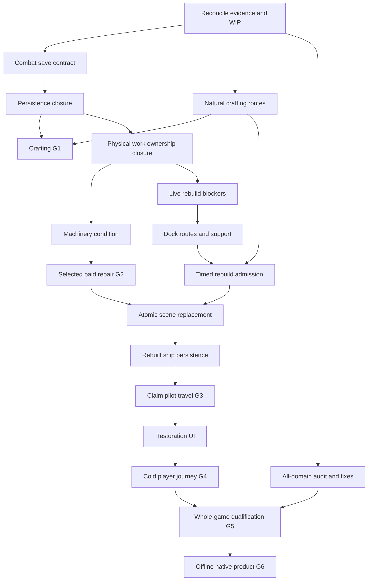

# Remaining Game Systems Feature Completion Implementation Plan

> **For agentic workers:** REQUIRED SUB-SKILL: Use superpowers:subagent-driven-development (recommended) or superpowers:executing-plans to implement this plan task-by-task. Steps use checkbox (`- [ ]`) syntax for tracking.

**Goal:** Finish every remaining active crafting, machinery, repair, structural restoration, ship-use, and whole-game acceptance obligation without mistaking isolated proof for a completed player feature.

**Architecture:** Retain existing typed gameplay owners and exactly-once transactions. Scene coordinators authenticate targets and apply consequences; pure models never access the scene tree. Restore detached state before publishing it, and derive machinery, navigation, and atmosphere from their authoritative owners.

**Tech Stack:** Godot 4.7.2 Mono on Windows as accepted by ADR-0060, typed GDScript, native generation extension, JSON/TRES catalogs, Python/pytest, PowerShell and Git Bash.

**Spec:** [Crafting and derelict feature specification](../../game/features/crafting_derelict_feature_completion.md); [original P00–P24 plan](2026-09-04-crafting-derelict-feature-completion.md); ADRs [0059](../../game/adr/0059-crafting-and-derelict-restoration-transactions.md), [0065](../../game/adr/0065-structural-replacement-safety-and-scene-commit.md), and [0066](../../game/adr/0066-durable-machinery-condition-and-effective-system-health.md).

## Global constraints

- This is the remaining-work execution addendum, written 2026-09-05 against execution HEAD `792642db` plus existing uncommitted work. It does not replace frozen requirements, rewrite historical evidence, or assert that WIP is committed.
- Execute in `D:/the-synaptic-sea-feature-completion`, branch `codex/feature-completion`. Preserve the original `D:/the-synaptic-sea` user checkout and all existing WIP.
- Keep the original P00–P24 identifiers. R01–R19 below are dependency-aware closure packages under those cards, not additional acceptance criteria.
- Freeze remains 668 source rows, 657 active rows, 11 explicit deferrals, and 622 distinct active criteria after reviewed aliases. Fingerprint: `8041e481680152f85fe2d3617491880a5268d89dcb63a59608590711edef48d0`.
- Keep exact item/recipe/ship/module/slot IDs, lot quantity/quality/condition/origin, per-item stack ceilings, soft player encumbrance, cargo limits, and native generation contracts.
- Structural replacement uses the original authored module footprint and contract. No freeform construction or new module substitution is implied.
- Before each implementation package, update its spec/ADR where necessary and local `synaptic-sea-stage-gate` card with requirements, allowed files, non-goals, dependencies, verification commands, and owner. External board synchronization remains `pending` until an actual connector confirms it.
- Root owns integration and the Git index. No blanket staging, reset, cleanup, merge, push, publishing, plugin changes, or paid services. Git fetch has completed; it did not merge `origin/main`.
- Serialize edits to the playable coordinator, loader, snapshots, inventory, catalogs, and navigation, and serialize full-project Godot runs against a frozen source set. Isolated byte-identical scratch proofs must be labeled as such.
- Every Godot gate requires exit 0, the exact expected marker once, no unexpected diagnostics, no timeout, and retained raw output. A negative case requires its intended denial, unchanged protected state, and no success marker.
- Distinguish implemented, production reachable, freshly validated, and player accepted. A helper PASS cannot set a whole-feature or human acceptance flag.

## 1. Reconciled starting point

Evidence below is bounded. A later source change requires applicable checks again.

| Area | Established evidence | Remaining obligation |
|---|---|---|
| P00 baseline | Immutable `3b601e39` passed all 652 then-documented canonical commands and native generation probe | Validate the final changed execution tree; do not repeat the unchanged historical baseline |
| P01–P02 accounting/runner | Frozen source set and runner checks exist | Reconcile new evidence, current source hashes, smoke membership, and honest counts |
| P03–P08 crafting foundations | Lots, knowledge, station jobs, escrow, pending outputs, and quality consumers have implementation/focused evidence | Requalify all affected production paths and close G1; no blanket reimplementation |
| P09 live tools | Real crafted quality changes timed weld/cut progress and actual effects | Natural starter/donor/advanced acquisition and final economy/source closure |
| P09 discovery | Real schematic lot `loot:-2:-2:1:container_53:000` observed at marker `-2:-2:1` | Discovery used repaired travel fixtures; it is not a cold-start player journey |
| P10 persistence | Three independent OS processes passed save, load, exact collection, save, and reload with no replay | Combat structural-damage persistence defect, independent final review, complete save regression and G1 |
| P10 adversarial matrix | Owner reports `.tmp/p10-authority-matrix-09/fc_p10_smoke.log` clean PASS for terminal forgery, legacy cancellation, source-seal, settings/audio, and camera cases | Root/reviewer must inspect its exact source and evidence before accepting the matrix |
| P11–P13 physical work/ownership | Implemented compatibility and transaction slices; P10 component moves and P13 legacy-access integration have focused PASS evidence | Validate stable integrated sources, relocated origins, access denials, and later condition/rebuild consumers |
| P14 machinery | ADR-0066 accepted; runtime implementation still required | Durable condition, derived effective health/power/tier, paid repair and no install/remove healing |
| P15 selected repair | Existing repair mechanisms are inputs | Complete selected, paid, quality-aware module/system repair using P14 authority |
| P16 destroyed descriptors | Bounded descriptor implementation reviewed | Full live selection/initial-wreck/rebuild integration and final regression |
| P17 safety foundations | Catalog/policy, exact collision query, physical-volume helper, and candidate navigation have focused evidence | Authenticate live projections; real blockers/docking/egress; exterior and floor/ceiling support; actual timed work |
| P18–P20 | Defined contracts and existing supporting systems | Atomic physical replacement, persistence, and repaired derelict claim/pilot/travel integration |
| P21–P24 | Existing UI, domain plans, and test infrastructure | Restoration UX, cold-player acceptance, all-domain gap closure, offline export validation |

Key retained evidence:

- `artifacts/feature-completion/P09-quant-20260905-162302/summary.json`.
- `artifacts/feature-completion/P09-native-discovery-20260905-remaining-20260905-173844/discovery_summary.json` (qualified discovery only).
- `artifacts/feature-completion/P10-process-wire-direct-20260905-184856/summary.json`: producer/consumer1/consumer2 each exit 0, marker count 1, diagnostics empty, source drift false. Sixteen focused Python runner tests also passed.
- `.tmp/p13-p10-pointer-run8/fc_p13_smoke.log` and `.tmp/p10-sixty-sixth-run/fc_p10_smoke.log` (copy into durable evidence during R01).
- `artifacts/feature-completion/P17-query-shared-20260905/output.log` and `artifacts/feature-completion/P17-physical-shared-20260905/summary.json`.
- `artifacts/validation/p17-nav-shared-smoke-01/output.txt`; reviewed nav SHA `ABBB3F76C3A5C97F3CD17CDB24AD75B2F0CBAFF4FD2F5CF672B6AF87B282F38E`, smoke SHA `EC6E9981BE33B4CD46B76FCB8A305179A19F95A5C6439CC0ECB9F55EC73D5449`.

## 2. Order, ownership, and release gates



Root coordinates architecture and acceptance. Use Luna for read-only tracing, evidence, and routine checks; Terra for ordinary implementation, UI, catalogs, and tests; Sol for persistence, cross-system state changes, atomic replacement, and independent consequential review. Independent work may proceed in parallel; shared-file work may not.

Each task uses this review cycle: reproduce its stated failure or missing behavior, implement the scoped change, run the specified positive/negative cases, inspect the diff, obtain independent review where consequential, attach exact-source evidence, and commit only that reviewed slice. If a case already passes on unchanged code, retain the evidence and do not invent a rewrite.

## 3. Executable remaining-work packages

### Task 1: R01 — Reconcile the baseline, evidence, and completion register

**Parent:** P01–P02, all gates. **Owner:** root with Luna evidence support. **Dependencies:** none.

**Files:** `STATUS.md`; original plan; `docs/game/inventory/feature_acceptance.json`; `data/validation/feature_completion_cards.json`; `tools/build_feature_acceptance.py`; `docs/game/06_validation_plan.md`; `tools/classify_orphan_smokes.sh`; durable evidence under `artifacts/feature-completion/`.

- [x] Capture HEAD, scoped tracked/untracked changes, toolchain version, and current source hashes. Separate existing accepted slices, unreviewed WIP, and generated import noise.
- [x] Independently inspect the final process proof, its symmetric full-precision JSON comparison, all three raw logs, input/output digests, and exact-source manifest. Confirm integer/float wire representation is normalized symmetrically without numeric tolerance or relaxed lot identity.
- [x] Copy the latest P10 matrix and P13 integration logs plus source manifests from `.tmp` to durable evidence. Review reported coverage before updating its status.
- [x] Reconcile stale STATUS statements about fresh-process and candidate-nav work. Preserve partial/full distinctions.
- [x] Classify new process/nav smokes as standalone unless a reviewed canonical promotion is justified; regenerate both registry and card manifest, then run their checks and orphan classification.
- [x] Publish counts for implemented, production-reachable, fresh-validating, and player-accepted criteria. If evidence mapping is incomplete, publish its coverage and unknown count rather than a guessed percentage.

**Exit:** all 622 criteria retain stable identities and an explicit disposition; no new helper evidence claims a full FC row; current progress documents agree.

**Reviewed outcome:** R01 passed independent spec and quality review at `a12d3eed`. The P13 run8 log is retained as historical evidence, but its exact source snapshot is unavailable; the older P13 manifest is explicitly unrelated context. Evidence mapping remains incomplete, so product completion percentages remain unknown.

### Task 2: R02 — Preserve threat structural damage through old and new saves

**Parent:** P10/FC-12 and P23 combat/persistence. **Owner:** Sol plus independent Sol review. **Dependencies:** R01.

**Modify:** `scripts/systems/threat_ai_state.gd`, `threat_manager.gd`, `save_migration_service.gd`, `run_snapshot.gd`, `world_snapshot.gd`, `save_restore_candidate.gd`; P10 smoke/process proof and fixtures; ADR-0059 and scope/card metadata. Add a focused combat persistence smoke if the integrated proof becomes unwieldy.

**Defect:** `structure_damage` is configured and used by threats but omitted from summaries, so a restored hull tendril ceases to damage modules. Weapon attribution has already been repaired by deriving its cache from persisted `last_attack_result.weapon_id`; preserve that repair.

- [x] Record a reviewed save-contract amendment before runtime edits. Proposed nested current format is `threat-manager-2`, requiring finite, nonnegative `structure_damage` on every threat row, including an explicit zero where applicable.
- [x] Define recognized legacy input precisely: unversioned historical manager summaries without the new field. Migrate a detached copy using a version-pinned archetype mapping verified against shipped historical definitions; known hull tendril damage is `0.4`. Unknown/ambiguous archetypes fail with a recoverable, explicit reason and unchanged source bytes. Do not infer historical values from future mutable balance data.
- [x] Use an enclosing version boundary to distinguish current missing data from genuine legacy input: plan `gate2-current-run-6` and `world-6`, each requiring `threat-manager-2` wherever its combat summary is present. Add explicit v5-to-v6 migration and update version fixtures, constants, readers, and writers together. A v2 declaration missing its field is invalid, and unversioned input carrying v2-only fields is invalid. Removing every discriminator and rewriting the outer version can manufacture a legacy-shaped document; do not claim cryptographic authenticity for an editable save format. Record the version decision in the ADR and allocate these names after confirming they remain unused.
- [x] Traverse home `inventory_summary.threat_summary` and each visited ship's `combat`, including inactive owners. Validate completely before mutating a live manager; clear derived nodes before hydrating authoritative fields.
- [x] Test legacy migration/resave twice, current nonzero exact roundtrip, absent/invalid/negative/nonfinite values, unknown versions/archetypes, and mixed home/away failure rollback. Assert source bytes/index/live world unchanged on rejection.
- [x] Save/reload a real hull tendril and observe the next structural-damage callback. Also retain lethal ranged-hit save/reload/sweep proof with exact weapon identity and no unintended intimidation reward.
- [x] Extend the independent-process scenario to cover the repaired combat state, then run threat, save-migration, P10, and process-runner regressions.

**Exit:** restored threats retain authored behavior; historical saves have an explicit tested compatibility rule; no ignored combat fields or comparison exemptions hide lost state.

**Reviewed outcome:** R02 passed independent spec and quality re-review with all eight findings addressed. Nine isolated focused gates, 38 Python tests, and the final three-process proof passed. Legacy compatibility follows ADR-0059 decisions 40-42; unreconstructable mobile anchors reject explicitly. Runtime acceptance is pinned to the retained initial/fix manifests and process source closure. Its runtime commit is grouped with R03 because the reviewed source depends on the existing uncommitted P10 owner/job/activation closure; this does not accept the remaining P10 matrix or player journey. The earlier default-profile test incident remains recorded; the observed afterimage is not a recovery baseline.

### Task 3: R03 — Close atomic save/load and migration acceptance

**Parent:** P10/FC-12. **Owner:** Sol. **Dependencies:** R02.

**Files:** existing P10 allowed files and `scripts/validation/fc_p10_smoke.gd`, `fc_p10_process_smoke.gd`, `fc_p13_smoke.gd`; `tools/run_p10_process_smoke.py`; `tests/test_p10_process_runner.py`; historical fixtures under `tests/fixtures/feature_completion/`.

- [x] Review and rerun the latest terminal/refund/field forgery, legacy downgrade, started/unstarted cancellation, partial collection, station destruction, inactive catch-up, and source-buffer mutation matrix against the final combat fix.
- [x] Confirm failure snapshots compare inventory/escrow/receipts, owner graph, mounted lots, audio buses/playback state, current camera, source file bytes, index, and absence of precommit migrated sidecars.
- [x] Verify present malformed audio/settings/system data rejects atomically; valid nondefault values survive two loads. Preserve exact quality beyond default JSON precision.
- [x] Test the one documented derived oxygen projection: boolean validation, exact exception path only, unrelated oxygen drift rejection, and correct context after activation/revisit/tick.
- [x] Verify old world-4 absent home access becomes explicit local ownership in the detached candidate, present foreign access remains unchanged, and present empty/malformed access rejects. A migrated sidecar is published only after successful commit.
- [x] Cover manual/auto/quick/title load, same-ship and cross-ship component moves, stale coordinator pointers, and station interactions after partial/full output collection.
- [x] Run focused P10/P13, all save-migration/load/world smokes named in the original plan, sixteen process-runner tests, and the complete three-process proof with unique initially empty homes.
- [x] Obtain final independent review on one stable diff and source manifest, replacing obsolete moving-source review conclusions with an evidence-linked disposition.

**Exit:** no known P10 production blocker or required untested matrix row remains. This closes P10 evidence, not G1 by itself.

**Reviewed outcome:** R03 local persistence closure is complete: [report](../../../.superpowers/sdd/2026-09-05-remaining-feature-completion/task-3-report.md), [independent review](../../../.superpowers/sdd/2026-09-05-remaining-feature-completion/task-3-review.md), and [root raw-evidence check](../../../.superpowers/sdd/2026-09-05-remaining-feature-completion/r03-root-raw-evidence-check.md) record 16 focused cases, a three-process proof, and 47 Python tests. This does not accept G1 or player evidence; external board synchronization remains pending. The runtime commit boundary remains root-owned and no commit is claimed here.

### Task 4: R04 — Finish natural crafting acquisition and economy closure

**Parent:** P09/FC-10, with FC-04–06 and FC-11. **Owner:** Terra; root owns balance decisions. **Dependencies:** R01; final source pinning waits R03/R11.

**Files:** `tools/check_crafting_economy.py`, `tests/test_crafting_economy.py`; existing material/recipe/item/loot/component catalogs; `scripts/tools/crafting_station.gd`; `scripts/ui/recipe_picker_panel.gd`; `scripts/validation/fc_p09_smoke.gd`; narrow coordinator crafting/interaction seams.

- [ ] Finish graph validation of recipe inputs/outputs, knowledge sources, station tiers, repair BOMs, donor forms, and deconstruction paths. Reject missing IDs, circular mandatory prerequisites, and profitable conversion cycles without an authored sink.
- [ ] Preserve the real existing titanium route: looted thruster nozzle or plasma cutter can be deconstructed at a skill-1 workbench for an ingot. Absence in one sampled route is not proof of unreachability and does not justify arbitrary loot additions.
- [ ] Record a starter route from a new run to mandatory opening repair materials, recipe learning, and usable tools. Follow actual container origin IDs; do not attribute carried inventory to the current container.
- [ ] Record a machinery-donor route: locate compatible donor, dismount through real work, retain lot/condition/origin, transport and install in a real compatible slot, then observe the intended station/system benefit.
- [ ] Record an advanced route through genuine schematic use, XP/skill growth, tier access, and required advanced parts. Confirm `plating` to `plating_plate` conversion and its actual installation/repair use.
- [ ] Fix only demonstrated broken links; each new data edge must have a necessity, balance invariant, and acquisition test. Controlled setup remains useful for negative tests but never satisfies natural acquisition.
- [ ] Run the economy checker's negative tests, explicitly provisional graph diagnostics, recipe resource/picker checks, and actual timed quality tests. Retain the canonical pending-source-pin rejection until R05 pins the reviewed R11 integration.

**Exit:** starter, donor, and advanced routes are reachable through normal gameplay; provisional graph checks and their negative tests pass with the final production source pin explicitly pending R05 after R11; no resource injection, force repair, or teleport substitutes for route evidence. R04 cannot claim canonical economy or G1 acceptance.

### Task 5: R05 — Qualify crafting as a complete feature

**Parent:** P03–P10 / G1. **Owner:** Terra with root acceptance. **Dependencies:** R03 and R04; rebuild-action economy rows finalize with R11.

**Files:** P03–P10 smokes, crafting profile manifest, recipe-picker UI only for demonstrated gaps, acceptance evidence.

- [ ] Trace every FC-04–12 criterion to a real input path and downstream effect. Recheck lot transfer through inventory, cargo, cart, drops, equipment, corpse, salvage, and save paths touched by integration.
- [ ] Exercise independent home/away stations, serial per-station queues, exact paid reservation, power pause/resume, cancellation warnings, pending/refund capacity, and destruction recovery.
- [ ] Verify picker and execution share knowledge/skill/tier/power/input eligibility and display exact denial reasons, quality, owner, queue, progress, and pending output.
- [ ] After reviewed R11 integration, pin the economy checker's complete production source closure and require its canonical check to pass. This closes R04's explicitly deferred source-pin obligation; provisional diagnostics cannot satisfy this gate.
- [ ] Run the crafting profile and applicable full regression at a frozen candidate; repair failures before marking G1 accepted. Keep human/controller acceptance open until R16 if not yet observed.

**Exit:** all crafting implementation/runtime criteria pass, and every remaining player-evidence dependency is explicit; full G1 acceptance requires those player criteria too.

### Task 6: R06 — Close physical-work and selected-ship integration

**Parent:** P11–P13 / FC-13–15. **Owner:** Sol for integration, Terra for bounded tests. **Dependencies:** R03.

**Files:** `scripts/systems/component_placement_state.gd`, `component_mount_resolver.gd`, `ship_work_transaction.gd`, `ship_work_context.gd`, `ship_access_state.gd`; coordinator work targeting; `scripts/validation/fc_p11_smoke.gd`, `fc_p12_smoke.gd`, `fc_p13_smoke.gd`.

- [ ] Validate physical slot identity/type/size, selected ship, ownership policy, occupancy, range, and target revision at start and commit. Water, unknown items, foreign/stale/missing owners, and synthetic fallback slots must deny without spend.
- [ ] Prove timed work has no early consequence, pause retains escrow/progress, explicit physical-work cancel refunds exact lots, and duplicate/reentrant completion yields one receipt/effect/XP award.
- [ ] Revalidate two-ship relocation and loaded owner pointers using exact component lot origins and counts. Never solve valid stack-cap denials by discarding displaced parts.
- [ ] Run focused P11–P13 and component/mount/away-access regressions on stable P10 integration; review changed ownership and transaction code independently.

**Exit:** P14/P15/P17 receive one dependable work/owner boundary, with no separate UI mutation path.

### Task 7: R07 — Implement durable machinery condition and reversible effects

**Parent:** P14 / FC-16. **Owner:** Sol. **Dependencies:** R06; quality behavior from P05/R05.

**Files:** `scripts/systems/component_placement_state.gd`, `component_mount_resolver.gd`, `ship_systems_manager.gd`, `ship_system.gd`, `ship_subcomponent.gd`, `ship_modification_state.gd`, `crafting_state.gd`; `scripts/tools/repair_point.gd`; coordinator effective-health consumers; `tests/test_p14_health_authority.py`; `scripts/validation/fc_p14_smoke.gd` and original P14 regression allowlist.

- [ ] Implement ADR-0066 exactly. Installed `source_lot.condition` is authoritative and placement condition is its atomic mirror. Intrinsic ship health remains independently persisted.
- [ ] Route production health/functionality decisions through `ShipSystemsManager`; audit power, dependency resolution, crafting tier, repair targeting, fire damage, HUD, objectives, and travel for intrinsic-only bypasses.
- [ ] Compute mapped effective health as `min(intrinsic_health, max(mounted_provider_conditions))`; no mounted provider means disconnected/effective zero. Unmapped targets retain intrinsic health.
- [ ] Apply damage to the proper owner once; keep removed inventory lots outside ship-side damage. Paid repair updates intrinsic health and the deterministic mounted provider atomically; disconnected targets require a component first.
- [ ] Derive power/tier/upgrade effects from current placement and existing quality rules. Remove install healing floors, dismount intrinsic damage, restore-replayed bonuses, and plating patch side effects.
- [ ] Test two providers, last-provider removal, healthy replacement versus damaged remount, seeded intrinsic damage, quality preservation, power change mid-work, and two reloads.
- [ ] Run ten install/remove cycles: original quantity/condition/intrinsic health/power/tier must return exactly, apart from explicitly authored work costs. Run the full P14 named regression set and independent review.

**Exit:** installing real machinery has reversible, condition-dependent consequences; mounting cannot mint health or resources.

### Task 8: R08 — Complete selected, paid module and system repair

**Parent:** P15 / FC-17 / G2. **Owner:** Terra with Sol review of multi-owner commit. **Dependencies:** R07.

**Files:** `scripts/systems/module_integrity_state.gd`, `module_integrity_map.gd`, `module_integrity_consequences.gd`, `work_action_resolver.gd`, `ship_subcomponent.gd`; `scripts/tools/repair_point.gd`; existing work-action/BOM catalog and coordinator targeting; `scripts/validation/fc_p15_smoke.gd`.

- [ ] Select the second of two damaged modules and capture both states. Repair only the selected stable ship/module target using the authored BOM, tool/skill/duration, and bounded quality effect.
- [ ] Revalidate the target at commit; stale, moved, out-of-range, healthy, or destroyed targets must return distinct reasons with no invalid spend. Ordinary repair must not resurrect destroyed structure.
- [ ] Apply shared-edge/two-room nav and atmosphere consequences exactly once where integrity thresholds require them. Preserve dependency recovery and unrelated breach state.
- [ ] Verify system repair uses R07's deterministic provider/intrinsic transaction, not a separate heal shortcut.
- [ ] Run P15, repair-loop, integrity-consequence, and paid-patching replacement regressions; verify repeated completion/install/remove cannot reproduce free healing.

**Exit:** selected repair spends the right material once, changes the chosen target only, and passes G2's machinery/repair criteria.

### Task 9: R09 — Bind rebuild collision checks to actual scene occupants

**Parent:** P16–P17 / FC-18–19. **Owner:** Sol. **Dependencies:** R06; accepted P16/P17 foundation.

**Files:** `scripts/systems/structural_rebuild_state.gd`, `module_integrity_map.gd`, `runtime_physical_volume.gd`, `runtime_physical_volume_catalog.gd`; new `scripts/systems/structural_rebuild_preflight.gd`; `scripts/procgen/generated_ship_loader.gd`; coordinator scene binding; actual cart/drop/component owner scripts after exact paths are added to the card.

- [ ] Verify live destruction retains the original descriptor, actual integrity-map owner, selectable target, kit/contract identity, sockets, footprint, and revision; cover initially wrecked ships and unsupported metadata.
- [ ] Bind actor capsules and cart/drop/mounted-component volumes through actual live owners and canonical profile IDs. Authenticate owner, instance identity, current transform, liveness, and target revision; raw dictionaries never authorize a build.
- [ ] Validate all authored physical profiles against actual scene clearance, including rotated and moved ships. Preserve `ship * mount * profile` transform order and reject stale/missing geometry.
- [ ] Query both unchanged live solids and the isolated candidate. Include start/end/zero-motion overlap and continuous sweeps; preserve explicit below-resolution denial.
- [ ] Cover parked/grabbed cart, cargo, mounted component, actor and threat overlap, destroyed-target exclusions, and independently blocked routes. Denial changes neither geometry nor net resources.
- [ ] Keep passive projections separate from player-motion behavior. If an existing player/cart motion defect blocks the feature, create an explicit motion card with swept/clamped movement tests before changing masks; do not silently introduce pushing.

**Exit:** real scene blockers are enforced with trusted bindings. Passing synthetic geometry tests alone does not close this package.

### Task 10: R10 — Complete docking, egress, and structural-support preflight

**Parent:** P17 / FC-19. **Owner:** Sol. **Dependencies:** R09.

**Files:** `scripts/systems/ship_nav_graph.gd`, `dock_ports.gd`, `docking_manager.gd`, `ship_instance.gd`, `structural_rebuild_preflight.gd`; loader/socket/coordinator endpoint seams; candidate-nav and live-safety smokes.

- [ ] Register real endpoint IDs with distinct threshold and meaningful interior anchors from authored geometry. A structural exterior boundary alone is not an exit.
- [ ] Authenticate the pure helper's layout, portal, base-clearance, local endpoint, and connection-side projections against current scene owners. Preserve closed/unsafe portal semantics and exact authored portal IDs.
- [ ] Evaluate every connected ship against its own graph. Preserve each previously usable local connection-side threshold-to-interior route; separately require actor access to at least one candidate-usable registered exit.
- [ ] Filter blocked edges before route search, then check every route segment against unchanged-world and candidate clearance. Reject missing/ambiguous/dead-end anchors instead of accepting a vacuous route.
- [ ] Extend the currently bounded helper/preflight with explicit exterior-target, floor/ramp, and ceiling/support topology rules for every required active module. Record the extension in ADR-0065 before implementation; unsupported cases remain visible until proved.
- [ ] Test active docks, both connection sides, transformed/nested hosts, thin blockers, alternate routes, shared edges, open/closed doorway state, and trapped actors. Run candidate-nav plus existing `ship_nav_graph_smoke.gd` and docking/socket regressions.

**Exit:** each required replacement topology has real safety evidence. Full P17 cannot pass with exterior/floor/ceiling targets silently unsupported.

### Task 11: R11 — Connect paid rebuild admission to timed work

**Parent:** P17 / FC-18–19. **Owner:** Terra with Sol integration review. **Dependencies:** R04, R06, R10.

**Files:** `scripts/systems/structural_rebuild_catalog.gd`, `structural_rebuild_state.gd`, `structural_rebuild_preflight.gd`, `ship_work_transaction.gd`, `work_action_catalog.gd`, `work_action_resolver.gd`; rebuild/work/tool/item catalogs; coordinator admission; `scripts/validation/fc_p17_smoke.gd`.

- [ ] Validate the 60 active kit/contract tuples and 15 module IDs against independent loader and resource identity; do not compare the catalog only to itself.
- [ ] Connect canonical BOM/tool/skill/duration to `rebuild_structure`, including the welder's explicit compatible-action metadata. No caller-supplied policy row or generic fallback.
- [ ] Reserve exact lots through the existing physical-work transaction. Pause/cancel/retry obey its escrow rules, and completion revalidates R09/R10 owner/geometry/docking state.
- [ ] Produce an immutable, scene-owned staging plan for R12. No structural consequence or committed receipt occurs at eligibility success alone.
- [ ] Verify stale target, occupied completion, missing tool/knowledge/resource, unknown contract, and duplicate callback behavior; run P09 economy plus P12/P13/P16/P17 regressions.

**Exit:** player-selected destroyed modules start paid timed rebuild work, with safe staging handoff and no early spend finalization.

### Task 12: R12 — Apply replacement geometry, navigation, and air atomically

**Parent:** P18 / FC-20. **Owner:** Sol plus independent Sol review. **Dependencies:** R08 and R11.

**Files:** new `scripts/systems/structural_rebuild_applier.gd`; `scripts/systems/ship_work_transaction.gd`, `structural_rebuild_state.gd`, `module_integrity_consequences.gd`, `ship_nav_graph.gd`; `scripts/procgen/generated_ship_loader.gd`, `slice_atmosphere_applier.gd`, coordinator commit seams; `scripts/validation/fc_p18_smoke.gd`.

**Proposed interface contract:** the new coordinator-owned applier exposes the signatures below. A `RefCounted` handle is issued only by this applier and checked by object identity in its private registry; callers cannot authorize stages by supplying lookalike dictionaries. The scene context is injected by the coordinator and authenticated before use. Every returned result includes typed `ok: bool`, `reason: String`, and `state: String` fields; successful `begin_stage` additionally includes the issued `handle: RefCounted`. States are STAGING, READY, APPLYING, COMMITTED, ROLLED_BACK, or DISCARDED. Record these signatures and result fields in the P18 card before implementation. Handles cannot enter save DTOs.

```gdscript
func begin_stage(plan: Dictionary, scene_context: Node) -> Dictionary
func poll_stage(handle: RefCounted) -> Dictionary
func discard_stage(handle: RefCounted) -> Dictionary
func begin_apply(handle: RefCounted, work_id: String) -> Dictionary
func finalize_success(handle: RefCounted) -> Dictionary
func finalize_rollback(handle: RefCounted) -> Dictionary
```

These are planned new interfaces, not claims about current code. The applier owns scene assets; the transaction continues owning escrow and receipts. `finalize_success` must atomically coordinate the accepted scene state with the single transaction receipt; rollback cannot emit that receipt.

- [ ] Stage the actual wrapper/resources without changing live authority. Validate identity and readiness before entering APPLYING.
- [ ] Barrier affected ships' movement, actors/carts, WorkActions, and save capture across physics synchronization. Retain escrow and rollback assets; do not create the receipt yet.
- [ ] Journal old wrapper, integrity/rebuild descriptors, shared boundary/both rooms, portals, component lots, collision, navigation, atmosphere, and markers. Apply the coherent replacement through existing owners.
- [ ] Recover displaced/incompatible components as exact persistent lots. A full destination retains recoverable output rather than losing or duplicating it.
- [ ] Poll physical/nav/air readiness. Finalize once only after verification; on failure restore and verify old coherence, return to READY with retained escrow, then release the barrier.
- [ ] Inject wrapper/resource, collision, nav, air, component-recovery and finalization failures. Reject duplicate/reentrant finalize/cancel/disposal; no tick or save can observe mixed state.
- [ ] Prove a restored wall blocks player/threat passage and closes its air boundary; a doorway preserves its portal semantics. Test rotated/moved/docked ships, shared walls, floor support, and unrelated breaches.

**Exit:** visible and physical reconstruction succeeds as one paid operation, with verified rollback and no proof-only replacement object.

### Task 13: R13 — Persist repaired and rebuilt ships across every boundary

**Parent:** P19 / FC-22. **Owner:** Sol. **Dependencies:** R03, R07–R08, R12.

**Files:** `scripts/systems/pillar_persistence.gd`, `ship_instance.gd`, `ship_runtime.gd`, `run_snapshot.gd`, `world_snapshot.gd`, `save_migration_service.gd`, `structural_rebuild_state.gd`; coordinator capture/restore/revisit; `scripts/validation/fc_p19_smoke.gd` and migration fixtures.

- [ ] Persist replacement descriptors separately from integrity damage deltas so pristine rebuilt modules survive regeneration. Preserve condition, placement, exact lots, work escrow, and terminal receipts together.
- [ ] Save must wait or return busy during APPLYING. Never serialize a Node, RID, stage capability, or half-applied scene; restart recovers the last committed ownership graph.
- [ ] Restore in explicit order: original generation, replacements, integrity, components, systems/effects, derived nav/air, active simulation.
- [ ] Reject unsupported identity/version/layout mismatch with source bytes intact; legacy descriptor reconstruction requires exact verified original identity, never a guessed replacement.
- [ ] Test mid-work pause/save, each commit boundary, pristine replacement, two reloads, leave/regenerate/revisit, home/away, moved/docked transforms, and destroyed-station escrow.
- [ ] Extend independent-process disk proof for replacement state, no second cost/XP, and post-collection no replay. Run P19 plus pillar, world, and docking persistence regressions.

**Exit:** the rebuilt ship's physical behavior and all resources survive restart and regeneration exactly.

### Task 14: R14 — Make the restored derelict a usable ship

**Parent:** P20 / FC-21–22 / G3. **Owner:** Terra; Sol reviews owner/host/travel integration. **Dependencies:** R13.

**Files:** new `scripts/systems/ship_restoration_readiness.gd`; `scripts/systems/ship_access_state.gd`, `travel_controller.gd`, `docking_manager.gd`, `ship_instance.gd`; `scripts/tools/bridge_terminal.gd`; coordinator claim/pilot/travel; `scripts/validation/fc_p20_smoke.gd`.

- [ ] Derive readiness from the selected ship's real propulsion, navigation, power dependencies, hull/atmosphere policy, access, and docking constraints. Ownership alone grants no operational health.
- [ ] Repair, claim, switch pilot, undock, travel, redock, revisit, and reload using ordinary requests. Carry a lifeboat only where actual port/hangar capacity permits it.
- [ ] Disable selected-ride propulsion and verify the correct departure denial; repair it using real materials and verify departure recovers. Preserve safe-return behavior and unrelated-ship independence.
- [ ] Assert host/parent links, pilot ID, transforms, component lots, and repaired state through each transition. Run pilot-switch, docking-loop, repair-loop, native travel, and G3 profiles.

**Exit:** a repaired derelict operates as the player's ride without test-only force repair or fabricated readiness.

### Task 15: R15 — Finish restoration UX and input accessibility

**Parent:** P21 / FC-11, FC-17–21. **Owner:** Terra. **Dependencies:** R05, R08, R14.

**Files:** new `scripts/ui/ship_restoration_panel.gd`; `scripts/ui/ship_modification_panel.gd`, `work_action_hud_panel.gd`, `recipe_picker_panel.gd`; coordinator input; `data/ui/tutorial_triggers.json`, `data/ui/input_glyphs.json`, `data/release/localization_catalog.json`; `scripts/validation/fc_p21_smoke.gd`.

- [ ] Present selected ship/room/module, condition versus quality, machinery, repair versus replacement, exact cost, required tool/skill, progress, and departure blockers.
- [ ] Connect mouse/keyboard/controller to the same production requests; preserve focus and modal pause/close behavior, remapping, and no double activation.
- [ ] Add contextual guidance for learning, pending outputs, donors, paid patching, reconstruction, and safe departure using existing UI conventions.
- [ ] Verify legibility in normal/dark/emergency lighting, non-color status cues, long/localized text, controller focus recovery, and denied-action feedback.

**Exit:** players can identify their target, explain a blocked action, and discover the next required step using in-game information.

### Task 16: R16 — Accept the complete natural player journey

**Parent:** P22 / FC-04–22 / G4. **Owner:** Terra automation, root synthesis, human player acceptance. **Dependencies:** R15.

**Files:** `scripts/validation/fc_p22_smoke.gd`; `docs/game/playtests/feature-completion-restoration-protocol.md`; case manifest and evidence register.

- [ ] Automate the real-scene salvage → learn → craft → donor installation → selected repair → rebuild → claim/pilot/travel → save/reload chain. Assert resources, quality, target/owner IDs, nav/air and readiness at each transition.
- [ ] Include seeds 42/777 and the discovered schematic route as appropriate, home/away, full inventory, power interruption, threat interruption, duplicate completion, old saves, and moved docking transforms. Label controlled fixtures distinctly.
- [ ] Run a separate Title → New Game session with ordinary controls and no injected stock, forced repair, teleports, or debug commands. Observe keyboard/mouse and controller requirements.
- [ ] Record failures and usability confusion as reproducible fix cards. Repair them and repeat the affected route before acceptance; a passing seed cannot average out a required failing seed.
- [ ] Prepare build, instructions, saves, and recording/evidence package before requesting the user's final human acceptance. Automation may record observed outcomes but cannot invent a human sign-off.

**Exit:** all crafting/restoration runtime and required player criteria pass; no open FC-04–22 defect remains.

### Task 17: R17 — Audit and close every other active designed system

**Parent:** P23 / FC-23. **Owner:** Luna tracing, Terra fixes, Sol difficult work, root synthesis. **Dependencies:** start after R01; implementation respects shared-file windows.

**Files:** fifteen existing plans under `docs/game/build-plans/`; their feature specs and requirement rows; registry/evidence tools. Each discovered product defect receives its own exact file allowlist; this task grants no blanket code scope.

For every domain below, trace requirement → implementation → production caller → player-visible consequence → persistence → fresh validation → required player observation. Record each leaf as passed, failed, unbuilt, blocked, or not verified. Create and finish a bounded card for every failed or missing active requirement.

| Existing plan | Required coverage |
|---|---|
| `01-survival-vitals-e2e.md` | Oxygen, temperature, radiation, wounds, sanity, incapacitation/death, recovery; home/away and restored enclosure |
| `02-food-cooking-spoilage-e2e.md` | Acquire/grow/cook/eat, water, spoilage/freshness, powered facilities, saves |
| `03-crafting-materials-recipes-e2e.md` | R04–R05 plus every retained crafting criterion outside the new program rows |
| `04-loot-ecosystem-e2e.md` | Reachable deterministic loot, rarity/condition, searches/corpses, salvage and revisit conservation |
| `05-consumables-medicine-stimulants-e2e.md` | Use/equip/consume, potency, medicine/stimulant interactions and authored restrictions, ammo |
| `06-combat-threat-ai-e2e.md` | Detection/LOS, routes, attacks, armor/damage, death/loot, structural attacks, rebuilt obstacles, save continuity |
| `07-ship-systems-sustenance-e2e.md` | Dependencies, power, fire/air/hull, paid repair, machinery condition and two-ship isolation |
| `08-progression-skills-meta-e2e.md` | Actual action XP, thresholds/effects, knowledge/unlocks, duplicate suppression, persistence and explicit deferrals |
| `09-ui-ux-accessibility-e2e.md` | Title/run, menus/HUD/inventory, remapping/controller, readable feedback, localization/accessibility |
| `10-audio-music-spatial-e2e.md` | Audible cues, spatial/ambient/voice behavior, captions/settings, missing content and restore side effects |
| `11-save-load-persistence-e2e.md` | Slot lifecycle, supported migration, world/run ownership, corruption and no duplicate jobs/repairs |
| `12-procedural-generation-expansion-e2e.md` | Native generation, determinism, stable IDs, reachable/coherent layouts, authored topology/air and reconstruction |
| `13-distribution-store-postlaunch-e2e.md` | Explicit disposition of each active export/store/cloud/achievement obligation; release-only work remains separately visible |
| `14-cross-system-integration-review-e2e.md` | Threats interrupt work; cargo/logistics/docking/fleet interactions; cold-player balance and scenario continuity |
| `15-systems-map-task-graph-update-e2e.md` | Complete source coverage, requirement/card/evidence consistency, no orphan active system |

- [ ] Separately trace travel, docking, ownership/access, hangars, nested ships, objectives, and extraction through their own specs even when grouped in the table.
- [ ] For each gap, write concrete expected/actual behavior, exact files, dependency owner, regression command, and observable exit condition before implementation; add an ADR for architectural changes.
- [ ] Implement and review all resulting required gap cards, then rerun their domain scenarios. Unverified is not equivalent to broken, and model completeness is not production acceptance.
- [ ] Reconcile all 622 active criteria and the eleven documented deferrals. New findings cannot be removed from the denominator merely to improve the score.

**Exit:** every active designed criterion is accounted for and every resulting required fix is closed. The full list of previously unassessed defects cannot honestly be predicted before this audit; the audit and its fix backlog are mandatory parts of the plan.

### Task 18: R18 — Qualify one integrated whole-game candidate

**Parent:** P02/P22/P23 / G5. **Owner:** root, Luna execution, independent Sol review. **Dependencies:** R16 and R17.

**Files:** validation manifests/registry, evidence artifacts, STATUS, plan/card dispositions; production changes only through failing-case cards.

- [ ] Freeze a reviewed candidate and record commit plus any permitted source manifest; run all affected feature/domain profiles and the canonical bundle extracted from current `docs/game/06_validation_plan.md`.
- [ ] Require every expected marker and clean output. Regressions found here reopen their owning package; never edit a test to accept lost behavior or suppress unexplained diagnostics.
- [ ] Verify orphan classification, inventory coverage, registry/card agreement, and no false evidence promotion. Retain engine/native-extension identity and raw logs.
- [ ] Publish per-domain implemented/reachable/validated/player-accepted counts and percentages using the same frozen denominator. Show blocked/unbuilt/not-verified counts alongside them.
- [ ] Root and independent reviewer reconcile all high-impact changes and acceptance evidence. Update STATUS only after the candidate gates pass.

**Exit:** all active designed-system acceptance obligations are satisfied on the same integrated candidate, with no blocking defects. Release publication remains a separate action.

### Task 19: R19 — Verify an offline native product

**Parent:** P24 / FC-24 / G6. **Owner:** Terra/Luna build evidence; root acceptance. **Dependencies:** R18 for the whole-game claim; preparatory export diagnosis can follow R16.

**Files:** existing export configuration/checks, `docs/game/performance_baseline.md`, `scripts/validation/performance_profiler.gd`, `windowed_fps_capture.gd`, release evidence. Change packaging only for demonstrated defects.

- [ ] Export the supported native target with the exact validated engine/templates and packaged extension. Verify resources/licenses and record target/hardware/version.
- [ ] Run from clean user data with the application's network unavailable; do not disrupt unrelated machine networking. Complete crafting, salvage, selected repair, rebuilding, claim/travel, and save/load through ordinary controls.
- [ ] Prove no editor, Python, developer absolute path, local plugin, authoring tool, or missing asset cache is needed by the exported game.
- [ ] Measure actual windowed performance against the documented budget, cold launch/clean exit, and supported historical saves. Headless duration does not prove frame-rate performance.
- [ ] Repair packaging/performance failures within scoped cards and rerun affected gates. Prepare the final build/evidence packet; publishing is not implied.

**Exit:** the supported offline export passes the core journey and product validation, with other platform/release obligations stated separately.

## 4. Concrete regression protocol

Use the accepted Windows toolchain from the execution worktree:

```powershell
$Godot = 'C:/Users/dasbl/Downloads/Godot_v4.7.2-stable_mono_win64/Godot_v4.7.2-stable_mono_win64/Godot_v4.7.2-stable_mono_win64_console.exe'
$Python = '.superpowers/test-runtime/Scripts/python.exe'
& $Godot --version
& $Python tools/build_feature_acceptance.py --check
& $Python -m pytest -q tests/test_feature_acceptance_registry.py tests/test_p10_process_runner.py
& 'C:/Program Files/Git/bin/bash.exe' tools/classify_orphan_smokes.sh --check
```

For direct focused smokes, use fresh task-specific `APPDATA` and `LOCALAPPDATA` directories and restore the shell's original variables afterward. Prefer the strict runner's owned process homes when it supplies them. Do not reuse a proof home's mutable saves across independent consumers.

```powershell
$Evidence = 'artifacts/feature-completion/remaining-' + (Get-Date -Format 'yyyyMMdd-HHmmss')
& $Python tools/run_p10_process_smoke.py --root . --godot $Godot --evidence-dir ($Evidence + '-process')
if ($LASTEXITCODE -ne 0) { exit $LASTEXITCODE }
& $Python tools/run_feature_completion.py --godot $Godot --case P10 --evidence-dir ($Evidence + '-P10')
if ($LASTEXITCODE -ne 0) { exit $LASTEXITCODE }
& $Python tools/run_feature_completion.py --godot $Godot --profile crafting --evidence-dir ($Evidence + '-crafting')
```

Substitute the owning case (`P14` through `P22`) when it is implemented and registered. Run `restoration` and `all` profiles at their stated gates. A nonexistent/unregistered smoke is incomplete, not a skipped pass.

The complete canonical bundle is the current `Regression bundle` in `docs/game/06_validation_plan.md`, executed through the P02 extraction/strict validation path with verified Bash and Godot paths. Do not run the historical macOS-hardcoded runner unchanged. The earlier count of 652 documents P00 only; derive the final expected count from the current canonical document.

Every evidence packet contains the exact source revision/hashes, command, engine/native-extension identity, scenario/setup label, raw stdout/stderr, marker count, exit code, diagnostics classification, relevant saves/digests, expected versus actual behavior, and reviewer disposition. Human observations additionally identify the input method and whether any debug assistance was used.

## 5. Scheduling and completion reporting

The immediate sequence is **R01 → R02 → R03**, with read-only R04 route analysis and R17 domain tracing alongside it. Then complete **R06–R08** and **R09–R14**, followed by UI/player acceptance and final qualification. R04/R05 must close before accepting the full crafting/restoration loop.

Do not provide a calendar estimate based on package count: atomic restoration and the unassessed P23 gap backlog dominate uncertainty. After R01/R17 tracing, estimate each scoped implementation card using its actual affected code and failing cases, and report the critical path separately from parallel work.

After each reviewed package, report what changed in player behavior, evidence that passed, open defects and their owning package, and the next dependency. Publish percentage changes only from updated criterion evidence. Completed foundation packages stay credited; any regression reopens the affected criterion explicitly.

The final handoff includes the candidate commit/build, per-domain acceptance table, migration compatibility notes, raw regression/player/export evidence, reproduction saves, and any genuinely release-only limitations. **Feature complete** is reserved for all required criteria being accepted with no blocking defect; it cannot be inferred from all tasks having code or all headless smokes printing PASS.
