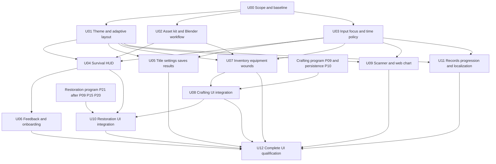

# Game UI Presentation Implementation Plan

> **For agentic workers:** REQUIRED SUB-SKILL: Use superpowers:subagent-driven-development (recommended) or superpowers:executing-plans to implement this plan task-by-task. Steps use checkbox (`- [ ]`) syntax for tracking.

**Goal:** Turn the existing UI into a cohesive, accessible native-game interface that communicates the survival loop and supports every existing player workflow.

**Architecture:** Keep the pure gameplay/menu/settings models and their command paths. Introduce a shared Godot theme, reusable `Control` compositions, adaptive layout, and explicit surface/input ownership, then replace individual views incrementally. Crafting and restoration UI consume the September 4 program's authoritative transactions rather than introducing a second implementation.

**Tech Stack:** Godot 4.7.1 Forward+, typed GDScript, native `Control`/`Container`/`Theme` resources, JSON catalogs, existing Godot smokes and Python validators; Blender 5.2 for selected asset rendering.

**Spec:** [UI presentation program](../../game/features/ui_presentation_program.md). Read it together with the [repository review](../../game/audits/2026-09-05-ui-repository-review.md).

**Status:** Comprehensive planning proposal, 2026-09-05. Runtime implementation has not started in this task. Existing user changes are preserved. Work packages, requirement IDs, future files, and verification commands below are proposed; they are not completed work or newly registered board cards.

## Global Constraints

- Native Godot 4.7.1 Forward+ is the repository validation target; verify the executable and imports before runtime work. `project.godot` declares 4.7; older 4.6.2 status/tool paths are historical.
- Keep the locked-isometric 3D camera and the live title → main → coherent hub/away path.
- Preserve pure typed `RefCounted`/`Resource` state, injected dependencies, signals, and scene-owned consequences.
- Use one writer at a time for `scripts/procgen/playable_generated_ship.gd` and `scripts/ui/menu_coordinator.gd`.
- Preserve player oxygen/load's single HUD home under ADR-0027.
- Preserve ADR-0045: no interior minimap, room map, or omniscient enemy radar. Web charts remain item-gated, ship-position based, read-only, and session-only.
- Preserve ADR-0043 permadeath freeze, load refusal, save guards, and Save & Exit behavior.
- Support keyboard, mouse, and gamepad across supported menus and workflows; glyph display alone is insufficient.
- Support text scale 1.0×, 1.5×, and 2.0× without clipping critical information or reducing the requested text size.
- Milestone A keeps the fixed default start, `breach_field`/`standard`, seeds 42 and 777, and 20–40-minute cold-player journey. No new title class picker is required.
- Windows and macOS are the native release targets in the slice/demo contract. Linux is optional. Mobile/touch and a browser port are separate future product decisions.
- Do not promote PoC tiles or unreviewed art into runtime. Use the existing shippable-art gate and record provenance for new UI assets.
- UI models must never fabricate eligibility, travel knowledge, inventory quantities, quality, repair costs, or flight readiness.

## 1. Review conclusion and priorities

The repository has a broad working UI shell, not an empty frontend. Preserve its menu stack, inventory transfer models, tooltip/tutorial systems, save semantics, scanner/chart data, and WorkAction integration. The principal work is to replace disconnected presentation conventions and fill real usability gaps.

| Priority | Evidence | Consequence for the plan |
|---|---|---|
| First | Repeated local style constants; many text-only panels; no shared Theme | Build the theme and representative live slice before reskinning every screen |
| First | Fixed 520×250 objective and 360×150 vitals panels grow to 1040×500 and 720×300 at 2× | Reflow is a functional requirement, not late polish; historical scaling smokes do not prove fit |
| First | Manual panel input ordering, mouse-driven inventory, label-based menu rows | Establish focus, Back, input consumption and time policy before adding more interactions |
| First | Pause freezes player processing while `_process` continues simulation | Resolve the intended behavior explicitly; do not confuse an open menu with a paused game |
| First | Eight 1×1 status icons; no bundled fonts | Author a small slice-critical icon/font kit with actual size checks |
| Next | Scanner, recipes, wounds, ship-mod, records use sparse text surfaces | Structured list/detail/action patterns can improve many screens with one component family |
| Dependent | September 4 P09/P21 own queue/restoration behavior | Integrate presentation into those packages; do not expose mock quality/jobs/readiness |
| Acceptance | Headless state/text smokes are extensive; fresh visual/controller evidence absent | Add real viewport, input-event and cold-player gates; preserve existing behavior tests |

The [audit](../../game/audits/2026-09-05-ui-repository-review.md) contains the source links, asset inventory, historical images, and limits of this review. No fresh game run, import, benchmark, or regression result is claimed. The UI feature references REQ-UI-001..016 while the canonical requirements contain only 001/003/006; U00 reconciles that discrepancy rather than asserting 16 accepted requirements.

## 2. Deliveries and dependency order

Use delivery waves rather than calendar promises. Relative effort below is planning guidance: S is a bounded surface/content task; M is several integrated views; L is architecture or multi-workflow integration. Split L packages at the listed independently reviewable boundaries. Re-estimate after U00 establishes engine health and U01 proves the design at 2×.

| Wave | Packages | Reviewable result | Effort |
|---|---|---|---|
| 0 — establish authority and baseline | U00 | Agreed UI contract, current board scope, engine/import evidence, before-capture set | M |
| 1 — establish the common language | U01, U02, U03 | Native theme/layout, slice asset kit, deterministic focus/input/time policy | L |
| 2 — make the first session coherent | U04, U05, U06, U07; U09 scanner portion | Title → readable survival → loot/use → craft/repair → board → results on existing mechanics | L |
| 3 — complete the deeper workflows | U08 with P09, U10 with P21, U09 chart polish, U11 | Consistent production UI for crafting/jobs, restoration, navigation and records | L; gated by gameplay program |
| 4 — qualify and tune | U12 | Clean regression, complete surface/input/scale coverage, fresh captures and player evidence | M |



Wave 2 is a useful Milestone A checkpoint, not completion of the entire UI program. U12 runs focused checks throughout the waves and closes only when all required integrations are present. If P09/P21 are still pending, report the deeper UI rows as blocked by named gameplay packages; do not hide them in a completion percentage.

## 3. File and interface map

All new paths in this section are planned. Existing paths are confirmed by the review. Native UI scenes may be introduced where editable composition helps; keep stable script APIs while their internals change.

| Responsibility | Existing integration | Proposed files |
|---|---|---|
| Theme and text scale | `scripts/ui/accessibility_settings.gd`; existing per-panel `apply_accessibility_settings` | `data/ui/themes/synaptic_sea_theme.tres`, `scripts/ui/ui_theme_controller.gd` |
| Layout decisions | `project.godot`; panel anchors/fixed offsets | `scripts/ui/ui_layout_policy.gd`, `scenes/ui/components/panel_shell.tscn`, `scenes/ui/components/list_detail.tscn` |
| Surface/input ownership | `scripts/ui/menu_coordinator.gd`; playable `_input`, open/close handlers | `scripts/systems/ui_surface_state.gd`, `scripts/ui/ui_surface_host.gd` |
| HUD composition | `objective_tracker.gd`, `player_vitals_panel.gd`, `hotbar_panel.gd`; playable names one HotbarPanel instance `WeaponHotbarPanel`, while MenuCoordinator creates another | `scripts/ui/gameplay_ui_presenter.gd`, `scripts/ui/components/status_badge.gd`, `scenes/ui/components/stat_readout.tscn` |
| Asset mapping | `data/ui/status_effect_icons.json`, `data/ui/input_glyphs.json`, achievement catalog | `data/ui/ui_asset_manifest.json`, `scripts/ui/ui_asset_catalog.gd`, `tools/render_ui_thumbnails.py`, `tools/validate_ui_assets.py` |
| User preferences | `scripts/systems/settings_state.gd`; title-local/session settings | `scripts/systems/user_preferences_store.gd`; schema additions only where migration needs them |
| Notifications | `tooltip_presenter.gd`, tutorial state, current feedback/caption emitters | `scripts/systems/ui_notification_state.gd`, `scripts/ui/notification_presenter.gd` |
| Craft/restoration | `recipe_picker_panel.gd`, `ship_modification_panel.gd`, WorkAction HUD | `scripts/ui/ship_restoration_panel.gd` is owned by P21, not separately created here |
| Evidence | Existing `scripts/validation/` and `docs/game/06_validation_plan.md` | `scripts/validation/ui_presentation_capture.gd`, `data/ui/validation/ui_presentation_cases.json`, `docs/game/playtests/ui_presentation_protocol.md` |

New interfaces to settle in U01/U03, before dependent workers start:

```gdscript
# UiLayoutPolicy: pure layout decisions; no scene-tree access.
static func resolve(viewport_size: Vector2, text_scale: float) -> Dictionary
# Returns: inspector_mode ("split"/"tabs"), safe_inset (float),
# persistent_coverage_limit (float). Control containers own final geometry.

# UiSurfaceState: configure once with a validated, defensively copied policy catalog.
func configure(surface_policies: Dictionary) -> bool
func open_surface(surface_id: StringName) -> bool
func close_top() -> StringName
func top_id() -> StringName
func blocks_gameplay() -> bool
func pauses_simulation() -> bool
func enter_terminal(surface_id: StringName) -> bool

# UiSurfaceHost: injected scene references, never hard-coded tree paths.
func register_surface(surface_id: StringName, control: Control) -> void
func open_surface(surface_id: StringName, return_focus: Dictionary = {}) -> bool
func close_top() -> void
signal gameplay_gate_changed(blocked: bool)
signal simulation_pause_changed(paused: bool)
```

These signatures are proposed contracts, not existing methods. Each immutable policy record contains `surface_class` (`inspection`, `pause_menu`, `dialog`, `terminal`), `time_mode` (`live`, `paused`, `terminal`), and `blocks_gameplay` (bool); the state rejects unknown IDs and invalid combinations. Runtime callers cannot select a different pause mode. Terminal entry clears incompatible live surfaces and latches gameplay blocking until the old host is disposed for a new run. Keep `MenuState` authoritative for menu navigation; `UiSurfaceState` composes the active gameplay panel and menu surface, rather than duplicating menu definitions or focus indices. Removing a hidden/unregistered surface must not restore gameplay while another surface still blocks it.

`return_focus` is a value token `{surface_id: StringName, item_id: String, command_id: String, fallback: StringName}`; `fallback` is `nearest_row`, `first_action`, or `back`. The host resolves it against currently registered controls when the surface returns. Never retain a row's raw Control reference across list rebuild, load, travel or terminal transition. Empty tokens select the registered initial focus.

Maintain public methods such as `InventoryPanel.open_self/open_transfer`, `RecipePickerPanel.move_selection/confirm_selection`, `ScannerPanel.bind/confirm_selection`, `ChartPanel.bind/set_route_summary`, and `RunResultsPanel.set_run_summary`. Add typed snapshots to `GameplayUiPresenter` from existing model summaries; do not parse display strings to recover health or compute authoritative gameplay state. Keep old text-query methods as semantic/accessibility adapters where existing tests rely on them, then deliberately update tests that assert obsolete layout rather than behavior.

### Co-owned crafting and restoration presentation contracts

Before U08/U10 integration, their P09/P21 owners lock the following schema-backed adapter boundary with the crafting program's P01 contract register. Proposed files are `scripts/ui/crafting_ui_adapter.gd`, `scripts/ui/restoration_ui_adapter.gd`, `data/ui/schemas/ui_presentation_snapshot_v1.schema.json`, `data/ui/schemas/ui_action_preview_v1.schema.json`, `data/ui/schemas/ui_action_request_v1.schema.json`, and `data/ui/schemas/ui_command_receipt_v1.schema.json`. These are injected, thin scene adapters over the already proposed `CraftJobScheduler.evaluate/enqueue/cancel`, `ShipWorkContext.resolve`, `ShipWorkTransaction.prepare/commit/cancel`, `StructuralRebuildState.evaluate_replace`, and `ShipRestorationReadiness.evaluate`. They do not own simulation or implement those methods again.

```gdscript
# Both adapters expose this surface; Dictionary fields are validated by the schemas.
signal snapshot_changed(snapshot: Dictionary)
func get_snapshot() -> Dictionary
func evaluate_action(request: Dictionary) -> Dictionary
func submit_action(request: Dictionary) -> Dictionary
```

| Record | Required schema fields and authority |
|---|---|
| Snapshot | `schema_version: int = 1`, `ship_id: String`, `context_revision: int`, `station_id: String` or `target_id: String`, `rows: Array[Dictionary]`, `selected_id: String`, `jobs: Array[Dictionary]`, `readiness: Dictionary`; irrelevant collections empty. Job/lot/work/target IDs come unchanged from their owner; readiness is the model's result. |
| Preview | `schema_version`, `ok: bool`, `reason: String`, `blocked_reasons: Array[String]`, `ship_id`, `station_id`/`target_id`, `action_id: String`, `recipe_id: String`, `lot_ids: PackedStringArray` (JSON array), `context_revision: int`, `costs: Array[Dictionary]`, `quality: Dictionary`, `cancellation: Dictionary`; every displayed value comes from authoritative evaluation. |
| Request | Stable owner/target/action/recipe/lot IDs, `expected_revision: int`, `request_id: String`; no Node references, labels as IDs, or copied model inventory as execution context. |
| Receipt | `schema_version`, `ok`, `reason`, `request_id`, `receipt_id: String`, `job_id: String`, `work_id: String`, `context_revision: int`; irrelevant IDs empty. A received command is not displayed as completed work unless its authoritative phase says complete. |

Context revision is issued by the gameplay owner for eligibility-affecting changes; it is not a UI counter or a job's persisted sequence field. The owner re-evaluates the live context on every submit, rejects a stale owner/target/revision with `ok=false, reason="stale_context"`, and returns its existing once-only receipt for duplicate accepted request IDs. Agreement/implementation of this seam belongs to P09/P21 and must update their scope if missing. The adapter copies data for display, emits a changed snapshot only when relevant source state changes, and never treats the displayed preview as permission to bypass execution checks. U08/U10 validate all four record schemas, including missing owner IDs, incorrect types, unsupported versions and stale revisions. Behavior tests cover stale costs, target changes, duplicate confirms, cancellation, and a delayed receipt after the panel closes.

## 4. Work packages

### U00 — Freeze the UI contract and establish a reproducible baseline

**Owner:** Astra coordinates; Luna gathers tool/evidence facts; Sol resolves input/time and settings decisions. **Depends:** none. **Requirements:** REQ-UIP-001.

**Files:** this plan and its feature spec; existing `docs/game/features/ui_ux_accessibility.md`, `docs/game/05_requirements.md`, `docs/game/balance/ui_ux_accessibility_tuning.md`, `docs/game/adr/README.md`, `docs/game/build-plans/README.md`, `STATUS.md`, and `docs/game/06_validation_plan.md` only through reviewed scope. Create the baseline-only `scripts/validation/ui_presentation_capture.gd` and `data/ui/validation/ui_presentation_cases.json`; U12 extends them. New proposed ADR files: `ui-theme-layout-and-surface-ownership.md` and `ui-time-and-user-preferences.md` under `docs/game/adr/`; assign canonical numeric prefixes after checking the index. Preserve existing ADR-0059 work.

- [ ] Reconcile sources: keep no-interior-map decision, fixed A start, current engine target, implemented results/tutorials, UI requirement denominator, and pending P09/P21 work explicit. Classify `scenes/topdown/topdown_hud.tscn` and its `scripts/topdown/topdown_playable_ship.gd` consumer in the supported-surface register: the current recommendation is an alternate development path excluded from the locked-isometric title-flow acceptance. If an active contract requires player support, add its migration and evidence as an explicit package before claiming all supported surfaces complete.
- [ ] Record the spec's proposed visual, pause, settings, layout and chart decisions as proposed/accepted with rationale. The layout ADR must specifically supersede ADR-0027's tracker-detail placement and the older UI feature's bottom-center hotbar while preserving oxygen/load's single home. The preferences ADR must specifically supersede ADR-0043 §6's standalone-settings deferral while preserving save/permadeath/title lifecycle semantics. Do not mark decisions accepted just because this plan contains them.
- [ ] Resolve the live `synaptic-sea-stage-gate` board via the installed board tool/CLI; inspect its actual help/schema and existing cards before updating. Reuse matching work; never invent card IDs or assume historical manifests are current. CLI scripts must pass `--board synaptic-sea-stage-gate` explicitly.
- [ ] Create or update one card per independently reviewable package with requirement/spec links, dependency IDs, owner, exact allowed files, non-goals, commands, markers, captures and acceptance. Publish no gameplay completion claims during planning.
- [ ] Record `git status`, engine `--version`, renderer and import health in an isolated checkout/copy. Use a disposable project-specific user-data directory so save/death smokes cannot touch player saves. Confirm that isolation with a probe before save-affecting tests.
- [ ] Execute existing focused title/HUD/input/inventory/recipe/results smokes and the canonical regression bundle; classify existing failures separately. Repair engine/import blockers in a separate scoped baseline card. Do not bypass clean-output requirements or substitute the old 4.6.2 runner.
- [ ] Create the capture harness using `main_playable_slice_capture_sequence.gd` for capture mechanics, but boot `scenes/title_main.tscn` and traverse its actual gameplay path. Parse explicit case/output/viewport/text-scale arguments; use the real Forward+ renderer rather than headless blank images. Capture the current title, normal HUD, critical HUD, inventory transfer, recipe picker, scanner, chart, pause/settings, wounds, ship modification and results at 1280×720 and 2× text where supported. Save source commit/engine/seed/state metadata beside captures.

**Accept:** authority and board links are current; baseline failures are recorded accurately; approved decisions and actual before-images make implementation reviewable. Existing protected planning work remains intact.

### U01 — Build the native visual and adaptive-layout foundation

**Owner:** Terra; Sol reviews integration contract. **Depends:** U00. **Requirements:** REQ-UIP-002, REQ-UIP-004, REQ-UIP-013.

**Create:** theme/controller/layout/component files from §3; `scenes/ui/ui_component_gallery.tscn`; `scripts/validation/ui_layout_policy_smoke.gd`; `scripts/validation/ui_theme_gallery_smoke.gd`. **Modify:** `project.godot`, `scripts/ui/menu_panel.gd`, `scripts/ui/accessibility_settings.gd` only for the shared seam and one representative screen. **Non-goal:** migrating every panel or adopting a web stack.

- [ ] Add pure layout cases for minimum resolution, 2× text, wide and compact aspect ratios. Start with split mode only when available width supports two readable panes at the requested scale; otherwise use tabs. Determine final fit from containers, not fixed panel multiplication.
- [ ] Create Theme variants for body/secondary/title text, normal/danger/action buttons, panels, focus, progress, input glyph and disabled reason. Use the spec's token values as the initial proposal. Clone mutable Theme state per preference context so a preview does not mutate another live scene's settings.
- [ ] Compose PanelShell and ListDetail with native margin/box/scroll containers. Pin heading, critical strip, action bar and Back while content scrolls. Add empty/error/loading/long-text states to the gallery.
- [ ] Make the gallery use the same production components and theme. Apply them to the real MenuPanel before accepting the gallery; the gallery is supporting evidence only.
- [ ] Exercise 1×/1.5×/2×, 40% copy expansion, keyboard focus, and high-DPI scaling. Update obsolete fixed-size assertions only after adding fit/no-overlap assertions that protect the original accessibility intent.

First regression case, using the proposed API:

```gdscript
extends SceneTree
const Policy = preload("res://scripts/ui/ui_layout_policy.gd")

func _init() -> void:
    call_deferred("_run")

func _run() -> void:
    var compact: Dictionary = Policy.resolve(Vector2(1280, 720), 2.0)
    var wide: Dictionary = Policy.resolve(Vector2(1920, 1080), 1.0)
    if compact.get("inspector_mode") != "tabs" or wide.get("inspector_mode") != "split":
        push_error("UI layout must reflow two-pane inspection at large text size")
        quit(1)
        return
    print("UI LAYOUT POLICY PASS compact=true wide=true")
    quit(0)
```

**Verify:** new layout and gallery smokes plus `main_playable_slice_text_scale_smoke.gd`; rendered bounds checks must complement the pure policy test. **Accept:** representative title/panel uses the production theme with no clipped critical content across the matrix.

### U02 — Produce a small, usable asset kit

**Owner:** Terra for catalog/tooling; art owner for selection; Luna for dimensions/provenance checks. **Depends:** U00; coordinate visual values with U01. **Requirements:** REQ-UIP-003.

**Create:** `data/ui/ui_asset_manifest.json`, `scripts/ui/ui_asset_catalog.gd`, `tools/render_ui_thumbnails.py`, `tools/validate_ui_assets.py`, `tests/test_ui_asset_manifest.py`, staged/source folders under `artifacts/ui-presentation/`. **Modify:** `assets/ui/status/`, selected achievement art if approved, `data/ui/status_effect_icons.json`, `data/ui/input_glyphs.json`, corresponding runtime consumers. Approved fonts go under `assets/ui/fonts/` with license text. **Non-goal:** producing every item icon before the slice works.

- [ ] Inventory the actual slice item/status/command IDs and their live consumers. Prioritize health/O2/stamina/load/fire/breach/wound, the eight placeholder statuses, active weapon/ammo, slice tools/materials/consumables, and input glyphs. Keep map entries keyed by canonical IDs, not display names.
- [ ] Validate schema cases: duplicate ID, missing file, 1×1 image, missing provenance/license/source, missing consumer, and a valid staged asset. Distinguish a named temporary fallback from an accepted final slice asset.
- [ ] Author the simple status/glyph family as readable 2D silhouettes. Reuse the achievement outline family after 32/48/64 px review. Choose and license the font family based on the spec's glyph/readability tests.
- [ ] Implement a Blender thumbnail script with explicit `--manifest`, `--output`, `--size` and optional asset ID filter, launched by a configurable `BLENDER` executable path. Never hardcode the local Windows installation in the renderer; record actual Blender version and render settings in output metadata. Use approved existing source GLBs, fixed camera/light recipe, transparent background, deterministic names and no structural mutations. Save editable scene/recipe and source references.
- [ ] Render the first 6–10 high-frequency inventory/tool thumbnails. Review them alongside the actual HUD at small size in normal/emergency/dark lighting. Simplify unclear thumbnails rather than increasing their HUD footprint.
- [ ] Promote only accepted assets, update their actual consumers, and extend `ui_icon_paths_smoke.gd` to test useful dimensions and resolution, not only path existence. Add the new Python validator to the content gate.
- [ ] Before full-program acceptance, resolve every supported item/status/command ID to an approved bespoke icon or an explicitly mapped approved category silhouette with exact text naming. Keep individual review mandatory for slice-critical IDs. Expand this coverage alongside U08/U10/U11; fail the manifest validator on unresolved IDs and 1×1/missing fallbacks. Bespoke art for every low-frequency item is optional; complete explicit mapping is required.

Proposed manifest record (schema to implement; this reuses an existing image as an explicit review candidate):

```json
{
  "id": "achievement.reactor_stabilized",
  "path": "res://assets/ui/achievements/reactor_stabilized.png",
  "kind": "icon",
  "minimum_size": [32, 32],
  "source": "existing repository asset",
  "license_status": "needs_provenance_review",
  "consumer": "achievements_panel",
  "promotion_status": "review_candidate"
}
```

**Verify:** `python -m pytest -q tests/test_ui_asset_manifest.py`, new validator, existing icon path smoke, rendered small-size proofs. **Accept:** all slice-critical IDs resolve to readable, approved assets; unapproved candidates do not count as final coverage. Blender MCP installation remains optional; native CLI is already available.

### U03 — Unify surface ownership, focus and pause behavior

**Owner:** Sol engineer with independent Sol review. **Depends:** U00 decision disposition; U01 components for final controls. **Requirements:** REQ-UIP-005.

**Create:** `scripts/systems/ui_surface_state.gd`, `scripts/ui/ui_surface_host.gd`, `scripts/validation/ui_surface_state_smoke.gd`, `scripts/validation/ui_pause_policy_smoke.gd`, `scripts/validation/ui_input_focus_smoke.gd`. **Modify:** `scripts/ui/menu_coordinator.gd`, `scripts/procgen/playable_generated_ship.gd`, `scripts/player/player_controller.gd`, `data/ui/input_glyphs.json`, existing panel open/close/input seams. Any additional simulation service file needs explicit card scope. **Non-goal:** gameplay rebinding or simulation changes unrelated to the approved time policy.

- [ ] First characterize current input and timer behavior. Model tests cover opening inventory, entering pause above it, settings above pause, closing each level, duplicate open/close, freed return-focus target and death while a live panel is open.
- [ ] Implement the §3 state/host contracts with one active top-level gameplay panel. Use MenuState for menu hierarchy; route one physical event once. Closing a child must not unblock gameplay or simulation while its parent still blocks it.
- [ ] Apply initial focus and explicit neighbor paths to native controls. Restore focus by stable item ID; fall back to the nearest valid control. Skip disabled commands in traversal while keeping their reasons accessible. Scroll focused rows into view.
- [ ] Separate gameplay action bindings from UI navigation, even when keys overlap. Gate the complete gameplay tail: movement, attack, reload, crouch, hotbar/use slots, field craft, held work/interact, developer save/load keys and competing panel toggles. Only explicit surface commands may cross that gate through existing guarded services. Add actual joypad mappings and active-device updates; glyphs must follow actual bindings. Prevent held key/button release from confirming an underlying screen after close.
- [ ] Implement the accepted time policy through an explicit coordinator gate covering both present-ship branches, run/world time, work/craft progress, threats, food, hazards and autosave cadence. Prevent resume catch-up for menu-paused time; preserve legitimate away-ship elapsed simulation.
- [ ] Verify Escape/Back closes the topmost inspection/dialog, normal-play Escape pauses, and a controller Start/on-screen Pause path can pause above any live inspection screen. Preserve audible/visible danger in live panels.

**Verify:** new state/pause/focus smokes; existing `panel_menu_modal_guard_smoke.gd`, `main_playable_slice_alternate_input_smoke.gd`, `controller_glyph_state_smoke.gd`, `permadeath_freeze_smoke.gd`. Exercise every gated action through `_input` and `_unhandled_input`, including held work and shortcuts. **Accept:** no gameplay action leaks through any blocking surface; pause settings do not inflict damage or advance jobs; Back and resume are deterministic. A clean headless result must be accompanied by real pointer/keyboard/gamepad event evidence.

### U04 — Replace the text-heavy live HUD with a compact survival composition

**Owner:** Terra; coordinator integration has one assigned writer. **Depends:** U01,U02,U03. **Requirements:** REQ-UIP-004, REQ-UIP-007.

**Create:** gameplay presenter/stat/status components from §3; `scripts/validation/ui_survival_hud_smoke.gd`, `scripts/validation/ui_world_affordance_smoke.gd`. **Modify:** `scripts/ui/objective_tracker.gd`, `scripts/ui/player_vitals_panel.gd`, `scripts/ui/hotbar_panel.gd`, `scripts/ui/work_action_hud_panel.gd`, `scripts/ui/menu_coordinator.gd`, and `scripts/procgen/playable_generated_ship.gd` HUD/label build, scale and refresh seams (affordance labels around line 1207, unsafe-room marker around 9021, fire label around 9511 at the baseline). **Non-goal:** tuning survival values or adding status systems.

- [ ] Define typed display snapshots from current vitals/oxygen/encumbrance/weapon/WorkAction summaries. Add cases for ordinary state, low/zero oxygen, overload, empty magazine/reload, multiple statuses, active work and interruption on hub and away.
- [ ] Build the lower-left primary cluster and small upper-left current-objective chip from the spec. Keep health/O2/stamina always readable; severity-rank secondary conditions and provide an accessible detail route.
- [ ] Put weapon and consumable shortcuts in the same composition. Replace the work text bar with a real progress control and concise status, keeping its actual progress/interrupt/noise source.
- [ ] Move long controls/system dumps/objective history to inspection/help. Preserve runtime semantic query methods for tests; make diagnostic display an explicit development option rather than player chrome.
- [ ] Refine world-space affordance/fire/unsafe-room Label3D readability with the shared type/contrast hierarchy. Test nearby versus distant targets, occlusion, 1×/2× scale and collisions with HUD tooltips in normal/emergency/dark lighting. Characterize current `no_depth_test`/fixed-size behavior before changing it; retain required hazard/route cues and prevent added hidden-target information. Use the new world-affordance smoke plus real-view captures.
- [ ] Measure coverage and forbidden-region intersections on the real 3D view. At 2×, reflow rather than rescale text down. Verify oxygen/load have one persistent home and source values match models during change.

**Verify:** new survival HUD smoke; `main_playable_slice_hud_smoke.gd`, `main_playable_slice_text_scale_smoke.gd`, `ui_consumers_d9_smoke.gd`, and relevant WorkAction progress smokes. **Accept:** normal and danger captures read as gameplay, retain correct readings, and pass the spec's fit/coverage targets.

### U05 — Productize title, settings, saves and terminal results

**Owner:** Terra for views; Sol for user preference migration/save integration review. **Depends:** U01,U03; U02 for final artwork/fonts. **Requirements:** REQ-UIP-006, REQ-UIP-013.

**Create:** `scripts/systems/user_preferences_store.gd`, `scripts/validation/ui_preferences_lifecycle_smoke.gd`, `scripts/validation/ui_shell_controls_smoke.gd`. **Modify:** `scripts/title_main.gd`, `scripts/ui/menu_panel.gd`, `scripts/ui/menu_coordinator.gd`, `scripts/ui/save_load_menu.gd`, `scripts/ui/run_results_panel.gd`, `scripts/ui/audio_settings_panel.gd`, `scripts/ui/language_selector.gd`, `scripts/systems/settings_state.gd`, `data/ui/menu_definitions.json`, `data/ui/run_results_copy.json`, `data/release/localization_catalog.json`. **Non-goal:** changing run-save formats except compatibility needed for approved preference migration; class selection at A title.

- [ ] Replace decorative menu text rows with real buttons/controls carrying stable command IDs. Title and in-run Settings share the same component and preference contract; accessibility applies visibly before starting a run.
- [ ] Split Settings into readable accessibility/input/audio/language groups plus run information. Add live previews for scale and focus. Milestone A shows difficulty as read-only `Standard`; existing non-slice difficulty controls retain their established contract and are not user accessibility preferences.
- [ ] Implement the preference ownership/precedence contract below after U00's ADR explicitly supersedes ADR-0043 §6's standalone-settings deferral. Loading a run must not overwrite a user's chosen accessibility settings. Preserve run difficulty authority separately, including when applying mixed accessibility/difficulty presets.
- [ ] Build slot list/detail/actions over SaveLoadMenu with frozen epitaph, world/ship scope, unavailable/corrupt, save busy/failure and delete-confirmation states. Save & Exit remains on the guarded service path and exits only on success.
- [ ] Refine the existing results screen with outcome, supported cause/time/objective summary, retained/lost consequences, Return to Title and New Run. Support 2× and focus; never invent causal stats absent from the run summary.
- [ ] Add restrained title/background artwork only after controls pass. Show loading/failure before allowing another Start/Continue request. Reduced motion disables decorative animation.

**Verify:** existing `title_screen_flow_smoke.gd`, `title_settings_smoke.gd`, `title_load_failure_smoke.gd`, `save_load_slot_screen_smoke.gd`, `save_and_exit_smoke.gd`, `run_results_smoke.gd`, `ui_shell_save_load_smoke.gd`; new preference/control tests cover title → new → settings → save/load → process restart and corrupt/frozen cases. **Accept:** all flows operate via actual controls with trustworthy save/death semantics.

Preference ownership contract for the proposed U00 ADR:

| Field family | Owner and load behavior |
|---|---|
| Text scale, colorblind mode, motion reduction, captions, hold/tap, glyph scheme, accessibility-only preset fields | Versioned user preferences, applied through the existing SettingsState → AccessibilitySettings seam; explicit current-session edits outrank disk preferences |
| Language and audio volume/bus choices | User preferences; same title/run instance; keep audio model's authoritative ranges and apply path |
| Window/display choices, if U01 exposes them | Machine-local section; never copied from a run save |
| Difficulty/profile and simulation tuning | Run/session authority; A remains `standard`; no user-preference override or accessibility-preset side effect |

Use `user://ui_preferences.json` with `schema_version: 1`. Precedence for user fields is explicit current-session edit → valid preference file → valid legacy run fields only on first migration → defaults. Migration must not seed run-owned difficulty into the preference file. Validate the schema and supported values; write a same-directory temporary file, flush/close, then atomically replace the valid file, verifying the replacement behavior on Windows and macOS. This durability path is new preference-store work; the current direct-write SaveLoadService is not evidence that it already exists. Failed write retains the previous valid file, keeps the current-session choice, and shows `Applied for this session; settings could not be saved`. An unsupported future schema must be preserved without overwriting it and surfaced as unsupported. Corrupt files use safe defaults and remain recoverable for diagnosis. Test migration, failed writes, interrupted replacement, unsupported versions, presets, restart, and loading a run with different difficulty/text scale.

Required migration scenarios: no preferences plus a valid legacy run imports user fields once on Continue; a title edit before that Continue wins over legacy values; existing preferences win over both older and newer run user fields while run difficulty stays run-owned; corrupt/unsupported preferences remain untouched or recoverably quarantined with visible failure and must not be silently overwritten by defaults; failed replacement leaves the previous valid preferences readable. Applying an accessibility preset must not change A's Standard profile or a loaded run's difficulty.

### U06 — Make contextual feedback and onboarding coherent

**Owner:** Terra with content owner. **Depends:** U03,U04,U05. **Requirements:** REQ-UIP-007, REQ-UIP-012.

**Create:** notification state/presenter from §3; `scripts/validation/ui_notification_priority_smoke.gd`. **Modify:** `scripts/ui/tooltip_panel.gd`, `scripts/ui/tutorial_overlay_panel.gd`, `scripts/ui/menu_coordinator.gd`, `scripts/ui/hallucination_fx_overlay.gd` only for presentation compatibility, `data/ui/tooltip_catalog.json`, `data/ui/tutorial_triggers.json`, `data/ui/codex_entries.json`, localization copy and current audio/caption routing consumers. **Non-goal:** new tutorial gameplay or hallucination mechanics.

- [ ] Implement semantic priority/dedup rules from the spec. Critical alarms persist until resolved; action denial remains accessible beside its focused action; transient rewards/tutorials cannot cover work or danger.
- [ ] Replace last-writer tooltip ownership with topmost focused surface ownership. Test proximity change while inventory selection is focused, multi/empty selection, panel close, travel and reload.
- [ ] Rewrite first-session copy around real verbs and results: move, interact, loot/equip/use, O2, fire/breach, craft/repair, scanner/boarding/return, threats and terminal outcome. Use actual bound glyphs and once-per-run event semantics.
- [ ] Provide replayable Codex/help access and skip/dismiss with preserved unlock semantics. Add critical hint persistence/accessibility rather than relying on a five-second reading deadline alone.
- [ ] Audit current audio assets against semantic open/close/confirm/deny/transfer/work/danger events. Replace inappropriate shared placeholder cues with a small approved UI cue family, avoiding per-frame audio and hover chatter. Captions must describe required non-speech cues.

**Verify:** notification smoke; `tutorial_state_smoke.gd`, `tutorial_slice_coverage_smoke.gd`, `tutorial_away_smoke.gd`, `ui_polish_smoke.gd`, existing tooltip/caption/audio-log smokes. **Accept:** a cold player can follow the next action without opening several permanent information panels; danger interrupts low-priority information without losing replayable help.

### U07 — Make inventory, equipment, loot and treatment fully usable

**Owner:** Terra; Sol reviews mutation/persistence regression coverage. **Depends:** U01,U02,U03,U04. **Requirements:** REQ-UIP-008.

**Create:** `scripts/validation/ui_inventory_navigation_smoke.gd`, `scripts/validation/ui_wounds_controls_smoke.gd`. **Modify:** `scripts/ui/inventory_panel.gd`, `scripts/ui/inventory_row.gd`, `scripts/ui/inventory_drop_zone.gd`, `scripts/ui/wounds_panel.gd`; playable treatment/input seams. **Non-goal:** replacing InventorySelectionModel/CargoTransfer or implementing quality-lot mechanics owned by P03/P04.

- [ ] Build a two-pane carried/container layout and tabbed compact layout with a shared detail/action region. Show meaningful item name/icon, quantity, actual mass/capacity and equipment state. Prefer rows that support scanning many similar resources over an ornamental grid.
- [ ] Add search/filter/sort as view operations, preserving selection by item/lot identity. Expose quantity selection, take/put, take-all within constraints, equip, use, drop and split through explicit commands. Reuse existing model operations; any missing gameplay command is a separate dependency, not a UI-only fake.
- [ ] Provide keyboard/gamepad paths for every mouse drag/drop operation. Test controller pane switching, scrolling, quantities, disabled reasons, and returning focus after a transfer removes the row.
- [ ] Integrate wounds as the survivor detail route with severity, treatment availability and explicit Bandage/Treat actions. Replace hard-coded B/T-only discoverability with bound controls without bypassing existing treatment requests.
- [ ] Test full/empty containers, partial transfer, encumbrance, rejected equipment, consumable failure, close during interaction and load/travel restoration. When P03/P04 add lots, integrate stable lot keys and quality details in the same UI ownership window.

**Verify:** new navigation/treatment smokes; `main_playable_slice_inventory_ui_smoke.gd`, existing inventory transfer/equipment/wounds smokes, and relevant P04 quality transfer tests once available. **Accept:** loot → compare → equip/use → transfer/treat → return to play succeeds with each input device at 2× text with accurate quantities.

### U08 — Integrate recipe, station-job and quality presentation with P09

**Owner:** the same writer assigned to crafting program P09; Terra may style components independently. **Depends:** U01,U03,U07; behavior depends on P05–P09, persisted acceptance on P10. **Requirements:** REQ-UIP-009 and FC-11.

**Modify:** `scripts/ui/recipe_picker_panel.gd`, shared components, current WorkAction/job UI binders and localized copy; transaction and station files remain owned by P09. **Create with P09:** `scripts/ui/crafting_ui_adapter.gd`, §3's four shared snapshot/preview/request/receipt schemas, `scripts/validation/ui_crafting_journey_smoke.gd`. **Non-goal:** reimplementing eligibility, escrow, queue timing, quality calculation or refund logic.

- [ ] Apply the common recipe list/detail/action layout to current working field/station crafting first; show exact existing denial reasons and output.
- [ ] Lock §3's adapter/snapshot/preview/request/receipt contract with P09 before binding widgets. In P09's ownership window, consume its selected station/recipe/lot, eligibility, queue and quality outputs. Show available/required/reserved quantities distinctly and explain blocked recipes using the same result execution uses.
- [ ] Present queue order, active progress, power-paused status, cancellation policy, pending output and collect/refund states. Use an explicit confirmation for started-job loss; merely selecting a recipe never commits work.
- [ ] Cover rapid confirm, inventory mutation while open, power loss, output full, unstarted cancel, started cancel, leave/revisit and P10 reload. Verify the UI reflects exactly-once outcomes without introducing its own transaction state.

**Verify:** `recipe_picker_panel_smoke.gd`, `main_playable_slice_recipe_picker_smoke.gd`, P09/P10 smokes and new UI journey smoke. **Accept:** a player can predict why crafting is allowed/blocked, what it costs, where output goes and what cancellation loses; all values come from the accepted model contracts.

### U09 — Make scanner travel readable and polish the item-gated web chart

**Owner:** Terra; Sol reviews information-disclosure and travel boundary. **Depends:** U01,U03,U04. **Requirements:** REQ-UIP-010.

**Modify:** `scripts/ui/scanner_panel.gd`, `scripts/ui/chart_panel.gd`, tooltip/localization copy and their current injected data binders. **Create:** `scripts/validation/ui_navigation_knowledge_smoke.gd`. **Non-goal:** interior maps, free chart access, new radar, chart persistence or chart-based travel.

- [ ] Put scanner contacts on a backed, scrollable list with selected-target detail, known/unknown fields, actual travel availability and a deliberate confirm action. Preview only costs the existing model can authoritatively expose; revalidate before committing.
- [ ] Make no-scanner/no-signal/no-target/blocked/transition/failure states legible. Preserve scanner training emission once per deliberate open; refreshing a row must not farm XP or knowledge.
- [ ] Replace raw chart text with a restrained ship-position diagram plus equivalent navigable text list. The graphical projection must use only the same authorized recorded markers/route information as the text view; use an abstract labeled diagram if coordinates are unavailable.
- [ ] Test no chart possessed, found chart, scanner-recorded knowledge, missing/partial route knowledge, travel home/away, and fresh-run knowledge reset. Keep travel commands on the scanner and keep interior ship geometry absent.

**Verify:** `web_chart_state_smoke.gd`, `ui_polish_smoke.gd`, existing travel/scanner/SeaGraph smokes and new knowledge smoke. **Accept:** players know which contact they are choosing, why travel fails, and what their chart actually knows without gaining omniscient navigation.

### U10 — Integrate restoration and ship-readiness UI with P21

**Owner:** the same writer assigned to restoration P21; Sol reviews cross-ship and command integrity. **Depends:** U01,U03,U04,U08; P21 depends on P09,P15,P20. **Requirements:** REQ-UIP-011 and FC-17..21.

**Files:** P21-owned `scripts/ui/ship_restoration_panel.gd`; existing `ship_modification_panel.gd`, `work_action_hud_panel.gd`, `recipe_picker_panel.gd`; selected-target/input binders; shared component/asset/localization catalogs. **Create with P21:** `scripts/ui/restoration_ui_adapter.gd`, `scripts/validation/ui_restoration_journey_smoke.gd`; reuse §3's four U08 record schemas. **Non-goal:** a parallel editor, arbitrary new geometry, a second readiness calculation, or choosing a different repair target in the UI than execution uses.

- [ ] Apply common shell/rows/focus to today's modification panel without claiming rebuild functionality exists.
- [ ] Lock §3's adapter/snapshot contract with P21. Once it can consume P15/P20 results, present selected ship, room/module and condition; installed/compatible machinery; repair vs replacement; exact tools/materials/skills/power/blockers; pending/active work; and authoritative departure readiness.
- [ ] Keep the selected target identity visible at confirmation and through progress. If the player changes ship/target or the target becomes invalid, discard stale previews and revalidate the request. Do not silently retarget home while aboard a derelict.
- [ ] Integrate P21's learning/quality/pending-output/donor/patch-vs-rebuild/departure tutorial beats with U06. Test all actions via pointer/keyboard/gamepad through the actual playable coordinator.

**Verify:** P21/P22 journey smokes and new UI restoration smoke; two-ship target distinction, rejected/unsafe rebuild, power/part blockers, interrupted work, save/load and real departure. **Accept:** players can identify what is broken, choose a valid action, explain the blocker and see a usable repaired ship through normal controls.

### U11 — Finish records, progression, logs and language coverage

**Owner:** Terra/content; Luna catalogs copy and state coverage. **Depends:** U01,U03,U05,U06. **Requirements:** REQ-UIP-012, REQ-UIP-013.

**Modify:** `scripts/ui/codex_panel.gd`, `skill_tree_panel.gd`, `hub_upgrade_panel.gd`, `class_panel.gd`, `achievements_panel.gd`, `audio_log_panel.gd`, `credits_screen.gd`, `release_badge_overlay.gd`, `language_selector.gd`, `scripts/systems/localization_catalog.gd`, `data/release/localization_catalog.json`, menu/codex catalogs. **Create:** `scripts/validation/ui_records_navigation_smoke.gd`, `scripts/validation/ui_copy_expansion_smoke.gd`. **Non-goal:** expanding skill/class content or promising unsupported languages.

- [ ] Move audio/language entry points into Settings while preserving existing reachable routes until migration tests pass. Keep build info/credits quiet and secondary.
- [ ] Apply common list/detail/action patterns to records, with prerequisites/cost/locked/maxed/failure states on progression. Separate browsing from purchase/unlock confirmation; execute existing guarded commands once.
- [ ] Improve Codex topic/entry navigation, audio-log Play/Stop/transcript, unread/unlocked discoverability, and scroll restoration. Add persistence for unread metadata only if explicitly included in the user-preference/data contract.
- [ ] Replace hard-coded new player copy and raw internal IDs with catalog-backed display names. Wire language changes to current visible controls; validate the project's custom localization route before using engine pseudolocalization.
- [ ] Test 40% longer strings and accented glyphs using a pseudo catalog where the custom resolver bypasses Godot translation. Record supported font/script coverage and English fallback behavior.

**Verify:** existing `localization_catalog_smoke.gd`, records/meta/progression/audio-log smokes plus new navigation/copy tests. **Accept:** every supported record is reachable and readable at 2× with each input device, with no false progression or language claims.

### U12 — Qualify the full UI and run cold-player sessions

**Owner:** Luna executes evidence collection; Terra fixes bounded issues; Sol independently reviews consequential behavior; Astra owns acceptance. **Depends:** all required preceding packages. **Requirements:** REQ-UIP-004, REQ-UIP-005, REQ-UIP-006, REQ-UIP-013, REQ-UIP-014.

**Create:** playtest protocol from §3; `scripts/validation/ui_presentation_bounds_smoke.gd`; results under `artifacts/ui-presentation/evidence/` and `docs/game/playtests/`. **Modify:** U00's capture script/case manifest, `docs/game/06_validation_plan.md`, `docs/game/accessibility_review.md`, requirement rows and board evidence after verification. Update generated inventory only through its generator and only if changed citations/status warrant it. **Non-goal:** declaring visual acceptance from gallery shots or old PASS logs.

- [ ] Capture production title entry and live hub/away states with commit, engine, renderer, viewport, scale, language, input, seed, lighting and scenario metadata. Use seeds 42/777 and normal/emergency/dark scenes; label deterministic validation injection separately from manual play.
- [ ] Run bounds/focus/input checks on the matrix in §5. Test death during live inventory, pause above crafting, load while away, full containers, long strings, disconnected controller, repeated open/close and no-chart access.
- [ ] Profile the full inventory, busiest HUD and chart against U00's measured baseline; retain event/update optimization only where it fixes measured churn. Check 100 open/close cycles for growth and stale subscriptions.
- [ ] Run all focused affected tests, Python tests, orphan-smoke membership check when membership changes, then the complete canonical regression bundle. Require every expected PASS and clean output. Update the expected command count from the current bundle, never from historical STATUS prose.
- [ ] Conduct at least five blind/external cold-player sessions using the real title path and the 20–40-minute slice. Do not supply debug stock, teleport players or explain controls. Record input device, scale, confusion points, accidental actions, task completion and want-to-continue rating.
- [ ] Resolve UI P0/P1 blockers and retest changed scenarios. Record acceptance per REQ-UIP row, current UI requirements and FC dependencies, with model/input/live/visual/player evidence distinguished. Leave any failed/unavailable platform or dependency row explicitly open.

**Accept:** no inaccessible required action, unrecoverable focus trap, accidental double commit, critical text clipping, silent unsafe save behavior or hidden critical hazard; full canonical regression clean; at least four of five players can identify the next objective, interpret O2 danger, transfer/use an item and explain a blocked action without coaching. Retain the slice's median want-to-continue ≥3 target. These usability thresholds are proposed additions, not historical results.

## 5. Verification contract and scenario matrix

Set `GODOT` to the executable verified in U00. The following are commands to run during implementation; none were run as part of this planning review. Start with existing smokes to characterize behavior, then add the new smokes when their files exist. On this Windows host the plain `python` command is a Microsoft Store alias; the bundled Python path below is available. Re-resolve the runtime on another host.

```powershell
$UiPython = 'C:\Users\dasbl\.cache\codex-runtimes\codex-primary-runtime\dependencies\python\python.exe'
& $env:GODOT --version
& $env:GODOT --headless --path . --script res://scripts/validation/title_screen_flow_smoke.gd
& $env:GODOT --headless --path . --script res://scripts/validation/main_playable_slice_ui_shell_smoke.gd
& $env:GODOT --headless --path . --script res://scripts/validation/main_playable_slice_text_scale_smoke.gd
& $env:GODOT --headless --path . --script res://scripts/validation/panel_menu_modal_guard_smoke.gd
& $env:GODOT --headless --path . --script res://scripts/validation/main_playable_slice_inventory_ui_smoke.gd
& $env:GODOT --headless --path . --script res://scripts/validation/main_playable_slice_recipe_picker_smoke.gd
& $env:GODOT --headless --path . --script res://scripts/validation/run_results_smoke.gd
& $UiPython -m pytest -q
& $UiPython tools/build_system_inventory.py --check
bash tools/classify_orphan_smokes.sh --check
```

Run save-affecting commands only in U00's verified disposable user-data environment. For the full regression, execute the bundle in [06_validation_plan.md](../../game/06_validation_plan.md), adapting only host paths/engine as documented. `tools/synaptic_sea_gate4_regression.sh` hardcodes old macOS/4.6.2 paths and accepts historical warning patterns; do not run it unchanged or use it as the clean-output authority.

New smokes follow `<feature>_smoke.gd`, print one distinctive final `... PASS ...` only after all assertions, and exit nonzero on intended failure. Require the intended failure and no PASS in RED. Full acceptance requires `SYNAPTIC_SEA REGRESSION PASS commands=<actual count> clean_output=true`, the complete expected marker set and no unclassified `ERROR:`/`WARNING:`; exit zero alone is insufficient.

| Dimension | Required coverage |
|---|---|
| Baseline viewport | 1280×720, 1920×1080, 2560×1440, 3440×1440, 1280×800 at 1×/1.5×/2×; one 4K/high-DPI native-window check |
| Gameplay scene | Coherent hub and actual boarded derelict; seeds 42/777; normal/emergency/dark |
| HUD state | Healthy; O2 critical; multiple severe conditions; work active/interrupted; empty/reloading weapon; simultaneous caption/tutorial/denial |
| Inspector state | Empty/long/full inventory, partial transfer, disabled recipe, pending output, no signal/no chart, selected wrong/unavailable target, long codex/log |
| Input | Each UI workflow via keyboard-only, pointer-only and gamepad-only UI navigation; full gameplay via supported movement/action bindings; actual remapped glyph; device switch/disconnect; focus restore and held input |
| Time/lifecycle | Open panel during danger; pause/settings hierarchy; death while panel open; travel/reload while away; prefs survive process restart |
| Accessibility | Scale; every palette consumer; meaningful shape/text cues; reduced motion; captions; hold/tap; 40% expanded copy/font fallback |
| Platform | Fresh Windows native evidence; macOS native evidence before claiming macOS release parity; untested targets remain open |

Do not brute-force the entire Cartesian product. Automate all resolution/scale bounds and targeted worst-case state/input pairs; run the full journey at 720p/2× and 1080p/1× using supported gameplay input. Independently complete each UI workflow with keyboard-only, pointer-only UI navigation and gamepad-only UI navigation; this does not add mouse locomotion. Capture the six seed/lighting combinations for representative HUD and dense inspection; use targeted cases for secondary records. This keeps coverage meaningful without multiplying hundreds of redundant scene smokes.

## 6. Kanban card template and coordination

The board was not mutated during this plan. Before implementation, use the current board API/CLI discovered in U00. Each card must contain this information, populated from its package:

```text
Board: synaptic-sea-stage-gate
Title: U04 — Compact survival HUD on the live hub and away path
Spec: docs/game/features/ui_presentation_program.md
Requirements: REQ-UIP-004, REQ-UIP-007; preserve ADR-0027
Depends on: U01, U02, U03 (resolve to actual board card IDs)
Owner: one Terra implementation owner; one assigned playable-coordinator writer
Allowed files: U04's explicit create/modify list and its registered validation/docs
Non-goals: survival tuning, new status mechanics, interior map, gameplay rewrites
Verification: ui_survival_hud_smoke, existing HUD/text-scale/D9 smokes;
  live 720p/1080p/ultrawide captures at 1x/1.5x/2x; normal and critical states
Acceptance: single oxygen/load home, correct model values, no critical clipping,
  no protected-playfield overlap, coverage within spec
Evidence: commit, engine, commands, exact PASS output, diagnostics, capture paths,
  reviewer decision, unresolved requirements
```

Luna handles discovery, catalogs, test execution and evidence. Terra handles most views/content/tooling. Sol owns surface/time/settings changes and independently reviews save/mutation-sensitive integrations. Astra integrates requirements, architecture, ownership and final acceptance. Parallelize U02 asset work with U01 pure theme/layout and U03 pure state tests; serialize their edits to title/menu/playable composition. U08/P09 and U10/P21 have one shared owner per overlapping file set.

Commit by independently reviewable deliverable: shared theme, surface/time policy, first live HUD, inventory navigation, each dependent workflow, final evidence. Do not combine a reskin and unrelated gameplay changes. Keep legacy adapters until replacement behavior is proven, then remove only superseded production paths. Do not rebuild the unused topdown HUD to satisfy the current live path.

## 7. Risks, decision gates and completion reporting

| Risk | Prevention and stopping condition |
|---|---|
| Attractive screenshots obscure functional gaps | Bind live models; scenario/input evidence required before a UI row is complete |
| 2× scaling erases the playfield | Reflow from U01; early real HUD proof; no reducing requested font size |
| Pause changes world/job timing | Explicit accepted policy; Sol implementation/review; both-branch/catch-up/autosave tests |
| New settings overwrite run state or accessibility | Separate visual preference ownership from run difficulty; migrate and test restart/new/load |
| Input dispatch and native focus both activate a command | One event owner, stable IDs, held-input tests, single request confirmation |
| Chart art reveals hidden knowledge | Render only permitted chart snapshot; compare text/graph visible IDs |
| UI races crafting/restoration authors | P09/P21 shared ownership and capability gates; no duplicated economy/readiness rules |
| Blender/source assets unavailable or uncertain provenance | Existing local CLI; explicit source roots/manifest; approved GLBs or simple 2D art; keep candidates staged |
| Asset production stalls usable delivery | Small slice kit first; broader item coverage after the live composition is accepted |
| Old engine logs or historical gate reports imply green status | U00 fresh baseline; exact canonical markers/clean-output contract; record engine and diagnostics |
| Broader platform/input support gets declared prematurely | Track each actual platform/device journey; preserve untested rows |

Report separate statuses for (1) planning complete, (2) foundation accepted, (3) Milestone A UI accepted, (4) full UI including P09/P21 accepted, and (5) native release qualification. This document fulfills the planning deliverable only.

## 8. Primary technical references

These support the implementation approach; they do not certify this repository or replace the pinned engine baseline. Retrieved 2026-09-05.

- Use shared native theme variants to avoid repeated per-widget style overrides: [Godot Theme type variations](https://docs.godotengine.org/en/stable/tutorials/ui/gui_theme_type_variations.html).
- Set initial focus and explicit navigation neighbors, and keep UI focus actions separate from gameplay actions: [Godot keyboard/controller navigation](https://docs.godotengine.org/en/stable/tutorials/ui/gui_navigation.html).
- Configure base size/scaling deliberately and keep UI resolution independent of reduced-resolution 3D rendering: [Godot multiple resolutions](https://docs.godotengine.org/en/stable/tutorials/rendering/multiple_resolutions.html).
- Stress long translated strings through the actual translation route: [Godot pseudolocalization](https://docs.godotengine.org/en/stable/tutorials/i18n/pseudolocalization.html). This project's custom catalog may require a pseudo-catalog adapter.
